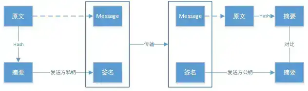

HTTP có thể truyền tải nội dung trang web, nhưng mặc định là truyền dạng văn bản thuần (Plaintext). Nếu Request và Response bị nghe lén, chỉnh sửa hoặc giả mạo trên đường truyền mạng, bản thân HTTP không có đủ khả năng tự bảo vệ.

HTTPS không phải là một giao thức tầng ứng dụng hoàn toàn mới, mà là việc sử dụng TLS để bảo vệ giao tiếp HTTP. Trong các kịch bản HTTP/1.1 và HTTP/2 phổ biến, TLS thường chạy trên nền TCP; còn HTTP/3 thì ánh xạ ngữ nghĩa HTTP lên QUIC (chạy trên UDP), và tích hợp sẵn TLS 1.3 trong QUIC.

Bài viết này chủ yếu trả lời các câu hỏi:

1. Điểm khác biệt cốt lõi giữa HTTP và HTTPS là gì?
2. HTTPS phòng chống nghe lén (Eavesdropping), giả mạo (Tampering) và mạo danh (Impersonation) bằng cách nào?
3. Quá trình bắt tay SSL/TLS (Handshake) thực hiện những việc gì?
4. Tại sao sau khi dùng HTTPS thì Chứng chỉ (Certificate), Nội dung hỗn hợp (Mixed Content) và Tối ưu hiệu năng vẫn cần được chú trọng?

## Giao thức HTTP

### Giới thiệu giao thức HTTP

HTTP là viết tắt của Hypertext Transfer Protocol (Giao thức truyền siêu văn bản). Đúng như tên gọi, HTTP dùng để quy chuẩn hóa việc truyền tải siêu văn bản (bao gồm văn bản, hình ảnh, âm thanh, video), cụ thể là quy định hành vi giao tiếp giữa Trình duyệt (Browser) và Máy chủ (Server).

HTTP là một giao thức phi trạng thái (**Stateless**), nghĩa là server không lưu giữ bất kỳ thông tin nào về các request trong quá khứ của client. Đây thực chất là một thiết kế có chủ đích: giao thức có trạng thái (stateful) sẽ phức tạp hơn nhiều vì phải duy trì lịch sử phiên, và nếu client hoặc server gặp sự cố thì việc xử lý không nhất quán trạng thái sẽ tốn chi phí rất lớn.

### Quy trình giao tiếp của giao thức HTTP

HTTP là giao thức tầng ứng dụng. Lấy ví dụ HTTP/1.1 chạy trên TCP với cổng mặc định là 80:

1. Server lắng nghe kết nối từ Client trên cổng 80.
2. Trình duyệt khởi tạo kết nối TCP tới Server (tạo Socket).
3. Server chấp nhận kết nối TCP từ Trình duyệt.
4. Trình duyệt (HTTP Client) và Web Server (HTTP Server) trao đổi các HTTP Message (Request & Response).
5. Đóng kết nối TCP (hoặc tái sử dụng qua Keep-Alive).

### Ưu điểm của HTTP

Khả năng mở rộng tốt, tốc độ nhanh, hỗ trợ đa nền tảng xuất sắc.

## Giao thức HTTPS

### Giới thiệu giao thức HTTPS

HTTPS (Hypertext Transfer Protocol Secure) sử dụng TLS để cung cấp tính bảo mật (Confidentiality), tính toàn vẹn (Integrity) và xác thực danh tính (Authentication) cho HTTP, cổng mặc định là 443. HTTP/1.1 và HTTP/2 thường dùng TLS over TCP; HTTP/3 dùng QUIC tích hợp TLS 1.3 (xây dựng trên UDP).

Trong HTTPS, sau khi hoàn tất bắt tay TLS, dữ liệu truyền tải sẽ được bảo vệ bởi các thuật toán mã hóa đối xứng AEAD như AES-GCM, ChaCha20-Poly1305. Bắt tay TLS có thể dùng (EC)DHE để thỏa thuận bí mật chung, hoặc dùng PSK trong kịch bản phục hồi phiên (Session Resumption); các phiên bản TLS cũ từng hỗ trợ truyền khóa bằng RSA. ECDH/ECDHE là thuật toán thỏa thuận khóa (Key Exchange), chứ không phải dùng khóa công khai để mã hóa một khóa đối xứng tạo sẵn.

### Ưu điểm của HTTPS

Tính bảo mật cao, độ tin cậy danh tính cao.

## Cốt lõi của HTTPS: Giao thức SSL/TLS

Năng lực bảo mật của HTTPS đến từ TLS. TLS bảo vệ tính bảo mật và tính toàn vẹn cho dữ liệu, đồng thời xác thực đối phương thông qua Chứng chỉ số (Digital Certificate).

### Sự khác biệt giữa SSL và TLS?

**Về bản chất, SSL và TLS là các giai đoạn phát triển kế tiếp nhau của cùng một công nghệ.**

SSL (Secure Sockets Layer) được phát hành lần đầu vào năm 1996 (bản SSL 3.0, bản 1.0 không ra mắt công chúng, bản 2.0 có lỗ hổng lớn DROWN). Đến năm 1999, SSL 3.0 được nâng cấp và **đổi tên thành TLS 1.0 (Transport Layer Security)**. Do thói quen gọi tên trong lịch sử, người ta thường gọi chung là SSL/TLS. Hiện nay SSL đã bị khai tử hoàn toàn, TLS 1.2 và TLS 1.3 là tiêu chuẩn thực tế của HTTPS hiện đại.

### Nguyên lý hoạt động của SSL/TLS

#### Mã hóa bất đối xứng (Asymmetric Encryption)

TLS sử dụng cơ chế mật mã bất đối xứng để xác thực danh tính và/hoặc thỏa thuận khóa phiên, sau đó dùng khóa đối xứng để bảo vệ dữ liệu nghiệp vụ. Mật mã bất đối xứng không chỉ có công dụng "khóa công khai mã hóa, khóa bí mật giải mã": Chữ ký số sử dụng khóa bí mật (Private Key) để ký và khóa công khai (Public Key) để xác thực; còn ECDHE thông qua các cặp khóa tạm thời (Ephemeral Key) của hai bên để cùng tính toán ra bí mật chung.

Ví dụ ẩn dụ về hòm thư:

> Tại một bưu điện tự phục vụ, mỗi kênh liên lạc là một hòm thư. Chủ hòm thư dựng một tấm biển có treo một chiếc chìa khóa: Đây là Khóa Công Khai (Public Key) của tôi, ai muốn gửi thư xin hãy bỏ vào hòm và dùng chìa khóa này khóa lại.
> 
> Tuy nhiên chiếc chìa này chỉ có thể khóa vào, không thể mở ra. Người duy nhất mở được hòm thư là chủ sở hữu - vì chỉ có người đó giữ Khóa Bí Mật (Private Key).
> 
> Nhờ đó, thông tin gửi đi sẽ không bị người khác chặn đọc được.

Cặp khóa công khai/bí mật được sinh ra dựa trên các hàm toán học một chiều có cửa sập (Trapdoor One-way Function).

Ở đây, hàm $f$ tương ứng với khóa công khai (dễ tính toán xuôi), còn cửa sập $h$ tương ứng với khóa bí mật (giúp tính ngược lại).

#### Mã hóa đối xứng (Symmetric Encryption)

TLS không sử dụng thuật toán bất đối xứng để mã hóa trực tiếp khối lượng lớn dữ liệu nghiệp vụ vì chi phí tính toán của mã hóa bất đối xứng rất đắt. Sau khi giai đoạn bắt tay hoàn tất xác thực và thiết lập khóa, tầng bản ghi (Record Layer) sẽ sử dụng thuật toán đối xứng AEAD (như AES-GCM, ChaCha20) để mã hóa dữ liệu HTTP.

> Mã hóa đối xứng: Hai bên giao tiếp cùng chia sẻ duy nhất một khóa $k$. Bên gửi dùng khóa $k$ để mã hóa, bên nhận dùng khóa $k$ để giải mã. Tính bảo mật hoàn toàn phụ thuộc vào việc giữ bí mật khóa $k$.

Hai bên cần thiết lập khóa đối xứng thông qua mạng không an toàn:
- Trong TLS 1.2 dùng RSA Key Exchange: Client tạo `PreMasterSecret` ngẫu nhiên, dùng Public Key của Server để mã hóa và gửi sang Server.
- Trong TLS hiện đại dùng ECDHE: Hai bên trao đổi Public Key tạm thời và mỗi bên tự tính toán độc lập để ra cùng một Shared Secret.
- TLS 1.3 đã loại bỏ hoàn toàn cơ chế trao đổi khóa RSA tĩnh, chỉ cho phép (EC)DHE, PSK nhằm đảm bảo Forward Secrecy.

#### Vấn đề tin cậy khi truyền khóa công khai

Nếu Client $C$ và Server $S$ muốn giao tiếp, $C$ cần biết Public Key của $S$. Nếu Public Key của $S$ truyền tự do qua mạng:

> Kẻ tấn công trung gian $A$ (Man-in-the-Middle) có thể chặn gói tin và thay thế bằng Public Key của kẻ tấn công $AS$. Khi $C$ nhận được Public Key của $AS$ (nhưng tưởng là của $S$), $C$ sẽ mã hóa dữ liệu bằng key của $AS$. Kẻ tấn công $A$ chặn gói tin, dùng Private Key của $AS$ giải mã đọc toàn bộ nội dung, rồi mã hóa lại bằng key của $S$ và gửi tiếp. Cả $C$ và $S$ đều không hề hay biết!

Để giải quyết bài toán tin cậy khi truyền Public Key, các tổ chức bên thứ ba ra đời - gọi là **Cơ quan cấp phát chứng chỉ (CA - Certificate Authority)**. CA là bên thứ ba đáng tin cậy. CA sẽ cấp Chứng chỉ số (Digital Certificate) cho server, chứng chỉ được lưu trên server và có đính kèm **Chữ ký số** của CA.

Khi kết nối, Client nhận chuỗi chứng chỉ từ Server, kiểm tra chữ ký số lần ngược về Root CA đáng tin cậy lưu sẵn trong hệ điều hành/trình duyệt, đồng thời kiểm tra tên miền (Domain Name), thời hạn hiệu lực (Validity Period) và mục đích sử dụng.

#### Chữ ký số (Digital Signature)

Chữ ký số giải quyết bài toán: **Ngăn chặn chứng chỉ bị làm giả hoặc chỉnh sửa nội dung**.

Quy trình: **Khóa bí mật dùng để Ký, Khóa công khai dùng để Xác minh**.

> CA sau khi thẩm định thông tin đăng ký của Server, sẽ lấy bản tóm lược (Hash) của chứng chỉ và dùng Private Key của CA để ký lên đó, tạo thành Chữ ký số đính kèm vào chứng chỉ.
> 
> Client khi nhận chứng chỉ sẽ dùng Public Key của CA (có sẵn trong Root Store của OS/Browser) để giải mã chữ ký số và so sánh với giá trị Hash của chứng chỉ nhận được. Nếu khớp, chứng chỉ đảm bảo 100% nguyên vẹn và do chính CA đó cấp phát.

Tóm tắt cơ chế truyền Public Key qua Chứng chỉ CA:

1. Server $S$ gửi yêu cầu cấp chứng chỉ tới CA.
2. CA xác thực danh tính của $S$, tạo chứng chỉ chứa Public Key của $S$ cùng thông tin tên miền, rồi dùng Private Key của CA để ký số.
3. $S$ nhận chứng chỉ từ CA và gửi cho Client $C$ khi bắt tay TLS.
4. $C$ nhận chứng chỉ, dùng Public Key của CA để xác minh chữ ký số, kiểm tra chuỗi chứng chỉ dẫn về Root CA tin cậy.
5. $C$ kiểm tra tên miền, ngày hết hạn. Sau khi mọi thứ hợp lệ, $C$ hoàn toàn tin tưởng Public Key bên trong chứng chỉ thuộc về Server $S$.

## Tổng kết

- **Cổng mặc định**: HTTP là 80, HTTPS là 443.
- **Tiền tố URL**: HTTP là `http://`, HTTPS là `https://`.
- **Tính an toàn**: HTTP truyền Plaintext, không mã hóa, không xác thực danh tính. HTTPS sử dụng TLS để mã hóa kênh truyền, bảo đảm tính toàn vẹn dữ liệu và xác thực danh tính máy chủ thông qua chứng chỉ số CA. Quá trình bắt tay TLS thiết lập khóa đối xứng tạm thời để mã hóa dữ liệu nghiệp vụ với hiệu năng cao.

<!-- @include: @article-footer.snippet.md -->
