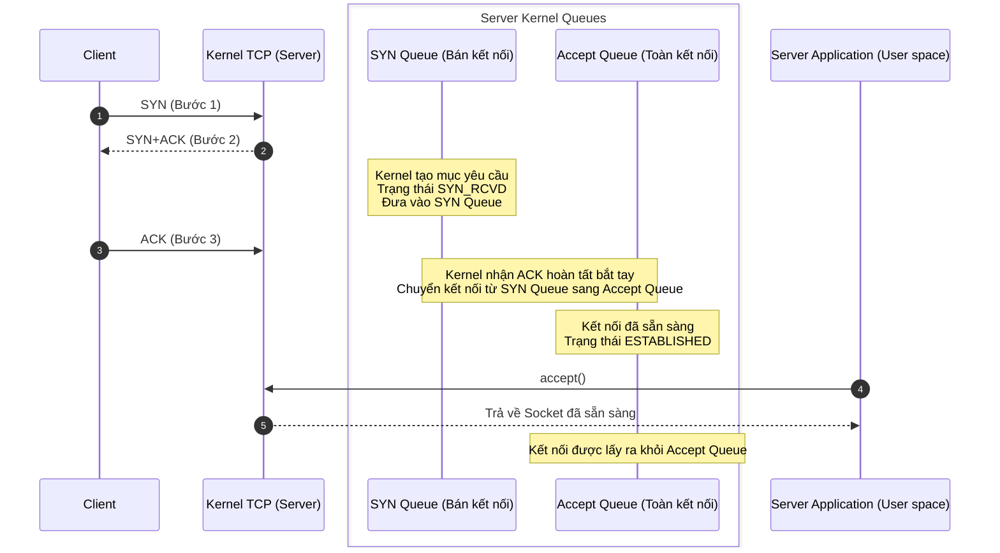

TCP 3-way Handshake (Bắt tay 3 bước) và 4-way Teardown (Bắt tay 4 bước) rất dễ bị học vẹt thành một sơ đồ máy móc: Client gửi `SYN`, Server gửi `SYN+ACK`, Client gửi lại `ACK`; khi đóng kết nối thì lần lượt đi qua `FIN`, `ACK`, `FIN`, `ACK`.

Tuy nhiên, khi phân tích lỗi mạng thực tế, phân tích gói tin Wireshark hoặc trả lời phỏng vấn chuyên sâu, chỉ nhớ thứ tự là chưa đủ. Ví dụ: Tại sao thiết lập kết nối không phải là 2 bước? Khi Server nhận được ACK của bước thứ 3, kết nối được lưu vào hàng đợi nào? Trong 4 bước ngắt kết nối, tại sao ACK và FIN thường gửi tách rời nhau? Trong điều kiện nào có thể gộp thành 3 bước ngắt kết nối?

Bài viết này sẽ xâu chuỗi và làm sáng tỏ toàn bộ các vấn đề cốt lõi trên:

1. Từng bước trong Bắt tay 3 bước của TCP thực hiện những việc gì?
2. Tại sao thiết lập kết nối cần 3 bước mà không phải 2 hay 4 bước?
3. Hàng đợi bán kết nối (SYN Queue) và Hàng đợi toàn kết nối (Accept Queue) lưu trữ những gì?
4. Từng bước trong Bắt tay 4 bước của TCP diễn ra như thế nào?
5. Các trạng thái `TIME_WAIT`, `CLOSE_WAIT` và khoảng thời gian 2MSL nên hiểu ra sao?

---

## 1. Thiết lập kết nối: TCP 3-way Handshake (Bắt tay 3 bước)

Trong kịch bản phổ biến nhất (Client chủ động kết nối, Server bị động lắng nghe), kết nối TCP được thiết lập qua 3 bước:

1. **Bước 1 (SYN)**: Client gửi một gói tin có cờ `SYN=1` (Synchronize Sequence Numbers) tới Server, kèm theo Số thứ tự khởi tạo (**Initial Sequence Number - ISN**) do Client tự sinh, ví dụ `seq=x`. Client chuyển sang trạng thái `SYN_SENT`.
2. **Bước 2 (SYN+ACK)**: Server nhận được SYN, nếu đồng ý kết nối sẽ phản hồi gói tin chứa cả hai cờ `SYN=1, ACK=1`:
   - **SYN**: Server cũng cần đồng bộ số thứ tự khởi tạo của mình, mang giá trị ISN của Server, ví dụ `seq=y`.
   - **ACK**: Xác nhận đã nhận được SYN của Client, số xác nhận là `ack=x+1`.
   - Server chuyển sang trạng thái `SYN_RCVD`.
3. **Bước 3 (ACK)**: Client nhận được SYN+ACK từ Server, gửi lại gói tin xác nhận cuối cùng với `ACK=1, seq=x+1, ack=y+1`. Client chuyển sang trạng thái `ESTABLISHED`. Server nhận được gói ACK này cũng chuyển sang trạng thái `ESTABLISHED`.

Lúc này, hai bên đã hoàn tất đồng bộ số thứ tự khởi tạo ISN hai chiều và sẵn sàng truyền dữ liệu.

---

## 2. Hàng đợi bán kết nối (SYN Queue) và Hàng đợi toàn kết nối (Accept Queue)

Trong nhân Linux, Kernel sử dụng 2 hàng đợi để quản lý các yêu cầu kết nối TCP:

| Hàng đợi | Tên gọi | Chức năng | Trạng thái Socket | Điều kiện chuyển/lấy ra |
| --- | --- | --- | --- | --- |
| **SYN Queue** | Hàng đợi bán kết nối (Half-open Queue) | Lưu trữ các kết nối đang bắt tay dở dang | `SYN_RCVD` | Nhận được ACK bước 3 (chuyển sang Accept Queue) hoặc timeout xóa bỏ |
| **Accept Queue** | Hàng đợi toàn kết nối (Complete Queue) | Lưu trữ các kết nối đã bắt tay thành công, chờ ứng dụng lấy ra | `ESTABLISHED` | Ứng dụng phía User-space gọi hàm `accept()` lấy ra |

### Cơ chế khi Hàng đợi bị đầy (Queue Overflow)

- **Khi Accept Queue (Toàn kết nối) bị đầy**: Tham số kernel `net.ipv4.tcp_abort_on_overflow` quyết định:
  - `0` (Mặc định): Server âm thầm drop gói ACK thứ 3 của Client, giữ kết nối ở `SYN_RCVD` và gửi lại SYN+ACK. Phía Client tưởng kết nối đã thành công nhưng khi gửi dữ liệu sẽ bị nghẽn (Read Timeout).
  - `1`: Server lập tức gửi gói tin `RST` để Client biết và ngắt kết nối nhanh (Fail-fast).
- **Khi SYN Queue bị đầy do tấn công SYN Flood**:
  - Nếu bật `net.ipv4.tcp_syncookies = 1`, Linux kích hoạt cơ chế **SYN Cookie**: Server không lưu trạng thái vào SYN Queue mà mã hóa thông tin vào chính số thứ tự ISN của gói SYN+ACK. Khi nhận được ACK hợp lệ từ Client, Server giải mã cookie để tái tạo lại kết nối.

---

## 3. Tại sao bắt buộc phải là Bắt tay 3 bước?

Bắt tay 3 bước của TCP giải quyết 2 mục đích cốt lõi: **Đồng bộ số thứ tự khởi tạo (ISN) hai chiều** và **Xác nhận tính khả dụng của kênh truyền hai chiều (Send & Receive)**.

### Lý do 1: Ngăn chặn các gói tin SYN cũ/trễ gây ra kết nối "ma" (Stale Connection)

Giả sử Client gửi gói `SYN_1`, nhưng do nghẽn mạng gói này bị kẹt lại. Client tưởng mất gói nên gửi lại `SYN_2` và hoàn thành kết nối bình thường.

Sau đó, kết nối đóng lại. Đúng lúc này, gói `SYN_1` cũ bị trễ mới đến được Server:
- Nếu chỉ dùng **2 bước bắt tay**: Server nhận `SYN_1` liền lập tức chuyển sang `ESTABLISHED` và cấp phát tài nguyên chờ dữ liệu. Nhưng phía Client biết đây là kết nối cũ nên sẽ lờ đi hoặc gửi `RST`. Hậu quả: Server bị treo một kết nối "ma" lãng phí tài nguyên.
- Với **3 bước bắt tay**: Server gửi `SYN+ACK (ack cho SYN_1)`. Client nhận được thấy mã `ack` không khớp với phiên làm việc hiện tại, lập tức gửi `RST` báo cho Server hủy ngay kết nối dở dang này.

### Lý do 2: Cần tối thiểu 3 bước để cả hai bên xác nhận kênh truyền 2 chiều

- Sau Bước 1 (SYN): Server biết Client có thể gửi và Server có thể nhận.
- Sau Bước 2 (SYN+ACK): Client biết Server có thể nhận và gửi, đồng thời xác nhận Client gửi được.
- Sau Bước 3 (ACK): Server mới chính thức biết Client có thể nhận được dữ liệu từ Server.

Thiếu bước thứ 3, Server không có cách nào biết được kênh truyền từ Server tới Client có thông suốt hay không.

---

## 4. Ngắt kết nối: TCP 4-way Teardown (Bắt tay 4 bước)

Do kết nối TCP là **song công toàn phần (Full-Duplex)**, việc đóng kết nối ở mỗi chiều phải được thực hiện độc lập:

1. **Bước 1 (FIN từ Client)**: Client không còn dữ liệu muốn gửi, gửi gói tin `FIN=1, seq=u` tới Server và chuyển sang trạng thái `FIN_WAIT_1`.
2. **Bước 2 (ACK từ Server)**: Server nhận được FIN, lập tức phản hồi `ACK=1, seq=v, ack=u+1`.
   - Server chuyển sang trạng thái `CLOSE_WAIT`.
   - Client nhận được ACK chuyển sang trạng thái `FIN_WAIT_2`.
   - *Lúc này chiều gửi từ Client -> Server đã đóng (Half-Close), nhưng chiều từ Server -> Client vẫn có thể tiếp tục gửi nốt dữ liệu còn dang dở.*
3. **Bước 3 (FIN từ Server)**: Sau khi Server đã gửi hết toàn bộ dữ liệu còn lại, Server gửi gói tin `FIN=1, ACK=1, seq=w, ack=u+1` tới Client và chuyển sang trạng thái `LAST_ACK`.
4. **Bước 4 (ACK từ Client)**: Client nhận được FIN từ Server, gửi lại gói tin xác nhận cuối cùng `ACK=1, seq=u+1, ack=w+1`.
   - Client bước vào trạng thái `TIME_WAIT` và duy trì bộ đếm thời gian **2MSL**.
   - Server nhận được ACK sẽ lập tức chuyển sang `CLOSED`.
   - Sau khi hết thời gian 2MSL, Client mới chính thức chuyển sang `CLOSED`.

---

## 5. Tại sao cần trạng thái TIME_WAIT và khoảng thời gian 2MSL?

**MSL (Maximum Segment Lifetime - Thời gian sống tối đa của một phân đoạn)** là thời gian tối đa một gói tin IP có thể tồn tại trên mạng Internet trước khi bị hủy (thường mặc định là 60 giây trong Linux, 2MSL = 120 giây hoặc 60 giây tùy cấu hình).

Bên **chủ động đóng kết nối (Active Closer)** bắt buộc phải trải qua trạng thái `TIME_WAIT` kéo dài 2MSL vì 2 lý do sống còn:

### Lý do 1: Đảm bảo gói tin ACK cuối cùng đến được Server một cách tin cậy
Nếu gói tin ACK ở bước 4 bị mất trên đường truyền:
- Server ở trạng thái `LAST_ACK` không nhận được ACK sẽ gửi lại gói `FIN` (bước 3).
- Nếu Client không duy trì `TIME_WAIT` mà đóng ngay lập tức (`CLOSED`), khi nhận lại gói `FIN` gửi lại từ Server, Client sẽ trả về `RST`, khiến Server coi đây là một lỗi bất thường thay vì đóng kết nối êm đẹp.
- Khoảng thời gian 2MSL (1 MSL cho gói ACK đi và 1 MSL cho gói FIN gửi lại nếu bị mất) đảm bảo đủ thời gian để xử lý trường hợp gói tin cuối cùng bị thất lạc.

### Lý do 2: Ngăn chặn các gói tin cũ còn trôi nổi trên mạng làm nhiễu kết nối mới
Sau 2MSL, toàn bộ các gói tin trôi nổi của kết nối cũ trên mạng chắc chắn đã biến mất hoàn toàn. Nhờ đó, nếu sau này một kết nối mới được tạo lại trên cùng bộ tứ `(IP nguồn, Port nguồn, IP đích, Port đích)`, nó sẽ không bao giờ bị các gói tin lạc của kết nối cũ gây sai lệch dữ liệu.

<!-- @include: @article-footer.snippet.md -->
