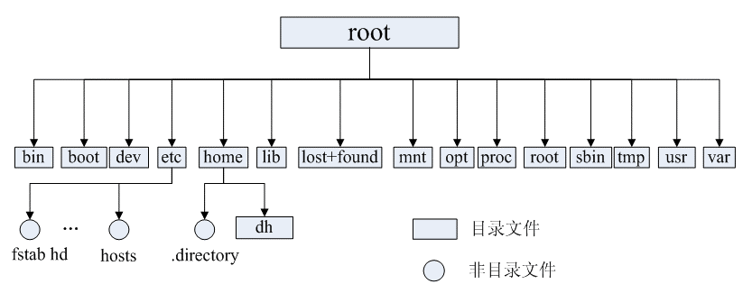

Tổng hợp toàn diện các khái niệm và câu lệnh Linux thiết yếu mà lập trình viên Backend bắt buộc phải nắm vững.

---

## 1. Tổng quan về Linux

- **Hệ điều hành tương tự Unix (Unix-like)**: Linux là hệ điều hành mã nguồn mở, tự do, đa nhiệm và đa người dùng.
- **Bản chất**: Từ "Linux" về mặt kỹ thuật chỉ dùng để chỉ **Linux Kernel (Nhân Linux)**. Một Kernel đơn lẻ không thể tạo thành một hệ điều hành hoàn chỉnh; các tổ chức đóng gói Kernel với các công cụ GNU, trình quản lý gói và phần mềm để tạo thành các **Bản phân phối (Linux Distributions / Distros)**.
- **Linus Torvalds**: Tác giả ban đầu và kiến trúc sư trưởng của Linux Kernel, đồng thời là cha đẻ của hệ thống quản lý phiên bản mã nguồn Git.


### Các bản phân phối Linux phổ biến
1. **Dành cho doanh nghiệp / Server**: Rocky Linux, AlmaLinux, Red Hat Enterprise Linux (RHEL), Debian.
2. **Phổ biến, dễ tiếp cận, cộng đồng lớn**: **Ubuntu LTS** (Long Term Support).
3. *(Lưu ý: CentOS 7/8 đã dừng bảo trì, hiện nay các hệ thống RHEL tương thích khuyên dùng Rocky Linux hoặc AlmaLinux).*

---

## 2. Triết lý "Mọi thứ đều là tệp tin" (Everything is a file)

Trong Linux, toàn bộ tài nguyên do hệ điều hành quản lý - từ file văn bản thông thường, thư mục, ổ đĩa, tiến trình (`/proc`), card mạng cho đến thiết bị ngoại vi (`/dev`) - đều được trừu tượng hóa dưới dạng **Tệp tin (File)**.

Nhờ đó, lập trình viên có thể sử dụng cùng một tập hợp các hàm API thống nhất (`open()`, `read()`, `write()`, `close()`) để tương tác với bất kỳ tài nguyên nào trong hệ thống.

---

## 3. Cấu trúc cây thư mục chuẩn trong Linux (FHS)



- `/bin` và `/usr/bin`: Chứa các file thực thi lệnh cơ bản của hệ thống (`ls`, `cp`, `cat`).
- `/sbin` và `/usr/sbin`: Chứa các lệnh quản trị hệ thống dành cho Superuser (`iptables`, `fdisk`, `reboot`).
- `/etc`: Chứa toàn bộ các **tệp cấu hình hệ thống** (ví dụ `/etc/hosts`, `/etc/nginx/`, `/etc/sysctl.conf`).
- `/var`: Chứa các dữ liệu biến đổi thường xuyên như Log hệ thống (`/var/log`), mail queue.
- `/tmp`: Thư mục chứa các tệp tin tạm thời (tự động dọn dẹp khi khởi động lại).
- `/home`: Thư mục gốc chứa tài liệu của các người dùng thông thường (`/home/username`).
- `/root`: Thư mục Home riêng của người dùng quản trị tối cao `root`.
- `/proc`: Hệ thống tệp tin ảo trong RAM biểu diễn thông tin trạng thái nhân Kernel và các tiến trình đang chạy (ví dụ `/proc/cpuinfo`, `/proc/meminfo`, `/proc/<pid>/`).
- `/dev`: Chứa các tệp đại diện cho thiết bị phần cứng (`/dev/sda`, `/dev/null`, `/dev/random`).

---

## 4. Hệ thống phân quyền tệp tin trong Linux

Mỗi file trong Linux đều có 3 nhóm quyền hạn: **Owner (Chủ sở hữu - u)**, **Group (Nhóm sở hữu - g)** và **Others (Những người khác - o)**.


Quyền hạn biểu diễn bằng 3 ký tự `r` (Read), `w` (Write), `x` (Execute):
- `r` (Read - Đọc): Giá trị số = **4**
- `w` (Write - Ghi/Sửa/Xóa): Giá trị số = **2**
- `x` (Execute - Thực thi file/Truy cập thư mục): Giá trị số = **1**

Ví dụ: `chmod 755 app.sh` mang ý nghĩa:
- Owner = $4 + 2 + 1 = 7$ (`rwx`: Toàn quyền Đọc, Ghi, Thực thi)
- Group = $4 + 0 + 1 = 5$ (`r-x`: Quyền Đọc và Thực thi)
- Others = $4 + 0 + 1 = 5$ (`r-x`: Quyền Đọc và Thực thi)

### Các lệnh quản lý quyền:
```bash
chmod 755 filename          # Đổi quyền hạn tệp tin
chown user:group filename   # Đổi chủ sở hữu và nhóm sở hữu của tệp
```

---

## 5. Các nhóm lệnh Linux thiết yếu cho Backend Developer

### 1. Quản lý Tệp tin & Thư mục
- `ls -lah`: Liệt kê chi tiết toàn bộ file (bao gồm file ẩn) với dung lượng người đọc được (Human-readable).
- `cd`, `pwd`: Chuyển thư mục, xem đường dẫn hiện tại.
- `mkdir -p /a/b/c`: Tạo thư mục đa cấp.
- `cp -r src/ dest/`: Sao chép đệ quy thư mục.
- `mv src dest`: Di chuyển hoặc đổi tên file/thư mục.
- `rm -rf dir/`: Xóa vĩnh viễn thư mục (Cẩn thận khi dùng!).
- `find /path -name "*.log" -mtime +7`: Tìm kiếm file log cũ hơn 7 ngày.
- `df -h`: Kiểm tra dung lượng còn trống của các phân vùng ổ đĩa.
- `du -sh *`: Kiểm tra kích thước của từng thư mục hiện tại.

### 2. Xem và Xử lý nội dung văn bản / Log
- `cat file.txt`: Xem toàn bộ nội dung file.
- `tail -f -n 200 app.log`: Theo dõi 200 dòng log cuối cùng trong thời gian thực (Cực kỳ thông dụng).
- `less file.txt`: Duyệt file dung lượng lớn với khả năng cuộn trang và tìm kiếm `/keyword`.
- `grep -rn "ERROR" /var/log/`: Tìm kiếm chuỗi "ERROR" đệ quy trong thư mục kèm số dòng.
- `awk '{print $1}' access.log | sort | uniq -c | sort -nr | head -n 10`: Thống kê Top 10 địa chỉ IP truy cập nhiều nhất từ access log.

### 3. Quản lý Tiến trình và Giám sát Tài nguyên
- `top` / `htop`: Giám sát CPU, RAM, Load Average của hệ thống trong thời gian thực.
- `ps aux | grep java`: Tìm thông tin tiến trình Java đang chạy.
- `kill -15 <pid>`: Dừng tiến trình êm đẹp (SIGTERM - Graceful Shutdown).
- `kill -9 <pid>`: Buộc dừng tiến trình ngay lập tức (SIGKILL).
- `free -h`: Xem dung lượng RAM vật lý và Swap đang sử dụng.
- `vmstat 1`: Giám sát trạng thái CPU, Context Switch, Swap và Memory mỗi giây.
- `iostat -x 1`: Giám sát tốc độ đọc/ghi IOPS và độ trễ của ổ đĩa.

### 4. Quản lý Mạng & Kết nối
- `ss -tunlp` hoặc `netstat -tunlp`: Xem toàn bộ các cổng mạng TCP/UDP đang ở trạng thái LISTEN.
- `ping host`: Kiểm tra thông suốt mạng qua ICMP.
- `telnet host port` hoặc `nc -zv host port`: Kiểm tra cổng TCP có mở và kết nối được không.
- `curl -I https://api.com`: Gửi request kiểm tra HTTP response header.
- `lsof -i :8080`: Tìm tiến trình nào đang chiếm dụng cổng 8080.

<!-- @include: @article-footer.snippet.md -->
