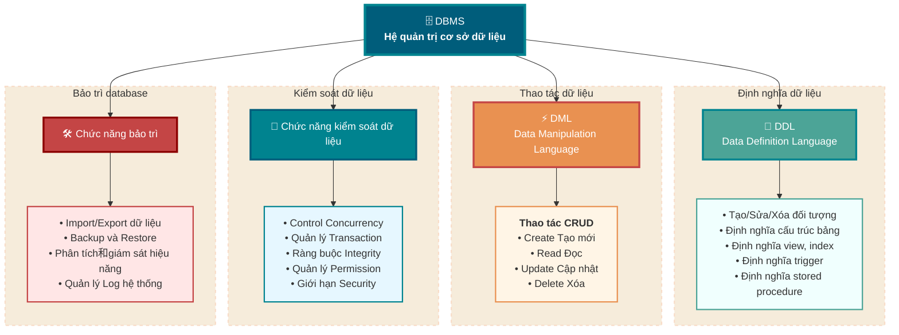
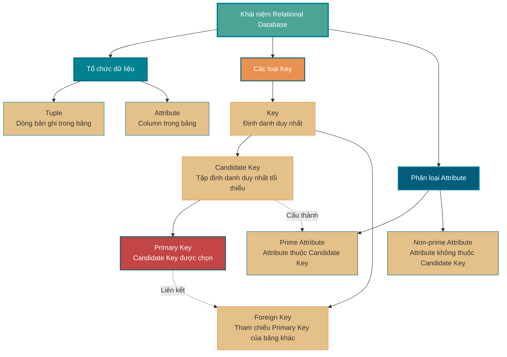
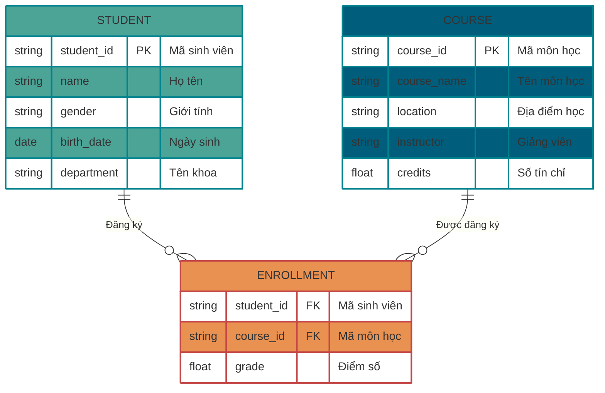
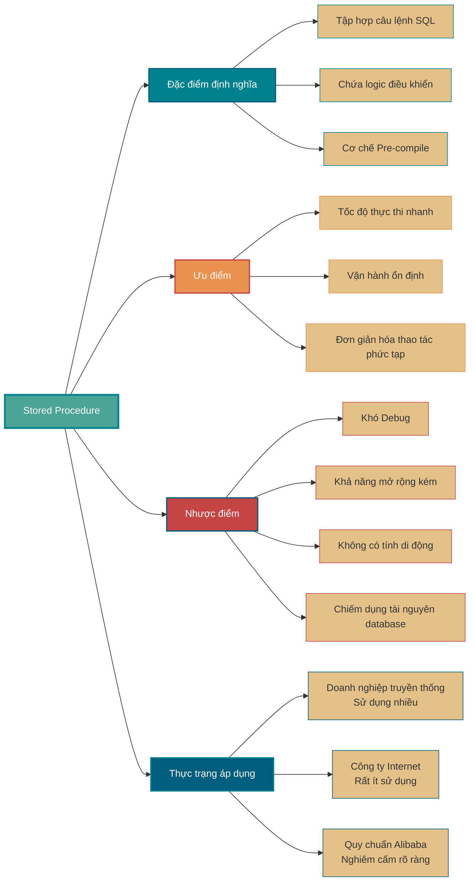
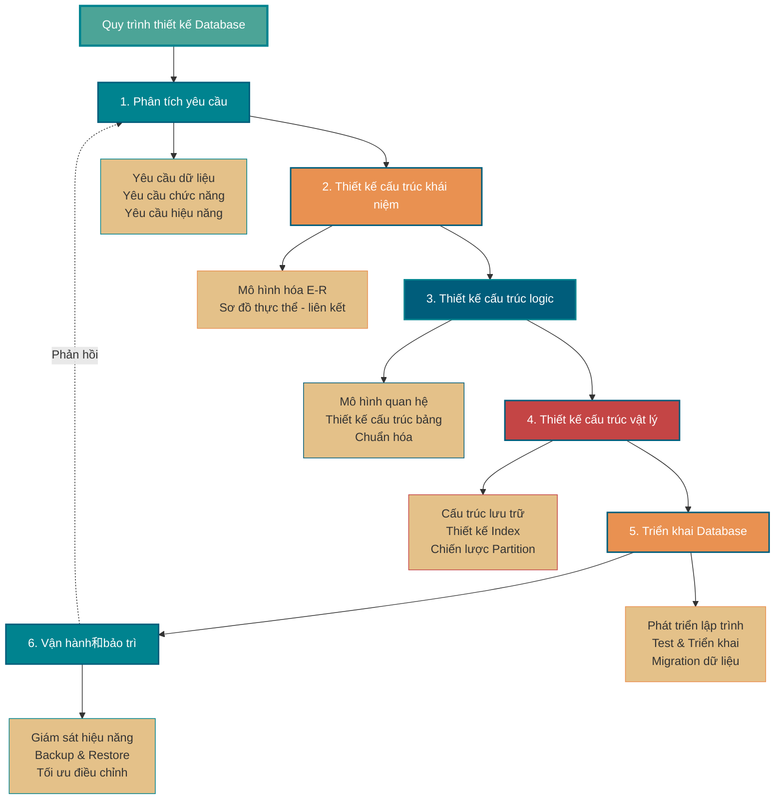

<!-- @include: @small-advertisement.snippet.md -->

Kiến thức cơ bản về Database, phần nội dung này nhất định phải hiểu và ghi nhớ. Mặc dù phần này chỉ là kiến thức lý thuyết, nhưng nó vô cùng quan trọng, là nền tảng cho việc học cơ sở dữ liệu MySQL sau này. PS: Do phần nội dung này liên quan đến nhiều khái niệm, nên đã tham khảo các giới thiệu tương ứng từ Wikipedia và Baidu Baike.

## Database, DBMS, DBS, DBA là gì?

Bốn khái niệm này mô tả các tầng khác nhau từ chính dữ liệu đến việc quản lý toàn bộ hệ thống. Chúng ta thường dùng ví dụ về một thư viện để kết nối và hiểu rõ chúng.

- **Database (DB - Cơ sở dữ liệu):** Nó giống như tất cả sách và tài liệu được lưu trữ trên kệ sách trong thư viện. Về mặt kỹ thuật, Database là một tập hợp các dữ liệu có cấu trúc được tổ chức, mô tả và lưu trữ theo một mô hình dữ liệu nhất định, có thể được chia sẻ bởi nhiều người dùng khác nhau. Nó chính là cốt lõi mà chúng ta muốn truy xuất — bản thân thông tin.
- **Database Management System (DBMS - Hệ quản trị cơ sở dữ liệu):** Nó giống như hệ thống quản lý của toàn bộ thư viện, bao gồm các quy tắc phân loại mục lục sách, quy trình mượn trả, hệ thống kiểm tra an ninh, v.v. Về mặt kỹ thuật, DBMS là một phần mềm cỡ lớn, ví dụ như các phần mềm MySQL, Oracle, PostgreSQL mà chúng ta thường dùng. Trách nhiệm cốt lõi của nó là tổ chức và lưu trữ dữ liệu một cách khoa học, truy xuất và bảo trì dữ liệu hiệu quả; che giấu sự phức tạp của thao tác tệp tầng dưới, cung cấp một tập hợp các giao diện chuẩn (như SQL) để thao tác dữ liệu, đồng thời chịu trách nhiệm giải quyết các vấn đề phức tạp như Concurrency Control, Transaction Management, Permission Control, v.v.
- **Database System (DBS - Hệ thống cơ sở dữ liệu):** Nó chính là toàn bộ thư viện đang vận hành bình thường. Đây là một khái niệm rộng hơn, không chỉ bao gồm sách (DB) và hệ thống quản lý (DBMS), mà còn bao gồm phần cứng, ứng dụng và người sử dụng.
- **Database Administrator (DBA - Quản trị viên cơ sở dữ liệu):** Người này giống như giám đốc thư viện, chịu trách nhiệm đảm bảo toàn bộ hệ thống cơ sở dữ liệu vận hành bình thường. Trách nhiệm của DBA rất rộng, bao gồm thiết kế, cài đặt, giám sát, Performance Tuning, Backup & Restore, quản lý an toàn bảo mật, v.v., nhằm đảm bảo toàn bộ hệ thống ổn định, hiệu quả và an toàn.

DB và DBMS chúng ta thường hay nhầm lẫn, ở đây xin đề cập ngắn gọn: **Thông thường khi chúng ta nói "dùng database MySQL", thực chất là dùng MySQL (DBMS) để quản lý một hoặc nhiều database (DB).**

## DBMS có những chức năng chính nào?

DBMS thường cung cấp 4 chức năng cốt lõi:

1. **Định nghĩa dữ liệu (Data Definition):** Đây là nền tảng của DBMS. Nó cung cấp một ngôn ngữ định nghĩa dữ liệu (Data Definition Language - DDL), cho phép chúng ta tạo, sửa đổi và xóa các đối tượng khác nhau trong database. Điều này không chỉ là định nghĩa cấu trúc bảng (như tên column, data type), mà còn bao gồm định nghĩa View, Index, Trigger, Stored Procedure, v.v.
2. **Thao tác dữ liệu (Data Manipulation):** Đây là chức năng mà các developer sử dụng nhiều nhất hàng ngày. Nó cung cấp một ngôn ngữ thao tác dữ liệu (Data Manipulation Language - DML), với cốt lõi là các thao tác Thêm, Xóa, Sửa, Truy vấn (CRUD) quen thuộc. Nó giúp chúng ta dễ dàng thao tác và truy xuất dữ liệu trong database.
3. **Kiểm soát dữ liệu (Data Control):** Đây là chìa khóa để đảm bảo dữ liệu chính xác, an toàn và tin cậy. Thường bao gồm Concurrency Control, Transaction Management, Ràng buộc Integrity, Permission Control, Giới hạn Security, v.v.
4. **Bảo trì cơ sở dữ liệu (Database Maintenance):** Chức năng này nhằm đảm bảo hệ thống cơ sở dữ liệu vận hành ổn định lâu dài. Nó bao gồm Import/Export dữ liệu, Backup & Restore database, Phân tích và giám sát hiệu năng, cũng như quản lý Log hệ thống.

## Bạn biết những loại DBMS nào?

### Relational Database (RDBMS)

Ngoài Relational Database (RDBMS) được dùng phổ biến nhất, chẳng hạn như MySQL (lựa chọn hàng đầu cho mã nguồn mở), PostgreSQL (tính năng đầy đủ nhất), Oracle (cấp doanh nghiệp), chúng dựa trên cấu trúc bảng nghiêm ngặt và SQL, rất phù hợp cho dữ liệu có cấu trúc và các kịch bản cần đảm bảo Transaction, ví dụ như giao dịch ngân hàng, hệ thống đơn hàng.

Những năm gần đây, để đáp ứng nhu cầu về dữ liệu khổng lồ (Big Data), High Concurrency và cấu trúc dữ liệu đa dạng do các ứng dụng Internet mang lại, một loạt các database NoSQL và NewSQL đã ra đời.

### NoSQL Database

Đặc điểm chung của chúng là vì hiệu năng tối thượng và khả năng mở rộng hàng ngang (Horizontal Scaling), nên đã thỏa hiệp ở một số khía cạnh (thường là Transaction).

**1. Key-Value Database, đại diện là Redis.**

- **Đặc điểm:** Data model cực kỳ đơn giản, chỉ như một Map khổng lồ, lưu trữ và truy xuất Value thông qua Key. Thao tác trên Memory nên hiệu năng cực cao.
- **Kịch bản áp dụng:** Rất thích hợp làm Cache, Session Storage, Counter và các kịch bản yêu cầu hiệu năng Read/Write cực cao.

**2. Document Database, đại diện là MongoDB.**

- **Đặc điểm:** Nó lưu trữ các tài liệu bán cấu trúc (như JSON/BSON), cấu trúc linh hoạt, không cần định nghĩa trước cấu trúc bảng.
- **Kịch bản áp dụng:** Đặc biệt phù hợp với các nghiệp vụ có cấu trúc dữ liệu thay đổi linh hoạt và lặp (iterate) nhanh, chẳng hạn như User Profile, Hệ thống quản lý nội dung (CMS), lưu trữ Log, v.v.

**3. Column-Oriented Database, đại diện là HBase, Cassandra.**

- **Đặc điểm:** Dữ liệu được lưu trữ theo Column Family thay vì theo Row. Điều này giúp cho hiệu năng cực cao khi đọc một số ít Column trên số lượng lớn các Row.
- **Kịch bản áp dụng:** Được thiết kế riêng cho việc lưu trữ và phân tích dữ liệu khổng lồ, rất thích hợp làm Big Data Analysis, lưu trữ dữ liệu giám sát, hệ thống gợi ý (Recommendation System) và các kịch bản cần High Throughput Write cũng như Range Scan.

**4. Graph Database, đại diện là Neo4j.**

- **Đặc điểm:** Data model bao gồm Node và Edge, chuyên dùng để lưu trữ và truy vấn mối quan hệ phức tạp giữa các entity.
- **Kịch bản áp dụng:** Trong các kịch bản như mạng xã hội (quan hệ bạn bè), Recommendation Engine (quan hệ người dùng - sản phẩm), Knowledge Graph, Fraud Detection (quan hệ dòng tiền), hiệu năng của nó vượt xa so với RDBMS.

### NewSQL Database

Do NoSQL không hỗ trợ Transaction (hoặc hỗ trợ hạn chế), nên nhiều hệ thống có yêu cầu rất cao về an toàn dữ liệu (như hệ thống tài chính, hệ thống đơn hàng, hệ thống giao dịch) không phù hợp để sử dụng. Tuy nhiên, các hệ thống này lại thường có nhu cầu lưu trữ lượng dữ liệu khổng lồ.

Các hệ thống này thường chỉ có thể nâng cao năng lực lưu trữ bằng cách mua các máy tính mạnh hơn (Scale Up), hoặc thông qua database middleware (Scale Out/Sharding). Tuy nhiên, chi phí tiền bạc của cách trước quá cao, còn chi phí phát triển của cách sau lại quá lớn.

Vì vậy, **NewSQL** xuất hiện!

Nói một cách đơn giản, NewSQL chính là: **Lưu trữ phân tán + SQL + Transaction**. NewSQL không chỉ có khả năng lưu trữ và quản lý dữ liệu khổng lồ của NoSQL, mà còn giữ được các đặc tính hỗ trợ ACID và SQL của database truyền thống. Do đó, NewSQL còn được gọi là **Distributed Relational Database (Database quan hệ phân tán)**.

Một số mục tiêu thiết kế của NewSQL Database:

1. Horizontal Scaling (Scale Out): Nâng cao năng lực tải của hệ thống bằng cách thêm máy chủ. Trái ngược với Scale Up (Vertical Scaling) - nâng cấp thiết bị phần cứng để tăng năng lực tải.
2. Strict Consistency (Tính nhất quán mạnh): Tại bất kỳ thời điểm nào, dữ liệu trong tất cả các node đều giống nhau.
3. High Availability (Tính sẵn sàng cao): Hệ thống hầu như luôn có thể cung cấp dịch vụ.
4. Hỗ trợ SQL tiêu chuẩn (Structured Query Language): Các RDBMS như PostgreSQL, MySQL, Oracle đều hỗ trợ SQL.
5. Transaction (ACID): Atomicity (Tính nguyên tố), Consistency (Tính nhất quán), Isolation (Tính cô lập), Durability (Tính bền vững).
6. Tương thích với các RDBMS phổ biến: Tương thích với các RDBMS thông dụng như MySQL, Oracle, PostgreSQL.
7. Cloud Native: Có thể thực hiện tự động hóa và công cụ hóa việc triển khai trên Public Cloud, Private Cloud và Hybrid Cloud.
8. HTAP (Hybrid Transactional/Analytical Processing): Hỗ trợ xử lý hỗn hợp cả OLTP và OLAP.

Các đại diện NewSQL Database: F1/Spanner của Google, [OceanBase](https://open.oceanbase.com/) của Alibaba, [TiDB](https://pingcap.com/zh/product-community/) của PingCAP.

## Tuple, Key, Candidate Key, Primary Key, Foreign Key, Prime Attribute, Non-prime Attribute là gì?

Trong lý thuyết RDBMS, việc hiểu các khái niệm cốt lõi như Tuple, Key, Candidate Key, Primary Key, Foreign Key, Prime Attribute và Non-prime Attribute là cực kỳ quan trọng đối với việc thiết kế và chuẩn hóa database. Những khái niệm này cấu thành nên nền tảng lý thuyết của relational database.

### Khái niệm cơ bản

- **Tuple (Bộ / Bản ghi):** Tuple là đơn vị cơ bản trong relational database, tương ứng với một dòng bản ghi (row) trong bảng 2 chiều. Mỗi tuple chứa thông tin hoàn chỉnh của một entity. Ví dụ, trong bảng sinh viên, thông tin đầy đủ của mỗi sinh viên (mã sinh viên, họ tên, tuổi, v.v.) cấu thành một tuple.
- **Key (Khóa):** Key là một hoặc một tập hợp nhiều attribute có thể định danh duy nhất một tuple trong một relation (bảng). Vai trò chính của Key là đảm bảo tính duy nhất và tính toàn vẹn của dữ liệu.

### Phân loại Key

- **Candidate Key (Khóa ứng viên):** Candidate Key là tập hợp attribute tối thiểu có thể định danh duy nhất một tuple, mà bất kỳ tập con thực sự (proper subset) nào của nó cũng không thể định danh duy nhất tuple. Một relation có thể có nhiều Candidate Key. Ví dụ, trong bảng sinh viên, nếu "Mã sinh viên" có thể định danh duy nhất sinh viên, đồng thời "Số CCCD" cũng có thể định danh duy nhất sinh viên, thì {Mã sinh viên} và {Số CCCD} đều là Candidate Key.
- **Primary Key (Khóa chính):** Primary Key là một Key được chọn ra từ các Candidate Key, dùng để định danh duy nhất các tuple trong relation. Mỗi relation chỉ có duy nhất một Primary Key, nhưng có thể có nhiều Candidate Key. Khi chọn Primary Key thường cân nhắc các yếu tố: sự đơn giản, tính ổn định, không chứa ý nghĩa nghiệp vụ, v.v.
- **Foreign Key (Khóa ngoại):** Foreign Key là một attribute hoặc nhóm attribute trong một relation, tương ứng với Primary Key của một relation khác. Foreign Key được dùng để thiết lập và duy trì mối liên kết giữa hai relation, là cơ chế quan trọng để thực hiện Referential Integrity (Tính toàn vẹn tham chiếu). Ví dụ, nếu "Mã sinh viên" trong bảng đăng ký môn học tham chiếu đến Primary Key "Mã sinh viên" của bảng sinh viên, thì "Mã sinh viên" trong bảng đăng ký môn học chính là Foreign Key.

### Phân loại Attribute

- **Prime Attribute (Thuộc tính khóa):** Prime Attribute là attribute nằm trong bất kỳ một Candidate Key nào. Nếu một relation có nhiều Candidate Key, thì tất cả các attribute xuất hiện trong các Candidate Key đó đều là Prime Attribute. Ví dụ, trong relation công nhân (Mã công nhân, Số CCCD, Họ tên, Giới tính, Phòng ban), nếu {Mã công nhân} và {Số CCCD} đều là Candidate Key, thì "Mã công nhân" và "Số CCCD" đều là Prime Attribute.
- **Non-prime Attribute (Thuộc tính không khóa):** Non-prime Attribute là attribute không nằm trong bất kỳ Candidate Key nào. Giá trị của các attribute này phụ thuộc hoàn toàn vào Candidate Key để xác định. Trong relation công nhân ở trên, "Họ tên", "Giới tính", "Phòng ban" đều là Non-prime Attribute.

## Sơ đồ ER (ER Diagram) là gì?

Khi thực hiện một dự án, chúng ta nhất định nên thử vẽ ER Diagram để làm rõ thiết kế database. Đây cũng là nội dung nhà tuyển dụng rất hay hỏi khi phỏng vấn về dự án của bạn.

**Sơ đồ ER (ER Diagram)** có tên đầy đủ là Entity Relationship Diagram (Sơ đồ thực thể - liên kết), cung cấp phương pháp biểu diễn các loại Entity, Attribute và Relationship.

Sơ đồ ER gồm 3 yếu tố sau:

- **Entity (Thực thể):** Thường là đối tượng nghiệp vụ trong thế giới thực, tất nhiên cũng có thể sử dụng một số đối tượng logic. Ví dụ đối với một hệ thống quản lý trường học, sẽ liên quan đến các Entity như Sinh viên, Giảng viên, Môn học, Lớp học, v.v. Trong sơ đồ ER, Entity được biểu diễn bằng hình chữ nhật.
- **Attribute (Thuộc tính):** Là thuộc tính mà một Entity sở hữu, dùng để mô tả các yếu tố cấu thành Entity, đối với thiết kế sản phẩm có thể hiểu là field (trường). Trong sơ đồ ER, Attribute được biểu diễn bằng hình bầu dục (oval).
- **Relationship (Liên kết / Mối quan hệ):** Là mối quan hệ giữa các Entity với nhau, trong sơ đồ ER được biểu diễn bằng hình thoi. Mối quan hệ này không chỉ là mối quan hệ nghiệp vụ, mà còn biểu diễn mối quan hệ đối chiếu số lượng giữa các Entity thông qua các con số. Ví dụ, một lớp học có nhiều sinh viên là một loại Relationship giữa các Entity.

Hình dưới đây là sơ đồ ER của sinh viên đăng ký môn học. Mỗi sinh viên có thể đăng ký nhiều môn học, và một môn học cũng có thể được nhiều sinh viên đăng ký, nên mối quan hệ giữa chúng là Nhiều - Nhiều (M:N). Ngoài ra, còn có 2 loại mối quan hệ khác giữa các Entity là: 1 - 1 (1:1), 1 - Nhiều (1:N).

## Bạn có biết về các Normal Form (Dạng chuẩn) của Database không?

Database Normal Form (Dạng chuẩn) thường có 3 loại phổ biến:

- 1NF (Dạng chuẩn 1): Thuộc tính không thể phân chia nhỏ hơn.
- 2NF (Dạng chuẩn 2): Trên cơ sở 1NF, loại bỏ sự phụ thuộc hàm một phần (Partial Functional Dependency) của Non-prime Attribute vào Key.
- 3NF (Dạng chuẩn 3): Trên cơ sở 2NF, loại bỏ sự phụ thuộc hàm bắc cầu (Transitive Functional Dependency) của Non-prime Attribute vào Key.

### 1NF (Dạng chuẩn 1)

Thuộc tính (tương ứng với field trong bảng) không thể bị chia nhỏ hơn nữa, tức là field này chỉ chứa một giá trị đơn, không thể tách thành nhiều field khác. **1NF là yêu cầu cơ bản nhất của tất cả RDBMS**, có nghĩa là các bảng được tạo trong RDBMS nhất định phải thỏa mãn dạng chuẩn 1.

### 2NF (Dạng chuẩn 2)

2NF trên cơ sở của 1NF, loại bỏ sự phụ thuộc hàm một phần của Non-prime Attribute vào Key. Như hình dưới đây minh họa sự chuyển tiếp từ 1NF sang 2NF. Dạng chuẩn 2 thêm một column trên cơ sở 1NF, column này được gọi là Primary Key, tất cả các Non-prime Attribute đều phụ thuộc vào Primary Key.

Một số khái niệm quan trọng:

- **Functional Dependency (Phụ thuộc hàm)**: Trong một bảng, nếu khi giá trị của attribute (hoặc nhóm attribute) X được xác định thì chắc chắn xác định được giá trị của attribute Y, ta nói Y phụ thuộc hàm vào X, viết là X → Y.
- **Partial Functional Dependency (Phụ thuộc hàm một phần)**: Nếu X → Y và tồn tại một tập con thực sự X0 của X sao cho X0 → Y, ta nói Y phụ thuộc hàm một phần vào X. Ví dụ trong bảng thông tin sinh viên R (Mã sinh viên, Số CCCD, Họ tên), giá trị Mã sinh viên là duy nhất. Trong relation R, (Mã sinh viên, Số CCCD) -> (Họ tên), (Mã sinh viên) -> (Họ tên), (Số CCCD) -> (Họ tên); do đó Họ tên phụ thuộc hàm một phần vào (Mã sinh viên, Số CCCD).
- **Full Functional Dependency (Phụ thuộc hàm đầy đủ)**: Trong một relation, nếu một Non-prime Attribute phụ thuộc vào toàn bộ các phần tử cấu thành Candidate Key thì gọi là phụ thuộc hàm đầy đủ. Ví dụ bảng thông tin sinh viên R (Mã sinh viên, Lớp, Họ tên), giả sử các lớp khác nhau có thể trùng Mã sinh viên, nhưng trong cùng một lớp Mã sinh viên không trùng nhau. Trong relation R, (Mã sinh viên, Lớp) -> (Họ tên), nhưng (Mã sinh viên) -> (Họ tên) không đúng, (Lớp) -> (Họ tên) không đúng, do đó Họ tên phụ thuộc hàm đầy đủ vào (Mã sinh viên, Lớp).
- **Transitive Functional Dependency (Phụ thuộc hàm bắc cầu)**: Trong relation schema R(U), giả sử X, Y, Z là các tập con attribute khác nhau của U, nếu X xác định Y, Y xác định Z, và X không chứa Y, Y không xác định X, (X ∪ Y) ∩ Z = ∅, thì gọi Z phụ thuộc hàm bắc cầu (Transitive Functional Dependency) vào X. Phụ thuộc hàm bắc cầu sẽ gây ra dư thừa dữ liệu và các bất thường (anomaly). Thường tập con Y và Z cùng thuộc về một đối tượng nào đó, nên có thể tách và đưa chúng vào một bảng riêng. Ví dụ trong relation R (Mã sinh viên, Họ tên, Tên khoa, Trưởng khoa), Mã sinh viên → Tên khoa, Tên khoa → Trưởng khoa, do đó tồn tại phụ thuộc hàm bắc cầu của Non-prime Attribute Trưởng khoa vào Mã sinh viên.

### 3NF (Dạng chuẩn 3)

3NF trên cơ sở của 2NF, loại bỏ sự phụ thuộc hàm bắc cầu của Non-prime Attribute vào Key. Thiết kế database đáp ứng yêu cầu 3NF **về cơ bản** giải quyết được các vấn đề dư thừa dữ liệu lớn, bất thường khi chèn (Insert Anomaly), bất thường khi sửa (Update Anomaly) và bất thường khi xóa (Delete Anomaly). Ví dụ trong relation R (Mã sinh viên, Họ tên, Tên khoa, Trưởng khoa), Mã sinh viên → Tên khoa, Tên khoa → Trưởng khoa, tồn tại phụ thuộc hàm bắc cầu của Non-prime Attribute Trưởng khoa vào Mã sinh viên, nên thiết kế của bảng này không đạt yêu cầu 3NF.

## Primary Key và Foreign Key khác nhau như thế nào?

Xét về mặt định nghĩa và thuộc tính, điểm khác biệt của chúng là:

- **Primary Key (Khóa chính):** Vai trò cốt lõi của nó là định danh duy nhất cho từng dòng dữ liệu trong bảng. Do đó, giá trị của column Primary Key phải là duy nhất (Unique) và không được rỗng (Not Null). Một bảng chỉ có thể có duy nhất một Primary Key. Primary Key đảm bảo Entity Integrity (Tính toàn vẹn thực thể).
- **Foreign Key (Khóa ngoại):** Vai trò cốt lõi của nó là thiết lập và cưỡng chế mối quan hệ liên kết giữa hai bảng. Column Foreign Key trong một bảng phải có giá trị tương ứng với giá trị Candidate Key (thường là Primary Key, hoặc Unique Key) của một dòng trong bảng khác, hoặc là giá trị NULL. Do đó, giá trị của Foreign Key có thể lặp lại và có thể rỗng. Một bảng có thể có nhiều Foreign Key, lần lượt liên kết với các bảng khác nhau. Foreign Key đảm bảo Referential Integrity (Tính toàn vẹn tham chiếu).

Dùng một ví dụ thương mại điện tử đơn giản để minh họa: Giả sử chúng ta có hai bảng: `users` (bảng người dùng) và `orders` (bảng đơn hàng).

- Trong bảng `users`, column `user_id` là **Primary Key**. `user_id` của mỗi người dùng đều là duy nhất, chúng ta dùng nó để phân biệt người dùng A và người dùng B.
- Trong bảng `orders`, `order_id` là **Primary Key** của chính nó. Đồng thời, nó có một column `user_id`, column này chính là **Foreign Key**, tham chiếu đến Primary Key `user_id` của bảng `users`.

Ràng buộc Foreign Key này đảm bảo rằng:

1. Bạn không thể tạo một đơn hàng không thuộc về bất kỳ người dùng đã tồn tại nào (`user_id` không tồn tại trong bảng `users`).
2. Bạn không thể xóa một người dùng đã đặt đơn hàng (trừ khi thiết lập các quy tắc đặc biệt như Cascade Delete).

## Tại sao không khuyến nghị sử dụng Foreign Key và Cascade?

Đối với Foreign Key và Cascade, Quy chuẩn phát triển Alibaba đã nêu:

> 【BẮT BUỘC】 Không được sử dụng Foreign Key và Cascade, tất cả khái niệm Foreign Key phải được giải quyết ở tầng Application.
>
> Giải thích: Lấy mối quan hệ giữa sinh viên và điểm số làm ví dụ, student_id trong bảng sinh viên là Primary Key, thì student_id trong bảng điểm số là Foreign Key. Nếu cập nhật student_id trong bảng sinh viên, đồng thời kích hoạt cập nhật student_id trong bảng điểm số thì đó là Cascade Update. Foreign Key và Cascade Update phù hợp với đơn máy High Concurrency thấp, không thích hợp cho cluster phân tán, High Concurrency; Cascade Update là block mạnh, có nguy cơ gây ra bão cập nhật database; Foreign Key ảnh hưởng đến tốc độ Insert của database.

Tại sao không nên dùng Foreign Key? Hầu hết mọi người có thể trả lời như sau:

1. **Tăng độ phức tạp:** a. Mỗi lần thực hiện DELETE hoặc UPDATE đều phải xem xét ràng buộc Foreign Key, dẫn đến việc phát triển rất vất vả, tạo dữ liệu test cực kỳ bất tiện; b. Quan hệ Master-Slave của Foreign Key là cố định, giả sử một ngày nào đó yêu cầu thay đổi, field này trong database không cần liên kết với bảng khác nữa thì sẽ gây thêm nhiều rắc rối.
2. **Tăng thêm công việc phụ:** Database cần tăng thêm công việc duy trì Foreign Key, chẳng hạn khi chúng ta thực hiện một số thao tác Insert, Delete, Update liên quan đến field Foreign Key, cần kích hoạt các thao tác liên quan để kiểm tra, đảm bảo Data Consistency và tính đúng đắn, việc này bắt buộc phải tiêu tốn tài nguyên database. Nếu duy trì ở tầng application thì có thể giảm bớt áp lực cho database;
3. **Không thân thiện với Sharding (Phân kho phân bảng):** Vì dưới cơ chế Sharding, Foreign Key không thể phát huy hiệu lực.
4. ......

Cá nhân tôi cảm thấy câu trả lời trên không đặc biệt toàn diện, chỉ nói lên một vấn đề phổ biến của Foreign Key. Thực tế, chúng ta biết Foreign Key cũng có nhiều lợi ích, chẳng hạn:

1. Đảm bảo Data Consistency và tính toàn vẹn của dữ liệu trong database;
2. Thao tác Cascade tiện lợi, giảm lượng code trong chương trình;
3. ......

Cho nên, đừng ngay lập tức vứt bỏ khái niệm Foreign Key, một khi nó tồn tại thì có lý do tồn tại của nó. Nếu hệ thống không liên quan đến Sharding, và lượng truy cập đồng thời không quá cao, vẫn có thể cân nhắc sử dụng Foreign Key.

## Stored Procedure là gì?

Stored Procedure (Thủ tục lưu trữ) là một tập hợp các câu lệnh SQL đã được biên dịch trước (Pre-compiled) trong database, đóng gói nhiều câu lệnh SQL cùng với các lệnh điều khiển logic (như IF-ELSE, vòng lặp WHILE, v.v.) lại với nhau, tạo thành một đối tượng database có thể tái sử dụng nhiều lần.

**Ưu điểm của Stored Procedure:**

Trong các ứng dụng doanh nghiệp truyền thống, Stored Procedure có giá trị thực tiễn nhất định. Khi logic nghiệp vụ phức tạp, cần thực thi lượng lớn câu lệnh SQL mới hoàn thành một thao tác nghiệp vụ, lúc này có thể đóng gói các câu lệnh đó thành Stored Procedure để đơn giản hóa quá trình gọi. Do Stored Procedure đã được biên dịch và lưu trong database ngay khi tạo, nên khi thực thi không cần biên dịch lại, do đó có hiệu năng thực thi tốt hơn so với câu lệnh SQL động. Đồng thời, một khi Stored Procedure đã được debug xong, việc vận hành của nó tương đối ổn định và đáng tin cậy.

**Hạn chế của Stored Procedure:**

Tuy nhiên, trong kiến trúc Internet hiện đại, Stored Procedure ngày càng ít được sử dụng. Các lý do chính bao gồm: Khó debug, thiếu công cụ debug chín chắn; Khả năng mở rộng kém, muốn sửa logic nghiệp vụ phải trực tiếp sửa đối tượng database; Tính di động (Portability) kém, cú pháp Stored Procedure của các hệ quản trị database khác nhau có sự khác biệt lớn; Chiếm dụng tài nguyên database, tăng gánh nặng cho database server; Quản lý phiên bản khó khăn, không thuận tiện cho việc Version Control của code.

**Quy chuẩn ngành:**

Dựa trên các lý do trên, nhiều quy chuẩn phát triển của các công ty Internet nghiêm cấm hoặc hạn chế rõ ràng việc sử dụng Stored Procedure. Ví dụ, trong "Quy chuẩn phát triển Java Alibaba" đã quy định rõ ràng cấm sử dụng Stored Procedure, khuyến nghị đưa logic nghiệp vụ lên tầng Application để thực hiện, giữ cho database đơn giản và hiệu quả.

## DROP, DELETE, TRUNCATE khác nhau như thế nào?

Trong thao tác database, `DROP`, `DELETE` và `TRUNCATE` là 3 lệnh xóa dữ liệu thường dùng, chúng có sự khác biệt rõ rệt về chức năng, hiệu năng và kịch bản sử dụng.

**Lệnh DROP:**

- Cú pháp: `DROP TABLE name_table`
- Tác dụng: Xóa hoàn toàn toàn bộ bảng, bao gồm cấu trúc bảng, dữ liệu, Index, Trigger, Constraint và tất cả các đối tượng liên quan
- Kịch bản sử dụng: Dùng khi bảng không còn cần thiết nữa

**Lệnh TRUNCATE:**

- Cú pháp: `TRUNCATE TABLE name_table`
- Tác dụng: Xóa sạch toàn bộ dữ liệu trong bảng, nhưng giữ lại cấu trúc bảng
- Đặc điểm: Field tự tăng (AUTO_INCREMENT) sẽ được reset về giá trị ban đầu (thường là 1)
- Kịch bản sử dụng: Dùng khi cần nhanh chóng xóa sạch dữ liệu bảng nhưng vẫn giữ lại cấu trúc bảng

**Lệnh DELETE:**

- Cú pháp: `DELETE FROM name_table WHERE condition`
- Tác dụng: Xóa các dòng dữ liệu thỏa mãn điều kiện, khi không có mệnh đề WHERE sẽ xóa toàn bộ dữ liệu
- Đặc điểm: Field tự tăng sẽ không bị reset, tiếp tục tăng từ giá trị trước đó
- Kịch bản sử dụng: Dùng khi cần xóa có chọn lọc một phần dữ liệu

`TRUNCATE`, `DELETE` không có mệnh đề `WHERE` và `DROP` đều sẽ xóa dữ liệu trong bảng, nhưng **`TRUNCATE` và `DELETE` chỉ xóa dữ liệu chứ không xóa cấu trúc (định nghĩa) của bảng, còn thực thi câu lệnh `DROP` thì cấu trúc của bảng đó cũng bị xóa, tức là sau khi thực thi `DROP`, bảng tương ứng sẽ không còn tồn tại.**

### Ảnh hưởng đến cấu trúc bảng

- `DROP`: Xóa cấu trúc bảng và toàn bộ dữ liệu, bảng sẽ không còn tồn tại
- `TRUNCATE`: Chỉ xóa dữ liệu, giữ lại cấu trúc và định nghĩa bảng
- `DELETE`: Chỉ xóa dữ liệu, giữ lại cấu trúc và định nghĩa bảng

### Trigger

- Thao tác `DELETE` sẽ kích hoạt Trigger DELETE tương ứng
- `TRUNCATE` và `DROP` sẽ không kích hoạt Trigger DELETE

### Transaction và Rollback

- `DROP` và `TRUNCATE` thuộc thao tác DDL, có hiệu lực ngay lập tức sau khi thực thi, không thể Rollback
- `DELETE` thuộc thao tác DML, có thể Rollback (trong Transaction)

### Tốc độ thực thi

Thông thường: `DROP` > `TRUNCATE` > `DELETE` (điều này tôi chưa kiểm tra thực tế).

- Lệnh `DELETE` khi thực thi sẽ tạo ra log `binlog` của database, mà việc ghi log đòi hỏi tiêu tốn thời gian, nhưng cũng có cái lợi là thuận tiện cho việc Rollback/khôi phục dữ liệu.
- Lệnh `TRUNCATE` khi thực thi sẽ không tạo ra log database, do đó nhanh hơn `DELETE`. Ngoài ra, nó cũng sẽ reset giá trị tự tăng của bảng và khôi phục Index về kích thước ban đầu, v.v.
- Lệnh `DROP` sẽ giải phóng toàn bộ không gian mà bảng chiếm dụng.

Tips: Bạn nên chú ý nhiều hơn đến kịch bản sử dụng thay vì chỉ chú ý đến hiệu suất thực thi.

## Phân biệt câu lệnh DML và DDL?

- DML là viết tắt của Data Manipulation Language (Ngôn ngữ thao tác dữ liệu), chỉ các thao tác đối với bản ghi trong bảng database, chủ yếu bao gồm Insert, Update, Delete và Query bản ghi trong bảng, là thao tác mà developer sử dụng thường xuyên nhất hàng ngày.
- DDL là viết tắt của Data Definition Language (Ngôn ngữ định nghĩa dữ liệu), nói một cách đơn giản là ngôn ngữ thao tác dùng để Create, Delete, Alter các đối tượng bên trong database. Điểm khác biệt lớn nhất giữa DDL và DML là DML chỉ thao tác trên dữ liệu bên trong bảng mà không liên quan đến việc thay đổi định nghĩa, cấu trúc của bảng, càng không liên quan đến các đối tượng khác. Các câu lệnh DDL được Database Administrator (DBA) sử dụng nhiều hơn, developer bình thường ít khi sử dụng.

Ngoài ra, vì `SELECT` không gây phá hỏng dữ liệu trong bảng, nên ở một số nơi `SELECT` cũng được tách riêng ra gọi là DQL (Data Query Language - Ngôn ngữ truy vấn dữ liệu).

## Thiết kế database thường chia thành mấy bước?

### 1. Giai đoạn phân tích yêu cầu

**Mục tiêu:** Tìm hiểu và phân tích sâu sắc yêu cầu của người dùng, xác định rõ ranh giới hệ thống.
**Công việc chính:**

- Thu thập và phân tích yêu cầu dữ liệu: Xác định cần lưu trữ những dữ liệu nào, dung lượng dữ liệu, tần suất cập nhật dữ liệu.
- Làm rõ yêu cầu chức năng: Hệ thống cần hỗ trợ những thao tác nghiệp vụ nào, độ ưu tiên của từng thao tác.
- Định nghĩa yêu cầu hiệu năng: Yêu cầu thời gian phản hồi (Response Time), số lượng người dùng đồng thời, Throughput dữ liệu.
- Xác định yêu cầu an toàn bảo mật: Quyền truy cập dữ liệu, yêu cầu mã hóa, yêu cầu audit.
  **Sản phẩm đầu ra:** Tài liệu tả tả yêu cầu kỹ thuật (Requirement Specification), bản thảo Data Dictionary.

### 2. Giai đoạn thiết kế cấu trúc khái niệm

**Mục tiêu:** Chuyển đổi yêu cầu thành Conceptual Model (mô hình khái niệm) của thế giới thông tin.
**Công việc chính:**

- Nhận diện Entity: Xác định các đối tượng chính trong hệ thống.
- Định nghĩa Attribute: Làm rõ các đặc tính của từng Entity.
- Thiết lập Relationship: Xác định mối quan hệ giữa các Entity (1-1, 1-Nhiều, Nhiều-Nhiều).
- Vẽ sơ đồ E-R (Sơ đồ Thực thể - Liên kết).
  **Sản phẩm đầu ra:** Sơ đồ E-R, tài liệu Conceptual Data Model.

### 3. Giai đoạn thiết kế cấu trúc logic

**Mục tiêu:** Chuyển đổi Conceptual Model thành Logical Model được hỗ trợ bởi DBMS cụ thể.
**Công việc chính:**

- Chuyển đổi từ sơ đồ E-R sang Relational Model: Chuyển đổi Entity thành bảng, Attribute thành field.
- Xử lý chuẩn hóa (Normalization): Loại bỏ dư thừa dữ liệu và bất thường khi cập nhật thông qua việc chuẩn hóa (thường đạt đến 3NF).
- Định nghĩa ràng buộc Integrity: Primary Key, Foreign Key, Ràng buộc Unique, Ràng buộc Check.
- Tối ưu mô hình: Tiến hành giải chuẩn化 (Denormalization) thích hợp dựa trên yêu cầu hiệu năng.
  **Sản phẩm đầu ra:** Logical Data Model, tài liệu thiết kế cấu trúc bảng.

### 4. Giai đoạn thiết kế cấu trúc vật lý

**Mục tiêu:** Xác định phương án lưu trữ vật lý và phương pháp truy cập dữ liệu.
**Công việc chính:**

- Chọn Storage Engine: Chẳng hạn như InnoDB, MyISAM của MySQL.
- Thiết kế chiến lược Index: Xác định các loại Index và field cần tạo Index.
- Thiết kế Partition: Tiến hành Partition đối với bảng lớn để nâng cao hiệu năng.
- Xác định tham số lưu trữ: Dung lượng Tablespace, vị trí file dữ liệu, cấu hình Buffer.
- Xây dựng chiến lược Backup: Tần suất và phương thức Full Backup, Incremental Backup.
  **Sản phẩm đầu ra:** Tài liệu thiết kế vật lý, phương án thiết kế Index.

### 5. Giai đoạn triển khai database

**Mục tiêu:** Chuyển đổi thiết kế thành hệ thống database thực tế vận hành.
**Công việc chính:**

- Tạo database và cấu trúc bảng: Soạn thảo và thực thi các câu lệnh DDL.
- Phát triển Stored Procedure和Trigger (nếu cần).
- Viết giao diện ứng dụng (Application Interface).
- Import dữ liệu ban đầu.
- Kiểm thử tích hợp hệ thống: Functional Test, Performance Test, Stress Test.
- Đào tạo người dùng和soạn thảo tài liệu.
  **Sản phẩm đầu ra:** Script database, báo cáo kiểm thử, tài liệu hướng dẫn người dùng.

### 6. Giai đoạn vận hành和bảo trì

**Mục tiêu:** Đảm bảo hệ thống database vận hành ổn định和hiệu quả.
**Công việc chính:**

- Giám sát hàng ngày: Giám sát hiệu năng, giám sát dung lượng, phân tích Error Log.
- Tối ưu hiệu năng (Performance Tuning): Tối ưu Query, điều chỉnh Index, điều chỉnh tham số.
- Backup和Restore dữ liệu: Backup định kỳ, diễn tập khôi phục (Restore Drill).
- Quản lý an toàn bảo mật: Quản lý phân quyền, cập nhật bản vá bảo mật, Audit.
- Quy hoạch dung lượng: Dự đoán tăng trưởng dữ liệu, mở rộng dung lượng trước.
- Quản lý thay đổi: Đánh价和thực thi khi có thay đổi yêu求.
  **Sản phẩm đầu ra:** Báo cáo vận hành bảo trì, phương án tối ưu, nhật ký thay đổi.

### Nguyên tắc thiết kế

Trong toàn bộ quá trình thiết kế nên tuân thủ: Nguyên tắc Độc lập dữ liệu (Data Independence), Nguyên tắc Tính toàn vẹn (Integrity), Nguyên tắc An toàn bảo mật (Security), Nguyên tắc Khả năng mở rộng (Extensibility) và Nguyên tắc Chuẩn hóa (Standardization).

## Tham khảo

- <https://blog.csdn.net/rl529014/article/details/48391465>
- <https://www.zhihu.com/question/24696366/answer/29189700>
- <https://blog.csdn.net/bieleyang/article/details/77149954>

<!-- @include: @article-footer.snippet.md -->
