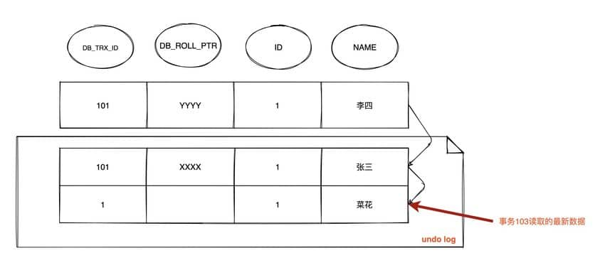
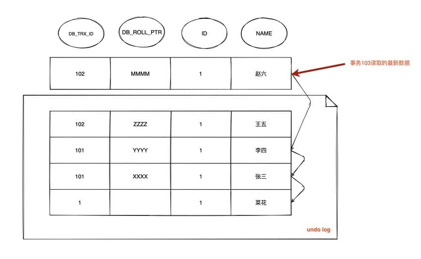

## Đa phiên bản kiểm soát đồng thời (Multi-Version Concurrency Control - MVCC)

MVCC là một cơ chế kiểm soát đồng thời được sử dụng để giữ cho dữ liệu có tính nhất quán và tính cô lập khi nhiều Transaction đồng thời đọc ghi vào cơ sở dữ liệu. Nó được thực hiện bằng cách duy trì nhiều phiên bản dữ liệu trên mỗi hàng dữ liệu. Khi một Transaction sửa đổi dữ liệu, InnoDB sẽ **trực tiếp cập nhật hàng dữ liệu hiện tại** (in-place update) và **lưu trữ phiên bản dữ liệu cũ vào Undo Log**. Các Transaction khác khi thực hiện Snapshot Read (Đọc ảnh chụp) sẽ dựa vào **ReadView** và chuỗi phiên bản (version chain) trong **Undo Log** để đọc khung nhìn nhất quán (consistent view) của dữ liệu tại một thời điểm nhất định, từ đó tránh việc thao tác đọc bị chặn bởi thao tác ghi.

1. Thao tác đọc (SELECT):

Khi một Transaction thực hiện thao tác đọc, nó sẽ sử dụng Snapshot Read. Snapshot Read được tạo dựa trên trạng thái của cơ sở dữ liệu khi Transaction khởi chạy, do đó Transaction sẽ không đọc được các sửa đổi chưa commit của các Transaction khác. Tình huống làm việc cụ thể như sau:

- Đối với thao tác đọc, Transaction sẽ tìm kiếm hàng dữ liệu thỏa mãn điều kiện và chọn phiên bản dữ liệu không muộn hơn thời điểm khởi chạy Transaction để đọc.
- Nếu một hàng dữ liệu có nhiều phiên bản, Transaction sẽ chọn phiên bản mới nhất không muộn hơn thời điểm khởi chạy của nó, đảm bảo Transaction chỉ đọc dữ liệu đã tồn tại trước khi nó khởi chạy.
- Transaction đọc là dữ liệu snapshot, do đó các sửa đổi hàng dữ liệu của các Transaction đồng thời khác sẽ không ảnh hưởng đến thao tác đọc của Transaction hiện tại.

2. Thao tác ghi (INSERT, UPDATE, DELETE):

Khi một Transaction thực hiện thao tác ghi, nó sẽ tạo một phiên bản dữ liệu mới và ghi dữ liệu đã sửa đổi vào cơ sở dữ liệu. Tình huống làm việc cụ thể như sau:

- Đối với thao tác ghi, Transaction sẽ tạo một phiên bản mới cho hàng dữ liệu cần sửa đổi và ghi dữ liệu đã sửa đổi vào phiên bản mới.
- Phiên bản dữ liệu mới sẽ mang Transaction ID của Transaction hiện tại, để các Transaction khác có thể đọc chính xác dữ liệu của phiên bản tương ứng.
- Dữ liệu của phiên bản ban đầu vẫn tồn tại để các Transaction khác sử dụng Snapshot Read, điều này đảm bảo các Transaction khác không bị ảnh hưởng bởi thao tác ghi của Transaction hiện tại.

3. Commit và Rollback của Transaction:

- Khi một Transaction commit, các sửa đổi mà nó thực hiện sẽ trở thành phiên bản mới nhất của cơ sở dữ liệu và hiển thị với các Transaction khác.
- Khi một Transaction rollback, các sửa đổi mà nó thực hiện sẽ bị hủy bỏ và không hiển thị với các Transaction khác.

4. Thu hồi phiên bản (Purge):

Để tránh số lượng phiên bản trong cơ sở dữ liệu tăng trưởng vô hạn, MVCC sẽ định kỳ thu hồi các phiên bản. Cơ chế thu hồi (Purge) sẽ xóa các dữ liệu phiên bản cũ không còn cần thiết nữa, từ đó giải phóng dung lượng.

MVCC thông qua việc tạo nhiều phiên bản dữ liệu và sử dụng Snapshot Read để thực hiện kiểm soát đồng thời. Thao tác đọc dùng snapshot dữ liệu phiên bản cũ, thao tác ghi tạo phiên bản mới và đảm bảo phiên bản ban đầu vẫn khả dụng. Nhờ vậy, các Transaction khác nhau có thể thực thi đồng thời ở mức độ nhất định mà không can thiệp lẫn nhau, nâng cao hiệu năng đồng thời và tính nhất quán dữ liệu của cơ sở dữ liệu.

## Consistent Nonlocking Read và Locking Read

### Consistent Nonlocking Read (Đọc không khóa nhất quán)

Đối với việc thực thi [**Consistent Nonlocking Read**](https://dev.mysql.com/doc/refman/5.7/en/innodb-consistent-read.html), cách làm thông thường là thêm một field version number hoặc timestamp, khi cập nhật dữ liệu đồng thời version number + 1 hoặc cập nhật timestamp. Khi query, so sánh version number hiện tại có thể nhìn thấy với version number của bản ghi tương ứng, nếu version của bản ghi nhỏ hơn version có thể nhìn thấy thì bản ghi đó có thể nhìn thấy.

Trong Storage Engine `InnoDB`, [Multi-Version Concurrency Control (MVCC)](https://dev.mysql.com/doc/refman/5.7/en/innodb-multi-versioning.html) chính là thực thi của Consistent Nonlocking Read. Nếu hàng được đọc đang thực hiện thao tác `DELETE` hoặc `UPDATE`, thao tác đọc lúc này sẽ không chờ giải phóng lock trên hàng. Ngược lại, Storage Engine `InnoDB` sẽ đi đọc một snapshot dữ liệu của hàng, đối với phương thức đọc dữ liệu lịch sử này, chúng ta gọi là Snapshot Read (快照读).

Trong 2 mức độ cô lập `Repeatable Read` và `Read Committed`, nếu thực thi câu lệnh `SELECT` thông thường (không bao gồm `SELECT ... LOCK IN SHARE MODE`, `SELECT ... FOR UPDATE`), sẽ sử dụng Consistent Nonlocking Read (MVCC). Ngoài ra trong `Repeatable Read`, MVCC đã thực thi可重复读 (Repeatable Read) và ngăn chặn một phần Phantom Read.

### Locking Read (Đọc khóa)

Nếu thực thi các câu lệnh sau, chính là [**Locking Read**](https://dev.mysql.com/doc/refman/5.7/en/innodb-locking-reads.html):

- `SELECT ... LOCK IN SHARE MODE`
- `SELECT ... FOR UPDATE`
- Thao tác `INSERT`, `UPDATE`, `DELETE`

Trong Locking Read, dữ liệu được đọc là phiên bản mới nhất, loại đọc này còn gọi là `Current Read (当前读)`. Locking Read sẽ thêm khóa vào các bản ghi đọc được:

- `SELECT ... LOCK IN SHARE MODE`: Thêm `S` lock vào bản ghi, Transaction khác cũng có thể thêm `S` lock, nếu thêm `X` lock sẽ bị chặn (blocked).
- `SELECT ... FOR UPDATE`, `INSERT`, `UPDATE`, `DELETE`: Thêm `X` lock vào bản ghi, Transaction khác không thể thêm bất kỳ lock nào.

Trong Consistent Nonlocking Read, ngay cả khi bản ghi được đọc đã bị Transaction khác thêm `X` lock, lúc này bản ghi vẫn có thể được đọc (đọc dữ liệu snapshot). Ở trên đã nói, ở mức `Repeatable Read`, `MVCC` ngăn chặn một phần Phantom Read, chữ "một phần" ở đây chỉ việc trong trường hợp `Consistent Nonlocking Read`, chỉ có thể đọc được dữ liệu được chèn trước lần query đầu tiên (dựa theo Read View đánh giá tính nhìn thấy của dữ liệu, Read View được tạo ở lần query đầu tiên). Nhưng! Nếu là `Current Read`, mỗi lần đọc đều là dữ liệu mới nhất, lúc này nếu giữa 2 lần query có Transaction khác chèn dữ liệu thì sẽ phát sinh Phantom Read. Cho nên, **`InnoDB` khi thực thi `Repeatable Read`, nếu thực thi Current Read sẽ sử dụng `Next-key Lock` trên các bản ghi được đọc để ngăn chặn Transaction khác chèn dữ liệu vào các khoảng trống (gap)**.

## Thực thi MVCC trong InnoDB

Sự thực thi của `MVCC` phụ thuộc vào: **Field ẩn (Hidden columns), Read View, Undo Log**. Bên trong, `InnoDB` thông qua `DB_TRX_ID` của hàng dữ liệu và `Read View` để phán đoán tính nhìn thấy của dữ liệu, nếu không nhìn thấy thì thông qua `DB_ROLL_PTR` của hàng dữ liệu tìm phiên bản lịch sử trong `Undo Log`. Phiên bản dữ liệu mà mỗi Transaction đọc được có thể khác nhau, trong cùng một Transaction, người dùng chỉ nhìn thấy các sửa đổi đã commit trước khi Transaction đó tạo `Read View` và các sửa đổi do chính Transaction đó thực hiện.

### Field ẩn (Hidden columns)

Bên trong, Storage Engine `InnoDB` thêm 3 [Field ẩn](https://dev.mysql.com/doc/refman/5.7/en/innodb-multi-versioning.html) cho mỗi hàng dữ liệu:

- `DB_TRX_ID (6 byte)`: Biểu thị Transaction ID thực hiện insert hoặc update hàng đó lần cuối. Ngoài ra thao tác `DELETE` bên trong được xem là update, chỉ là sẽ đánh dấu là đã xóa ở field `deleted_flag` trong Record Header.
- `DB_ROLL_PTR (7 byte)`: Con trỏ rollback, trỏ đến `Undo Log` của hàng đó. Nếu hàng đó chưa bị update thì để rỗng.
- `DB_ROW_ID (6 byte)`: Nếu không thiết lập Primary Key và bảng đó không có Unique Index không null, `InnoDB` sẽ dùng ID này để tạo Clustered Index.

### ReadView

```c
class ReadView {
  /* ... */
private:
  trx_id_t m_low_limit_id;      /* Các Transaction ID lớn hơn hoặc bằng ID này đều không nhìn thấy */

  trx_id_t m_up_limit_id;       /* Các Transaction ID nhỏ hơn ID này đều nhìn thấy */

  trx_id_t m_creator_trx_id;    /* Transaction ID tạo Read View này */

  trx_id_t m_low_limit_no;      /* Transaction Number, các Undo Log nhỏ hơn Number này đều có thể bị Purge */

  ids_t m_ids;                  /* Danh sách các Transaction đang hoạt động (active) khi tạo Read View */

  m_closed;                     /* Đánh dấu Read View có close hay không */
}
```

`Read View` chủ yếu dùng để đánh giá tính nhìn thấy (visibility), bên trong lưu trữ "danh sách các Transaction đang hoạt động khác không hiển thị với Transaction hiện tại".

Có các field chính:

- `m_low_limit_id`: Transaction ID lớn nhất từng xuất hiện + 1, tức Transaction ID tiếp theo sẽ được cấp phát. Dữ liệu có phiên bản lớn hơn hoặc bằng ID này đều không nhìn thấy.
- `m_up_limit_id`: Transaction ID nhỏ nhất trong danh sách Transaction hoạt động `m_ids`. Nếu `m_ids` rỗng thì `m_up_limit_id` chính là `m_low_limit_id`. Dữ liệu có phiên bản nhỏ hơn ID này đều nhìn thấy.
- `m_ids`: Danh sách ID của các Transaction hoạt động chưa commit khác khi tạo `Read View`. Khi tạo `Read View`, ghi lại ID các Transaction chưa commit hiện tại, về sau dù chúng có sửa đổi giá trị hàng bản ghi thì đối với Transaction hiện tại cũng không nhìn thấy. `m_ids` không bao gồm bản thân Transaction hiện tại và các Transaction đã commit.
- `m_creator_trx_id`: Transaction ID tạo nên `Read View` này.

Sơ đồ tính nhìn thấy của Transaction:


### Undo Log

`Undo Log` chủ yếu có 2 tác dụng:

- Khi Transaction rollback, dùng để khôi phục dữ liệu về trạng thái trước khi sửa đổi.
- Tác dụng khác là `MVCC`, khi đọc bản ghi, nếu bản ghi bị Transaction khác chiếm giữ hoặc phiên bản hiện tại không hiển thị với Transaction hiện tại, có thể thông qua `Undo Log` đọc dữ liệu phiên bản trước đó, qua đó thực hiện Consistent Nonlocking Read.

Trong Storage Engine `InnoDB`, `Undo Log` chia làm 2 loại: `insert undo log` và `update undo log`:

1. **`insert undo log`**: Undo log tạo ra trong thao tác `INSERT`. Vì bản ghi của thao tác `INSERT` chỉ hiển thị với chính Transaction đó, không hiển thị với Transaction khác, nên `Undo Log` này có thể xóa trực tiếp sau khi Transaction commit. Không cần thao tác `purge`.

Trạng thái ban đầu của dữ liệu khi `INSERT`:


2. **`update undo log`**: Undo log tạo ra trong thao tác `UPDATE` hoặc `DELETE`. `Undo Log` này có thể cần cung cấp cho cơ chế `MVCC`, do đó không thể xóa ngay khi Transaction commit. Khi commit sẽ đưa vào linked list `Undo Log`, chờ `Purge Thread` thực hiện xóa cuối cùng.

Lần đầu tiên dữ liệu bị sửa đổi:


Lần thứ hai dữ liệu bị sửa đổi:


Các sửa đổi của các Transaction khác nhau hoặc cùng Transaction trên cùng một hàng bản ghi sẽ làm cho `Undo Log` của hàng bản ghi đó trở thành một linked list, đầu chuỗi là bản ghi mới nhất, cuối chuỗi là bản ghi cũ nhất.

### Thuật toán đánh giá tính nhìn thấy của dữ liệu (Data Visibility Algorithm)

Trong Storage Engine `InnoDB`, sau khi tạo một Transaction mới, trước khi thực thi mỗi câu lệnh `SELECT`, đều sẽ tạo một snapshot (Read View), **trong snapshot lưu trữ các ID của các Transaction đang trong trạng thái hoạt động (chưa commit) trong hệ thống database hiện tại**. Đơn giản là lưu trữ danh sách các Transaction ID khác không nên được nhìn thấy bởi Transaction hiện tại (tức m_ids). Khi người dùng trong Transaction này muốn đọc một hàng bản ghi nào đó, `InnoDB` sẽ lấy `DB_TRX_ID` của hàng bản ghi đó so sánh với các biến trong `Read View` và ID của Transaction hiện tại để phán đoán xem có thỏa mãn điều kiện nhìn thấy hay không.

Thuật toán so sánh cụ thể:


1. Nếu bản ghi DB_TRX_ID < m_up_limit_id, chứng tỏ Transaction sửa đổi hàng này gần nhất (DB_TRX_ID) đã commit trước khi Transaction hiện tại tạo snapshot, nên giá trị hàng bản ghi này có thể nhìn thấy đối với Transaction hiện tại.
2. Nếu DB_TRX_ID >= m_low_limit_id, chứng tỏ Transaction sửa đổi hàng này gần nhất (DB_TRX_ID) sửa đổi sau khi Transaction hiện tại tạo snapshot, nên giá trị hàng bản ghi này không thể nhìn thấy đối với Transaction hiện tại. Nhảy sang bước 5.
3. Nếu m_ids rỗng, chứng tỏ trước khi Transaction hiện tại tạo snapshot, Transaction sửa đổi hàng này đã commit, nên giá trị hàng bản ghi này có thể nhìn thấy đối međến Transaction hiện tại.
4. Nếu m_up_limit_id <= DB_TRX_ID < m_low_limit_id, chứng tỏ Transaction sửa đổi hàng này gần nhất (DB_TRX_ID) khi Transaction hiện tại tạo snapshot có thể đang ở trạng thái "hoạt động" hoặc "đã commit"; do đó cần tìm kiếm trong danh sách Transaction hoạt động m_ids (trong source code dùng nhị phân search do m_ids đã sắp xếp):
   - Nếu tìm thấy DB_TRX_ID trong danh sách m_ids, chứng tỏ: ① Trước khi Transaction hiện tại tạo snapshot, giá trị hàng bị sửa đổi bởi Transaction ID = DB_TRX_ID nhưng chưa commit; hoặc ② Sau khi Transaction hiện tại tạo snapshot, giá trị hàng bị sửa bởi Transaction ID = DB_TRX_ID. Trong các trường hợp này, giá trị hàng bản ghi đều không nhìn thấy đối với Transaction hiện tại. Nhảy sang bước 5.
   - Nếu không tìm thấy trong danh sách m_ids, chứng tỏ "Transaction id = trx_id" sau khi sửa giá trị hàng đã commit trước khi "Transaction hiện tại" tạo snapshot, nên hàng bản ghi có thể nhìn thấy đối với Transaction hiện tại.
5. Từ con trỏ DB_ROLL_PTR của hàng bản ghi trỏ đến `Undo Log` lấy ra bản ghi snapshot, dùng DB_TRX_ID của bản ghi snapshot quay lại bước 1 bắt đầu phán đoán lại, cho đến khi tìm thấy phiên bản snapshot thỏa mãn hoặc trả về rỗng.

## Sự khác biệt của MVCC giữa hai mức độ cô lập RC và RR

Ở mức độ cô lập Transaction `RC` và `RR` (mặc định của InnoDB), Storage Engine `InnoDB` đều sử dụng `MVCC` (Consistent Nonlocking Read), nhưng thời điểm chúng tạo `Read View` lại khác nhau:

- Mức RC: **Trước mỗi câu lệnh `SELECT`** đều tạo một `Read View` mới (danh sách m_ids).
- Mức RR: Chỉ tạo một `Read View` (danh sách m_ids) **trước câu `SELECT` đầu tiên** sau khi bắt đầu Transaction.

## MVCC giải quyết vấn đề Non-repeatable Read

Mặc dù cả RC và RR đều thông qua `MVCC` để đọc dữ liệu snapshot, nhưng do **thời điểm tạo Read View khác nhau**, từ đó ở mức RR thực thi được Repeatable Read (Đọc lặp lại được).

Ví dụ:


### Tình huống tạo ReadView ở mức RC

**1. Giả sử mốc thời gian đến T4, lúc này chuỗi phiên bản của hàng id = 1 là:**



Do ở mức RC mỗi lần query đều tạo `Read View`, và Transaction 101, 102 chưa commit, lúc này `Read View` tạo bởi Transaction `103` có danh sách **`m_ids`: [101, 102]**, `m_low_limit_id`: 104, `m_up_limit_id`: 101, `m_creator_trx_id`: 103.

- Lúc này `DB_TRX_ID` mới nhất là 101, m_up_limit_id <= 101 < m_low_limit_id, tìm trong `m_ids` thấy 101 có tồn tại, nên bản ghi này không nhìn thấy.
- Dựa theo `DB_ROLL_PTR` tìm bản ghi phiên bản trước trong `Undo Log`, `DB_TRX_ID` của bản ghi trước vẫn là 101, không nhìn thấy.
- Tiếp tục tìm bản ghi trước nữa có `DB_TRX_ID` = 1, thỏa mãn 1 < m_up_limit_id, nhìn thấy, nên Transaction 103 query ra dữ liệu `name = 菜花`.

**2. Mốc thời gian đến T6, chuỗi phiên bản dữ liệu là:**


Vì ở mức RC sẽ tạo lại `Read View`, lúc này Transaction 101 đã commit, 102 chưa commit, nên **`m_ids`: [102]**, `m_low_limit_id`: 104, `m_up_limit_id`: 102, `m_creator_trx_id`: 103.

- `DB_TRX_ID` mới nhất là 102, tìm thấy trong `m_ids` nên không nhìn thấy.
- Dựa theo `DB_ROLL_PTR` tìm bản ghi trước có `DB_TRX_ID` = 101, thỏa mãn 101 < m_up_limit_id, nhìn thấy. Do đó tại mốc T6 query ra `name = 李四`, không nhất quán với mốc T4 (`name = 菜花`), phát sinh Non-repeatable Read!

**3. Mốc thời gian đến T9, chuỗi phiên bản dữ liệu là:**



Tạo lại `Read View`, lúc này cả 101 và 102 đều đã commit, **m_ids** rỗng, m_up_limit_id = m_low_limit_id = 104, `DB_TRX_ID` mới nhất = 102 < 104, nhìn thấy, kết quả `name = 赵六`.

> **Tóm lại:** **Ở mức độ cô lập RC, Transaction tạo và thiết lập Read View mới trước mỗi lần query, dẫn đến Non-repeatable Read.**

### Tình huống tạo ReadView ở mức RR

Ở mức Repeatable Read, chỉ tạo một Read View (danh sách m_ids) ở lần đọc dữ liệu đầu tiên sau khi Transaction bắt đầu.

**1. Ở mốc T4:**
Giống mức RC, Transaction 103 query ra `name = 菜花`.

**2. Ở mốc T6:**
Do mức RR dùng lại `Read View` đã tạo ở T4 (**`m_ids`: [101, 102]**), nên kết quả query vẫn là `name = 菜花`.

**3. Ở mốc T9:**
Vẫn dùng lại `Read View` (**`m_ids`: [101, 102]**), kết quả query vẫn là `name = 菜花`.

## MVCC + Next-key Lock chống Phantom Read

Storage Engine `InnoDB` ở mức RR giải quyết Phantom Read thông qua `MVCC` và `Next-key Lock`:

1. **Thực thi SELECT thông thường (Snapshot Read với MVCC)**: Dùng chung 1 `Read View` xuyên suốt Transaction, không nhìn thấy các bản ghi mới insert của Transaction khác.
2. **Thực thi Current Read (SELECT ... FOR UPDATE, INSERT, UPDATE, DELETE)**: Khóa các bản ghi đọc được đồng thời khóa khoảng trống (Gap) giữa chúng, ngăn chặn Transaction khác insert dữ liệu mới vào phạm vi query.

## Tham khảo

- **《MySQL 技术内幕 InnoDB 存储引擎第 2 版》**
- [Innodb 中的事务隔离级别和锁的关系](https://tech.meituan.com/2014/08/20/innodb-lock.html)
- [MySQL 事务与 MVCC 如何实现的隔离级别](https://blog.csdn.net/qq_35190492/article/details/109044141)
- [InnoDB 事务分析-MVCC](https://leviathan.vip/2019/03/20/InnoDB%E7%9A%84%E4%BA%8B%E5%8A%A1%E5%88%86%E6%9E%90-MVCC/)

<!-- @include: @article-footer.snippet.md -->
