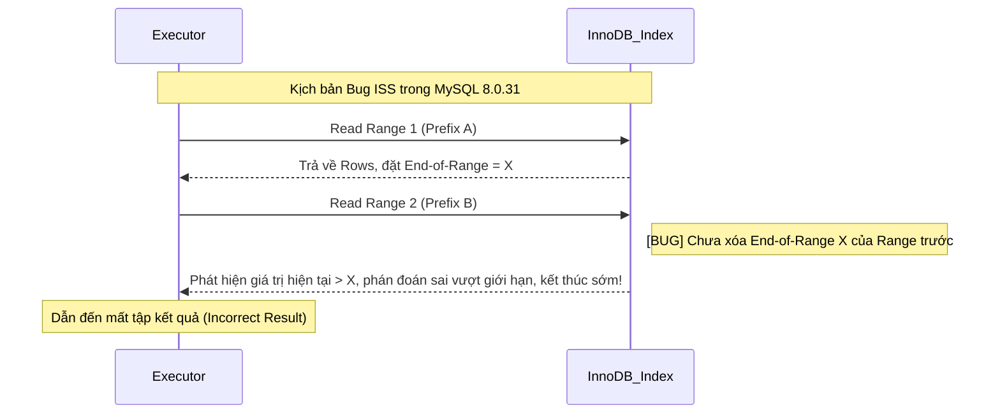

Trong tối ưu hóa hiệu năng database, Index là một trong những phương tiện tối ưu hóa trực tiếp và hiệu quả nhất. Tuy nhiên, **tạo Index không đồng nghĩa với việc chắc chắn sử dụng được Index**. Trong phát triển thực tế, chúng ta thường gặp phải sự cố: rõ ràng đã tạo Index trên field nhưng query vẫn chậm như sên, dùng `EXPLAIN` phân tích phát hiện ra là Full Table Scan.

Nguyên nhân dẫn đến Index bị vô hiệu hóa (Index Invalidation) rất đa dạng, vừa do cách viết câu SQL vừa do thiết kế Index không hợp lý. Có những kịch bản vô hiệu hóa hiển nhiên (như vi phạm quy tắc tiền tố trái nhất), có những kịch bản lại cực kỳ ẩn ấp (như chuyển đổi kiểu ngầm định). If không tìm hiểu sâu các kịch bản này, rất dễ chôn giấu hiểm họa hiệu năng trong môi trường production.

Bài viết này tổng kết hệ thống các kịch bản vô hiệu hóa Index phổ biến trong MySQL, phân tích nguyên lý đằng sau và cung cấp các kiến nghị tối ưu tương ứng.

### Truy vấn SELECT * (Đánh đổi chi phí)

- **Định nghĩa cốt lõi**: `SELECT *` bản thân nó **không trực tiếp làm Index vô hiệu hóa**. Nó là loại truy vấn "không dùng Covering Index", nếu điều kiện `WHERE` trúng Index, Index vẫn sẽ được cân nhắc ban đầu.
- **Quyết định chi phí Index Lookup (回表)**: Khi các field cần query không nằm trong cây Index, MySQL bắt buộc phải cầm Primary Key thực hiện Index Lookup (回表) về Clustered Index để lấy dữ liệu toàn hàng. Optimizer sẽ so sánh chi phí giữa "Quét Index + 回表" và "Full Table Scan trực tiếp". Nếu tỷ lệ kết quả query chiếm phần lớn tổng dữ liệu (thông thường ngưỡng từ 20%~30%), Optimizer sẽ cho rằng I/O tuần tự của Full Table Scan hiệu quả hơn I/O ngẫu nhiên của 回表, từ đó **chủ động từ bỏ Index**.
- **Đánh đổi kịch bản**:
  - **Kịch bản Covering Index**: Nếu query chỉ cần các field mà Index bao phủ, sử dụng Covering Index có thể tránh 回表, hiệu năng tối ưu nhất.
  - **Khi 回表 là không thể tránh khỏi**: Nếu nghiệp vụ thực sự cần nhiều field không có trong Index, trực tiếp `SELECT các_field_cần_thiết` là được.
- **Kiến nghị**: Ưu tiên `SELECT các_field_cần_thiết`, trúng Covering Index là tốt nhất.

### Vi phạm Quy tắc Tiền tố Trái nhất (Leftmost Prefix Rule)

- **Định nghĩa cốt lõi**: Quy tắc Tiền tố Trái nhất đề cập đến việc khi sử dụng Composite Index, MySQL sẽ dựa theo thứ tự các field trong Index, từ trái sang phải khớp lần lượt các field trong điều kiện query.
- **Hiệu ứng ngắt quãng của truy vấn phạm vi**: Trong Composite Index, nếu một field sử dụng truy vấn phạm vi (ví dụ `>`, `<`, `BETWEEN`, `LIKE "abc%"`), field đó và các cột phía trước nó vẫn có thể khớp và định vị chính xác, nhưng các cột phía sau field đó sẽ không thể lợi dụng Index để định vị nhanh (không thể dùng truy vấn二分查找 kiểu `ref`). Điều này là do trong cấu trúc Index B+Tree, chỉ khi các cột phía trước hoàn toàn bằng nhau thì các cột phía sau mới có thứ tự. Tuy nhiên từ MySQL 5.6 trở đi, các cột phía sau không bị vô hiệu hóa hoàn toàn mà được hạ cấp xuống sử dụng cơ chế **Index Condition Pushdown (ICP)** để lọc điều kiện trực tiếp trong quá trình quét phạm vi, qua đó giảm số lần 回表.
- **Index Skip Scan (ISS)**: MySQL 8.0.13 đưa vào **Index Skip Scan (ISS)**, cho phép nhảy qua các node khi thiếu tiền tố trái nhất bằng cách duyệt tất cả các giá trị Distinct của cột tiền tố.
  - **Cảnh báo phiên bản**: Trong **MySQL 8.0.31**, ISS tồn tại Bug nghiêm trọng ([[Bug #109145]](https://bugs.mysql.com/bug.php?id=109145)), khi đọc qua các Range không dọn dẹp biên cũ, dẫn đến query trực tiếp **bị mất dữ liệu**.
  - **Khuyến nghị**: Trong môi trường production, **nghiêm cấm dựa vào ISS để bù đắp cho thiết kế Index kém**, bắt buộc phải đáp ứng quy tắc tiền tố trái nhất bằng cách điều chỉnh thứ tự Composite Index hoặc bổ sung điều kiện tiền tố.

**Sơ đồ lỗi Index Skip Scan:**



Ví dụ vô hiệu hóa:

```sql
-- Index: (sname, s_code, address)
SELECT * FROM students WHERE s_code = 1;                  -- Bỏ qua cột ngoài cùng bên trái sname -> Index vô hiệu hóa
SELECT * FROM students WHERE sname = 'A' AND address = 'Shanghai'; -- Bỏ qua cột ở giữa, chỉ sname đi qua Index (ICP hỗ trợ lọc address)
SELECT * FROM students WHERE sname = 'A' AND s_code > 1 AND address = 'Shanghai'; -- Sau truy vấn phạm vi, address không thể dùng để định vị, chỉ dùng để lọc
```

### Tính toán, hàm hoặc chuyển đổi kiểu trên cột Index

- **Định nghĩa cốt lõi**: Index B+Tree lưu trữ giá trị **ban đầu** của field. Một khi dùng hàm (như `ABS()`, `DATE()`) hoặc phép tính số học trên cột Index ở mệnh đề `WHERE`, giá trị cột đó về mặt logic đã bị thay đổi.
- **Hiệu ứng phá vỡ tính thứ tự**: Do B+Tree sắp xếp dựa trên giá trị ban đầu, kết quả sau khi qua hàm xử lý sẽ **không có thứ tự** trong cây Index. Database không thể dùng nhị phân search để định vị nhanh, buộc phải Full Table Scan.
- **Function-based Index**: MySQL 8.0 hỗ trợ **Function-based Index** (Index dựa trên hàm), có thể tạo Index cho giá trị sau khi tính toán.

Ví dụ vô hiệu hóa:

```sql
SELECT * FROM students WHERE height + 1 = 170;            -- Phép tính trên cột Index
SELECT * FROM students WHERE DATE(create_time) = '2022-01-01'; -- Dùng hàm trên cột Index
```

Tối ưu hóa:

```sql
SELECT * FROM students WHERE height = 169;                -- Chuyển phép tính sang vế phải
SELECT * FROM students WHERE create_time BETWEEN '2022-01-01 00:00:00' AND '2022-01-01 23:59:59';
```

### Truy vấn LIKE bắt đầu bằng ký tự đại diện (%)

- **Định nghĩa cốt lõi**: Truy vấn `LIKE` bắt buộc phải bắt đầu bằng ký tự cụ thể mới tận dụng được tính có thứ tự của Index, ví dụ `WHERE sname LIKE 'Guide%';`. Đó là do B+Tree sắp xếp từ trái sang phải.
- **Cơ chế vô hiệu hóa**: Nếu bắt đầu bằng `%` (như `'%abc'`), do không xác định được ký tự đầu tiên nên có thể xuất hiện ở bất kỳ vị trí nào trên cây Index, dẫn đến không thể định vị điểm bắt đầu quét.

Ví dụ vô hiệu hóa:

```sql
SELECT * FROM students WHERE sname LIKE '%Guide';          -- Bắt đầu bằng %, Full Table Scan
SELECT * FROM students WHERE sname LIKE '%Guide%';         -- Cả 2 đầu %, Full Table Scan
```

### Thao tác OR và Index Merge

- **Định nghĩa cốt lõi**: Trong nhiều điều kiện nối bằng `OR`, chỉ cần **có bất kỳ một cột nào không có Index**, MySQL sẽ bỏ tất cả Index chuyển sang Full Table Scan.
- **Cơ chế Index Merge**: Nếu cả 2 bên `OR` đều có Index, MySQL 5.1+ có thể kích hoạt tối ưu **Index Merge**, quét riêng 2 Index rồi gộp tập kết quả. Tuy nhiên nếu lượng dữ liệu quét lớn, chi phí gộp có thể cao hơn Full Table Scan nên vẫn có thể bỏ Index.
- **Khuyến nghị**: Ưu tiên viết lại `OR` thành `UNION ALL`.

Ví dụ vô hiệu hóa:

```sql
-- Giả sử sname và address đều có Index, nhưng mỗi bên khớp 30%+ dữ liệu
SELECT * FROM students WHERE sname = 'Học sinh 1' OR address = 'Thượng Hải'; -- Có thể bỏ Index, Full Table Scan

-- Đề xuất viết lại thành
SELECT * FROM students WHERE sname = 'Học sinh 1'
UNION ALL
SELECT * FROM students WHERE address = 'Thượng Hải'; -- Mỗi bên tự đi qua Index
```

### Sử dụng IN / NOT IN không đúng cách

- `eq_range_index_dive_limit` (mặc định **200**) ảnh hưởng đến chiến lược ước tính số hàng. Khi danh sách `IN` > 200, Optimizer chuyển từ Index Dive sang dựa vào `index_statistics`. Nếu thông tin thống kê bị lỗi thời, có thể phán đoán sai chi phí và bỏ dùng Index.
- `NOT IN` danh sách hằng số (như `NOT IN (1,2,3)`): Thường Full Table Scan. Khuyên dùng `NOT EXISTS` hoặc `LEFT JOIN / IS NULL`.

### Chuyển đổi ngầm định (Implicit Conversion)

Đây là bẫy ẩn ấp nhất khi lập trình, **hướng chuyển đổi quyết định Index sống hay chết**.

| Kịch bản | Ví dụ | Hướng chuyển đổi | Index có hiệu lực không? |
| --------------------- | ------------------- | ---------------------------- | ------------ |
| **Cột String + Giá trị Số** | `varchar_col = 123` | Chuỗi chuyển thành Số (xảy ra trên cột Index) | ❌ Vô hiệu hóa |
| **Cột Số + Giá trị Chuỗi** | `int_col = '123'` | Chuỗi chuyển thành Số (xảy ra trên hằng số) | ✅ Có hiệu lực |

- Chỉ khi **chuyển đổi xảy ra trên cột Index** thì Index mới bị vô hiệu hóa.
- Khi so sánh Chuỗi và Số, MySQL mặc định chuyển Chuỗi thành **DOUBLE**. Thực hiện chuyển đổi ngầm định trên cột Index tương đương áp dụng hàm chuyển đổi trên cột Index, phá vỡ tính thứ tự của B+Tree.

Chi tiết: [Chuyển đổi ngầm định trong MySQL gây vô hiệu hóa Index](https://javaguide.cn/database/mysql/index-invalidation-caused-by-implicit-conversion.html)

### Bẫy tối ưu hóa ORDER BY

Kích hoạt `Using filesort` khi:
- Cột sắp xếp không nằm trong Index.
- Thứ tự Index không khớp với `ORDER BY` (ví dụ Index `(a,b)` nhưng `ORDER BY b,a`).
- `WHERE` và `ORDER BY` dùng các Index khác nhau.

### Tóm tắt

1. **Rèn luyện thói quen dùng `EXPLAIN`** phân tích SQL.
2. **Lựa chọn chiến lược truy vấn theo kịch bản**: Dùng Covering Index khi có thể.
3. **Chuẩn hóa kiểu dữ liệu**: Đảm bảo loại giá trị khớp với loại cột.
4. **Thiết kế Composite Index hợp lý**: Đặt các cột query tần suất cao ở tiền tố.
5. **Tìm kiếm mờ quy mô lớn cân nhắc ES**: Dùng ElasticSearch thay cho `LIKE '%keyword%'`.

<!-- @include: @article-footer.snippet.md -->
