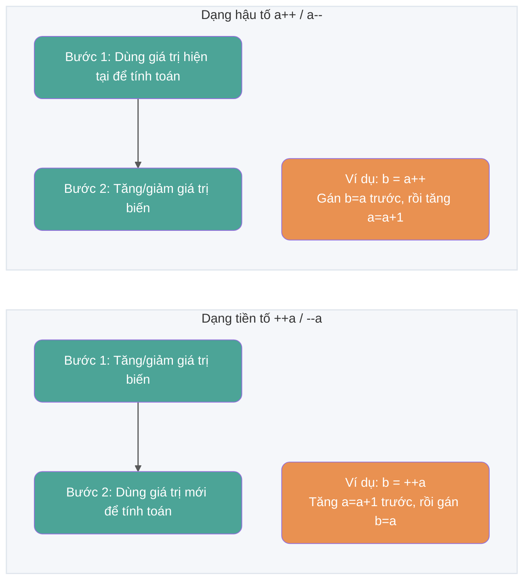
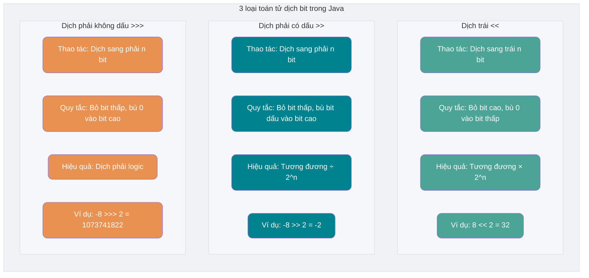
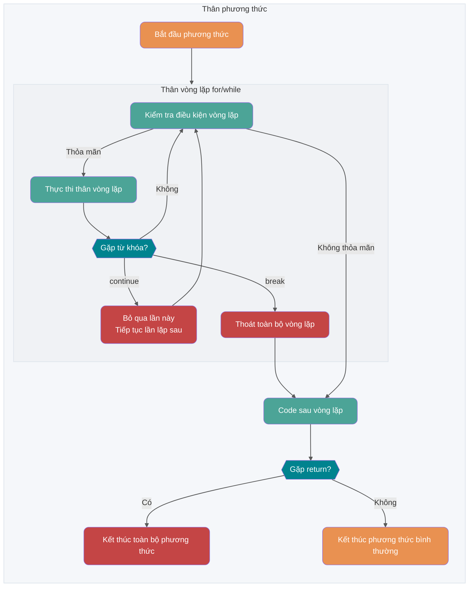
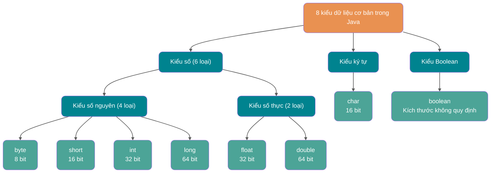
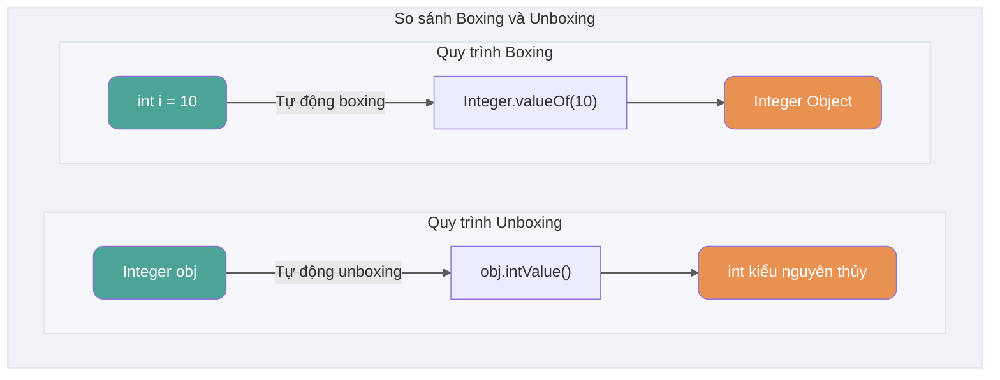

## Khái niệm cơ bản & Thường thức

### Ngôn ngữ Java có những đặc điểm gì?

1. Đơn giản, dễ học (cú pháp đơn giản, dễ tiếp cận);
2. Hướng đối tượng OOP (đóng gói Encapsulation, kế thừa Inheritance, đa hình Polymorphism);
3. Độc lập nền tảng (Java Virtual Machine giúp đạt được sự độc lập nền tảng);
4. Hỗ trợ đa luồng Multi-threading (ngôn ngữ C++ không tích hợp sẵn cơ chế đa luồng nên phải gọi các tính năng đa luồng của hệ điều hành, trong khi Java cung cấp sẵn sự hỗ trợ đa luồng);
5. Độ tin cậy cao (có cơ chế xử lý ngoại lệ Exception và tự động quản lý bộ nhớ GC);
6. Tính an toàn (bản thân thiết kế ngôn ngữ Java đã cung cấp nhiều cơ chế bảo vệ an toàn như modifier hạn chế truy cập, hạn chế chương trình truy cập trực tiếp tài nguyên hệ điều hành);
7. Hiệu năng cao (nhờ tối ưu hóa của trình biên dịch Just In Time (JIT), hiệu năng chạy của Java rất tốt);
8. Hỗ trợ lập trình mạng rất thuận tiện;
9. Biên dịch và thông dịch cùng tồn tại;
10. ……

> **🐛 Sửa lỗi (Xem: [issue#544](https://github.com/Snailclimb/JavaGuide/issues/544))**: Từ C++11 (năm 2011), C++ đã đưa vào thư viện đa luồng, trên Windows, Linux, macOS đều có thể dùng `std::thread` và `std::async` để tạo Thread. Thư mục tham khảo: <http://www.cplusplus.com/reference/thread/thread/?kw=thread>

🌈 Mở rộng một chút:

Khẩu hiệu quảng cáo “Write Once, Run Anywhere (Viết một lần, chạy mọi nơi)” thực sự vô cùng kinh điển, lưu truyền trong nhiều năm! Đến mức ngày nay vẫn có nhiều người nghĩ rằng tính năng đa nền tảng là ưu điểm lớn nhất của Java. Thực ra, đa nền tảng không còn là điểm bán hàng lớn nhất của Java nữa, các tính năng mới của JDK cũng vậy. Hiện nay kỹ thuật ảo hóa trên thị trường đã rất chín mùi, ví dụ bạn thông qua Docker đã rất dễ dàng thực hiện đa nền tảng. Theo tôi, hệ sinh thái mạnh mẽ của Java mới chính là ưu điểm lớn nhất!

### Java SE vs Java EE

- Java SE (Java Platform, Standard Edition): Phiên bản chuẩn của nền tảng Java, là nền tảng của ngôn ngữ lập trình Java. Nó chứa các thư viện lớp cốt lõi hỗ trợ phát triển và chạy ứng dụng Java cũng như các thành phần cốt lõi như JVM. Java SE có thể dùng để xây dựng ứng dụng desktop hoặc ứng dụng máy chủ đơn giản.
- Java EE (Java Platform, Enterprise Edition): Phiên bản doanh nghiệp của nền tảng Java, được xây dựng trên nền Java SE, chứa các tiêu chuẩn và quy chuẩn hỗ trợ phát triển và triển khai ứng dụng cấp doanh nghiệp (như Servlet, JSP, EJB, JDBC, JPA, JTA, JavaMail, JMS). Java EE có thể dùng để xây dựng các ứng dụng Java phía server phân tán, có thể di chuyển, mạnh mẽ, có khả năng mở rộng và an toàn, chẳng hạn như ứng dụng Web.

Nói một cách đơn giản, Java SE là phiên bản cơ bản của Java, Java EE là phiên bản nâng cao của Java. Java SE thích hợp hơn cho việc phát triển ứng dụng desktop hoặc ứng dụng máy chủ đơn giản, Java EE thích hợp hơn cho việc phát triển các ứng dụng doanh nghiệp phức tạp hoặc ứng dụng Web.

Ngoài Java SE và Java EE, còn có Java ME (Java Platform, Micro Edition). Java ME là phiên bản vi mô của Java, chủ yếu dùng để phát triển ứng dụng cho các thiết bị điện tử tiêu dùng nhúng như điện thoại di động, PDA, đầu kỹ thuật số, tủ lạnh, điều hòa,... Java ME không cần quá bận tâm, chỉ cần biết có tồn tại là được, hiện tại hầu như không còn dùng đến.

### ⭐️ JVM vs JDK vs JRE

#### JVM

Java Virtual Machine (JVM) là máy ảo chạy bytecode Java. JVM có các bản thực thi cụ thể dành cho các hệ điều hành khác nhau (Windows, Linux, macOS), mục đích là sử dụng cùng một bytecode sẽ cho ra cùng một kết quả. Bytecode và bản thực thi JVM trên các hệ điều hành khác nhau chính là chìa khóa cho khẩu hiệu "biên dịch một lần, chạy mọi nơi" của ngôn ngữ Java.

Như hình dưới đây, các ngôn ngữ lập trình khác nhau (Java, Groovy, Kotlin, JRuby, Clojure ...) thông qua trình biên dịch tương ứng sẽ biên dịch thành file `.class`, và cuối cùng thông qua JVM chạy trên các nền tảng khác nhau (Windows, Mac, Linux).


**JVM không chỉ có duy nhất một loại! Chỉ cần đáp ứng quy chuẩn JVM (JVM Specification), mỗi công ty, tổ chức hoặc cá nhân đều có thể phát triển JVM riêng của mình.** Nghĩa là HotSpot VM mà chúng ta thường tiếp xúc chỉ là một bản thực thi của quy chuẩn JVM mà thôi.

Ngoài HotSpot VM phổ biến nhất, còn có J9 VM, Zing VM, JRockit VM,... Trên Wikipedia có bảng so sánh các JVM phổ biến: [Comparison of Java virtual machines](https://en.wikipedia.org/wiki/Comparison_of_Java_virtual_machines). Ngoài ra, bạn có thể tìm thấy quy chuẩn JVM tương ứng với các phiên bản JDK tại [Java SE Specifications](https://docs.oracle.com/javase/specs/index.html).


#### JDK và JRE

JDK (Java Development Kit) là bộ công cụ phát triển Java đầy đủ tính năng dành cho các lập trình viên sử dụng để tạo và biên dịch chương trình Java. Nó bao gồm JRE (Java Runtime Environment), trình biên dịch `javac` và các công cụ khác như `javadoc` (trình tạo tài liệu), `jdb` (trình gỡ lỗi debugger), `jconsole` (công cụ giám sát), `javap` (công cụ disassembler/nối mã bytecode),...

JRE là môi trường cần thiết để chạy chương trình Java đã biên dịch, chủ yếu bao gồm 2 phần sau:

1. **JVM**: Chính là Java Virtual Machine đã đề cập ở trên.
2. **Thư viện lớp cơ bản Java (Class Library)**: Tập hợp các thư viện chuẩn cung cấp các chức năng và API phổ biến (như thao tác I/O, truyền thông mạng, cấu trúc dữ liệu,...).

Nói một cách đơn giản, JRE chỉ chứa môi trường và thư viện lớp cần thiết để chạy chương trình Java, trong khi JDK không chỉ chứa JRE mà còn bao gồm các công cụ để phát triển và gỡ lỗi chương trình Java.

Nếu cần viết, biên dịch chương trình Java hoặc sử dụng các công cụ phát triển đi kèm với JDK thì cần cài đặt JDK. Một số ứng dụng biên dịch mã nguồn Java tại thời điểm runtime (như chuyển đổi JSP thành Servlet) cũng có thể cần JDK. API Reflection cốt lõi của Java thuộc về thư viện runtime, bản thân việc sử dụng Reflection không bắt buộc phải cài đặt đầy đủ JDK.

Hình dưới đây hiển thị rõ ràng mối quan hệ giữa JDK, JRE và JVM.


Tuy nhiên, từ JDK 9 trở đi, không cần phải phân biệt mối quan hệ giữa JDK và JRE nữa, thay vào đó là hệ thống module (JDK được tổ chức lại thành 94 module) + công cụ [jlink](http://openjdk.java.net/jeps/282) (công cụ dòng lệnh mới đi kèm với Java 9, dùng để tạo image runtime Java tùy chỉnh chỉ chứa các module cần thiết cho ứng dụng). Đồng thời từ JDK 11, Oracle không còn cung cấp bản tải về JRE riêng biệt nữa.

Trong bài viết [Tổng quan về tính năng mới của Java 9](https://javaguide.cn/java/new-features/java9.html), khi giới thiệu về hệ thống module tôi có đề cập:

> Sau khi giới thiệu hệ thống module, JDK đã được tổ chức lại thành 94 module. Ứng dụng Java có thể thông qua công cụ jlink mới để tạo ra runtime image tùy chỉnh chỉ chứa các module JDK mà nó phụ thuộc. Điều này giúp giảm đáng kể dung lượng môi trường Java runtime.

Nghĩa là có thể dùng `jlink` căn cứ vào nhu cầu của bản thân để tạo ra một runtime nhỏ hơn, thay vì bất kỳ ứng dụng nào cũng phải dùng chung một JRE dung lượng lớn.

Tùy chỉnh và module hóa Java runtime image giúp đơn giản hóa việc triển khai ứng dụng Java, tiết kiệm bộ nhớ, tăng cường tính an toàn và khả năng bảo trì. Điều này rất quan trọng đối với các kiến trúc ứng dụng hiện đại như ảo hóa, container hóa, microservices và cloud-native.

### ⭐️ Bytecode là gì? Lợi ích của việc sử dụng Bytecode là gì?

Trong Java, mã mà JVM có thể hiểu được gọi là bytecode (tức các file có phần mở rộng `.class`), nó không hướng tới bất kỳ bộ xử lý cụ thể nào mà chỉ hướng tới máy ảo JVM. Ngôn ngữ Java thông qua bytecode đã giải quyết được ở một mức độ nào đó vấn đề hiệu năng thấp của các ngôn ngữ thông dịch truyền thống, đồng thời vẫn giữ được đặc tính dễ di chuyển (portable) của ngôn ngữ thông dịch. Vì vậy, chương trình Java khi chạy tương đối hiệu quả (tuy nhiên vẫn có khoảng cách nhất định so với C, C++, Rust, Go,...), và do bytecode không nhắm vào một cỗ máy cụ thể nên chương trình Java không cần biên dịch lại vẫn có thể chạy trên nhiều hệ điều hành khác nhau.

**Quá trình chương trình Java từ mã nguồn đến khi chạy được thể hiện như hình dưới đây**:


Chúng ta cần đặc biệt chú ý đến bước `.class -> Mã máy`. Lấy HotSpot làm ví dụ, JVM sau khi tải bytecode có thể giải thích thực thi trước, đồng thời nhận diện các method và block code được gọi thường xuyên (gọi là hot code), sau đó trình biên dịch **JIT (Just in Time Compilation)** sẽ biên dịch hot bytecode thành mã máy. Khi tiến trình JVM tiếp tục thực thi các đoạn code này sau đó, nó có thể trực tiếp sử dụng mã máy đã biên dịch. Điều này giải thích tại sao chúng ta thường nói **Java là ngôn ngữ vừa biên dịch vừa thông dịch**. Tuy nhiên quy chuẩn JVM không bắt buộc bản thực thi cụ thể phải chứa interpreter hay JIT compiler.

> 🌈 Đọc thêm:
>
> - [Kỹ năng cơ bản | Phân tích nguyên lý và thực tiễn trình biên dịch JIT trong Java - Meituan Tech Team](https://mp.weixin.qq.com/s/7PH8o1tbjLsM4-nOnjbwLw)
> - [Xây dựng ứng dụng Microservices dựa trên biên dịch tĩnh - Alibaba Middleware](https://mp.weixin.qq.com/s/4haTyXUmh8m-dBQaEzwDJw)


> HotSpot áp dụng chiến lược Đánh giá lười (Lazy Evaluation), dựa trên quy luật 80/20, phần lớn tài nguyên hệ thống bị tiêu thụ bởi chỉ một phần nhỏ mã (hot code), và đây chính là phần mà JIT cần biên dịch. JVM sẽ thu thập thông tin dựa trên mỗi lần mã được thực thi và thực hiện một số tối ưu hóa tương ứng, do đó số lần thực thi càng nhiều thì tốc độ của nó càng nhanh.

Mối quan hệ giữa JDK, JRE, JVM, JIT được hiển thị như hình dưới đây.


Dưới đây là mô hình cấu trúc tổng thể của JVM.


### ⭐️ Tại sao nói ngôn ngữ Java “vừa biên dịch vừa thông dịch”?

Thực ra câu hỏi này đã được đề cập khi nói về bytecode, nhưng vì nó khá quan trọng nên chúng ta nhắc lại ở đây.

Chúng ta có thể chia các ngôn ngữ lập trình bậc cao thành 2 loại theo phương thức thực thi chương trình:

- **Biên dịch (Compiled)**: Ngôn ngữ biên dịch sẽ thông qua trình biên dịch (Compiler) để dịch mã nguồn một lần thành mã máy có thể thực thi trên nền tảng đó. Thông thường, tốc độ thực thi của ngôn ngữ biên dịch nhanh hơn, nhưng hiệu suất phát triển thấp hơn. Các ngôn ngữ biên dịch phổ biến bao gồm C, C++, Go, Rust,...
- **Thông dịch (Interpreted)**: Ngôn ngữ thông dịch sẽ thông qua trình thông dịch (Interpreter) để dịch từng câu lệnh (interpret) thành mã máy rồi mới thực thi. Ngôn ngữ thông dịch có hiệu suất phát triển nhanh hơn nhưng tốc độ thực thi chậm hơn. Các ngôn ngữ thông dịch phổ biến bao gồm Python, JavaScript, PHP,...


Theo Wikipedia giới thiệu:

> Để cải thiện hiệu năng của ngôn ngữ thông dịch, kỹ thuật [Just-In-Time Compilation (JIT)](https://zh.wikipedia.org/wiki/即時編譯) ra đời đã thu hẹp khoảng cách giữa hai loại ngôn ngữ này. Kỹ thuật này kết hợp ưu điểm của ngôn ngữ biên dịch và ngôn ngữ thông dịch: đầu tiên biên dịch mã nguồn chương trình thành [bytecode](https://zh.wikipedia.org/wiki/字节码) giống như ngôn ngữ biên dịch, sau đó đến thời điểm thực thi mới dịch trực tiếp bytecode và chạy. Java và LLVM là đại diện cho kỹ thuật này.

**Tại sao nói ngôn ngữ Java “vừa biên dịch vừa thông dịch”?**

Đó là vì các bản thực thi Java phổ biến sử dụng đồng thời cả kỹ thuật biên dịch và thông dịch: mã nguồn Java trước tiên được trình biên dịch biên dịch thành bytecode (`.class`), bytecode có thể được JVM thông dịch thực thi, hoặc được JIT biên dịch thành mã máy tại thời điểm runtime. Bytecode không bắt buộc phải được thực thi bởi interpreter, chiến lược thực thi cụ thể do bản thực thi JVM quyết định.

### AOT có ưu điểm gì? Tại sao không dùng toàn bộ AOT?

JDK 9 từng đưa vào công cụ AOT (Ahead of Time Compilation) thử nghiệm `jaotc` thông qua JEP 295, nhưng công cụ này đã bị xóa bỏ trong JDK 17. Do đó, JDK 17 và các phiên bản JDK chuẩn về sau không còn chứa bộ biên dịch AOT tích hợp sẵn này nữa; phần thảo luận dưới đây nói về AOT theo nghĩa chung và các chuỗi công cụ độc lập như GraalVM Native Image (Native Image là một công nghệ AOT do GraalVM cung cấp). Khác với JIT, AOT sẽ biên dịch code thành mã máy trước khi chương trình thực thi, giúp giảm chi phí làm nóng (warm-up) lúc runtime và cải thiện tốc độ khởi động, nhưng dung lượng bộ nhớ thực tế, hiệu năng đỉnh (peak performance) và kịch bản áp dụng phụ thuộc vào bản thực thi AOT và tải ứng dụng.

Bảng so sánh dưới đây lấy HotSpot JIT và GraalVM Native Image phổ biến làm ví dụ. Cách thực thi của các công cụ AOT khác nhau không hoàn toàn giống nhau, biểu hiện thực tế còn chịu ảnh hưởng bởi tham số build, tải ứng dụng và việc có sử dụng PGO (Profile-Guided Optimization) hay không.

| Tiêu chí so sánh | JIT (Just-In-Time Compilation) | AOT (Ahead-Of-Time Compilation) |
| --- | --- | --- |
| **Thời điểm biên dịch** | Biên dịch lúc runtime dựa trên tình hình thực thi code | Biên dịch trước ở giai đoạn build |
| **Khởi động & Warm-up** | Sau khi khởi động cần thông dịch thực thi và biên dịch hot code | Thường khởi động nhanh hơn, không cần chờ JIT warm-up |
| **Hiệu năng chạy lâu dài** | Tận dụng thông tin thu thập lúc runtime để liên tục tối ưu hot code | Thiếu thông tin runtime đầy đủ, biểu hiện cụ thể phụ thuộc bản thực thi và cấu hình build |
| **Bộ nhớ Runtime** | Cần lưu trữ compiler, dữ liệu hiệu năng và mã máy đã sinh ra | Bản thực thi như Native Image thường chiếm ít bộ nhớ runtime hơn |
| **Phụ thuộc khi chạy** | Cần JVM và runtime tương ứng | Native Image có thể tạo ra file thực thi native độc lập |
| **Tính năng động** | Hỗ trợ dynamic loading, Reflection và sinh bytecode lúc runtime | Công cụ Closed-World Analysis thường cần metadata hoặc xử lý ở thời điểm build |
| **Kịch bản phổ biến** | Service chạy thời gian dài, coi trọng throughput liên tục | CLI, Serverless, co giãn nhanh và service nhạy cảm với cold start |


Ưu thế của AOT chủ yếu thể hiện ở tốc độ khởi động và dung lượng bộ nhớ runtime, rất phù hợp cho ứng dụng khởi động lạnh (cold start) thường xuyên, vòng đời instance ngắn hoặc cần co giãn (scale) nhanh. Trong khi đó JIT có thể dựa trên thông tin thu thập khi chương trình chạy để tối ưu hot code, các dịch vụ chạy lâu dài thường dễ phát huy ưu thế này hơn. Throughput và latency của cả hai không thể chỉ dựa vào phương thức biên dịch để đưa ra kết luận trực tiếp, mà còn cần kết hợp chuỗi công cụ cụ thể và kiểm thử tải thực tế.

Nói đến AOT thì không thể không nhắc tới [GraalVM](https://www.graalvm.org/)! GraalVM là một JDK hiệu năng cao (bản phát hành JDK hoàn chỉnh), nó có thể chạy Java và các ngôn ngữ JVM khác, cũng như các ngôn ngữ phi JVM như JavaScript, Python. GraalVM không chỉ cung cấp AOT compilation mà còn cung cấp JIT compilation.

**Nếu AOT có nhiều ưu điểm như vậy, tại sao không sử dụng toàn bộ phương thức biên dịch này?**

Lấy GraalVM Native Image làm ví dụ, khi build file thực thi native nó sẽ tiến hành Phân tích thế giới đóng (Closed-World Analysis): Builder xuất phát từ điểm vào (entry point) của chương trình, phân tích những class, method và field nào có thể được truy cập lúc runtime, chỉ đưa các code có thể với tới (reachable code) và metadata cần thiết vào sản phẩm cuối cùng. Chương trình vẫn có thể nhận input động và tạo object; mã hoàn toàn không xác định ở giai đoạn build sẽ không tự động đi vào kết quả phân tích.

Đoạn code dưới đây có tên class đến từ tham số runtime, builder không thể chỉ dựa vào quan hệ gọi tĩnh để xác định class nào cần giữ lại:

```java
String className = args[0];
Class<?> clazz = Class.forName(className);
Object instance = clazz.getDeclaredConstructor().newInstance();
```

Reflection, Dynamic Proxy và JNI vẫn có thể sử dụng trong Native Image. Đối với các truy cập động mà phân tích tĩnh không thể suy luận, thông thường cần [Reachability Metadata](https://www.graalvm.org/latest/reference-manual/native-image/metadata/), khai báo trước các class, method, field, proxy interface và phần tử JNI có thể truy cập lúc runtime. Việc tải động các class không xác định lúc runtime, sinh và tải bytecode mới sẽ bị hạn chế nghiêm ngặt hơn, vì code liên quan không tồn tại ở giai đoạn build.

Spring sử dụng xử lý AOT để thích ứng với phương thức thực thi này. Nó sẽ phân tích Application Context ở giai đoạn build, sinh mã nguồn Java, proxy bytecode cũng như `RuntimeHints` cần thiết cho Reflection, tài nguyên và proxy. CGLIB thường nhờ ASM sinh proxy class lúc runtime; đối với kịch bản Native Image, loại công việc này có thể đẩy sớm lên giai đoạn build. Sau khi framework hoặc ứng dụng cung cấp chuyển đổi tương ứng ở thời điểm build, Spring, CGLIB và ASM vẫn có thể tham gia vào việc build và chạy ứng dụng AOT. Cơ chế cụ thể có thể tham khảo [Tài liệu chính thức Spring AOT](https://docs.spring.io/spring-framework/reference/core/aot.html).

AOT chuyển một phần công việc và thông tin runtime sang giai đoạn build, đồng thời làm tăng thời gian build, chi phí bảo trì metadata và chi phí tương thích. Đối với các ứng dụng phụ thuộc vào tải động runtime, Java Agent hoặc sinh bytecode động số lượng lớn, chế độ JIT thường tiện lợi hơn; đối với ứng dụng nhạy cảm với cold start và bộ nhớ, AOT hấp dẫn hơn.

### Oracle JDK vs OpenJDK

Có thể trước khi xem câu hỏi này nhiều người chưa từng tiếp xúc và sử dụng OpenJDK. Vậy giữa Oracle JDK và OpenJDK có sự khác biệt lớn nào không? Dưới đây tôi tổng hợp một số tài liệu để giải đáp câu hỏi bị nhiều người bỏ qua này.

Đầu tiên, năm 2006 công ty SUN đã mã nguồn mở Java, từ đó có OpenJDK. Năm 2009 Oracle thâu tóm công ty Sun, sau đó tự mình phát triển Oracle JDK trên nền tảng OpenJDK. Oracle JDK không phải là mã nguồn mở, và vài phiên bản đầu tiên (Java 8 ~ Java 11) so với OpenJDK còn thêm một số tính năng và công cụ riêng.

Thứ hai, đối với Java 7, OpenJDK và Oracle JDK rất gần nhau. Oracle JDK được xây dựng trên OpenJDK 7, chỉ thêm một vài tính năng nhỏ, do các kỹ sư Oracle tham gia bảo trì.

Đoạn dưới đây trích từ bài blog chính thức của Oracle xuất bản năm 2012:

> Hỏi: Có sự khác biệt nào giữa mã nguồn trong kho lưu trữ OpenJDK và mã nguồn được sử dụng để build Oracle JDK?
>
> Đáp: Rất gần nhau - Quy trình build phiên bản Oracle JDK của chúng tôi dựa trên OpenJDK 7, chỉ thêm một vài phần như mã triển khai (bao gồm Java Plugin của Oracle và bản thực thi Java WebStart), một số thành phần bên thứ ba đóng mã nguồn như trình dựng đồ họa rasterizer, một số thành phần bên thứ ba mở mã nguồn như Rhino, và một số thứ lặt vặt như tài liệu bổ sung hoặc font chữ bên thứ ba. Hướng tới tương lai, mục đích của chúng tôi là mở mã nguồn tất cả các phần của Oracle JDK, ngoại trừ các phần chúng tôi xem là tính năng thương mại.

Cuối cùng, tóm tắt ngắn gọn sự khác biệt giữa Oracle JDK và OpenJDK:

1. **Có mã nguồn mở hay không**: OpenJDK là mô hình tham chiếu và hoàn toàn mở mã nguồn, trong khi Oracle JDK được thực thi dựa trên OpenJDK và không hoàn toàn mở mã nguồn. Kho lưu trữ mã nguồn mở OpenJDK: [https://github.com/openjdk/jdk](https://github.com/openjdk/jdk).
2. **Có miễn phí hay không**: Giấy phép của Oracle JDK phụ thuộc vào phiên bản cụ thể và bản cập nhật. Các bản cập nhật cụ thể của Oracle JDK 21 trở đi trong thời gian hiệu lực của NFTC cho phép sử dụng miễn phí bao gồm cả môi trường sản xuất thương mại; ví dụ, Oracle kế hoạch áp dụng NFTC đối với bản cập nhật JDK 21 cho đến tháng 9 năm 2026, đối với JDK 25 cho đến tháng 9 năm 2028. Sau khi hết hạn miễn phí, điều thay đổi là giấy phép của các bản cập nhật tiếp theo, phiên bản đã tải về vẫn sử dụng theo license tại thời điểm tải. Bản build OpenJDK của Oracle thì sử dụng GPLv2 + Classpath Exception.
3. **Tính năng**: Oracle JDK bổ sung một số tính năng và công cụ riêng trên nền OpenJDK, ví dụ như Java Flight Recorder (JFR, công cụ giám sát), Java Mission Control (JMC, công cụ giám sát). Tuy nhiên sau Java 11, tính năng của OracleJDK và OpenJDK về cơ bản là giống nhau, phần lớn các thành phần riêng trong OracleJDK trước đây cũng đã được quyên góp cho tổ chức mã nguồn mở.
4. **Hỗ trợ dài hạn (LTS)**: Bản thân dự án OpenJDK không cam kết dịch vụ LTS thương mại; Oracle cũng như nhiều nhà phát hành OpenJDK sẽ cung cấp hỗ trợ dài hạn cho các phiên bản cụ thể. Java 8, 11, 17, 21, 25 là các phiên bản Oracle LTS, Oracle dự kiến cứ 2 năm sẽ phát hành một phiên bản LTS.
5. **Thỏa thuận (License)**: Giấy phép của Oracle JDK thay đổi theo phiên bản và bản cập nhật, có thể là NFTC hoặc OTN; BCL chỉ dùng cho các phiên bản phát hành trước ngày 16 tháng 4 năm 2019. Oracle OpenJDK sử dụng GPLv2 + Classpath Exception.

> Đã Oracle JDK tốt như vậy, tại sao vẫn cần OpenJDK?
>
> Đáp:
>
> 1. OpenJDK là mã nguồn mở, mở mã nguồn nghĩa là bạn có thể tùy chỉnh, tối ưu hóa theo nhu cầu của riêng mình, ví dụ Alibaba dựa trên OpenJDK phát triển ra Dragonwell8: [https://github.com/alibaba/dragonwell8](https://github.com/alibaba/dragonwell8)
> 2. OpenJDK miễn phí thương mại (đó là lý do tại sao JDK mặc định cài đặt qua package manager `yum` là OpenJDK chứ không phải Oracle JDK). Mặc dù Oracle JDK cũng miễn phí thương mại ở một số bản (như JDK 8), nhưng không phải tất cả các phiên bản đều miễn phí.
> 3. Bản phát hành tính năng của OpenJDK và Oracle JDK đều tuân theo nhịp độ 6 tháng; chu kỳ cập nhật và hỗ trợ của từng bản phát hành có thể khác nhau.
>
> Vì những lý do trên, OpenJDK vẫn rất cần thiết phải tồn tại!


**Nên chọn Oracle JDK hay OpenJDK?**

Khuyên dùng OpenJDK hoặc các bản phát hành dựa trên OpenJDK, ví dụ Amazon Corretto của AWS, Alibaba Dragonwell của Alibaba.

🌈 Mở rộng:

- Thỏa thuận BCL (Oracle Binary Code License Agreement): Có thể sử dụng JDK (hỗ trợ thương mại), nhưng không được chỉnh sửa.
- Thỏa thuận OTN (Oracle Technology Network License Agreement): Các JDK mới phát hành từ 11 trở đi đều dùng thỏa thuận này, có thể dùng cá nhân, nhưng dùng thương mại phải trả phí.

### Sự khác biệt giữa Java và C++?

Tôi biết nhiều người chưa học C++, nhưng người phỏng vấn lại thích mang Java ra so sánh với C++! Không còn cách nào khác, dù chưa học C++ cũng nên nhớ kỹ.

Mặc dù Java và C++ đều là ngôn ngữ hướng đối tượng, đều hỗ trợ Encapsulation, Inheritance và Polymorphism, nhưng chúng vẫn có rất nhiều điểm khác biệt:

- Java không cung cấp con trỏ (pointer) để truy cập trực tiếp bộ nhớ, bộ nhớ chương trình an toàn hơn.
- Class trong Java là đơn kế thừa (single inheritance), C++ hỗ trợ đa kế thừa; mặc dù class trong Java không thể đa kế thừa nhưng interface có thể đa kế thừa.
- Java có cơ chế tự động quản lý bộ nhớ thu gom rác (GC), lập trình viên không cần giải phóng bộ nhớ không dùng thủ công.
- C++ đồng thời hỗ trợ method overloading và operator overloading, nhưng Java chỉ hỗ trợ method overloading (operator overloading làm tăng độ phức tạp, không phù hợp với tư tưởng thiết kế ban đầu của Java).
- ……

## Cú pháp cơ bản

### Comment có những dạng nào?

Comment trong Java có 3 dạng:

1. **Comment một dòng (Single-line comment)**: Thường dùng để giải thích tác dụng của một dòng code trong method.
2. **Comment nhiều dòng (Multi-line comment)**: Thường dùng để giải thích tác dụng của một đoạn code.
3. **Comment tài liệu (Javadoc comment)**: Thường dùng để tạo tài liệu phát triển Java.

Dạng dùng nhiều nhất vẫn là comment một dòng và comment tài liệu, comment nhiều dòng ít dùng hơn trong thực tế.


Khi chúng ta viết code, nếu lượng code ít, bản thân ta hoặc thành viên khác trong team vẫn có thể dễ dàng hiểu được code, nhưng khi cấu trúc dự án trở nên phức tạp, chúng ta bắt buộc phải dùng đến comment. Comment không được thực thi (trình biên dịch trước khi biên dịch code sẽ xóa toàn bộ comment trong code, bytecode không giữ lại comment), là thứ lập trình viên viết cho chính mình đọc, comment là bản hướng dẫn sử dụng cho code của bạn, giúp người đọc code nhanh chóng nắm bắt logic giữa các đoạn code. Do đó, thói quen thêm comment khi viết chương trình là một thói quen rất tốt.

Cuốn sách 《Clean Code》 chỉ rõ:

> **Comment trong code không phải càng chi tiết càng tốt. Thực ra code tốt bản thân nó chính là comment, chúng ta phải cố gắng chuẩn hóa và làm đẹp code của mình để giảm thiểu các comment không cần thiết.**
>
> **Nếu ngôn ngữ lập trình đủ sức diễn đạt, không cần comment, hãy cố gắng giải thích thông qua mã.**
>
> Ví dụ:
>
> Bỏ đi comment phức tạp bên dưới, chỉ cần tạo một hàm đúng như lời comment nói là được:
>
> ```java
> // check to see if the employee is eligible for full benefits
> if ((employee.flags & HOURLY_FLAG) && (employee.age > 65))
> ```
>
> Nên thay thế bằng:
>
> ```java
> if (employee.isEligibleForFullBenefits())
> ```

### Phân biệt Identifier và Keyword?

Khi chúng ta viết chương trình, cần đặt tên cho rất nhiều chương trình, class, biến, method,... từ đó xuất hiện **Identifier (định danh)**. Nói một cách đơn giản, **Identifier là một cái tên**.

Có một số Identifier được ngôn ngữ Java gán cho ý nghĩa đặc biệt, chỉ có thể dùng ở những nơi cụ thể, những Identifier đặc biệt này gọi là **Keyword (từ khóa)**. Nói một cách đơn giản, **Keyword là Identifier được gán ý nghĩa đặc biệt**. Ví dụ trong đời sống hàng ngày, nếu chúng ta muốn mở một cửa hàng thì phải đặt tên cho cửa hàng đó, cái "tên" đặt này gọi là Identifier. Nhưng tên cửa hàng của chúng ta không thể đặt là "Đồn cảnh sát", vì "Đồn cảnh sát" đã được gán ý nghĩa đặc biệt, và "Đồn cảnh sát" chính là Keyword trong đời sống hàng ngày của chúng ta.

### Các từ khóa trong ngôn ngữ Java là gì?

| Phân loại | Từ khóa | | | | | | |
| :--- | --- | --- | --- | --- | --- | --- | --- |
| Kiểm soát truy cập | private | protected | public | | | | |
| Modifier cho Class, Method, Variable | abstract | class | extends | final | implements | interface | native |
| | new | static | strictfp | synchronized | transient | volatile | enum |
| Luồng điều khiển | break | continue | return | do | while | if | else |
| | for | instanceof | switch | case | default | assert | |
| Xử lý lỗi | try | catch | throw | throws | finally | | |
| Liên quan đến Package | import | package | | | | | |
| Kiểu cơ bản | boolean | byte | char | double | float | int | long |
| | short | | | | | | |
| Tham chiếu biến | super | this | void | | | | |
| Từ khóa dự phòng | goto | const | | | | | |

> Tips: Tất cả các từ khóa đều viết thường, trong IDE sẽ hiển thị bằng màu sắc đặc biệt.
>
> Từ khóa `default` rất đặc biệt, vừa thuộc về kiểm soát luồng, vừa thuộc về modifier cho class, method, variable, vừa thuộc về kiểm soát truy cập.
>
> - Trong kiểm soát luồng, khi `switch` không khớp với trường hợp nào thì có thể dùng `default` để viết trường hợp mặc định.
> - Trong modifier cho method của interface, từ JDK 8 giới thiệu default method, có thể dùng từ khóa `default` để định nghĩa một bản thực thi mặc định của phương thức.
> - Trong kiểm soát truy cập, nếu một phương thức không có modifier nào phía trước thì mặc định có access modifier là `default` (package-private), nhưng nếu gõ từ khóa này vào trước method thì sẽ bị lỗi biên dịch.

⚠️ Lưu ý: Mặc dù `true`, `false`, và `null` trông giống từ khóa nhưng thực tế chúng là các giá trị literal, đồng thời bạn cũng không thể dùng chúng làm Identifier.

Tài liệu chính thức: [https://docs.oracle.com/javase/tutorial/java/nutsandbolts/\_keywords.html](https://docs.oracle.com/javase/tutorial/java/nutsandbolts/_keywords.html)

### ⭐️ Toán tử tăng và giảm (++ và --)

Trong quá trình viết code, một tình huống phổ biến là cần một biến kiểu số nguyên tăng thêm 1 hoặc giảm đi 1. Java cung cấp toán tử tăng (`++`) và toán tử giảm (`--`) để đơn giản hóa thao tác này.

Toán tử `++` và `--` có thể đặt trước biến hoặc sau biến:

- **Dạng tiền tố (Prefix)** (ví dụ `++a` hoặc `--a`): Tăng/giảm giá trị biến trước, rồi mới sử dụng biến đó. Ví dụ `b = ++a` sẽ tăng `a` lên 1 trước, sau đó gán giá trị sau khi tăng cho `b`.
- **Dạng hậu tố (Postfix)** (ví dụ `a++` hoặc `a--`): Sử dụng giá trị hiện tại của biến trước, sau đó mới tăng/giảm giá trị của biến. Ví dụ `b = a++` sẽ gán giá trị hiện tại của `a` cho `b` trước, rồi mới tăng `a` lên 1.

Để dễ nhớ, có thể dùng khẩu quyết: **Ký tự ở trước thì cộng/trừ trước, ký tự ở sau thì cộng/trừ sau**.



Dưới đây là một câu hỏi trắc nghiệm tần suất cao về toán tử tăng/giảm: Sau khi thực thi đoạn code sau, giá trị của `a`, `b`, `c`, `d` và `e` là bao nhiêu?

```java
int a = 9;
int b = a++;
int c = ++a;
int d = c--;
int e = --d;
```

Đáp án: `a = 11`, `b = 9`, `c = 10`, `d = 10`, `e = 10`.

### ⭐️ Toán tử dịch bit (Shift Operator)

Toán tử dịch bit là một trong những toán tử cơ bản nhất, hầu như ngôn ngữ lập trình nào cũng có. Trong thao tác dịch bit, dữ liệu bị thao tác được xem như số nhị phân, dịch bit là phép toán dịch chuyển dữ liệu đó sang trái hoặc sang phải một số bit nhất định.

Toán tử dịch bit được sử dụng khá phổ biến trong các framework và trong chính mã nguồn của JDK, mã nguồn method `hash` trong `HashMap` (JDK 1.8) có sử dụng toán tử dịch bit:

```java
static final int hash(Object key) {
    int h;
    // key.hashCode(): Trả về giá trị băm (hashcode)
    // ^: Toán tử XOR theo bit
    // >>>: Dịch phải không dấu, bỏ qua bit dấu, các vị trí trống đều bù bằng 0
    return (key == null) ? 0 : (h = key.hashCode()) ^ (h >>> 16);
  }
```

**Lý do chính nên sử dụng toán tử dịch bit**:

1. **Hiệu năng cao**: Toán tử dịch bit tương ứng trực tiếp với chỉ thị dịch bit của bộ xử lý. Bộ xử lý hiện đại có chỉ thị phần cứng chuyên dụng để thực thi các thao tác dịch bit này, các chỉ thị này thường hoàn thành trong 1 chu kỳ xung nhịp. So với đó, các phép toán số học như nhân và chia cần nhiều chu kỳ xung nhịp phần cứng hơn.
2. **Tiết kiệm bộ nhớ**: Thông qua thao tác dịch bit, có thể dùng một số nguyên (như `int` hoặc `long`) để lưu trữ nhiều giá trị boolean hoặc cờ hiệu (flag), từ đó tiết kiệm bộ nhớ.

Toán tử dịch bit thường dùng nhất để nhân hoặc chia nhanh cho số mũ của 2 ($2^n$). Ngoài ra, nó còn đóng vai trò quan trọng trong các khía cạnh:

- **Quản lý Bit Field**: Ví dụ lưu trữ và thao tác nhiều giá trị boolean.
- **Thuật toán Hash và Mã hóa/Giải mã**: Thông qua dịch bit và thao tác AND, OR để xáo trộn dữ liệu.
- **Nén dữ liệu**: Ví dụ mã hóa Huffman thông qua toán tử dịch bit có thể xử lý và thao tác dữ liệu nhị phân nhanh chóng để tạo định dạng nén nhỏ gọn.
- **Kiểm tra dữ liệu**: Ví dụ CRC (Cyclic Redundancy Check) thông qua dịch bit và phép chia đa thức để tạo và kiểm tra tính toàn vẹn dữ liệu.
- **Căn chỉnh bộ nhớ (Memory Alignment)**: Thông qua thao tác dịch bit, có thể dễ dàng tính toán và điều chỉnh địa chỉ căn chỉnh của dữ liệu.

Việc nắm vững kiến thức toán tử dịch bit cơ bản là rất cần thiết, điều này không chỉ giúp chúng ta sử dụng trong code mà còn giúp hiểu được mã nguồn có liên quan đến dịch bit.



Trong Java có 3 loại toán tử dịch bit:

- `<<`: Toán tử dịch trái, dịch sang trái n bit, bỏ bit cao, bù 0 vào bit thấp. `x << n` tương đương x nhân với $2^n$ (trong trường hợp không bị tràn số).
- `>>`: Dịch phải có dấu, dịch sang phải n bit, bù bit dấu vào bit cao, bỏ bit thấp. Số dương bù 0 vào bit cao, số âm bù 1 vào bit cao. `x >> n` tương đương x chia cho $2^n$.
- `>>>`: Dịch phải không dấu, bỏ qua bit dấu, tất cả các ô trống đều bù bằng 0.

Mặc dù dịch bit về bản chất chia thành dịch trái và dịch phải, nhưng trong ứng dụng thực tế, thao tác dịch phải cần xem xét cách xử lý bit dấu.

Do biểu diễn nhị phân của `double`, `float` khá đặc biệt nên không thể thực hiện thao tác dịch bit trên chúng.

Toán tử dịch bit thực tế chỉ hỗ trợ kiểu `int` và `long`, trình biên dịch trước khi dịch bit cho các kiểu `short`, `byte`, `char` sẽ tự động chuyển chúng thành `int` rồi mới thao tác.

**Nếu số bit dịch vượt quá số bit mà kiểu dữ liệu sở hữu thì sao?**

Khi số bit dịch trái/phải của kiểu `int` lớn hơn hoặc bằng 32, trước tiên nó sẽ lấy phần dư (%) rồi mới thực hiện dịch trái/phải. Nghĩa là dịch trái/phải 32 bit tương đương không dịch bit nào ($32 \% 32 = 0$), dịch trái/phải 42 bit tương đương dịch trái/phải 10 bit ($42 \% 32 = 10$). Khi kiểu `long` thực hiện dịch trái/phải, do kiểu `long` tương ứng với 64 bit nhị phân nên cơ số của phép chia lấy dư chuyển thành 64.

Nghĩa là: `x << 42` tương đương `x << 10`, `x >> 42` tương đương `x >> 10`, `x >>> 42` tương đương `x >>> 10`.

**Ví dụ code toán tử dịch trái**:

```java
int i = -1;
System.out.println("Dữ liệu ban đầu: " + i);
System.out.println("Chuỗi nhị phân ban đầu: " + Integer.toBinaryString(i));
i <<= 10;
System.out.println("Dữ liệu sau khi dịch trái 10 bit: " + i);
System.out.println("Chuỗi nhị phân sau khi dịch trái 10 bit: " + Integer.toBinaryString(i));
```

Két quả:

```plain
Dữ liệu ban đầu: -1
Chuỗi nhị phân ban đầu: 11111111111111111111111111111111
Dữ liệu sau khi dịch trái 10 bit: -1024
Chuỗi nhị phân sau khi dịch trái 10 bit: 11111111111111111111110000000000
```

Do số bit dịch lớn hơn hoặc bằng 32 sẽ lấy phần dư (%) trước, nên đoạn code dưới đây dịch trái 42 bit tương đương dịch trái 10 bit ($42 \% 32 = 10$), kết quả đầu ra giống hệt đoạn code trên.

```java
int i = -1;
System.out.println("Dữ liệu ban đầu: " + i);
System.out.println("Chuỗi nhị phân ban đầu: " + Integer.toBinaryString(i));
i <<= 42;
System.out.println("Dữ liệu sau khi dịch trái 10 bit: " + i);
System.out.println("Chuỗi nhị phân sau khi dịch trái 10 bit: " + Integer.toBinaryString(i));
```

Toán tử dịch phải sử dụng tương tự, do giới hạn độ dài nên không minh họa thêm ở đây.

### Phân biệt continue, break và return?

Trong cấu trúc vòng lặp, khi điều kiện vòng lặp không thỏa mãn hoặc số lần lặp đạt yêu cầu thì vòng lặp sẽ kết thúc bình thường. Tuy nhiên, đôi khi cần kết thúc vòng lặp sớm khi một điều kiện nào đó xảy ra trong quá trình lặp, lúc này cần dùng đến các từ khóa sau:

1. `continue`: Thoát khỏi lần lặp hiện tại, tiếp tục lần lặp tiếp theo.
2. `break`: Thoát khỏi toàn bộ khối vòng lặp, tiếp tục thực thi các câu lệnh bên dưới vòng lặp.

`return` dùng để thoát khỏi method chứa nó, kết thúc việc chạy method đó. `return` thường có 2 cách dùng:

1. `return;`: Dùng trực tiếp return để kết thúc thực thi method, dùng cho method không có giá trị trả về (`void`).
2. `return value;`: return một giá trị cụ thể, dùng cho method có giá trị trả về.



Hãy suy nghĩ: Kết quả chạy của câu lệnh sau là gì?

```java
public static void main(String[] args) {
    boolean flag = false;
    for (int i = 0; i <= 3; i++) {
        if (i == 0) {
            System.out.println("0");
        } else if (i == 1) {
            System.out.println("1");
            continue;
        } else if (i == 2) {
            System.out.println("2");
            flag = true;
        } else if (i == 3) {
            System.out.println("3");
            break;
        } else if (i == 4) {
            System.out.println("4");
        }
        System.out.println("xixi");
    }
    if (flag) {
        System.out.println("haha");
        return;
    }
    System.out.println("heihei");
}
```

Kết quả:

```plain
0
xixi
1
2
xixi
3
haha
```

## ⭐️ Kiểu dữ liệu cơ bản (Primitive Data Types)

### Bạn hiểu gì về các kiểu dữ liệu cơ bản trong Java?

Java có 8 kiểu dữ liệu cơ bản (primitive data types), bao gồm:

- 6 kiểu số:
  - 4 kiểu số nguyên: `byte`, `short`, `int`, `long`
  - 2 kiểu số thực: `float`, `double`
- 1 kiểu ký tự: `char`
- 1 kiểu boolean: `boolean`



Giá trị mặc định và dung lượng lưu trữ của 8 kiểu dữ liệu cơ bản này như sau:

| Kiểu cơ bản | Số bit | Số byte | Giá trị mặc định | Miền giá trị |
| :--- | :--- | :--- | :--- | --- |
| `byte` | 8 | 1 | 0 | -128 ~ 127 |
| `short` | 16 | 2 | 0 | -32768 ($-2^{15}$) ~ 32767 ($2^{15} - 1$) |
| `int` | 32 | 4 | 0 | -2147483648 ~ 2147483647 |
| `long` | 64 | 8 | 0L | -9223372036854775808 ($-2^{63}$) ~ 9223372036854775807 ($2^{63} - 1$) |
| `char` | 16 | 2 | '\u0000' | 0 ~ 65535 ($2^{16} - 1$) |
| `float` | 32 | 4 | 0f | Khoảng $-3.4028235E38 \sim 3.4028235E38$, giá trị dương nhỏ nhất khoảng $1.4E-45$, gồm $\pm 0, \pm \infty, NaN$ |
| `double` | 64 | 8 | 0d | Khoảng $-1.7976931348623157E308 \sim 1.7976931348623157E308$, giá trị dương nhỏ nhất khoảng $4.9E-324$, gồm $\pm 0, \pm \infty, NaN$ |
| `boolean` | Không quy định | Không quy định | false | true, false |

Có thể thấy, số dương lớn nhất của các kiểu như `byte`, `short`, `int`, `long` đều bị trừ đi 1. Tại sao lại như vậy? Đó là vì trong biểu diễn bù 2 (two's complement) của số nhị phân, bit cao nhất được dùng để biểu diễn dấu (0 là số dương, 1 là số âm), các bit còn lại biểu diễn phần giá trị. Vì vậy, để biểu diễn số dương lớn nhất, ta cần đặt tất cả các bit trừ bit dấu thành 1. Nếu cộng thêm 1 nữa sẽ bị tràn số và trở thành số âm.

Đối với `boolean`, tài liệu chính thức không định nghĩa rõ ràng, nó phụ thuộc vào bản thực thi cụ thể của vendor JVM. Về mặt logic thì chiếm 1 bit, nhưng trong thực tế sẽ xem xét yếu tố lưu trữ hiệu quả của máy tính.

Ngoài ra, kích thước bộ nhớ của mỗi kiểu nguyên thủy trong Java không thay đổi theo kiến trúc phần cứng máy tính như hầu hết các ngôn ngữ khác. Tính không đổi này là một trong những lý do khiến chương trình Java có tính di chuyển tốt hơn hầu hết các ngôn ngữ khác (sách 《Java Thinking》 mục 2.2 có đề cập).

**Lưu ý:**

1. Số nguyên literal mặc định được parse theo kiểu `int`; khi vượt quá phạm vi `int` hoặc cần viết rõ dạng `long` literal, nên thêm chữ **L** phía sau số. Số nguyên literal kiểu `int` có thể gán trực tiếp cho `long` nếu nằm trong phạm vi chuyển đổi, ví dụ `long n = 1;`.
2. Số thực literal có dấu chấm động hoặc số mũ mặc định là `double`, khi gán cho `float` thường cần thêm **f hoặc F**; số nguyên literal có thể gán trực tiếp cho `float` khi chuyển đổi được, ví dụ `float n = 1;`.
3. `char a = 'h'` char: Nháy đơn; `String a = "hello"` String: Nháy kép.

Tám kiểu nguyên thủy này đều có các lớp đóng gói Wrapper tương ứng là: `Byte`, `Short`, `Integer`, `Long`, `Float`, `Double`, `Character`, `Boolean`.

### Phân biệt kiểu nguyên thủy (Primitive Type) và kiểu đóng gói (Wrapper Class)?

- **Mục đích sử dụng**: Ngoại trừ việc định nghĩa một số hằng số và biến cục bộ, ở những nơi khác như tham số method, thuộc tính object chúng ta rất ít khi dùng kiểu nguyên thủy để định nghĩa biến. Hơn nữa, Wrapper Class có thể dùng trong Generics, còn kiểu nguyên thủy thì không.
- **Phương thức lưu trữ**: Biến cục bộ kiểu nguyên thủy được lưu trong Bảng biến cục bộ (Local Variable Table) của Stack Frame hiện tại, còn field của instance kiểu nguyên thủy thuộc về trạng thái của object. Wrapper class thuộc kiểu object, instance của nó thường được cấp phát trên Heap, nhưng JIT có thể thông qua Escape Analysis và Scalar Replacement để loại bỏ phân bổ thực tế.
- **Giá trị mặc định**: Biến thành viên kiểu nguyên thủy nếu không gán giá trị khởi tạo sẽ tự động được gán giá trị mặc định của kiểu đó, còn biến Wrapper Class không được gán khởi tạo thì giá trị mặc định là `null`.
- **So sánh**: Đối với kiểu nguyên thủy, toán tử `==` so sánh giá trị. Đối với Wrapper Class, `==` so sánh địa chỉ bộ nhớ trong bộ nhớ Heap. Do đó, so sánh giá trị giữa các object Wrapper Class phải dùng phương thức `equals()`.

Code minh họa:

```java
public class PrimitiveAndWrapperExample {
    static int b; // Biến thành viên kiểu nguyên thủy, giá trị mặc định 0
    static Integer objB; // Biến thành viên Wrapper Class, giá trị mặc định null

    public static void main(String[] args) {
        int a = 10;
        Integer objA = Integer.valueOf(10);
        System.out.println("b = " + b); // 0
        System.out.println("objB = " + objB); // null
        System.out.println(a == objA); // true (tự động unboxing rồi so sánh giá trị)

        Integer x = new Integer(10);
        Integer y = new Integer(10);
        System.out.println(x == y); // false (so sánh địa chỉ bộ nhớ)
        System.out.println(x.equals(y)); // true (so sánh giá trị)
    }
}
```

```java
    // Lữu trữ static field thuộc chi tiết thực thi của JVM; từ JDK 8 trong HotSpot nó nằm ở Java Heap.
    // Biến thuộc về Class, không thuộc về Object.
    static int b = 20;

    public void method() {
        // Biến cục bộ, lưu trên Stack
        int c = 30;
        static int d = 40; // Lỗi biên dịch, không thể dùng static cho biến cục bộ trong method
    }
}
```

### Cơ chế cache của Wrapper Class?

Hầu hết các Wrapper Class của kiểu dữ liệu cơ bản trong Java đều dùng cơ chế cache để nâng cao hiệu năng.

`Byte`, `Short`, `Integer`, `Long` 4 loại Wrapper Class này mặc định tạo sẵn dữ liệu cache cho các giá trị trong khoảng **[-128, 127]**, `Character` tạo cache cho các giá trị trong khoảng **[0, 127]**, `Boolean` trực tiếp trả về `TRUE` hoặc `FALSE`.

Đối với `Integer`, có thể thông qua tham số JVM `-XX:AutoBoxCacheMax=<size>` để sửa đổi giới hạn trên của cache, nhưng không thể sửa đổi giới hạn dưới -128. Trong sử dụng thực tế không khuyến nghị đặt giá trị quá lớn để tránh lãng phí bộ nhớ hoặc thậm chí OOM.

Đối với `Byte`, `Short`, `Long`, `Character`, không có tham số nào tương tự như `-XX:AutoBoxCacheMax` để sửa đổi, nên phạm vi cache của chúng là cố định và không thể điều chỉnh qua tham số JVM. `Boolean` thì trực tiếp trả về instance định nghĩa sẵn `TRUE` và `FALSE`, không có khái niệm phạm vi cache.

**Mã nguồn cache của Integer:**

```java
public static Integer valueOf(int i) {
    if (i >= IntegerCache.low && i <= IntegerCache.high)
        return IntegerCache.cache[i + (-IntegerCache.low)];
    return new Integer(i);
}
private static class IntegerCache {
    static final int low = -128;
    static final int high;
    static {
        // high value may be configured by property
        int h = 127;
    }
}
```

**Mã nguồn cache của `Character`:**

```java
public static Character valueOf(char c) {
    if (c <= 127) { // must cache
      return CharacterCache.cache[(int)c];
    }
    return new Character(c);
}

private static class CharacterCache {
    private CharacterCache(){}
    static final Character cache[] = new Character[127 + 1];
    static {
        for (int i = 0; i < cache.length; i++)
            cache[i] = new Character((char)i);
    }

}
```

**Mã nguồn cache của `Boolean`:**

```java
public static Boolean valueOf(boolean b) {
    return (b ? TRUE : FALSE);
}
```

Nếu vượt quá phạm vi tương ứng thì nó vẫn sẽ tạo object mới, phạm vi cache chỉ là sự cân bằng giữa hiệu năng và tài nguyên.

Hai loại Wrapper Class kiểu số thực `Float`, `Double` không thực thi cơ chế cache.

```java
Integer i1 = 33;
Integer i2 = 33;
System.out.println(i1 == i2);// In ra true

Float i11 = 333f;
Float i22 = 333f;
System.out.println(i11 == i22);// In ra false

Double i3 = 1.2;
Double i4 = 1.2;
System.out.println(i3 == i4);// In ra false
```

Hãy cùng xem một câu hỏi: Kết quả đầu ra của đoạn code dưới đây là `true` hay `false`?

```java
Integer i1 = 40;
Integer i2 = new Integer(40);
System.out.println(i1==i2);
```

Dòng code `Integer i1 = 40` sẽ xảy ra Auto-boxing, nghĩa là dòng này tương đương `Integer i1 = Integer.valueOf(40)`. Do đó, `i1` trực tiếp sử dụng object trong cache. Còn `Integer i2 = new Integer(40)` sẽ trực tiếp tạo object mới.

Vì vậy, đáp án là `false`. Bạn đã trả lời đúng chưa?

Hãy nhớ: **Tất cả việc so sánh giá trị giữa các object Wrapper Class kiểu số nguyên đều phải dùng phương thức equals**.


### Auto-boxing và Auto-unboxing là gì? Nguyên lý là gì?

**Auto-boxing & Unboxing là gì?**

- **Boxing (Đóng bao / Auto-boxing)**: Gói kiểu nguyên thủy thành kiểu tham chiếu tương ứng của chúng;
- **Unboxing (Mở bao / Auto-unboxing)**: Chuyển đổi kiểu đóng gói (Wrapper Class) thành kiểu dữ liệu nguyên thủy;



Ví dụ:

```java
Integer i = 10;  // Boxing
int n = i;   // Unboxing
```

Bytecode tương ứng với 2 dòng code trên là:

```java
   L1

    LINENUMBER 8 L1

    ALOAD 0

    BIPUSH 10

    INVOKESTATIC java/lang/Integer.valueOf (I)Ljava/lang/Integer;

    PUTFIELD AutoBoxTest.i : Ljava/lang/Integer;

   L2

    LINENUMBER 9 L2

    ALOAD 0

    ALOAD 0

    GETFIELD AutoBoxTest.i : Ljava/lang/Integer;

    INVOKEVIRTUAL java/lang/Integer.intValue ()I

    PUTFIELD AutoBoxTest.n : I

    RETURN
```

Từ bytecode, chúng ta nhận thấy Boxing thực chất là gọi phương thức `valueOf()` của Wrapper Class, Unboxing thực chất là gọi phương thức `xxxValue()`.

Do đó,

- `Integer i = 10` tương đương `Integer i = Integer.valueOf(10)`
- `int n = i` tương đương `int n = i.intValue()`;

Lưu ý: **Nếu tháo đóng bao quá thường xuyên cũng ảnh hưởng nghiêm trọng đến hiệu năng hệ thống. Chúng ta nên cố gắng tránh các thao tác tháo đóng bao không cần thiết.**

```java
private static long sum() {
    // Nên dùng long thay vì Long
    Long sum = 0L;
    for (long i = 0; i <= Integer.MAX_VALUE; i++)
        sum += i;
    return sum;
}
```

### Tại sao tính toán số thực lại có nguy cơ mất độ chính xác (Precision Loss)?

Đoạn code minh họa việc mất độ chính xác khi tính toán số thực:

```java
float a = 2.0f - 1.9f;
float b = 1.8f - 1.7f;
System.out.printf("%.9f",a);// 0.100000024
System.out.println(b);// 0.099999905
System.out.println(a == b);// false
```

**Tại sao lại xảy ra vấn đề này?**

Điều này có liên quan lớn đến cơ chế máy tính lưu trữ số thực (floating-point number). Máy tính sử dụng định dạng nhị phân với độ rộng bit hữu hạn để biểu diễn `float` và `double`, nhiều số thập phân khi chuyển sang nhị phân sẽ bị lặp vô hạn, chỉ có thể làm tròn thành số bit hữu hạn, do đó tồn tại nguy cơ mất độ chính xác. Tuy nhiên, các giá trị có thể biểu diễn dưới dạng số thập phân nhị phân hữu hạn như 0.5, 0.25 có thể được biểu diễn chính xác.

Ví dụ số 0.2 trong hệ thập phân không thể chuyển đổi chính xác thành số nhị phân:

```java
// Quá trình chuyển 0.2 sang số nhị phân là liên tục nhân 2 cho đến khi không còn phần thập phân,
// trong quá trình tính toán này, phần nguyên thu được xếp từ trên xuống dưới chính là kết quả nhị phân.
0.2 * 2 = 0.4 -> 0
0.4 * 2 = 0.8 -> 0
0.8 * 2 = 1.6 -> 1
0.6 * 2 = 1.2 -> 1
0.2 * 2 = 0.4 -> 0 (xảy ra lặp lại)
...
```

Về nhiều nội dung hơn về số thực, khuyên bạn nên đọc bài viết [Cơ sở hệ thống máy tính (4) Số thực](http://kaito-kidd.com/2018/08/08/computer-system-float-point/).

### Làm thế nào để giải quyết vấn đề mất độ chính xác khi tính toán số thực?

`BigDecimal` có thể biểu diễn chính xác số thập phân, và cung cấp các phép toán có thể chỉ định rõ độ chính xác và quy tắc làm tròn. Khi sử dụng độ chính xác hữu hạn, phép chia làm tròn hoặc chuyển đổi sang `float`, `double` vẫn có thể xảy ra làm tròn. Trong thực tế, hầu hết các kịch bản nghiệp vụ cần kết quả tính toán thập phân chính xác (như các kịch bản liên quan đến tiền bạc) đều sử dụng `BigDecimal`.

```java
BigDecimal a = new BigDecimal("1.0");
BigDecimal b = new BigDecimal("1.00");
BigDecimal c = new BigDecimal("0.8");

BigDecimal x = a.subtract(c);
BigDecimal y = b.subtract(c);

System.out.println(x); /* 0.2 */
System.out.println(y); /* 0.20 */
// So sánh nội dung, không phải so sánh giá trị
System.out.println(Objects.equals(x, y)); /* false */
// So sánh giá trị bằng nhau dùng compareTo, bằng nhau trả về 0
System.out.println(0 == x.compareTo(y)); /* true */
```

Về giới thiệu chi tiết của `BigDecimal`, có thể xem bài viết tôi đã viết: [Giải thích chi tiết BigDecimal](https://javaguide.cn/java/basis/bigdecimal.html).

### Dữ liệu vượt quá kiểu số nguyên long nên biểu diễn như thế nào?

Các kiểu số cơ bản đều có một phạm vi biểu diễn, nếu vượt quá phạm vi này sẽ có nguy cơ tràn số.

Trong Java, 64-bit long là kiểu số nguyên lớn nhất.

```java
long l = Long.MAX_VALUE;
System.out.println(l + 1); // -9223372036854775808
System.out.println(l + 1 == Long.MIN_VALUE); // true
```

`BigInteger` bên trong sử dụng mảng `int[]` để lưu trữ dữ liệu số nguyên có kích thước tùy ý.

So với các phép toán kiểu số nguyên thông thường, hiệu năng tính toán của `BigInteger` sẽ tương đối thấp hơn.

## Biến (Variables)

### ⭐️ Phân biệt biến thành viên (Member Variable) và biến cục bộ (Local Variable)?


- **Cú pháp**: Về mặt cú pháp, biến thành viên thuộc về Class, còn biến cục bộ là biến được định nghĩa trong khối code/method hoặc là tham số của method; biến thành viên có thể được修饰 bởi các modifier như `public`, `private`, `static`,... còn biến cục bộ không thể dùng access modifier và `static`; tuy nhiên cả biến thành viên và biến cục bộ đều có thể dùng `final`.
- **Phương thức lưu trữ**: Nếu biến thành viên dùng `static` modifier thì nó thuộc về Class; nếu không dùng `static` thì thuộc về instance. Instance field là một phần trạng thái của object, tham số method và biến cục bộ thì lưu trong Local Variable Table của Stack Frame hiện tại. Tối ưu hóa của JIT có thể loại bỏ một phần lưu trữ thực tế.
- **Thời gian tồn tại**: Về thời gian tồn tại trong bộ nhớ, biến thành viên là một phần của object, nó tồn tại cùng với sự khởi tạo của object; còn biến cục bộ được tạo tự động khi method được gọi và biến mất khi method kết thúc.
- **Giá trị mặc định**: Về việc có giá trị mặc định hay không, biến thành viên nếu không gán giá trị khởi tạo sẽ tự động được gán giá trị mặc định theo kiểu của nó (ngoại lệ: biến thành viên `final` bắt buộc phải gán giá trị rõ ràng), trong khi biến cục bộ không tự động được gán giá trị.

**Tại sao biến thành viên lại có giá trị mặc định?**

Theo JLS quy định, class variable, instance variable và thành phần mảng khi khởi tạo sẽ được gán giá trị mặc định của từng kiểu tương ứng, ví dụ kiểu số là 0, `boolean` là `false`, kiểu tham chiếu là `null`. Biến cục bộ không thực hiện khởi tạo mặc định và chịu sự ràng buộc bởi quy tắc "gán giá trị rõ ràng" (definite assignment): trước khi đọc biến cục bộ, trình biên dịch phải xác định chắc chắn rằng nó đã được gán giá trị. Đây là hai bộ quy tắc khởi tạo được quy định trực tiếp bởi ngôn ngữ chứ không phải vì trình biên dịch không thể dự đoán khi nào biến thành viên được gán giá trị.

Ví dụ code về biến thành viên và biến cục bộ:

```java
public class VariableExample {

    // Biến thành viên
    private String name;
    private int age;

    // Biến cục bộ trong phương thức
    public void method() {
        int num1 = 10; // Biến cục bộ cấp phát trên stack
        String str = "Hello, world!"; // Biến cục bộ cấp phát trên stack
        System.out.println(num1);
        System.out.println(str);
    }

    // Biến cục bộ trong phương thức có tham số
    public void method2(int num2) {
        int sum = num2 + 10; // Biến cục bộ cấp phát trên stack
        System.out.println(sum);
    }

    // Biến cục bộ trong constructor
    public VariableExample(String name, int age) {
        this.name = name; // Gán giá trị cho biến thành viên
        this.age = age; // Gán giá trị cho biến thành viên
        int num3 = 20; // Biến cục bộ cấp phát trên stack
        String str2 = "Hello, " + this.name + "!"; // Biến cục bộ cấp phát trên stack
        System.out.println(num3);
        System.out.println(str2);
    }
}
```

### Biến static có tác dụng gì?

Biến static (biến tĩnh) là biến được修饰 bởi từ khóa `static`. Nó có thể được chia sẻ bởi tất cả các instance của class, dù một class tạo ra bao nhiêu object thì chúng đều dùng chung một biến static. Nghĩa là biến static chỉ được cấp phát bộ nhớ một lần, ngay cả khi tạo nhiều object, từ đó giúp tiết kiệm bộ nhớ.


Biến static được truy cập thông qua tên class, ví dụ `StaticVariableExample.staticVar` (nếu dùng từ khóa `private` thì không thể truy cập như vậy).

```java
public class StaticVariableExample {
    // Biến static
    public static int staticVar = 0;
}
```

Thông thường, biến static sẽ đi kèm với từ khóa `final` để trở thành hằng số (constant).

```java
public class ConstantVariableExample {
    // Hằng số
    public static final int constantVar = 0;
}
```

### Phân biệt hằng số ký tự (Char Constant) và hằng số chuỗi (String Constant)?

- **Hình thức**: Hằng số ký tự là một ký tự nằm trong dấu nháy đơn, hằng số chuỗi là 0 hoặc nhiều ký tự nằm trong dấu nháy kép.
- **Ý nghĩa**: Hằng số ký tự là một giá trị `char`, biểu diễn một UTF-16 code unit, có thể tham gia vào các phép toán số học; hằng số chuỗi là tham chiếu đến object `String`, không phải là địa chỉ bộ nhớ exposed ở cấp độ ngôn ngữ.
- **Bộ nhớ chiếm dụng**: Giá trị `char` là số nguyên không dấu 16 bit. Bộ nhớ chiếm dụng của object `String` thuộc chi tiết thực thi JVM, không thể suy ra trực tiếp từ số byte sau khi encode của chuỗi.

⚠️ Lưu ý `char` trong Java chiếm 2 byte.

Ví dụ code về hằng số ký tự và hằng số chuỗi:

```java
public class StringExample {
    // Hằng số ký tự
    public static final char LETTER_A = 'A';

    // Hằng số chuỗi
    public static final String GREETING_MESSAGE = "Hello, world!";
    public static void main(String[] args) {
        System.out.println("Số byte chiếm dụng của hằng số ký tự là: "+Character.BYTES);
        System.out.println("Số byte của chuỗi sau khi mã hóa UTF-8 là: "+GREETING_MESSAGE.getBytes(java.nio.charset.StandardCharsets.UTF_8).length);
    }
}
```

Kết quả:

```plain
Số byte chiếm dụng của hằng số ký tự là: 2
Số byte của chuỗi sau khi mã hóa UTF-8 là: 13
```

## Phương thức (Methods)

### Giá trị trả về của phương thức là gì? Phương thức có những loại nào?

**Giá trị trả về của phương thức** là kết quả thu được sau khi thực thi code trong thân phương thức đó! (với điều kiện phương thức đó có thể tạo ra kết quả). Tác dụng của giá trị trả về là để nhận kết quả ra, giúp nó có thể được sử dụng cho các thao tác khác!

Chúng ta có thể phân loại phương thức dựa theo giá trị trả về và kiểu tham số như sau:

**1. Phương thức không tham số, không giá trị trả về**

```java
public void f1() {
    //......
}
// Phương thức dưới đây cũng không có giá trị trả về, mặc dù có dùng return
public void f(int a) {
    if (...) {
        // Biểu thị kết thúc thực thi phương thức, câu lệnh in bên dưới sẽ không chạy
        return;
    }
    System.out.println(a);
}
```

**2. Phương thức có tham số, không giá trị trả về**

```java
public void f2(Parameter 1, ..., Parameter n) {
    //......
}
```

**3. Phương thức có giá trị trả về, không tham số**

```java
public int f3() {
    //......
    return x;
}
```

**4. Phương thức có giá trị trả về, có tham số**

```java
public int f4(int a, int b) {
    return a * b;
}
```

### Tại sao phương thức static không thể gọi trực tiếp thành viên non-static?

Phương thức static được thực thi trong ngữ cảnh tĩnh (static context), không có tham chiếu ngầm `this` đến instance hiện tại, do đó không thể truy cập trực tiếp thành viên của instance. Phương thức static vẫn có thể truy cập thành viên instance thông qua một tham chiếu object rõ ràng, điều này không liên quan đến việc load class hay thành viên đó đã "được cấp phát bộ nhớ" hay chưa.

```java
public class Example {
    // Định nghĩa hằng số ký tự
    public static final char LETTER_A = 'A';

    // Định nghĩa hằng số chuỗi
    public static final String GREETING_MESSAGE = "Hello, world!";

    public static void main(String[] args) {
        // In giá trị hằng số ký tự
        System.out.println("Giá trị hằng số ký tự là: " + LETTER_A);

        // In giá trị hằng số chuỗi
        System.out.println("Giá trị hằng số chuỗi là: " + GREETING_MESSAGE);
    }
}
```

### ⭐️ Phương thức static và phương thức instance khác nhau như thế nào?

**1. Cách gọi**

Khi gọi phương thức static từ bên ngoài, có thể dùng dạng `TênClass.tênMethod`, cũng có thể dùng `ĐốiTượng.tênMethod`, còn phương thức instance chỉ có thể dùng cách thứ hai. Nghĩa là, **gọi phương thức static không cần phải tạo object**.

Tuy nhiên cần lưu ý là thông thường không khuyến nghị dùng dạng `ĐốiTượng.tênMethod` để gọi phương thức static. Cách này rất dễ gây nhầm lẫn, phương thức static không thuộc về một object cụ thể nào của class mà thuộc về chính class đó.

Vì vậy, thông thường nên dùng dạng `TênClass.tênMethod` để gọi phương thức static.

```java
public class Person {
    public void method() {
      //......
    }

    public static void staicMethod(){
      //......
    }
    public static void main(String[] args) {
        Person person = new Person();
        // Gọi phương thức instance
        person.method();
        // Gọi phương thức static
        Person.staicMethod();
    }
}
```

**2. Giới hạn khi truy cập thành viên class**

Phương thức static khi truy cập các thành viên trong cùng class chỉ cho phép truy cập thành viên static (biến static và method static), không cho phép truy cập thành viên instance (biến instance và method instance), còn phương thức instance không bị giới hạn này.

### ⭐️ Overloading và Overriding khác nhau như thế nào?

> Overloading (nạp chồng) là cùng một phương thức có thể đưa ra xử lý khác nhau dựa trên dữ liệu đầu vào khác nhau.
>
> Overriding (ghi đè) là khi class con kế thừa phương thức từ class bố, dữ liệu đầu vào giống nhau, nhưng cần đưa ra phản hồi khác với class bố, lúc này bạn phải ghi đè phương thức của class bố.

#### Overloading (Nạp chồng)

Xảy ra trong cùng một class (hoặc giữa class bố và class con), tên method bắt buộc phải giống nhau, kiểu tham số, số lượng tham số, thứ tự tham số phải khác nhau, giá trị trả về và access modifier có thể khác nhau.

Sách 《Java Core Technology》 giới thiệu về Overloading như sau:

> Nếu nhiều phương thức (ví dụ constructor của `StringBuilder`) có cùng tên nhưng khác tham số thì tạo ra Overloading.
>
> ```java
> StringBuilder sb = new StringBuilder();
> StringBuilder sb2 = new StringBuilder("HelloWorld");
> ```
>
> Trình biên dịch phải chọn ra phương thức cụ thể để thực thi, nó khớp kiểu giá trị tham số được truyền vào với kiểu tham số được khai báo trong các phương thức. Nếu trình biên dịch không tìm thấy phương thức phù hợp sẽ báo lỗi biên dịch, vì không tồn tại phương thức phù hợp hoặc không có phương thức nào tốt hơn các phương thức khác (quá trình này gọi là Overloading Resolution).
>
> Java cho phép nạp chồng bất kỳ phương thức nào chứ không chỉ riêng constructor.

Tóm lại: Overloading là nhiều phương thức trùng tên trong cùng một class thực hiện các logic xử lý khác nhau dựa trên các tham số truyền vào khác nhau.

#### Overriding (Ghi đè)

Overriding là quan hệ khai báo giữa phương thức instance của class con và phương thức instance có thể truy cập của class bố, được trình biên dịch kiểm tra theo quy tắc; tại thời điểm runtime xảy ra dynamic dispatch cho phương thức ghi đè.

1. Tên phương thức và danh sách tham số phải hoàn toàn giống nhau, kiểu giá trị trả về của class con phải nhỏ hơn hoặc bằng kiểu trả về của class bố, phạm vi ngoại lệ ném ra nhỏ hơn hoặc bằng class bố, phạm vi access modifier lớn hơn hoặc bằng class bố.
2. Nếu access modifier của phương thức class bố là `private/final/static` thì class con không thể ghi đè phương thức đó, tuy nhiên phương thức `static` có thể được khai báo lại.
3. Constructor không thể bị ghi đè.

#### Tóm tắt

Tóm lại: **Overriding là class con cải tạo lại phương thức của class bố, hình thức bên ngoài không thay đổi nhưng logic bên trong có thể thay đổi.**

| Điểm khác biệt | Overloading (Nạp chồng) | Overriding (Ghi đè) |
| --- | --- | --- |
| **Phạm vi xảy ra** | Trong cùng một class. | Giữa class bố và class con (có quan hệ kế thừa). |
| **Method Signature** | Tên phương thức **bắt buộc giống nhau**, nhưng **danh sách tham số phải khác nhau** (kiểu, số lượng hoặc thứ tự tham số khác nhau). | Tên phương thức và danh sách tham số **bắt buộc hoàn toàn giống nhau**. |
| **Kiểu trả về** | **Không liên quan** đến kiểu trả về, có thể chỉnh sửa tùy ý. | Kiểu trả về của class con **bắt buộc giống** hoặc là **class con** của kiểu trả về ở class bố. |
| **Access Modifier** | **Không liên quan** đến access modifier, có thể chỉnh sửa tùy ý. | Quyền truy cập của phương thức class con **không được thấp hơn** class bố. (public > protected > default > private) |
| **Thời điểm liên kết** | Liên kết thời điểm biên dịch (Static Binding). | Liên kết thời điểm runtime (Dynamic Binding). |

**Ghi đè phương thức phải tuân theo quy tắc "2 giống, 2 nhỏ, 1 lớn"** (Trích từ 《Phong cuồng Java giảng nghĩa》, [issue#892](https://github.com/Snailclimb/JavaGuide/issues/892)):

- "2 giống": Tên phương thức giống nhau, danh sách tham số giống nhau;
- "2 nhỏ": Kiểu trả về của phương thức class con phải nhỏ hơn hoặc bằng class bố, ngoại lệ khai báo ném ra phải nhỏ hơn hoặc bằng class bố;
- "1 lớn": Quyền truy cập của phương thức class con phải lớn hơn hoặc bằng class bố.

⭐️ Về **kiểu giá trị trả về khi Overriding** cần giải thích thêm ở đây: Nếu kiểu trả về là `void` và kiểu nguyên thủy thì khi ghi đè không được thay đổi. Nhưng nếu kiểu trả về là kiểu tham chiếu (reference type), khi ghi đè có thể trả về class con của kiểu tham chiếu đó.

```java
public class Hero {
    public String name() {
        return "Siêu nhân";
    }
}
public class SuperMan extends Hero {
    @Override
    public String name() {
        return "Superman";
    }
    public Hero hero() {
        return new Hero();
    }
}

public class SuperSuperMan extends SuperMan {
    @Override
    public String name() {
        return "Super-Superman";
    }

    @Override
    public SuperMan hero() {
        return new SuperMan();
    }
}
```

### Tham số biến thiên (Varargs) là gì?

Từ Java 5 trở đi, Java hỗ trợ định nghĩa tham số có độ dài biến đổi (Varargs). Cái gọi là tham số biến thiên nghĩa là cho phép truyền vào số lượng tham số không cố định khi gọi phương thức. Ví dụ phương thức dưới đây có thể nhận 0 hoặc nhiều tham số.

```java
public static void method1(String... args) {
   //......
}
```

Ngoài ra, tham số biến thiên chỉ có thể làm tham số cuối cùng của phương thức, nhưng phía trước nó có thể có hoặc không có tham số khác.

```java
public static void method2(String arg1, String... args) {
   //......
}
```

**Khi gặp trường hợp Overloading phương thức thì sao? Sẽ ưu tiên khớp phương thức có tham số cố định hay tham số biến thiên?**

Đáp án là sẽ ưu tiên khớp phương thức tham số cố định, vì phương thức tham số cố định có độ tương thích cao hơn.

Chúng ta kiểm chứng qua ví dụ dưới đây:

```java
/**
 * @author Guide哥
 * @date 2021/12/13 16:52
 **/
public class VariableLengthArgument {

    public static void printVariable(String... args) {
        for (String s : args) {
            System.out.println(s);
        }
    }

    public static void printVariable(String arg1, String arg2) {
        System.out.println(arg1 + arg2);
    }

    public static void main(String[] args) {
        printVariable("a", "b");
        printVariable("a", "b", "c", "d");
    }
}
```

Kết quả:

```plain
ab
a
b
c
d
```

Ngoài ra, tham số biến thiên của Java sau khi biên dịch thực chất được chuyển đổi thành một mảng, xem file `.class` sau khi biên dịch sẽ thấy rõ điều này.

```java
public class VariableLengthArgument {

    public static void printVariable(String... args) {
        String[] var1 = args;
        int var2 = args.length;

        for(int var3 = 0; var3 < var2; ++var3) {
            String s = var1[var3];
            System.out.println(s);
        }

    }
    // ......
}
```

## Tài liệu tham khảo

- What is the difference between JDK and JRE?: <https://stackoverflow.com/questions/1906445/what-is-the-difference-between-jdk-and-jre>
- Oracle vs OpenJDK: <https://www.educba.com/oracle-vs-openjdk/>
- Differences between Oracle JDK and OpenJDK: <https://stackoverflow.com/questions/22358071/differences-between-oracle-jdk-and-openjdk>
- Hiểu rõ toán tử dịch bit trong Java: <https://juejin.cn/post/6844904025880526861>

<!-- @include: @article-footer.snippet.md -->
