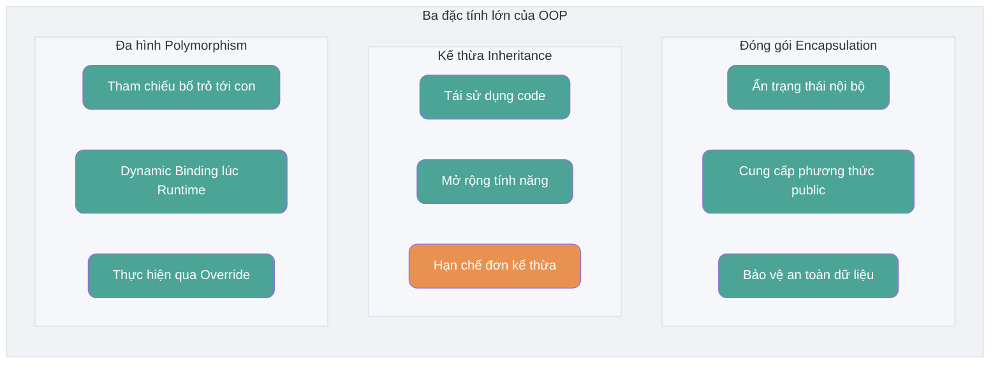
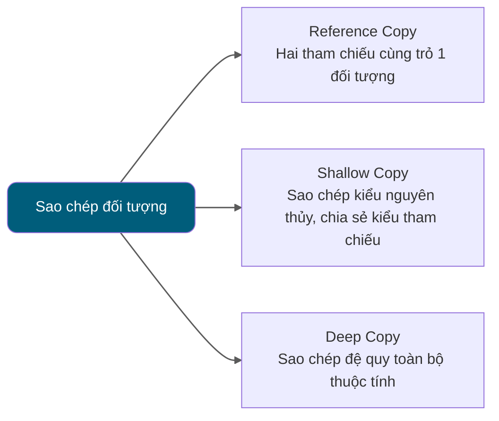

<!-- @include: @article-header.snippet.md -->

## Nền tảng Hướng đối tượng (OOP)

### ⭐️ Sự khác biệt giữa Hướng đối tượng và Hướng thủ tục

Lập trình hướng thủ tục (Procedural-Oriented Programming - POP) và Lập trình hướng đối tượng (Object-Oriented Programming - OOP) là hai paradigm lập trình phổ biến, điểm khác biệt chính nằm ở phương thức giải quyết vấn đề:

- **Lập trình hướng thủ tục (POP)**: Chia quá trình giải quyết vấn đề thành từng phương thức/hàm, giải quyết vấn đề thông qua việc thực thi lần lượt từng phương thức.
- **Lập trình hướng đối tượng (OOP)**: Trừu tượng hóa ra các đối tượng (object) trước, sau đó giải quyết vấn đề bằng cách để các đối tượng thực thi phương thức.

So với POP, chương trình phát triển bằng OOP thường có các ưu điểm sau:

- **Dễ bảo trì**: Nhờ cấu trúc tốt và tính đóng gói, chương trình OOP thường dễ bảo trì hơn.
- **Dễ tái sử dụng**: Thông qua kế thừa và đa hình, thiết kế OOP giúp mã nguồn có tính tái sử dụng cao hơn, thuận tiện mở rộng tính năng.
- **Dễ mở rộng**: Thiết kế module hóa giúp việc mở rộng hệ thống trở nên dễ dàng và linh hoạt hơn.

Phương thức lập trình POP thường đơn giản và trực tiếp hơn, thích hợp xử lý một số tác vụ đơn giản.

Sự khác biệt về hiệu năng giữa POP và OOP chủ yếu phụ thuộc vào cơ chế vận hành của chúng, chứ không chỉ riêng paradigm lập trình. Do đó, việc so sánh đơn thuần hiệu năng giữa hai bên là một hiểu lầm phổ biến (issue liên quan: [Hướng thủ tục: Hiệu năng hướng thủ tục cao hơn hướng đối tượng??](https://github.com/Snailclimb/JavaGuide/issues/431)).


Khi lựa chọn paradigm lập trình, hiệu năng không phải là yếu tố cân nhắc duy nhất. Khả năng bảo trì, khả năng mở rộng và hiệu suất phát triển của mã nguồn cũng quan trọng không kém.

Các ngôn ngữ lập trình hiện đại về cơ bản đều hỗ trợ nhiều paradigm lập trình, vừa có thể dùng để lập trình hướng thủ tục, vừa có thể dùng để lập trình hướng đối tượng.

Dưới đây là ví dụ tính diện tích và chu vi hình tròn, minh họa đơn giản hai giải pháp khác nhau theo hướng đối tượng và hướng thủ tục.

**Hướng đối tượng (OOP)**:

```java
public class Circle {
    // Định nghĩa bán kính hình tròn
    private double radius;

    // Constructor
    public Circle(double radius) {
        this.radius = radius;
    }

    // Tính diện tích hình tròn
    public double getArea() {
        return Math.PI * radius * radius;
    }

    // Tính chu vi hình tròn
    public double getPerimeter() {
        return 2 * Math.PI * radius;
    }

    public static void main(String[] args) {
        // Tạo một hình tròn có bán kính là 3.0
        Circle circle = new Circle(3.0);

        // In diện tích và chu vi hình tròn
        System.out.println("Diện tích hình tròn là: " + circle.getArea());
        System.out.println("Chu vi hình tròn là: " + circle.getPerimeter());
    }
}
```

Chúng ta định nghĩa lớp `Circle` để biểu diễn hình tròn, lớp này chứa thuộc tính bán kính và các phương thức tính diện tích, chu vi.

**Hướng thủ tục (POP)**:

```java
public class Main {
    public static void main(String[] args) {
        // Định nghĩa bán kính hình tròn
        double radius = 3.0;

        // Tính diện tích và chu vi hình tròn
        double area = Math.PI * radius * radius;
        double perimeter = 2 * Math.PI * radius;

        // In diện tích và chu vi hình tròn
        System.out.println("Diện tích hình tròn là: " + area);
        System.out.println("Chu vi hình tròn là: " + perimeter);
    }
}
```

Chúng ta định nghĩa trực tiếp bán kính hình tròn và sử dụng bán kính đó để tính trực tiếp diện tích và chu vi hình tròn.

### Dùng toán tử nào để tạo một đối tượng? Instance của đối tượng và Tham chiếu đối tượng khác nhau thế nào?

Sử dụng toán tử `new` để tạo instance của đối tượng. Heap của JVM được dùng để cấp phát class instance và mảng; giá trị tham chiếu (reference) có thể lưu trong biến cục bộ, field của đối tượng, static field hoặc phần tử mảng, không nhất thiết phải nằm trên Stack.

- Một tham chiếu đối tượng (object reference) có thể trỏ đến 0 hoặc 1 đối tượng (một sợi dây có thể không buộc bóng bay nào, hoặc buộc 1 quả bóng bay);
- Một đối tượng có thể có n tham chiếu trỏ đến nó (có thể dùng n sợi dây buộc cùng 1 quả bóng bay).

### ⭐️ Sự khác biệt giữa Sự bằng nhau của đối tượng và Sự bằng nhau của tham chiếu

- **Sự bằng nhau của đối tượng (Object Equality)** thường do `equals()` định nghĩa, dùng để so sánh trạng thái logic hoặc giá trị theo quy ước của kiểu dữ liệu.
- **Sự bằng nhau của tham chiếu (Reference Equality)** do toán tử `==` xác định, biểu thị hai tham chiếu có cùng trỏ đến một đối tượng hay không (hoặc đều là `null`), ngôn ngữ Java không phơi bày hay so sánh địa chỉ bộ nhớ vật lý.

Ví dụ:

```java
String str1 = "hello";
String str2 = new String("hello");
String str3 = "hello";
// Dùng == để so sánh tính bằng nhau của tham chiếu chuỗi
System.out.println(str1 == str2);
System.out.println(str1 == str3);
// Dùng phương thức equals để so sánh giá trị chuỗi
System.out.println(str1.equals(str2));
System.out.println(str1.equals(str3));
```

Kết quả:

```plain
false
true
true
true
```

Từ kết quả trên có thể thấy:

- `str1` và `str2` không bằng nhau về tham chiếu, còn `str1` và `str3` bằng nhau. Đó là vì toán tử `==` so sánh tham chiếu của chuỗi có giống nhau không.
- Nội dung của cả 3 chuỗi `str1`, `str2`, `str3` đều bằng nhau. Đó là vì phương thức `equals` so sánh nội dung của chuỗi, cho dù tham chiếu đối tượng khác nhau, chỉ cần nội dung bằng nhau thì được coi là bằng nhau.

### Nếu một lớp không khai báo constructor, chương trình có thể thực thi chính xác không?

Constructor là một phương thức đặc biệt, tác dụng chính là hoàn thành công việc khởi tạo đối tượng.

Nếu một lớp không khai báo constructor thì chương trình vẫn có thể thực thi chính xác! Bởi vì ngay cả khi không khai báo constructor, lớp đó vẫn sẽ có một constructor mặc định không tham số. Nếu chúng ta tự thêm constructor cho lớp (dù có tham số hay không), Java sẽ không tự động thêm constructor mặc định không tham số nữa.

Chúng ta vẫn luôn dùng constructor mà không hề hay biết, đó cũng là lý do tại sao khi tạo đối tượng chúng ta lại thêm dấu ngoặc đơn phía sau (vì phải gọi constructor không tham số). Nếu chúng ta overload constructor có tham số, hãy nhớ viết cả constructor không tham số ra (dù có dùng tới hay không), vì điều này giúp tránh gặp lỗi khi tạo đối tượng.

### Constructor có những đặc điểm gì? Có thể bị override không?

Constructor có các đặc điểm sau:

- **Tên trùng với tên lớp**: Tên constructor phải hoàn toàn trùng khớp với tên lớp.
- **Không có giá trị trả về**: Constructor không có kiểu trả về, và không được dùng `void` để khai báo.
- **Tự động thực thi**: Khi khởi tạo đối tượng của lớp, constructor sẽ tự động thực thi mà không cần gọi thủ công.

Constructor **không thể bị override (ghi đè)**, nhưng **có thể bị overload (nạp chồng)**. Do đó, một lớp có thể có nhiều constructor với danh sách tham số khác nhau để cung cấp các cách khởi tạo đối tượng khác nhau.

### ⭐️ Ba đặc tính lớn của Hướng đối tượng

#### Đóng gói (Encapsulation)

Đóng gói nghĩa là ẩn thông tin trạng thái (các thuộc tính) bên trong đối tượng, không cho phép các đối tượng bên ngoài trực tiếp truy cập vào thông tin bên trong. Tuy nhiên có thể cung cấp một số phương thức công khai để bên ngoài thao tác với thuộc tính. Giống như chúng ta không nhìn thấy linh kiện bên trong chiếc điều hòa treo tường (thuộc tính), nhưng có thể thông qua điều khiển từ xa (phương thức) để điều khiển điều hòa. Nếu thuộc tính không muốn cho bên ngoài truy cập, chúng ta hoàn toàn không cần cung cấp phương thức truy cập. Nhưng nếu một lớp không cung cấp phương thức nào cho bên ngoài truy cập thì lớp đó cũng không có nhiều ý nghĩa (tất nhiên giờ có nhiều cách khác, đây chỉ là ví dụ).

```java
public class Student {
    private int id; // Thuộc tính id để private
    private String name; // Thuộc tính name để private

    // Phương thức lấy id
    public int getId() {
        return id;
    }

    // Phương thức gán id
    public void setId(int id) {
        this.id = id;
    }

    // Phương thức lấy name
    public String getName() {
        return name;
    }

    // Phương thức gán name
    public void setName(String name) {
        this.name = name;
    }
}
```

#### Kế thừa (Inheritance)

Các đối tượng thuộc loại khác nhau thường có một số điểm chung. Ví dụ bạn Minh, bạn Hồng, bạn Nam đều có đặc tính chung của học sinh (lớp, mã học sinh,...). Đồng thời mỗi đối tượng còn định nghĩa thêm các đặc tính riêng. Ví dụ Minh giỏi Toán, Hồng tính cách dễ thương, Nam sức khỏe tốt. Kế thừa là kỹ thuật sử dụng định nghĩa của lớp đã có sẵn làm cơ sở để xây dựng lớp mới. Định nghĩa của lớp mới có thể thêm dữ liệu hoặc tính năng mới, cũng có thể dùng tính năng của lớp bố, nhưng không thể kế thừa một cách chọn lọc. Thông qua kế thừa, có thể nhanh chóng tạo ra lớp mới, nâng cao tính tái sử dụng mã nguồn, khả năng bảo trì chương trình, tiết kiệm thời gian tạo lớp mới và nâng cao hiệu suất phát triển.

**Ghi nhớ 3 điểm sau về kế thừa:**

1. Đối tượng lớp con chứa trạng thái instance do lớp bố khai báo, nhưng các thành viên `private` của lớp bố sẽ không được lớp con kế thừa, lớp con cũng không thể truy cập trực tiếp các thành viên này.
2. Lớp con có thể có thuộc tính và phương thức riêng, tức là lớp con có thể mở rộng lớp bố.
3. Lớp con có thể thực thi phương thức của lớp bố theo cách riêng của mình (sẽ giới thiệu sau).

#### Đa hình (Polymorphism)

Đa hình biểu thị một đối tượng có nhiều trạng thái khác nhau, biểu hiện cụ thể là tham chiếu của lớp bố trỏ đến instance của lớp con.

**Đặc điểm của Đa hình:**

- Giữa kiểu đối tượng và kiểu tham chiếu phải có quan hệ kế thừa (Class) hoặc thực thi (Interface);
- Phương thức được gọi bởi biến kiểu tham chiếu thực chất thuộc về lớp nào phải đến khi chương trình chạy (runtime) mới xác định được;
- Đa hình không thể gọi phương thức "chỉ tồn tại ở lớp con mà không có ở lớp bố";
- Nếu lớp con override phương thức của lớp bố, phương thức thực sự thực thi là phương thức đã override của lớp con; nếu lớp con không override thì thực thi phương thức của lớp bố.



### ⭐️ Điểm chung và khác biệt giữa Interface và Abstract Class?

#### Điểm chung giữa Interface và Abstract Class

- **Khởi tạo**: Cả Interface và Abstract Class đều không thể trực tiếp khởi tạo (new), chỉ khi được thực thi (Interface) hoặc kế thừa (Abstract Class) thì mới có thể tạo đối tượng cụ thể.
- **Phương thức抽象 (Abstract Method)**: Cả Interface và Abstract Class đều có thể chứa phương thức abstract. Phương thức abstract không có thân hàm (body), bắt buộc phải được thực thi trong lớp con hoặc lớp implementation.

#### Sự khác biệt giữa Interface và Abstract Class

- **Mục đích thiết kế**: Interface chủ yếu dùng để ràng buộc hành vi của lớp, khi bạn implement một interface nghĩa là bạn sở hữu hành vi tương ứng. Abstract Class chủ yếu dùng để tái sử dụng mã nguồn, nhấn mạnh vào quan hệ thuộc về (is-a).
- **Kế thừa và Thực thi**: Một lớp chỉ có thể kế thừa một lớp (bao gồm cả Abstract Class) vì Java không hỗ trợ đa kế thừa. Nhưng một lớp có thể implement nhiều Interface, và một Interface cũng có thể kế thừa (extends) nhiều Interface khác.
- **Biến thành viên**: Biến thành viên trong Interface chỉ có thể là `public static final`, không thể chỉnh sửa và bắt buộc phải có giá trị khởi tạo. Biến thành viên của Abstract Class có thể có bất kỳ modifier nào (`private`, `protected`, `public`), có thể định nghĩa lại hoặc gán giá trị trong lớp con.
- **Phương thức**:
  - Trước Java 8, các phương thức trong Interface mặc định là `public abstract`, tức chỉ có khai báo phương thức. Từ Java 8 trở đi, có thể định nghĩa phương thức `default` và `static` trong Interface. Từ Java 9 trở đi, Interface có thể chứa phương thức `private`.
  - Abstract Class có thể chứa cả phương thức abstract và non-abstract. Phương thức abstract không có thân hàm, bắt buộc phải implement ở lớp con. Phương thức non-abstract có bản thực thi cụ thể, có thể dùng trực tiếp trong Abstract Class hoặc override ở lớp con.

Java 8 đưa vào phương thức `default` và `static` cho Interface, Java 9 lại cho phép khai báo phương thức `private` trong Interface. Những phương thức này giúp việc sử dụng Interface trở nên linh hoạt hơn.

Phương thức `default` giới thiệu trong Java 8 dùng để cung cấp bản thực thi mặc định cho phương thức trong Interface, có thể bị ghi đè ở lớp implement. Nhờ đó có thể thêm tính năng mới vào Interface sẵn có mà không cần sửa đổi các lớp implement, giúp tăng khả năng mở rộng và tương thích ngược.

```java
public interface MyInterface {
    default void defaultMethod() {
        System.out.println("This is a default method.");
    }
}
```

Phương thức `static` trong Java 8 không thể bị ghi đè ở lớp implement, chỉ có thể gọi trực tiếp qua tên Interface (`MyInterface.staticMethod()`), tương tự phương thức static trong lớp. Phương thức `static` thường dùng để định nghĩa một số utility method dùng chung liên quan đến Interface.

```java
public interface MyInterface {
    static void staticMethod() {
        System.out.println("This is a static method in the interface.");
    }
}
```

Java 9 cho phép dùng phương thức `private` trong Interface. Phương thức `private` dùng để chia sẻ code nội bộ bên trong Interface mà không phơi bày ra ngoài.

```java
public interface MyInterface {
    // Phương thức default
    default void defaultMethod() {
        commonMethod();
    }

    // Phương thức static
    static void staticMethod() {
        commonMethod();
    }

    // Phương thức private static, có thể được gọi từ phương thức static và default
    private static void commonMethod() {
        System.out.println("This is a private method used internally.");
    }

    // Phương thức private instance, chỉ có thể được gọi từ phương thức default
    private void instanceCommonMethod() {
        System.out.println("This is a private instance method used internally.");
    }
}
```

### Phân biệt Deep Copy và Shallow Copy? Reference Copy là gì?



Về sự khác biệt giữa Deep Copy và Shallow Copy, đây là kết luận:

- **Shallow Copy (Sao chép nông)**: Shallow Copy sẽ tạo một đối tượng mới trên Heap (điểm khác biệt với Reference Copy). Tuy nhiên nếu thuộc tính bên trong đối tượng gốc là kiểu tham chiếu, Shallow Copy sẽ sao chép trực tiếp địa chỉ tham chiếu của đối tượng bên trong, nghĩa là đối tượng sao chép và đối tượng gốc dùng chung đối tượng bên trong.
- **Deep Copy (Sao chép sâu)**: Deep Copy sẽ sao chép hoàn toàn toàn bộ đối tượng, bao gồm cả các đối tượng bên trong mà đối tượng đó chứa.

#### Shallow Copy

Ví dụ code Shallow Copy bên dưới implement interface `Cloneable` và override phương thức `clone()`.

Phương thức `clone()` thực thi rất đơn giản, trực tiếp gọi phương thức `clone()` của lớp bố `Object`.

```java
public class Address implements Cloneable {
    private String name;
    // Bỏ qua constructor, Getter & Setter
    @Override
    public Address clone() {
        try {
            return (Address) super.clone();
        } catch (CloneNotSupportedException e) {
            throw new AssertionError();
        }
    }
}

public class Person implements Cloneable {
    private Address address;
    // Bỏ qua constructor, Getter & Setter
    @Override
    public Person clone() {
        try {
            Person person = (Person) super.clone();
            return person;
        } catch (CloneNotSupportedException e) {
            throw new AssertionError();
        }
    }
}
```

Kiểm thử:

```java
Person person1 = new Person(new Address("Vũ Hán"));
Person person1Copy = person1.clone();
// true
System.out.println(person1.getAddress() == person1Copy.getAddress());
```

Từ kết quả có thể thấy đối tượng clone của `person1` và `person1` vẫn dùng chung một đối tượng `Address`.

#### Deep Copy

Ở đây chúng ta chỉnh sửa nhẹ phương thức `clone()` của lớp `Person`, sao chép luôn đối tượng `Address` bên trong `Person`.

```java
@Override
public Person clone() {
    try {
        Person person = (Person) super.clone();
        person.setAddress(person.getAddress().clone());
        return person;
    } catch (CloneNotSupportedException e) {
        throw new AssertionError();
    }
}
```

Kiểm thử:

```java
Person person1 = new Person(new Address("Vũ Hán"));
Person person1Copy = person1.clone();
// false
System.out.println(person1.getAddress() == person1Copy.getAddress());
```

Từ kết quả có thể thấy đối tượng `Address` chứa trong đối tượng clone của `person1` và `person1` đã là hai đối tượng khác nhau.

**Thế nào là Reference Copy (Sao chép tham chiếu)?** Nói một cách đơn giản, Reference Copy là hai tham chiếu khác nhau cùng trỏ đến một đối tượng.

Sơ đồ mô tả Shallow Copy, Deep Copy và Reference Copy:


## ⭐️ Lớp Object

### Các phương thức phổ biến của lớp Object là gì?

Lớp Object là một lớp đặc biệt, là lớp bố của tất cả các lớp trong Java, chủ yếu cung cấp các phương thức sau. Lưu ý: `finalize()` đã bị ngưng sử dụng (deprecated) từ JDK 9 và đánh dấu để xóa bỏ trong JDK 18, không nên dùng trong code mới:

```java
/**
 * Phương thức native, dùng để trả về đối tượng Class của đối tượng runtime hiện tại. Dùng từ khóa final nên không cho phép lớp con override.
 */
public final native Class<?> getClass()

/**
 * Phương thức native, dùng để trả về mã băm (hashcode) của đối tượng, chủ yếu dùng trong bảng băm như HashMap trong JDK.
 */
public native int hashCode()

/**
 * Dùng để so sánh 2 tham chiếu có trỏ đến cùng một đối tượng hay không. Lớp String đã override phương thức này để so sánh giá trị chuỗi.
 */
public boolean equals(Object obj)

/**
 * Phương thức native, dùng để tạo và trả về một bản sao của đối tượng hiện tại.
 */
protected native Object clone() throws CloneNotSupportedException

/**
 * Trả về chuỗi gồm tên lớp và mã băm dạng hex. Khuyên tất cả các lớp con của Object nên override phương thức này.
 */
public String toString()

/**
 * Phương thức native và không thể override. Đánh thức một thread đang chờ trên monitor của đối tượng này. Nếu có nhiều thread đang chờ sẽ đánh thức ngẫu nhiên một thread.
 */
public final native void notify()

/**
 * Phương thức native và không thể override. Giống notify, điểm khác duy nhất là sẽ đánh thức tất cả các thread đang chờ trên monitor của đối tượng này.
 */
public final native void notifyAll()

/**
 * Phương thức native và không thể override. Tạm dừng thực thi thread. Lưu ý: sleep không giải phóng lock, còn wait giải phóng lock, timeout là thời gian chờ.
 */
public final native void wait(long timeout) throws InterruptedException

/**
 * Thêm tham số nanos biểu thị thời gian bổ sung (đơn vị nanosecond, từ 0-999999).
 */
public final void wait(long timeout, int nanos) throws InterruptedException

/**
 * Giống 2 phương thức wait trên, chỉ là phương thức này chờ vô hạn, không có khái niệm timeout.
 */
public final void wait() throws InterruptedException

/**
 * Thao tác được kích hoạt khi instance bị Garbage Collector thu gom.
 */
protected void finalize() throws Throwable { }
```

### Phân biệt `==` và `equals()`

**`==`** có hiệu quả khác nhau đối với kiểu nguyên thủy và kiểu tham chiếu:

- Đối với kiểu nguyên thủy, `==` so sánh giá trị.
- Đối với kiểu tham chiếu, `==` so sánh tham chiếu có trỏ đến cùng một đối tượng hay không (hoặc đều là `null`), không so sánh địa chỉ bộ nhớ vật lý.

> Đối với `==`, dù so sánh kiểu nguyên thủy hay kiểu tham chiếu thì thứ nó so sánh là giá trị của operand; giá trị tham chiếu mô tả đối tượng nó trỏ tới, nhưng ngôn ngữ Java không định nghĩa nó là địa chỉ bộ nhớ vật lý có thể nhìn thấy.

**`equals()`** không dùng để so sánh biến kiểu nguyên thủy, chỉ dùng để so sánh hai đối tượng có bằng nhau hay không. Phương thức `equals()` tồn tại trong lớp `Object`, mà lớp `Object` là lớp bố trực tiếp hoặc gián tiếp của tất cả các lớp, do đó tất cả các lớp đều có phương thức `equals()`.

Phương thức `equals()` trong lớp `Object`:

```java
public boolean equals(Object obj) {
     return (this == obj);
}
```

Phương thức `equals()` có hai trường hợp sử dụng:

- **Lớp không override phương thức `equals()`**: Khi so sánh 2 đối tượng của lớp đó qua `equals()`, tương đương với so sánh qua `==`, mặc định sử dụng phương thức `equals()` của lớp `Object`.
- **Lớp có override phương thức `equals()`**: Thông thường chúng ta override `equals()` để so sánh thuộc tính bên trong hai đối tượng có bằng nhau không; nếu các thuộc tính bằng nhau thì trả về true (tức coi 2 đối tượng đó bằng nhau).

Ví dụ:

```java
String a = new String("ab"); // a là một tham chiếu
String b = new String("ab"); // b là một tham chiếu khác, nội dung đối tượng giống nhau
String aa = "ab"; // Đặt trong Constant Pool
String bb = "ab"; // Tìm từ Constant Pool
System.out.println(aa == bb);// true
System.out.println(a == b);// false
System.out.println(a.equals(b));// true
System.out.println(42 == 42.0);// true
```

Phương thức `equals` trong `String` đã được override, vì phương thức `equals` của `Object` kiểm tra 2 tham chiếu có trỏ tới cùng 1 đối tượng không, còn `equals` của `String` so sánh giá trị của chuỗi.

Khi dùng string literal để tạo đối tượng `String` (như `String aa = "ab"`), máy ảo sẽ tìm trong String Constant Pool xem đã có đối tượng có giá trị giống hệt chưa, nếu có thì gán cho tham chiếu hiện tại; nếu chưa thì tạo một đối tượng `String` trong pool rồi gán cho tham chiếu. Nhưng khi dùng từ khóa `new` (như `String a = new String("ab")`), máy ảo luôn tạo một đối tượng mới trên Heap và khởi tạo bằng giá trị từ pool (nếu chưa có "ab" trong pool sẽ tạo "ab" trong pool trước), rồi mới gán cho tham chiếu.

Phương thức `equals()` của lớp `String`:

```java
public boolean equals(Object anObject) {
    if (this == anObject) {
        return true;
    }
    if (anObject instanceof String) {
        String anotherString = (String)anObject;
        int n = value.length;
        if (n == anotherString.value.length) {
            char v1[] = value;
            char v2[] = anotherString.value;
            int i = 0;
            while (n-- != 0) {
                if (v1[i] != v2[i])
                    return false;
                i++;
            }
            return true;
        }
    }
    return false;
}
```

### `hashCode()` có tác dụng gì?

Tác dụng của `hashCode()` là lấy mã băm (`int` number), còn gọi là hash code. Tác dụng của hash code là xác định vị trí chỉ mục (index) của đối tượng trong bảng băm (hash table).


`hashCode()` được định nghĩa trong lớp `Object` của JDK, điều này nghĩa là bất kỳ lớp nào trong Java cũng chứa hàm `hashCode()`. Ngoài ra cần lưu ý: Phương thức `hashCode()` của `Object` là native method, tức được thực thi bằng C hoặc C++.

> ⚠️ Lưu ý: Phương thức này trong **Oracle OpenJDK 8** mặc định "dùng trạng thái cục bộ của thread để thực thi xor-shift ngẫu nhiên của Marsaglia", không phải là "địa chỉ" hay "chuyển đổi từ địa chỉ", các JDK/VM khác nhau có thể khác nhau. Trong OpenJDK 8 có 6 cách tạo (cách 5 là trả về địa chỉ), bật cách 5 bằng tham số VM: `-XX:hashCode=4`.

```java
public native int hashCode();
```

Bảng băm lưu trữ key-value pair, đặc điểm của nó là: **Có thể dựa vào "Key" để truy xuất nhanh ra "Value" tương ứng. Trong đó có sử dụng hash code! (giúp nhanh chóng tìm ra đối tượng cần tìm)**

### Tại sao lại cần hashCode?

Chúng ta lấy ví dụ "HashSet kiểm tra trùng lặp như thế nào" để giải thích tại sao lại cần hashCode?

Khi chúng ta thêm đối tượng vào HashSet, HashSet sẽ gọi phương thức `hashCode()` của đối tượng trước để lấy một "giá trị băm", và thông qua hàm băm nội bộ biến đổi đơn giản giá trị băm đó (như chia lấy dư) để quyết định dữ liệu nên đặt vào bucket nào trong mảng bên dưới:

1. Nếu bucket đó hiện đang trống, trực tiếp chèn node đối tượng vào bucket đó.
2. Nếu bucket đó đã có phần tử khác, HashSet sẽ so sánh từng phần tử trong danh sách liên kết hoặc cây đỏ đen tương ứng của bucket đó:
   - Đối với node có **giá trị băm khác nhau**, bỏ qua trực tiếp;
   - Đối với node có **giá trị băm giống nhau**, tiếp tục gọi phương thức `equals()` để kiểm tra hai đối tượng có "bằng nhau" không:
     - Nếu `equals()` trả về true, nghĩa là tập hợp đã tồn tại phần tử tương đương, `HashSet` sẽ không thêm vào nữa;
     - Nếu trả về false, coi như phần tử mới, sẽ thêm đối tượng đó làm node mới vào danh sách liên kết hoặc cây đỏ đen của **cùng bucket đó**.

Thông qua việc dùng `hashCode()` thu hẹp phạm vi ứng viên vào cùng 1 bucket trước, rồi mới gọi `equals()` trên lượng ít phần tử trong bucket để đánh giá chính xác, `HashSet` giảm đáng kể số lần gọi `equals()`, từ đó nâng cao hiệu suất tìm kiếm và chèn.

**Tại sao JDK lại cung cấp đồng thời cả hai phương thức này?**

Đó là vì trong một số container (như `HashMap`, `HashSet`), sau khi có `hashCode()`, hiệu suất kiểm tra phần tử có trong container hay không sẽ cao hơn rất nhiều!

Như đã đề cập ở trên, nếu `HashSet` so sánh mà thấy có nhiều đối tượng trùng `hashCode`, nó sẽ tiếp tục dùng `equals()` để đánh giá xem có thực sự giống nhau không. Nghĩa là `hashCode` giúp chúng ta thu hẹp rất nhiều chi phí tìm kiếm.

**Tại sao không chỉ cung cấp phương thức `hashCode()`?**

Bởi vì hai đối tượng có `hashCode` bằng nhau không có nghĩa là hai đối tượng đó bằng nhau.

**Tại sao hai đối tượng có cùng giá trị `hashCode` nhưng lại chưa chắc bằng nhau?**

Bởi vì thuật toán băm của `hashCode()` có thể vô tình làm cho nhiều đối tượng trả về cùng một giá trị băm. Thuật toán băm càng tệ thì càng dễ đụng độ (collision), nhưng điều này cũng liên quan đến đặc tính phân bố miền giá trị dữ liệu (xung đột băm nghĩa là các đối tượng khác nhau thu được cùng một `hashCode`).

Tóm lại:

- Nếu `hashCode` của 2 đối tượng bằng nhau, 2 đối tượng đó chưa chắc đã bằng nhau (xung đột băm).
- Nếu `hashCode` của 2 đối tượng bằng nhau VÀ phương thức `equals()` trả về `true`, chúng ta mới coi 2 đối tượng đó bằng nhau.
- Nếu `hashCode` của 2 đối tượng không bằng nhau, chúng ta có thể kết luận trực tiếp 2 đối tượng đó không bằng nhau.

### Tại sao khi override equals() bắt buộc phải override phương thức hashCode()?

Bởi vì hai đối tượng bằng nhau thì giá trị `hashCode` của chúng bắt buộc phải bằng nhau. Nghĩa là nếu phương thức `equals` đánh giá hai đối tượng bằng nhau thì giá trị `hashCode` của hai đối tượng đó cũng phải bằng nhau.

Nếu override `equals()` mà không override `hashCode()` thì có thể dẫn tới trường hợp hai đối tượng được `equals` đánh giá bằng nhau nhưng giá trị `hashCode` lại không bằng nhau.

**Suy nghĩ**: Nếu override `equals()` mà không override `hashCode()`, khi dùng `HashMap` có thể gặp phải vấn đề gì?

**Tóm tắt**:

- Phương thức `equals` đánh giá 2 đối tượng bằng nhau thì `hashCode` của chúng cũng phải bằng nhau.
- Hai đối tượng có cùng `hashCode` chưa chắc đã bằng nhau (xung đột băm).

Đọc thêm về `hashCode()` và `equals()` tại: [Giải đáp các thắc mắc về Java hashCode() và equals()](https://www.cnblogs.com/skywang12345/p/3324958.html)

## String

### ⭐️ Sự khác biệt giữa String, StringBuffer, StringBuilder?

**Tính biến đổi (Mutability)**

`String` là immutable (không thể thay đổi, sẽ phân tích chi tiết bên dưới), mỗi lần sửa đổi đều tạo ra đối tượng mới và trỏ tham chiếu tới instance mới. Trong khi `StringBuffer` và `StringBuilder` đều là mutable, khi sửa đổi chuỗi chúng không tạo đối tượng mới mà thao tác trực tiếp trên mảng char ban đầu.

`StringBuilder` và `StringBuffer` đều kế thừa từ lớp `AbstractStringBuilder`, trong `AbstractStringBuilder` cũng dùng mảng char để lưu chuỗi, nhưng không dùng từ khóa `final` và `private`, điều quan trọng nhất là lớp `AbstractStringBuilder` này cung cấp rất nhiều phương thức sửa đổi chuỗi như `append`.

```java
abstract class AbstractStringBuilder implements Appendable, CharSequence {
    char[] value;
    public AbstractStringBuilder append(String str) {
        if (str == null)
            return appendNull();
        int len = str.length();
        ensureCapacityInternal(count + len);
        str.getChars(0, len, value, count);
        count += len;
        return this;
    }
    //...
}
```

**Tính an toàn luồng (Thread Safety)**

Đối tượng trong `String` là immutable, có thể hiểu là hằng số, an toàn luồng. `AbstractStringBuilder` là lớp bố chung của `StringBuilder` và `StringBuffer`, định nghĩa các thao tác chuỗi cơ bản như `expandCapacity`, `append`, `insert`, `indexOf`. `StringBuffer` thêm khóa đồng bộ (synchronized) cho các phương thức nên an toàn luồng. `StringBuilder` không thêm khóa đồng bộ cho phương thức nên không an toàn luồng.


**Hiệu năng**

Sự khác biệt hiệu năng chủ yếu đến từ cơ chế an toàn luồng:

- Phương thức của `StringBuffer` thường được đồng bộ hóa (thread-safe), do đó mang lại một khoản chi phí hiệu năng nhất định;
- `StringBuilder` không có chi phí đồng bộ hóa (non-thread-safe), trong kịch bản đơn luồng thường cho hiệu năng tốt hơn.
  Trong cùng điều kiện, dùng `StringBuilder` so với `StringBuffer` chỉ tăng khoảng 10%~15% hiệu năng, nhưng phải chịu rủi ro không an toàn trong đa luồng.
  Ngoài ra, khác biệt hiệu năng cụ thể không cố định, trong các JVM hiện đại nhờ tối ưu hóa lock (như lock elimination), khoảng cách hiệu năng giữa cả hai trong một số kịch bản có thể rất nhỏ.

**Tóm tắt cách dùng 3 loại:**

- Thao tác với lượng dữ liệu nhỏ: Dùng `String`
- Thao tác với lượng dữ liệu chuỗi lớn trong đơn luồng: Dùng `StringBuilder`
- Thao tác với lượng dữ liệu chuỗi lớn trong đa luồng: Dùng `StringBuffer`

### ⭐️ Tại sao String lại là bất biến (Immutable)?

Trong lớp `String` sử dụng từ khóa `final`修饰 mảng char để lưu chuỗi, ~~nên đối tượng `String` là bất biến.~~

```java
public final class String implements java.io.Serializable, Comparable<String>, CharSequence {
    private final char value[];
  //...
}
```

> 🐛 Sửa lỗi: Chúng ta biết lớp được修饰 bởi `final` không thể bị kế thừa, phương thức修饰 bởi `final` không thể bị override, biến kiểu nguyên thủy修饰 bởi `final` thì giá trị không thể thay đổi, biến kiểu tham chiếu修饰 bởi `final` thì không thể trỏ sang đối tượng khác. Do đó, mảng lưu chuỗi được修饰 bởi `final` không phải là lý do gốc rễ khiến `String` bất biến, vì nội dung chuỗi mà mảng này lưu trữ vẫn có thể thay đổi được (trường hợp `final`修饰 biến kiểu tham chiếu).
>
> `String` thực sự bất biến vì những lý do sau:
>
> 1. Mảng lưu chuỗi được修饰 bởi `final` và là `private`, đồng thời lớp `String` không cung cấp/phơi bày phương thức nào để sửa đổi chuỗi này.
> 2. Lớp `String` được修饰 bởi `final` khiến nó không thể bị kế thừa, từ đó tránh việc lớp con phá vỡ tính bất biến của `String`.
>
> Đọc thêm: [Hiểu thế nào về tính bất biến của giá trị kiểu String? - Trả lời trên Zhihu](https://www.zhihu.com/question/20618891/answer/114125846)
>
> Bổ sung (từ [issue 675](https://github.com/Snailclimb/JavaGuide/issues/675)): Từ Java 9 trở đi, bản thực thi của `String`, `StringBuilder` và `StringBuffer` chuyển sang dùng mảng `byte` để lưu chuỗi.
>
> ```java
> public final class String implements java.io.Serializable,Comparable<String>, CharSequence {
>     // Annotation @Stable biểu thị biến chỉ bị sửa đổi tối đa 1 lần, gọi là "ổn định".
>     @Stable
>     private final byte[] value;
> }
>
> abstract class AbstractStringBuilder implements Appendable, CharSequence {
>     byte[] value;
> }
> ```
>
> **Tại sao Java 9 lại đổi bản thực thi bên dưới của `String` từ `char[]` sang `byte[]`?**
>
> String phiên bản mới hỗ trợ 2 phương án mã hóa nội bộ: Latin-1 và UTF-16. Nếu tất cả ký tự trong chuỗi đều có thể biểu diễn bằng Latin-1 thì dùng Latin-1; ngược lại dùng UTF-16. Chữ Hán không nằm trong phạm vi ký tự của Latin-1. Theo phương án Latin-1, mỗi ký tự dùng 1 byte để lưu trữ, so với `char[]` ban đầu tiết kiệm được một nửa dung lượng dữ liệu ký tự.
>
> JDK chính thức cho biết đại đa số các đối tượng chuỗi chỉ chứa các ký tự có thể biểu diễn bằng Latin-1.
>
> 
>
> Nếu chuỗi chứa các ký tự không thể biểu diễn bằng Latin-1 (như chữ Hán), nội bộ sẽ dùng UTF-16, mỗi code unit dùng 2 byte.
>
> Đây là giới thiệu chính thức: <https://openjdk.java.net/jeps/254>.

### ⭐️ Nối chuỗi nên dùng "+" hay StringBuilder?

Java không hỗ trợ người dùng tự định nghĩa operator overloading, nhưng quy chuẩn ngôn ngữ định nghĩa riêng toán tử `+` và `+=` cho việc nối chuỗi.

```java
String str1 = "he";
String str2 = "llo";
String str3 = "world";
String str4 = str1 + str2 + str3;
```

Bytecode tương ứng với đoạn code trên như sau:


Đối với bytecode trong JDK 8 hiển thị ở đây, phép nối chuỗi "+" được `javac` chuyển đổi thành các tiếng gọi `StringBuilder.append()`. Từ JDK 9 trở đi, `javac` mặc định chuyển sang dùng `invokedynamic` và `StringConcatFactory`, do đó không thể coi `StringBuilder` là bản thực thi bắt buộc phải dùng cho tất cả các phiên bản.

Tuy nhiên, việc dùng "+" để nối chuỗi bên trong vòng lặp có nhược điểm rất rõ ràng: **Trình biên dịch không thể tạo một `StringBuilder` duy nhất để tái sử dụng, dẫn đến tạo ra quá nhiều đối tượng `StringBuilder`**.

```java
String[] arr = {"he", "llo", "world"};
String s = "";
for (int i = 0; i < arr.length; i++) {
    s += arr[i];
}
System.out.println(s);
```

Đối tượng `StringBuilder` được tạo bên trong vòng lặp, đồng nghĩa với việc mỗi lần lặp sẽ tạo ra một đối tượng `StringBuilder`.


Nếu dùng trực tiếp đối tượng `StringBuilder` để nối chuỗi thì sẽ không gặp phải vấn đề này.

```java
String[] arr = {"he", "llo", "world"};
StringBuilder s = new StringBuilder();
for (String value : arr) {
    s.append(value);
}
System.out.println(s);
```


Nếu bạn dùng IDEA, cơ chế kiểm tra code của IDEA cũng sẽ gợi ý bạn sửa code.

Trong JDK 9, phép cộng chuỗi "+" được đổi sang dùng phương thức động `makeConcatWithConstants()` để thực thi, thông qua việc cấp phát trước bộ nhớ giúp giảm một phần đối tượng tạm thời được tạo ra. Tuy nhiên tối ưu hóa này chủ yếu nhắm vào các phép nối chuỗi đơn giản như `a+b+c`. Đối với lượng lớn thao tác nối chuỗi trong vòng lặp, nó vẫn sẽ cấp phát bộ nhớ động từng cái một (tương tự khái niệm append từng cặp hai cái một), không hiệu quả bằng việc dùng `StringBuilder` thủ công để nối chuỗi. Cải tiến này do [JEP 280](https://openjdk.org/jeps/280) của JDK 9 đề ra, xem chi tiết bài viết: [Vẫn dùng StringBuilder một cách cảm tính? Cùng ôn lại về nối chuỗi nhé](https://juejin.cn/post/7182872058743750715) và tham khảo [issue#2442](https://github.com/Snailclimb/JavaGuide/issues/2442).

### Phân biệt String#equals() và Object#equals()?

Phương thức `equals` trong `String` đã được override, so sánh giá trị của chuỗi String có bằng nhau không. Còn phương thức `equals` của `Object` kiểm tra hai tham chiếu có trỏ đến cùng một đối tượng hay không.

### ⭐️ Tác dụng của String Constant Pool là gì?

**String Constant Pool (Bảng hằng số chuỗi)** là một vùng bộ nhớ do JVM mở ra dành riêng cho chuỗi (`String`) nhằm nâng cao hiệu năng và giảm tiêu thụ bộ nhớ, mục đích chính là tránh việc tạo lại các chuỗi bị trùng lặp.

```java
// 1. Tìm đối tượng chuỗi "ab" trong String Constant Pool, nếu chưa có thì tạo "ab" đưa vào pool
// 2. Gán tham chiếu đối tượng chuỗi "ab" cho aa
String aa = "ab";
// Trực tiếp trả về đối tượng chuỗi "ab" trong pool, gán cho tham chiếu bb
String bb = "ab";
System.out.println(aa==bb); // true
```

Xem thêm giới thiệu về String Constant Pool tại bài viết [Giải thích chi tiết vùng bộ nhớ Java](https://javaguide.cn/java/jvm/memory-area.html).

### ⭐️ Câu lệnh String s1 = new String("abc"); tạo ra bao nhiêu đối tượng chuỗi?

Đáp án trước: Sẽ tạo 1 hoặc 2 đối tượng chuỗi.

1. Nếu trong String Constant Pool chưa có "abc": Sẽ tạo **2** đối tượng chuỗi. Một đối tượng trong String Constant Pool do chỉ thị `ldc` kích hoạt tạo ra. Một đối tượng trên Heap do `new String()` tạo ra và khởi tạo bằng "abc" từ pool.
2. Nếu trong String Constant Pool đã có "abc": Sẽ tạo **1** đối tượng chuỗi. Đối tượng này nằm trên Heap do `new String()` tạo ra và khởi tạo bằng "abc" từ pool.

Phân tích chi tiết bên dưới.

1. Nếu trong String Constant Pool chưa có đối tượng chuỗi "abc", đầu tiên nó sẽ tạo đối tượng chuỗi "abc" trong String Constant Pool, sau đó tạo một đối tượng chuỗi "abc" nữa trong bộ nhớ Heap.

Code ví dụ (JDK 1.8):

```java
String s1 = new String("abc");
```

Bytecode tương ứng:

```java
// Cấp phát một đối tượng String chưa khởi tạo trên Heap.
// #2 là một symbol reference trong constant pool, trỏ tới class java/lang/String.
// Trong giai đoạn parse của class loading, symbol reference này sẽ được giải mã thành direct reference trỏ tới class java/lang/String thực tế.
0 new #2 <java/lang/String>
// Copy tham chiếu đối tượng String ở đỉnh stack, chuẩn bị cho việc gọi constructor tiếp theo.
// Lúc này trong operand stack có 2 tham chiếu giống hệt nhau: 1 truyền cho constructor, 1 giữ lại tham chiếu đối tượng mới để lưu vào local variable table sau này.
3 dup
// JVM kiểm tra trước xem trong String Constant Pool đã có "abc" chưa.
// Nếu trong pool đã có "abc", trực tiếp trả về tham chiếu chuỗi đó;
// Nếu chưa có "abc", JVM sẽ tạo string literal đó trong pool và trả về tham chiếu của nó.
// Tham chiếu này được push vào operand stack, dùng làm tham số cho constructor.
4 ldc #3 <abc>
// Gọi constructor, dùng "abc" load từ pool để khởi tạo đối tượng String trên Heap
// Đối tượng String mới sẽ chứa nội dung giống "abc" trong pool, nhưng nó là đối tượng độc lập lưu trên Heap.
6 invokespecial #4 <java/lang/String.<init> : (Ljava/lang/String;)V>
// Lưu tham chiếu đối tượng String trên Heap vào local variable table
9 astore_1
// Return, kết thúc phương thức
10 return
```

Chỉ thị `ldc (load constant)` chính xác là tải các loại hằng số từ constant pool, bao gồm hằng số chuỗi, hằng số số nguyên, hằng số số thực, và cả tham chiếu class. Đối với hằng số chuỗi, hành vi của `ldc` như sau:

1. **Tải chuỗi từ Constant Pool**: `ldc` đầu tiên kiểm tra xem String Constant Pool đã có đối tượng chuỗi có nội dung giống hệt chưa.
2. **Tái sử dụng đối tượng chuỗi đã có**: Nếu trong String Constant Pool đã có đối tượng chuỗi nội dung giống hệt, `ldc` sẽ tải tham chiếu đối tượng đó vào operand stack.
3. **Chưa có thì tạo đối tượng mới đưa vào pool**: Nếu trong String Constant Pool chưa có đối tượng chuỗi nội dung giống hệt, JVM sẽ tạo một đối tượng chuỗi mới trong pool và tải tham chiếu của nó vào operand stack.

2. Nếu trong String Constant Pool đã có đối tượng chuỗi "abc" thì chỉ tạo 1 đối tượng chuỗi "abc" trên Heap.

Code ví dụ (JDK 1.8):

```java
// Trong String Constant Pool đã tồn tại đối tượng chuỗi "abc"
String s1 = "abc";
// Đoạn code bên dưới chỉ tạo 1 đối tượng chuỗi "abc" trên Heap
String s2 = new String("abc");
```

Bytecode tương ứng:

```java
0 ldc #2 <abc>
2 astore_1
3 new #3 <java/lang/String>
6 dup
7 ldc #2 <abc>
9 invokespecial #4 <java/lang/String.<init> : (Ljava/lang/String;)V>
12 astore_2
13 return
```

Ở đây lệnh `ldc` tại vị trí 7 sẽ không tạo đối tượng chuỗi "abc" mới trên Heap, bởi vì vị trí 0 đã thực thi một lệnh `ldc` và đã tạo đối tượng chuỗi "abc" trong pool rồi. Lệnh `ldc` tại vị trí 7 sẽ trực tiếp trả về tham chiếu tương ứng của đối tượng "abc" trong String Constant Pool.

### Phương thức String#intern có tác dụng gì?

`String.intern()` là một phương thức `native` (bản địa), dùng để xử lý tham chiếu đối tượng chuỗi trong String Constant Pool. Luồng hoạt động của nó gồm 2 trường hợp:

1. **Constant Pool đã có đối tượng chuỗi cùng nội dung**: Nếu trong String Constant Pool đã có một đối tượng `String` có nội dung giống hệt chuỗi gọi `intern()`, phương thức `intern()` sẽ trực tiếp trả về tham chiếu của đối tượng đó trong pool.
2. **Constant Pool chưa có đối tượng chuỗi cùng nội dung**: Nếu trong String Constant Pool chưa có đối tượng có nội dung giống hệt chuỗi gọi `intern()`, phương thức `intern()` sẽ thêm tham chiếu của đối tượng chuỗi hiện tại vào String Constant Pool và trả về tham chiếu đó.

Tóm tắt:

- Tác dụng chính của `intern()` là đảm bảo tính duy nhất của tham chiếu chuỗi trong Constant Pool.
- Khi gọi `intern()`, nếu trong Constant Pool đã có chuỗi cùng nội dung thì trả về tham chiếu đối tượng đã có; ngược lại sẽ thêm chuỗi đó vào pool và trả về tham chiếu của nó.

Code ví dụ (JDK 1.8):

```java
// s1 trỏ tới đối tượng "Java" trong String Constant Pool
String s1 = "Java";
// s2 cũng trỏ tới đối tượng "Java" trong String Constant Pool, cùng là một đối tượng với s1
String s2 = s1.intern();
// Tạo đối tượng "Java" mới trên Heap, s3 trỏ tới nó
String s3 = new String("Java");
// s4 trỏ tới đối tượng "Java" trong String Constant Pool, cùng là một đối tượng với s1
String s4 = s3.intern();
// s1 và s2 cùng trỏ tới 1 đối tượng trong Constant Pool
System.out.println(s1 == s2); // true
// s3 trỏ tới đối tượng trên Heap, s4 trỏ tới đối tượng trong Constant Pool nên khác nhau
System.out.println(s3 == s4); // false
// s1 và s4 đều trỏ tới cùng 1 đối tượng trong Constant Pool
System.out.println(s1 == s4); // true
```

### Chuyện gì xảy ra khi thực hiện phép toán "+" giữa biến và hằng số kiểu String?

Đầu tiên xem trường hợp nối chuỗi không dùng từ khóa `final` (JDK 1.8):

```java
String str1 = "str";
String str2 = "ing";
String str3 = "str" + "ing";
String str4 = str1 + str2;
String str5 = "string";
System.out.println(str3 == str4);// false
System.out.println(str3 == str5);// true
System.out.println(str4 == str5);// false
```

> **Lưu ý**: Để so sánh giá trị chuỗi String có bằng nhau hay không, nên dùng phương thức `equals()`. Phương thức `equals` trong `String` đã được override. Phương thức `equals` của `Object` kiểm tra xem 2 tham chiếu có trỏ đến cùng 1 đối tượng không, còn `equals` của `String` so sánh giá trị của chuỗi. Nếu bạn dùng `==` để so sánh 2 chuỗi, IDEA sẽ gợi ý đổi sang `equals()`.


**Đối với biểu thức chuỗi có thể xác định giá trị ở thời điểm biên dịch, trình biên dịch sẽ tiến hành hằng số gấp khúc (Constant Folding), và ghi kết quả làm hằng số chuỗi vào Constant Pool của file class; đối tượng chuỗi tương ứng được tạo và trú ngụ trong string pool lúc runtime.**

Trong quá trình biên dịch, trình biên dịch Javac sẽ thực hiện một tối ưu hóa mã nguồn gọi là **Constant Folding (Gấp khúc hằng số)**. Sách 《Thấu hiểu Java Virtual Machine》 có giới thiệu:


Constant Folding sẽ tính toán giá trị của biểu thức hằng số và nhúng giá trị đó làm hằng số trong code cuối cùng sinh ra, đây là một trong số rất ít biện pháp tối ưu hóa mà trình biên dịch Javac thực hiện trên mã nguồn (tối ưu hóa mã nguồn hầu hết diễn ra trong JIT compiler).

Đối với `String str3 = "str" + "ing";`, trình biên dịch sẽ tối ưu giúp bạn thành `String str3 = "string";`.

Không phải tất cả các hằng số đều được gấp khúc, chỉ những hằng số mà trình biên dịch có thể xác định giá trị ở thời điểm biên dịch chương trình mới được tối ưu:

- Kiểu dữ liệu nguyên thủy (`byte`, `boolean`, `short`, `char`, `int`, `float`, `long`, `double`) và hằng số chuỗi.
- Biến kiểu nguyên thủy và biến chuỗi được修饰 bởi `final`.
- Chuỗi thu được từ phép nối "+" giữa các chuỗi hằng số, phép toán số học giữa các kiểu nguyên thủy (+ - * /), phép toán bit giữa các kiểu nguyên thủy (<<, >>, >>>).

**Giá trị của tham chiếu không thể xác định ở thời điểm biên dịch chương trình, trình biên dịch không thể tối ưu nó.**

Phép nối chuỗi giữa tham chiếu đối tượng và toán tử "+" thực chất được thực hiện bằng cách gọi `append()` của `StringBuilder`, sau khi nối xong gọi `toString()` để thu được đối tượng `String`.

```java
String str4 = new StringBuilder().append(str1).append(str2).toString();
```

Khi viết code hàng ngày, hãy cố gắng tránh việc nối nhiều đối tượng chuỗi vì như vậy sẽ liên tục tạo ra đối tượng mới. Nếu cần thay đổi chuỗi, hãy dùng `StringBuilder` hoặc `StringBuffer`.

Tuy nhiên, nếu chuỗi được khai báo với từ khóa `final`, trình biên dịch sẽ coi nó là hằng số để xử lý.

Code ví dụ:

```java
final String str1 = "str";
final String str2 = "ing";
// Hai biểu thức bên dưới thực chất tương đương nhau
String c = "str" + "ing";// Đối tượng trong Constant Pool
String d = str1 + str2; // Đối tượng trong Constant Pool
System.out.println(c == d);// true
```

`String` sau khi được修饰 bởi `final` sẽ được trình biên dịch coi là hằng số để xử lý, trình biên dịch có thể xác định giá trị của nó ở thời điểm biên dịch, hiệu quả tương đương truy cập hằng số.

Nếu trình biên dịch chỉ biết giá trị chính xác lúc runtime thì không thể tối ưu hóa.

Code ví dụ (`str2` chỉ xác định được giá trị lúc runtime):

```java
final String str1 = "str";
final String str2 = getStr();
String c = "str" + "ing";// Đối tượng trong Constant Pool
String d = str1 + str2; // Đối tượng mới được tạo trên Heap
System.out.println(c == d);// false
public static String getStr() {
      return "ing";
}
```

## Tài liệu tham khảo

- Phân tích sâu về String#intern: <https://tech.meituan.com/2014/03/06/in-depth-understanding-string-intern.html>
- Đọc mã nguồn Java String: <http://keaper.cn/2020/09/08/java-string-mian-mian-guan/>
- Câu trả lời của RednaxelaFX về Constant Folding: <https://www.zhihu.com/question/55976094/answer/147302764>

<!-- @include: @article-footer.snippet.md -->
