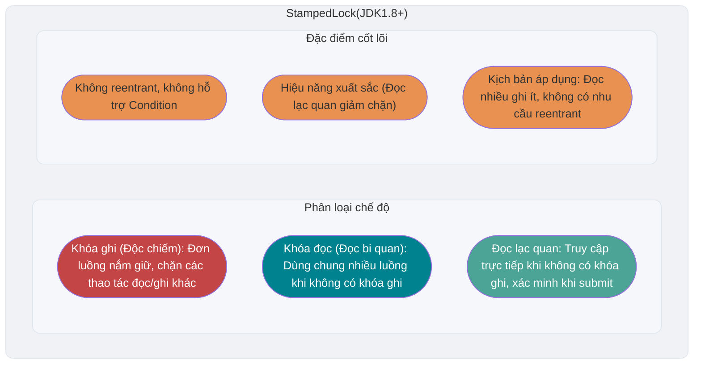

<!-- @include: @article-header.snippet.md -->

## ⭐️ JMM (Java Memory Model)

Các câu hỏi liên quan đến JMM (Java Memory Model) khá nhiều và cũng tương đối quan trọng, do đó tôi đã tách riêng một bài viết để tổng kết các kiến thức và câu hỏi liên quan đến JMM: [Giải thích chi tiết JMM (Java Memory Model)](https://javaguide.cn/java/concurrent/jmm.html).

## ⭐️ Từ khóa volatile

### Làm thế nào để đảm bảo tính nhìn thấy của biến?

Trong Java, từ khóa `volatile` có thể đảm bảo tính nhìn thấy của biến. Thao tác ghi vào một biến `volatile` happens-before thao tác đọc tiếp theo đối với cùng một biến đó, do đó luồng đọc có thể nhìn thấy kết quả của thao tác ghi đó cũng như các kết quả được truyền theo quan hệ happens-before trước thao tác ghi. Đây là ngữ nghĩa được quy định bởi JMM, không đồng nghĩa với việc bắt buộc mỗi lần truy cập đều phải bỏ qua CPU cache để đọc/ghi trực tiếp vào bộ nhớ chính (main memory).


Từ khóa `volatile` không chỉ riêng ngôn ngữ Java mới có, nhưng ngữ nghĩa của nó trong các ngôn ngữ khác nhau là không giống nhau. Trong Java, `volatile` được JMM định nghĩa các đảm bảo về tính nhìn thấy và tính thứ tự, không thể giải thích là "vô hiệu hóa CPU cache".

Từ khóa `volatile` có thể đảm bảo tính nhìn thấy của dữ liệu, nhưng không thể đảm bảo tính nguyên tử (atomicity) của dữ liệu. Từ khóa `synchronized` có thể đảm bảo cả hai.

### Làm thế nào để ngăn cấm sắp xếp lại chỉ thị (instruction reordering)?

**Trong Java, ngoài việc đảm bảo tính nhìn thấy của biến, từ khóa `volatile` còn có một tác dụng quan trọng khác là ngăn cấm việc JVM sắp xếp lại chỉ thị.** Nếu chúng ta khai báo một biến là **`volatile`**, khi thực hiện thao tác đọc/ghi đối với biến này, JVM sẽ chèn các **rào cản bộ nhớ (memory barrier)** đặc biệt để ngăn cấm việc sắp xếp lại chỉ thị.

Trong Java, lớp `Unsafe` cung cấp 3 phương thức rào cản bộ nhớ có thể sử dụng ngay, che giấu sự khác biệt bên dưới của các hệ điều hành:

```java
public native void loadFence();
public native void storeFence();
public native void fullFence();
```

Về mặt lý thuyết, thông qua 3 phương thức này bạn cũng có thể đạt được hiệu quả ngăn cấm sắp xếp lại chỉ thị giống như `volatile`, chỉ là sẽ phức tạp hơn một chút.

#### 4 loại rào cản bộ nhớ

Khi giải thích về cách triển khai JVM, người ta thường dùng 4 loại rào cản bộ nhớ dưới đây để mô tả mối quan hệ ràng buộc việc sắp xếp lại chỉ thị. Chúng là các mô hình cấp triển khai giúp dễ hiểu, chứ không phải là quy định của JLS bắt buộc JVM phải chèn chính xác những lệnh rào cản cụ thể nào:

| Loại rào cản | Ví dụ lệnh | Giải thích |
| --- | --- | --- |
| **LoadLoad** | `Load1; LoadLoad; Load2` | Đảm bảo thao tác đọc `Load1` hoàn thành trước `Load2` và các thao tác đọc phía sau nó |
| **StoreStore** | `Store1; StoreStore; Store2` | Ràng buộc thứ tự của hai thao tác ghi, làm cho hiệu quả của `Store1` không xuất hiện muộn hơn `Store2` đối với các bộ xử lý khác |
| **LoadStore** | `Load1; LoadStore; Store2` | Đảm bảo thao tác đọc `Load1` hoàn thành trước khi thao tác ghi `Store2` và các thao tác ghi phía sau nó được ghi vào bộ nhớ |
| **StoreLoad** | `Store1; StoreLoad; Load2` | Đảm bảo thao tác ghi `Store1` có thể nhìn thấy đối với các bộ xử lý khác trước `Load2` và các thao tác đọc phía sau nó. Chi phí của rào cản `StoreLoad` là lớn nhất trong 4 loại rào cản, nó đồng thời mang hiệu quả của cả 3 loại rào cản còn lại, nên còn được gọi là **Rào cản toàn năng (Full Barrier)** |

#### Chiến lược chèn rào cản bộ nhớ cho thao tác đọc/ghi volatile

Dưới đây là một chiến lược chèn rào cản bảo thủ giúp dễ hiểu ngữ nghĩa của `volatile`. JVM thực tế sẽ dựa trên mô hình bộ nhớ của bộ xử lý mục tiêu để lựa chọn, hợp nhất hoặc bỏ qua các rào cản cụ thể, miễn là hành vi cuối cùng đáp ứng JMM:

**Chiến lược chèn rào cản bộ nhớ cho thao tác ghi volatile:**

Chèn một rào cản `StoreStore` vào **phía trước** mỗi thao tác ghi volatile, và chèn một rào cản `StoreLoad` vào **phía sau**.

```
StoreStore 屏障
volatile 写操作
StoreLoad 屏障
```

- Rào cản `StoreStore` phía trước: Đảm bảo các thao tác ghi thông thường trước khi ghi `volatile` không bị sắp xếp lại sau thao tác ghi `volatile` đó.
- Rào cản `StoreLoad` phía sau: Đảm bảo giá trị đã ghi của volatile có thể nhìn thấy đối với các thao tác đọc/ghi volatile tiếp theo. Đây là rào cản có chi phí cao nhất, nhưng cũng là quan trọng nhất — nó tránh cho thao tác ghi volatile bị sắp xếp lại với các thao tác đọc/ghi volatile có thể có phía sau.

**Chiến lược chèn rào cản bộ nhớ cho thao tác đọc volatile:**

Chèn một rào cản `LoadLoad` và một rào cản `LoadStore` vào **phía sau** mỗi thao tác đọc volatile.

```
volatile 读操作
LoadLoad 屏障
LoadStore 屏障
```

- Rào cản `LoadLoad`: Đảm bảo các thao tác đọc thông thường sau khi đọc volatile không bị sắp xếp lại trước thao tác đọc volatile.
- Rào cản `LoadStore`: Đảm bảo các thao tác ghi thông thường sau khi đọc volatile không bị sắp xếp lại trước thao tác đọc volatile.

Như vậy, sự kết hợp giữa ghi - đọc volatile thiết lập ngữ nghĩa tương tự như **giải phóng - thu được khóa (lock release - acquire)**: **Tất cả các kết quả thao tác trước thao tác ghi volatile đều có thể nhìn thấy đối với tất cả các thao tác sau thao tác đọc biến volatile đó.**

Dưới đây tôi lấy một câu hỏi phỏng vấn thường gặp làm ví dụ để giải thích hiệu quả ngăn cấm sắp xếp lại chỉ thị của từ khóa `volatile`.

Trong phỏng vấn, người phỏng vấn thường nói: "Bạn có biết về Singleton pattern không? Hãy viết tay cho tôi xem! Giải thích nguyên lý triển khai Singleton pattern bằng Double-Checked Locking (khóa kiểm tra kép) nhé!"

**Triển khai Singleton bằng Double-Checked Locking (DCL - an toàn luồng)**:

```java
public class Singleton {

    private volatile static Singleton uniqueInstance;

    private Singleton() {
    }

    public static Singleton getUniqueInstance() {
       // Kiểm tra xem đối tượng đã được khởi tạo chưa, nếu chưa mới vào đoạn mã khóa
        if (uniqueInstance == null) {
            // Khóa đối tượng lớp
            synchronized (Singleton.class) {
                if (uniqueInstance == null) {
                    uniqueInstance = new Singleton();
                }
            }
        }
        return uniqueInstance;
    }
}
```

Việc dùng từ khóa `volatile` để tu sửa `uniqueInstance` là rất cần thiết. Đoạn mã `uniqueInstance = new Singleton();` thực tế được chia thành 3 bước thực thi:

1. Cấp phát không gian bộ nhớ cho `uniqueInstance`
2. Khởi tạo `uniqueInstance`
3. Trỏ `uniqueInstance` tới địa chỉ bộ nhớ đã cấp phát

Tuy nhiên, do JVM có đặc tính sắp xếp lại chỉ thị, thứ tự thực thi có thể trở thành 1->3->2. Việc sắp xếp lại chỉ thị trong môi trường đơn luồng sẽ không gây ra vấn đề, nhưng trong môi trường đa luồng có thể dẫn đến việc một luồng nhận được một thể hiện chưa được khởi tạo. Ví dụ: luồng T1 thực thi bước 1 và 3, lúc này T2 gọi `getUniqueInstance()`, phát hiện `uniqueInstance` không phải `null`, nên trả về `uniqueInstance`, nhưng lúc này `uniqueInstance` vẫn chưa được khởi tạo xong.

#### Hiểu lý do DCL bắt buộc dùng volatile dưới góc độ rào cản bộ nhớ

Phía trên đã giải thích từ góc độ sắp xếp lại chỉ thị lý do tại sao `uniqueInstance` trong DCL Singleton cần được tu sửa bằng `volatile`. Dưới đây sẽ phân tích sâu hơn dưới góc độ rào cản bộ nhớ cách `volatile` giải quyết vấn đề này.

Trong 3 bước của dòng mã `uniqueInstance = new Singleton();` (cấp phát bộ nhớ, khởi tạo đối tượng, gán tham chiếu), nếu không thêm `volatile`, bước 2 và bước 3 có thể bị sắp xếp lại thành 1→3→2. Sau khi thêm `volatile`, vì `uniqueInstance` là biến volatile, thao tác ghi vào nó (bước 3: gán tham chiếu cho `uniqueInstance`) sẽ được xử lý theo chiến lược chèn rào cản bộ nhớ cho volatile write:

1. Chèn rào cản `StoreStore` **trước** volatile write: Đảm bảo thao tác ghi ở bước 1 (cấp phát bộ nhớ) và bước 2 (khởi tạo đối tượng) hoàn thành trước bước 3 (gán tham chiếu), **ngăn cấm việc sắp xếp lại bước 2 và bước 3**.
2. Chèn rào cản `StoreLoad` **sau** volatile write: Ràng buộc việc sắp xếp lại giữa thao tác ghi đó với các thao tác đọc/ghi tiếp theo, đồng thời phối hợp với volatile read để thiết lập tính nhìn thấy mà JMM yêu cầu.

Nhờ đó, khi luồng T2 đọc `uniqueInstance` (volatile read), nếu phát hiện `uniqueInstance != null`, thì có thể đảm bảo đối tượng đó chắc chắn đã được khởi tạo hoàn chỉnh.

### Mối quan hệ giữa volatile và happens-before

Nguyên tắc happens-before trong JMM là căn cứ quan trọng để phán đoán xem dữ liệu có bị tranh chấp hay không, luồng có an toàn hay không. Thao tác đọc/ghi biến `volatile` có mối quan hệ chặt chẽ với nguyên tắc happens-before.

> Về bài giới thiệu chi tiết nguyên tắc happens-before, bạn có thể tham khảo bài viết [Giải thích chi tiết JMM (Java Memory Model)](https://javaguide.cn/java/concurrent/jmm.html).

Quy tắc liên quan trực tiếp đến `volatile` trong nguyên tắc happens-before là **quy tắc biến volatile (volatile variable rule)**:

> **Thao tác ghi vào một biến volatile happens-before thao tác đọc tiếp theo đối với cùng một biến volatile đó.**

Nói cách khác, nếu luồng A ghi vào một biến volatile, sau đó luồng B đọc cùng biến volatile đó, thì tất cả những thay đổi do luồng A thực hiện trước khi ghi vào biến volatile (bao gồm cả thay đổi trên các biến không phải volatile) đều có thể nhìn thấy đối với luồng B.

Quy tắc này phối hợp với **quy tắc tính bắc cầu (transitivity rule)** của happens-before (nếu A happens-before B, và B happens-before C, thì A happens-before C), có thể triển khai một cơ chế truyền thông giữa các luồng dạng nhẹ (lightweight inter-thread communication). Ví dụ dưới đây minh họa điều này:

```java
public class VolatileHappensBeforeDemo {
    private int a = 0;
    private int b = 0;
    private volatile boolean flag = false;

    // Luồng A thực thi
    public void writer() {
        a = 1;           // Thao tác 1: Ghi thông thường
        b = 2;           // Thao tác 2: Ghi thông thường
        flag = true;     // Thao tác 3: Ghi volatile
    }

    // Luồng B thực thi
    public void reader() {
        if (flag) {      // Thao tác 4: Đọc volatile
            int x = a;   // Thao tác 5: Đọc thông thường, x chắc chắn bằng 1
            int y = b;   // Thao tác 6: Đọc thông thường, y chắc chắn bằng 2
            System.out.println("x=" + x + ", y=" + y);
        }
    }
}
```

Trong đoạn mã trên, chuỗi quan hệ happens-before như sau:

1. Thao tác 1, thao tác 2 happens-before thao tác 3 (**Quy tắc thứ tự chương trình (Program Order Rule)**: Trong cùng một luồng, các thao tác phía trước happens-before các thao tác phía sau)
2. Thao tác 3 happens-before thao tác 4 (**Quy tắc biến volatile**: Ghi volatile happens-before đọc volatile)
3. Thao tác 4 happens-before thao tác 5, thao tác 6 (**Quy tắc thứ tự chương trình**)

Theo **tính bắc cầu**: Thao tác 1, thao tác 2 happens-before thao tác 5, thao tác 6.

Do đó, khi luồng B đọc được `flag == true` ở thao tác 4, các sửa đổi đối với `a` và `b` do luồng A thực hiện trước thao tác 3 chắc chắn sẽ nhìn thấy đối với luồng B. Điểm mấu chốt ở đây là: **Thao tác ghi-đọc biến volatile không chỉ đảm bảo tính nhìn thấy của bản thân biến volatile, mà thông qua tính bắc cầu của happens-before, nó còn "tiện tay" đảm bảo tính nhìn thấy của các biến thông thường trước và sau đó.**

Điều này cũng giải thích tại sao trong thực tế phát triển, `volatile` thường được dùng làm **cờ trạng thái (status flag)** (như `flag` trong ví dụ trên), nó có thể truyền thông tin trạng thái giữa các luồng một cách an toàn mà không cần dùng khóa, đồng thời đảm bảo tính nhìn thấy của dữ liệu liên quan.

### volatile có thể đảm bảo tính nguyên tử không?

**Từ khóa `volatile` có thể đảm bảo tính nhìn thấy của biến, nhưng không thể đảm bảo thao tác trên biến là có tính nguyên tử.**

Chúng ta có thể chứng minh điều này qua đoạn mã sau:

```java
/**
 * 微信搜 JavaGuide 回复"面试突击"即可免费领取个人原创的 Java 面试手册
 *
 * @author Guide哥
 * @date 2022/08/03 13:40
 **/
public class VolatileAtomicityDemo {
    public volatile static int inc = 0;

    public void increase() {
        inc++;
    }

    public static void main(String[] args) throws InterruptedException {
        ExecutorService threadPool = Executors.newFixedThreadPool(5);
        VolatileAtomicityDemo volatileAtomicityDemo = new VolatileAtomicityDemo();
        for (int i = 0; i < 5; i++) {
            threadPool.execute(() -> {
                for (int j = 0; j < 500; j++) {
                    volatileAtomicityDemo.increase();
                }
            });
        }
        // Chờ 1.5 giây để đảm bảo chương trình trên thực thi xong
        Thread.sleep(1500);
        System.out.println(inc);
        threadPool.shutdown();
    }
}
```

Trong trường hợp bình thường, chạy đoạn mã trên sẽ xuất ra `2500`. Nhưng khi bạn thực sự chạy đoạn mã trên, bạn sẽ phát hiện kết quả xuất ra mỗi lần đều nhỏ hơn `2500`.

Tại sao lại xảy ra tình trạng này? Chẳng phải đã nói `volatile` có thể đảm bảo tính nhìn thấy của biến sao?

Nếu `volatile` có thể đảm bảo tính nguyên tử của thao tác `inc++`, thì sau khi mỗi luồng tự tăng biến `inc`, các luồng khác sẽ lập tức nhìn thấy giá trị mới. 5 luồng lần lượt thực hiện 500 lần thao tác, thì giá trị cuối cùng của inc phải là 5\*500=2500.

Nhiều người hiểu nhầm rằng thao tác tự tăng `inc++` là mang tính nguyên tử, thực tế, `inc++` là một thao tác phức hợp (composite operation) gồm 3 bước:

1. Đọc giá trị của inc.
2. Cộng 1 vào inc.
3. Ghi giá trị của inc trở lại bộ nhớ.

`volatile` không thể đảm bảo 3 thao tác này mang tính nguyên tử, có thể dẫn đến tình huống như sau:

1. Luồng 1 đọc `inc` xong nhưng chưa kịp sửa đổi. Luồng 2 lại đọc giá trị của `inc` và sửa đổi nó (+1), rồi ghi giá trị `inc` trở lại bộ nhớ.
2. Sau khi luồng 2 thao tác xong, luồng 1 mới sửa đổi giá trị `inc` (+1), rồi ghi giá trị `inc` vào bộ nhớ.

Điều này dẫn đến việc mặc dù hai luồng đã lần lượt thực hiện thao tác tự tăng trên `inc`, nhưng `inc` thực tế chỉ tăng thêm 1.

Thực ra, nếu muốn đảm bảo đoạn mã trên chạy đúng cũng rất đơn giản, sử dụng `synchronized`, `Lock` hoặc `AtomicInteger` đều được.

Sử dụng `synchronized` để cải tiến:

```java
public synchronized void increase() {
    inc++;
}
```

Sử dụng `AtomicInteger` để cải tiến:

```java
public AtomicInteger inc = new AtomicInteger();

public void increase() {
    inc.getAndIncrement();
}
```

Sử dụng `ReentrantLock` để cải tiến:

```java
Lock lock = new ReentrantLock();
public void increase() {
    lock.lock();
    try {
        inc++;
    } finally {
        lock.unlock();
    }
}
```

## ⭐️ Khóa lạc quan và Khóa bi quan

### Khóa bi quan là gì?

Khóa bi quan luôn giả định trường hợp xấu nhất, cho rằng tài nguyên dùng chung mỗi lần được truy cập thì sẽ xảy ra vấn đề (như dữ liệu dùng chung bị sửa đổi), nên mỗi lần thực hiện thao tác lấy tài nguyên thì đều cài khóa (lock). Như vậy các luồng khác muốn lấy tài nguyên này sẽ bị chặn (block) cho đến khi khóa được người sở hữu trước đó giải phóng. Nói cách khác, **tài nguyên dùng chung mỗi lần chỉ cho một luồng sử dụng, các luồng khác bị chặn, dùng xong mới chuyển giao tài nguyên cho luồng khác**.

Các khóa độc chiếm như `synchronized` và `ReentrantLock` trong Java chính là sự triển khai của tư tưởng khóa bi quan.

```java
public void performSynchronisedTask() {
    synchronized (this) {
        // Thao tác cần đồng bộ
    }
}

private Lock lock = new ReentrantLock();
lock.lock();
try {
   // Thao tác cần đồng bộ
} finally {
    lock.unlock();
}
```

Trong kịch bản concurrency cao, việc tranh chấp khóa dữ dội sẽ khiến các luồng bị chặn, số lượng lớn luồng bị chặn sẽ dẫn đến chuyển đổi ngữ cảnh (context switch) của hệ thống, làm tăng chi phí hiệu năng của hệ thống. Hơn nữa, khóa bi quan còn có thể gặp phải vấn đề deadlock (khóa chết), ảnh hưởng đến việc vận hành bình thường của mã nguồn.

### Khóa lạc quan là gì?

Khóa lạc quan luôn giả định trường hợp tốt nhất, cho rằng tài nguyên dùng chung mỗi lần truy cập sẽ không gặp vấn đề gì, luồng có thể liên tục thực thi mà không cần cài khóa cũng không cần chờ đợi, chỉ khi submit sửa đổi mới đi xác minh xem tài nguyên tương ứng (tức là dữ liệu) có bị luồng khác sửa đổi hay không (phương pháp cụ thể có thể dùng cơ chế version number hoặc thuật toán CAS).

Trong Java, các lớp biến nguyên tử dưới gói `java.util.concurrent.atomic` (như `AtomicInteger`, `LongAdder`) chính là cách triển khai khóa lạc quan thông qua **CAS**.


```java
// LongAdder trong kịch bản concurrency cao sẽ có hiệu năng tốt hơn AtomicInteger và AtomicLong
// Đánh đổi lại là tiêu tốn nhiều bộ nhớ hơn (đổi không gian lấy thời gian)
LongAdder sum = new LongAdder();
sum.increment();
```

Trong kịch bản concurrency cao, so với khóa bi quan, khóa lạc quan không bị chặn luồng do tranh chấp khóa, cũng không gặp vấn đề deadlock, về mặt hiệu năng thường vượt trội hơn. Tuy nhiên, nếu xung đột xảy ra thường xuyên (trường hợp tỷ lệ ghi rất nhiều), sẽ dẫn đến thất bại và thử lại (retry) liên tục, điều này cũng ảnh hưởng rất lớn đến hiệu năng, làm CPU tăng cao.

Tuy nhiên, vấn đề thất bại thử lại số lượng lớn cũng có thể giải quyết được, như `LongAdder` đã đề cập ở trên dùng cách đổi không gian lấy thời gian để giải quyết vấn đề này.

Về mặt lý thuyết:

- Khóa bi quan thường dùng nhiều cho trường hợp ghi nhiều (kịch bản nhiều thao tác ghi, tranh chấp dữ dội), như vậy có thể tránh thất bại và thử lại liên tục ảnh hưởng đến hiệu năng, chi phí của khóa bi quan là cố định. Tuy nhiên, nếu khóa lạc quan giải quyết được vấn đề thất bại thử lại liên tục (như `LongAdder`), thì cũng có thể cân nhắc dùng khóa lạc quan, tùy thuộc vào tình hình thực tế.
- Khóa lạc quan thường dùng nhiều cho trường hợp ghi ít (kịch bản đọc nhiều, tranh chấp ít), như vậy có thể tránh việc cài khóa liên tục ảnh hưởng đến hiệu năng. Tuy nhiên, đối tượng chủ yếu của khóa lạc quan là một biến dùng chung đơn lẻ (tham khảo các lớp biến nguyên tử dưới gói `java.util.concurrent.atomic`).

### Làm thế nào để triển khai khóa lạc quan?

Khóa lạc quan thường sử dụng cơ chế số phiên bản (version number) hoặc thuật toán CAS để triển khai, thuật toán CAS tương đối phổ biến hơn, cần đặc biệt lưu ý ở đây.

#### Cơ chế số phiên bản

Thường là thêm một trường số phiên bản dữ liệu `version` vào bảng dữ liệu, thể hiện số lần dữ liệu đã bị sửa đổi. Khi dữ liệu bị sửa đổi, giá trị `version` sẽ cộng thêm 1. Khi luồng A muốn cập nhật giá trị dữ liệu, trong lúc đọc dữ liệu cũng sẽ đọc giá trị `version`, khi submit cập nhật, nếu giá trị `version` vừa đọc được bằng với giá trị `version` hiện tại trong cơ sở dữ liệu thì mới cập nhật, nếu không sẽ thử lại thao tác cập nhật cho đến khi thành công.

**Lấy một ví dụ đơn giản**: Giả sử trong bảng thông tin tài khoản cơ sở dữ liệu có một trường `version`, giá trị hiện tại là 1; trường số dư tài khoản (`balance`) hiện tại là $100.

1. Thao tác viên A lúc này đọc ra (`version`=1), và trừ đi $50 từ số dư tài khoản ($100-$50).
2. Trong quá trình thao tác viên A làm việc, thao tác viên B cũng đọc thông tin người dùng này (`version`=1), và trừ $20 từ số dư tài khoản ($100-$20).
3. Thao tác viên A hoàn thành công việc sửa đổi, đem số phiên bản dữ liệu (`version`=1) cùng số dư sau khi trừ (`balance`=$50) submit lên cơ sở dữ liệu để cập nhật. Lúc này do số phiên bản submit bằng phiên bản hiện tại của bản ghi cơ sở dữ liệu, dữ liệu được cập nhật, `version` của bản ghi cơ sở dữ liệu được cập nhật thành 2.
4. Thao tác viên B hoàn thành thao tác, cũng định submit số phiên bản (`version`=1) và dữ liệu (`balance`=$80) lên cơ sở dữ liệu, nhưng lúc này đối chiếu phiên bản bản ghi cơ sở dữ liệu phát hiện số phiên bản thao tác viên B submit là 1, còn phiên bản hiện tại của cơ sở dữ liệu đã là 2, không thỏa mãn chiến lược khóa lạc quan "phiên bản submit phải bằng phiên bản hiện tại mới được thực thi cập nhật", do đó submit của thao tác viên B bị từ chối.

Như vậy đã tránh được việc thao tác viên B dùng kết quả sửa đổi dựa trên dữ liệu cũ `version`=1 ghi đè lên kết quả thao tác của thao tác viên A.

#### Thuật toán CAS

Tên đầy đủ của CAS là **Compare And Swap (So sánh và Trao đổi)**, được dùng để triển khai khóa lạc quan, được áp dụng rộng rãi trong các framework lớn. Tư tưởng của CAS rất đơn giản, đó là dùng một giá trị kỳ vọng so sánh với giá trị biến cần cập nhật, chỉ khi hai giá trị bằng nhau thì mới tiến hành cập nhật.

CAS là một thao tác nguyên tử (atomic operation), bên dưới phụ thuộc vào một lệnh nguyên tử của CPU.

> **Thao tác nguyên tử** là thao tác nhỏ nhất không thể chia nhỏ, nghĩa là thao tác một khi bắt đầu thì không thể bị gián đoạn cho đến khi hoàn thành.

CAS liên quan đến 3 toán hạng:

- **V**: Giá trị biến cần cập nhật (Var)
- **E**: Giá trị kỳ vọng (Expected)
- **N**: Giá trị mới định ghi vào (New)

Khi và chỉ khi giá trị của V bằng E, CAS mới dùng cách nguyên tử để cập nhật giá trị của V thành giá trị mới N. Nếu không bằng, chứng tỏ đã có luồng khác cập nhật V, luồng hiện tại từ bỏ cập nhật.

**Lấy một ví dụ đơn giản**: Luồng A muốn sửa giá trị biến i thành 6, giá trị ban đầu của i là 1 (V = 1, E = 1, N = 6, giả sử không có vấn đề ABA).

1. i được so sánh với 1, nếu bằng nhau thì chứng tỏ chưa bị luồng khác sửa đổi, có thể đặt thành 6.
2. i được so sánh với 1, nếu không bằng thì chứng tỏ đã bị luồng khác sửa đổi, luồng hiện tại từ bỏ cập nhật, thao tác CAS thất bại.

Khi nhiều luồng đồng thời dùng CAS để thao tác trên một biến, chỉ có một luồng chiến thắng và cập nhật thành công, các luồng còn lại đều thất bại, nhưng các luồng thất bại không bị treo (suspend), mà chỉ được thông báo thất bại và được phép thử lại lần nữa, tất nhiên cũng cho phép luồng thất bại từ bỏ thao tác.

Code Java có thể thể hiện ngữ nghĩa CAS qua các API như các lớp nguyên tử, `VarHandle`. HotSpot thường sẽ nhận diện các lời gọi liên quan là hàm nội bộ JVM (intrinsic function), rồi ánh xạ thành lệnh nguyên tử mà CPU mục tiêu hỗ trợ hoặc cách triển khai tương đương; đây không phải là yêu cầu cố định của Java spec "gọi C++ inline assembly qua JNI".

Phương thức CAS cho các kiểu `Object`, `int`, `long` được cung cấp trong lớp `Unsafe` thuộc gói `sun.misc`:

```java
/**
  *  CAS
  * @param o         包含要修改field的对象
  * @param offset    对象中某field的偏移量
  * @param expected  期望值
  * @param update    更新值
  * @return          true | false
  */
public final native boolean compareAndSwapObject(Object o, long offset,  Object expected, Object update);

public final native boolean compareAndSwapInt(Object o, long offset, int expected,int update);

public final native boolean compareAndSwapLong(Object o, long offset, long expected, long update);
```

Bài giới thiệu chi tiết về lớp `Unsafe` có thể xem bài viết này: [Giải thích chi tiết lớp ma thuật Unsafe trong Java - JavaGuide - 2022](https://javaguide.cn/java/basis/unsafe.html).

### CAS trong Java được triển khai như thế nào?

Trong Java, một lớp then chốt để triển khai thao tác CAS (Compare-And-Swap) là `Unsafe`.

Lớp `Unsafe` nằm trong gói `sun.misc`, là một lớp cung cấp các thao tác cấp thấp, không an toàn. Do tính năng mạnh mẽ và nguy cơ tiềm ẩn của nó, nó thường được dùng trong nội bộ JVM hoặc một số thư viện cần hiệu năng cực cao và truy cập cấp thấp, chứ không khuyến nghị các nhà phát triển thông thường dùng trong ứng dụng. Về bài giới thiệu chi tiết lớp `Unsafe`, bạn có thể đọc bài viết này: 📌[Giải thích chi tiết lớp ma thuật Unsafe trong Java](https://javaguide.cn/java/basis/unsafe.html).

Lớp `Unsafe` dưới gói `sun.misc` cung cấp các phương thức `compareAndSwapObject`, `compareAndSwapInt`, `compareAndSwapLong` để triển khai thao tác CAS cho các kiểu `Object`, `int`, `long`:

```java
/**
 * 以原子方式更新对象字段的值。
 *
 * @param o        要操作的对象
 * @param offset   对象字段的内存偏移量
 * @param expected 期望的旧值
 * @param x        要设置的新值
 * @return 如果值被成功更新，则返回 true；否则返回 false
 */
boolean compareAndSwapObject(Object o, long offset, Object expected, Object x);

/**
 * 以原子方式更新 int 类型的对象字段的值。
 */
boolean compareAndSwapInt(Object o, long offset, int expected, int x);

/**
 * 以原子方式更新 long 类型的对象字段的值。
 */
boolean compareAndSwapLong(Object o, long offset, long expected, long x);
```

Trong JDK 8, các phương thức CAS này của `Unsafe` là phương thức `native`. Code Java thông qua chúng để thể hiện ngữ nghĩa so sánh và trao đổi nguyên tử, HotSpot thường xử lý các lời gọi liên quan như hàm nội bộ JVM, và ánh xạ thành lệnh nguyên tử được hỗ trợ bởi bộ xử lý mục tiêu hoặc cách triển khai tương đương. Cách triển khai cụ thể phụ thuộc vào kiến trúc JVM và CPU, nhưng không thể tóm tắt đơn giản là "gọi C++ inline assembly qua JNI".

Gói `java.util.concurrent.atomic` cung cấp một số lớp dùng cho các thao tác nguyên tử. Các lớp này tận dụng lệnh nguyên tử bên dưới để đảm bảo các thao tác trong môi trường đa luồng là an toàn luồng.


Về phần giới thiệu và cách sử dụng các lớp Atomic nguyên tử này, bạn có thể đọc bài viết: [Tổng kết các lớp Atomic nguyên tử](https://javaguide.cn/java/concurrent/atomic-classes.html).

`AtomicInteger` là một trong những lớp nguyên tử của Java, chủ yếu dùng để thao tác nguyên tử trên biến kiểu `int`, nó tận dụng các phương thức thao tác nguyên tử cấp thấp do lớp `Unsafe` cung cấp để đạt được tính an toàn luồng không cần khóa (lock-free).

Dưới đây, chúng ta hãy đọc mã nguồn cốt lõi của `AtomicInteger` (JDK1.8) để giải thích cách Java dùng phương thức của lớp `Unsafe` triển khai thao tác nguyên tử.

Mã nguồn cốt lõi của `AtomicInteger` như sau:

```java
// 获取 Unsafe 实例
private static final Unsafe unsafe = Unsafe.getUnsafe();
private static final long valueOffset;

static {
    try {
        // 获取“value”字段在AtomicInteger类中的内存偏移量
        valueOffset = unsafe.objectFieldOffset
            (AtomicInteger.class.getDeclaredField("value"));
    } catch (Exception ex) { throw new Error(ex); }
}
// 确保“value”字段的可见性
private volatile int value;

// 如果当前值等于预期值，则原子地将值设置为newValue
// 使用 Unsafe#compareAndSwapInt 方法进行CAS操作
public final boolean compareAndSet(int expect, int update) {
    return unsafe.compareAndSwapInt(this, valueOffset, expect, update);
}

// 原子地将当前值加 delta 并返回旧值
public final int getAndAdd(int delta) {
    return unsafe.getAndAddInt(this, valueOffset, delta);
}

// 原子地将当前值加 1 并返回加之前的值（旧值）
// 使用 Unsafe#getAndAddInt 方法进行CAS操作。
public final int getAndIncrement() {
    return unsafe.getAndAddInt(this, valueOffset, 1);
}

// 原子地将当前值减 1 并返回减之前的值（旧值）
public final int getAndDecrement() {
    return unsafe.getAndAddInt(this, valueOffset, -1);
}
```

Mã nguồn `Unsafe#getAndAddInt`:

```java
// 原子地获取并增加整数值
public final int getAndAddInt(Object o, long offset, int delta) {
    int v;
    do {
        // 以 volatile 方式获取对象 o 在内存偏移量 offset 处的整数值
        v = getIntVolatile(o, offset);
    } while (!compareAndSwapInt(o, offset, v, v + delta));
    // 返回旧值
    return v;
}
```

Có thể thấy, `getAndAddInt` sử dụng vòng lặp `do-while`: khi thao tác `compareAndSwapInt` thất bại, nó sẽ liên tục thử lại cho đến khi thành công. Nghĩa là phương thức `getAndAddInt` thông qua phương thức `compareAndSwapInt` để thử cập nhật giá trị của `value`, nếu cập nhật thất bại (giá trị hiện tại trong thời gian đó bị luồng khác sửa đổi), nó sẽ lấy lại giá trị hiện tại và thử cập nhật lại lần nữa, cho đến khi thao tác thành công.

Do thao tác CAS có thể thất bại vì xung đột concurrency, nên thường được phối hợp với vòng lặp `while`, sau khi thất bại sẽ liên tục thử lại cho đến khi thao tác thành công. Đây chính là **cơ chế tự xoay (Spin Lock)**.

### Thuật toán CAS có những vấn đề gì?

Vấn đề ABA là vấn đề thường gặp nhất của thuật toán CAS.

#### Vấn đề ABA

Nếu một biến V lần đọc đầu tiên là giá trị A, và khi chuẩn bị gán giá trị kiểm tra lại thấy nó vẫn là A, vậy chúng ta có thể khẳng định giá trị của nó chưa từng bị luồng khác sửa đổi không? Rõ ràng là không thể, bởi vì trong khoảng thời gian đó giá trị của nó có thể đã bị sửa thành giá trị khác, sau đó lại sửa về A, khi đó thao tác CAS sẽ hiểu nhầm là nó chưa từng bị sửa đổi. Vấn đề này được gọi là **vấn đề "ABA"** của thao tác CAS.

Hướng giải quyết vấn đề ABA là bổ sung thêm **số phiên bản hoặc nhãn thời gian** phía trước biến. Lớp `AtomicStampedReference` từ JDK 1.5 trở đi dùng để giải quyết vấn đề ABA, trong đó phương thức `compareAndSet()` đầu tiên kiểm tra xem tham chiếu hiện tại có bằng tham chiếu kỳ vọng hay không, và stamp hiện tại có bằng stamp kỳ vọng hay không, nếu tất cả đều bằng nhau thì sẽ cập nhật giá trị của tham chiếu và stamp đó thành giá trị cập nhật đã cho một cách nguyên tử.

```java
public boolean compareAndSet(V   expectedReference,
                             V   newReference,
                             int expectedStamp,
                             int newStamp) {
    Pair<V> current = pair;
    return
        expectedReference == current.reference &&
        expectedStamp == current.stamp &&
        ((newReference == current.reference &&
          newStamp == current.stamp) ||
         casPair(current, Pair.of(newReference, newStamp)));
}
```

#### Vòng lặp thời gian dài gây chi phí lớn

CAS thường dùng thao tác tự xoay (spin) để thử lại, tức là chưa thành công thì liên tục lặp cho đến khi thành công. Nếu thời gian dài không thành công, sẽ mang lại chi phí thực thi rất lớn cho CPU.

Nếu JVM hỗ trợ lệnh `pause` do bộ xử lý cung cấp, hiệu quả của thao tác tự xoay sẽ được nâng cao. Lệnh `pause` có 2 tác dụng quan trọng:

1. **Trì hoãn thực thi lệnh trong pipeline**: Lệnh `pause` có thể trì hoãn việc thực thi lệnh, từ đó giảm tiêu thụ tài nguyên CPU. Thời gian trì hoãn cụ thể phụ thuộc vào phiên bản triển khai của bộ xử lý, trên một số bộ xử lý, thời gian trì hoãn có thể bằng 0.
2. **Tránh xung đột thứ tự bộ nhớ**: Khi thoát khỏi vòng lặp, lệnh `pause` có thể tránh việc pipeline CPU bị xóa sạch (flush) do xung đột thứ tự bộ nhớ, từ đó nâng cao hiệu suất thực thi của CPU.

#### Chỉ có thể đảm bảo thao tác nguyên tử cho một biến dùng chung

Thao tác CAS chỉ có hiệu quả đối với một biến dùng chung đơn lẻ. Khi cần thao tác trên nhiều biến dùng chung, CAS tỏ ra bất lực. Tuy nhiên, bắt đầu từ JDK 1.5, Java cung cấp lớp `AtomicReference`, giúp chúng ta có thể đảm bảo tính nguyên tử giữa các đối tượng tham chiếu. Bằng cách đóng gói nhiều biến vào trong một đối tượng, chúng ta có thể dùng `AtomicReference` để thực hiện thao tác CAS.

Ngoài cách dùng `AtomicReference`, cũng có thể tận dụng việc cài khóa (locking) để đảm bảo.

### Tóm tắt

| **Chiều so sánh** | **Khóa lạc quan (Optimistic Locking)** | **Khóa bi quan (Pessimistic Locking)** |
| --- | --- | --- |
| **Giả định cốt lõi** | Giả định xung đột hiếm khi xảy ra, khi submit mới xác minh. | Giả định xung đột chắc chắn xảy ra, khi đọc đã cài khóa. |
| **Cách triển khai phổ biến** | **CAS (Compare And Swap)** hoặc cơ chế số phiên bản. | Java monitor, `Lock` hoặc khóa cơ sở dữ liệu...; triển khai cụ thể có thể gồm tự xoay, xếp hàng và treo. |
| **Hành vi khi tranh chấp** | Sau khi cập nhật thất bại do logic nghiệp vụ quyết định thử lại, từ bỏ hoặc rollback. | Luồng lấy khóa thất bại có thể tự xoay, xếp hàng hoặc bị treo, tùy thuộc vào cách triển khai khóa cụ thể. |
| **Chi phí concurrency** | **Tiêu thụ CPU** (khi ghi ở concurrency cao sẽ tự xoay thử lại liên tục). | **Chi phí chuyển đổi ngữ cảnh** (treo và đánh thức luồng). |
| **Nguy cơ deadlock** | **Không có deadlock** (vì không liên quan đến việc chờ đợi khi đang giữ khóa). | **Có nguy cơ deadlock** (nhiều khóa chờ đợi lẫn nhau). |
| **Triển khai cơ sở dữ liệu** | `UPDATE ... SET version = version + 1` | `SELECT ... FOR UPDATE` |
| **Lớp đại diện trong Java** | `AtomicInteger`, `LongAdder`, `StampedLock` | `synchronized`, `ReentrantLock` |
| **Kịch bản áp dụng** | Nghiệp vụ **đọc nhiều ghi ít**, xác suất xung đột concurrency thấp. | Nghiệp vụ cốt lõi **ghi nhiều đọc ít**, yêu cầu tính nhất quán dữ liệu cực cao. |

## Từ khóa synchronized

### synchronized là gì? Có tác dụng gì?

`synchronized` là một từ khóa trong Java, giải quyết chủ yếu vấn đề đồng bộ hóa việc truy cập tài nguyên giữa nhiều luồng, có thể đảm bảo phương thức hoặc khối mã được nó tu sửa chỉ có duy nhất một luồng thực thi tại bất kỳ thời điểm nào.

Trong các phiên bản Java thời kỳ đầu, `synchronized` thuộc loại **khóa hạng nặng (heavyweight lock)**, hiệu năng thấp. Đó là do monitor lock phụ thuộc vào `Mutex Lock` của hệ điều hành bên dưới để triển khai, luồng của Java được ánh xạ lên luồng nguyên bản (native thread) của hệ điều hành. Nếu muốn treo hoặc đánh thức một luồng, đều cần hệ điều hành giúp đỡ hoàn thành, mà khi hệ điều hành thực hiện chuyển đổi giữa các luồng cần chuyển từ user mode sang kernel mode, sự chuyển đổi giữa các trạng thái này mất thời gian tương đối dài, chi phí thời gian tương đối cao.

Tuy nhiên, sau Java 6, `synchronized` đã đưa vào rất nhiều tối ưu như spin lock, adaptive spin lock, lock elimination, lock coarsening, biased lock, lightweight lock... để giảm chi phí thao tác khóa, những tối ưu này giúp hiệu năng của khóa `synchronized` được nâng cao rất nhiều. Do đó, `synchronized` vẫn có thể sử dụng trong các dự án thực tế, như mã nguồn JDK, nhiều framework mã nguồn mở đều sử dụng rộng rãi `synchronized`.

Bổ sung một chút về Biased Lock (khóa thiên vị): Do Biased Lock làm tăng độ phức tạp của JVM, đồng thời không mang lại nâng cao hiệu năng cho tất cả ứng dụng. Do đó, trong JDK 15, Biased Lock đã bị tắt theo mặc định (vẫn có thể dùng `-XX:+UseBiasedLocking` để bật), trong JDK 18, Biased Lock đã bị loại bỏ hoàn toàn (không thể bật qua dòng lệnh nữa).

### Sử dụng synchronized như thế nào?

Từ khóa `synchronized` chủ yếu có 3 cách sử dụng dưới đây:

1. Tu sửa phương thức instance
2. Tu sửa phương thức static
3. Tu sửa khối mã (code block)

**1. Tu sửa phương thức instance** (khóa thể hiện đối tượng hiện tại)

Khóa thể hiện đối tượng hiện tại, trước khi vào mã đồng bộ phải lấy được **khóa của thể hiện đối tượng hiện tại**.

```java
synchronized void method() {
    // Mã nghiệp vụ
}
```

**2. Tu sửa phương thức static** (khóa lớp hiện tại)

Khóa lớp hiện tại, sẽ tác động lên tất cả các thể hiện đối tượng của lớp, trước khi vào mã đồng bộ phải lấy được **khóa của class hiện tại**.

Đó là vì thành viên static không thuộc về bất kỳ đối tượng thể hiện nào, mà thuộc về toàn bộ lớp, không phụ thuộc vào thể hiện cụ thể của lớp, được dùng chung bởi tất cả thể hiện của lớp.

```java
synchronized static void method() {
    // Mã nghiệp vụ
}
```

Việc gọi giữa phương thức `synchronized` static và phương thức `synchronized` non-static có tương hỗ loại trừ (mutual exclusion) không? Không! Nếu luồng A gọi một phương thức `synchronized` non-static của một đối tượng thể hiện, còn luồng B cần gọi phương thức `synchronized` static thuộc lớp của đối tượng thể hiện đó, điều này được phép, không xảy ra hiện tượng loại trừ lẫn nhau, vì khóa bị chiếm giữ khi truy cập phương thức `synchronized` static là khóa của lớp hiện tại, còn khóa bị chiếm giữ khi truy cập phương thức `synchronized` non-static là khóa của đối tượng thể hiện hiện tại.

**3. Tu sửa khối mã** (khóa đối tượng/lớp chỉ định)

Khóa đối tượng/lớp được chỉ định trong ngoặc đơn:

- `synchronized(object)` thể hiện trước khi vào khối mã đồng bộ phải lấy được **khóa của đối tượng đã cho**.
- `synchronized(Class.class)` thể hiện trước khi vào khối mã đồng bộ phải lấy được **khóa của Class đã cho**.

```java
synchronized(this) {
    // Mã nghiệp vụ
}
```

**Tóm tắt:**

- Từ khóa `synchronized` thêm vào phương thức static và khối mã `synchronized(class)` đều là khóa trên Class;
- Từ khóa `synchronized` thêm vào phương thức instance là khóa trên thể hiện đối tượng;
- Cố gắng không dùng `synchronized(String a)` vì trong JVM, chuỗi constant pool có tính năng caching.

### Phương thức khởi tạo (Constructor) có thể tu sửa bằng synchronized không?

Phương thức khởi tạo không thể sử dụng từ khóa synchronized để tu sửa. Tuy nhiên, có thể sử dụng khối mã synchronized bên trong phương thức khởi tạo.

Ngoài ra, bản thân phương thức khởi tạo là an toàn luồng, nhưng nếu trong phương thức khởi tạo có liên quan đến thao tác trên tài nguyên dùng chung, thì cần thực hiện biện pháp đồng bộ thích hợp để đảm bảo an toàn luồng cho toàn bộ quá trình khởi tạo.

### ⭐️ Bạn có hiểu nguyên lý bên dưới của synchronized không?

Nguyên lý bên dưới của từ khóa synchronized thuộc về cấp độ JVM.

#### Trường hợp câu lệnh đồng bộ synchronized (block)

```java
public class SynchronizedDemo {
    public void method() {
        synchronized (this) {
            System.out.println("synchronized 代码块");
        }
    }
}
```

Thông qua lệnh `javap` đi kèm JDK để xem thông tin bytecode liên quan của lớp `SynchronizedDemo`: Đầu tiên chuyển đến thư mục tương ứng của lớp thực thi lệnh `javac SynchronizedDemo.java` để sinh file .class sau khi biên dịch, sau đó thực thi `javap -c -s -v -l SynchronizedDemo.class`.


Từ hình trên chúng ta có thể thấy: **Việc triển khai khối câu lệnh đồng bộ `synchronized` sử dụng lệnh `monitorenter` và `monitorexit`, trong đó lệnh `monitorenter` chỉ đến vị trí bắt đầu của khối mã đồng bộ, còn lệnh `monitorexit` chỉ ra vị trí kết thúc của khối mã đồng bộ.**

Bytecode ở trên chứa một lệnh `monitorenter` và hai lệnh `monitorexit`, điều này là để đảm bảo khóa luôn được giải phóng đúng cách trong cả hai trường hợp: khối mã đồng bộ thực thi bình thường và xuất hiện ngoại lệ.

Khi thực thi lệnh `monitorenter`, luồng sẽ tìm cách lấy khóa, tức là lấy quyền sở hữu **giám sát đối tượng `monitor`**.

> Trong Java Virtual Machine (HotSpot), Monitor được triển khai dựa trên C++, do [ObjectMonitor](https://github.com/openjdk-mirror/jdk7u-hotspot/blob/50bdefc3afe944ca74c3093e7448d6b889cd20d1/src/share/vm/runtime/objectMonitor.cpp) triển khai. Mỗi đối tượng đều tích hợp sẵn một đối tượng `ObjectMonitor`.
>
> Ngoài ra, các phương thức như `wait/notify` cũng phụ thuộc vào đối tượng `monitor`, đó là lý do tại sao chỉ trong khối hoặc phương thức đồng bộ mới có thể gọi các phương thức như `wait/notify`, nếu không sẽ ném ra ngoại lệ `java.lang.IllegalMonitorStateException`.

Khi thực thi `monitorenter`, sẽ thử lấy khóa của đối tượng, nếu bộ đếm khóa bằng 0 thì thể hiện khóa có thể lấy được, sau khi lấy được sẽ đặt bộ đếm khóa thành 1 (tức là cộng 1).


Chỉ có luồng sở hữu khóa đối tượng mới có thể thực thi lệnh `monitorexit` để giải phóng khóa. Sau khi thực thi lệnh `monitorexit`, bộ đếm khóa được đặt về 0, thể hiện khóa đã được giải phóng, các luồng khác có thể thử lấy khóa.


Nếu lấy khóa đối tượng thất bại, luồng hiện tại sẽ phải bị chặn chờ đợi, cho đến khi khóa được một luồng khác giải phóng.

#### Trường hợp synchronized tu sửa phương thức

```java
public class SynchronizedDemo2 {
    public synchronized void method() {
        System.out.println("synchronized 方法");
    }
}

```


Phương thức được tu sửa bằng `synchronized` không có lệnh `monitorenter` và `monitorexit`, thay vào đó là cờ `ACC_SYNCHRONIZED`, cờ này chỉ rõ phương thức đó là một phương thức đồng bộ. JVM thông qua cờ truy cập `ACC_SYNCHRONIZED` này để nhận biết một phương thức có khai báo là đồng bộ hay không, từ đó thực thi lời gọi đồng bộ tương ứng.

Nếu là phương thức instance, JVM sẽ thử lấy khóa của đối tượng thể hiện. Nếu là phương thức static, JVM sẽ thử lấy khóa của class hiện tại.

#### Tóm tắt

Khối câu lệnh đồng bộ `synchronized` sử dụng các lệnh `monitorenter` và `monitorexit` để triển khai, trong đó lệnh `monitorenter` chỉ vị trí bắt đầu khối mã đồng bộ, còn lệnh `monitorexit` chỉ vị trí kết thúc khối mã đồng bộ.

Phương thức được tu sửa bằng `synchronized` không có các lệnh `monitorenter` và `monitorexit`, thay vào đó là cờ `ACC_SYNCHRONIZED`, cờ này chỉ rõ phương thức đó là một phương thức đồng bộ.

**Tuy nhiên, bản chất của cả hai đều là lấy đối tượng giám sát monitor.**

Bài viết liên quan: [Chuyện về khóa và luồng trong Java - Đội ngũ kỹ thuật Youzan](https://tech.youzan.com/javasuo-yu-xian-cheng-de-na-xie-shi/).

🧗🏻 Nâng cao: Những bạn còn sức học có thể dành thời gian nghiên cứu chi tiết về đối tượng giám sát `monitor`.

### Sau JDK 1.6 synchronized đã có những tối ưu gì bên dưới? Bạn có hiểu nguyên lý nâng cấp khóa (lock escalation) không?

Sau Java 6, `synchronized` đã đưa vào rất nhiều tối ưu như spin lock, adaptive spin lock, lock elimination, lock coarsening, biased lock, lightweight lock... để giảm chi phí thao tác khóa, những tối ưu này giúp hiệu năng của khóa `synchronized` được nâng cao rất nhiều (trong JDK 18, biased lock đã bị loại bỏ hoàn toàn, như đã đề cập ở trên).

Trạng thái khóa chủ yếu tồn tại 4 loại, lần lượt là: Trạng thái không khóa (no lock), trạng thái Biased Lock (khóa thiên vị), trạng thái Lightweight Lock (khóa hạng nhẹ), trạng thái Heavyweight Lock (khóa hạng nặng), chúng sẽ dần nâng cấp theo mức độ tranh chấp dữ dội. Lưu ý khóa có thể nâng cấp chứ không thể hạ cấp, chiến lược này là để nâng cao hiệu quả lấy khóa và giải phóng khóa.

Quá trình nâng cấp khóa `synchronized` tương đối phức tạp, phỏng vấn cũng ít khi hỏi tới, nếu bạn muốn tìm hiểu chi tiết có thể xem bài viết này: [Phân tích ngắn gọn nguyên lý và triển khai nâng cấp khóa synchronized](https://www.cnblogs.com/star95/p/17542850.html).

### Tại sao Biased Lock của synchronized lại bị loại bỏ?

Tuyên bố chính thức của Open JDK: [JEP 374: Deprecate and Disable Biased Locking](https://openjdk.org/jeps/374)

Trong JDK 15, Biased Lock bị tắt theo mặc định (vẫn có thể dùng `-XX:+UseBiasedLocking` để bật), trong JDK 18, Biased Lock đã bị loại bỏ hoàn toàn (không thể bật qua dòng lệnh nữa).

Trong tuyên bố chính thức, lý do chủ yếu có 2 phương diện:

- **Lợi ích hiệu năng không rõ ràng:**

Biased Lock là một kỹ thuật tối ưu của máy ảo HotSpot, có thể nâng cao hiệu năng truy cập khối mã đồng bộ của đơn luồng.

Các ứng dụng hưởng lợi từ Biased Lock thường sử dụng các Java Collection API thời kỳ đầu, ví dụ HashTable, Vector, trong các lớp tập hợp này dùng synchronized để kiểm soát đồng bộ, như vậy khi đơn luồng truy cập tần suất cao, thông qua Biased Lock sẽ giảm chi phí đồng bộ.

Cùng với sự phát triển của JDK, đã xuất hiện lớp tập hợp hiệu năng cao ConcurrentHashMap, bên trong lớp tập hợp đã thực hiện nhiều tối ưu hiệu năng, lúc này lợi ích hiệu năng do Biased Lock mang lại không còn rõ ràng nữa.

Biased Lock chỉ có thể thu được lợi ích hiệu năng trong kịch bản đơn luồng truy cập khối mã đồng bộ.

Nếu tồn tại tranh chấp đa luồng, cần phải **hủy bỏ Biased Lock (revoke biased lock)**, chi phí hiệu năng của thao tác này là tương đối đắt đỏ. Việc hủy bỏ Biased Lock cần chờ đi vào Safepoint toàn cục, ở trạng thái này tất cả các luồng đều bị tạm dừng, lúc này mới đi kiểm tra trạng thái luồng và thực hiện hủy bỏ Biased Lock.

- **Chi phí bảo trì mã nguồn bên trong JVM quá cao:**

Biased Lock đưa rất nhiều mã nguồn phức tạp vào hệ thống con đồng bộ, và có tính xâm nhập (intrusive) đối với các component HotSpot khác. Độ phức tạp này gây khó khăn cho việc hiểu code và refactor hệ thống, do đó OpenJDK chính thức muốn vô hiệu hóa, loại bỏ và xóa bỏ Biased Lock.

### ⭐️ synchronized và volatile có điểm gì khác nhau?

Từ khóa `synchronized` và từ khóa `volatile` là hai sự tồn tại bổ sung cho nhau, chứ không phải đối lập nhau!

- Từ khóa `volatile` là cách triển khai đồng bộ luồng dạng nhẹ, nên hiệu năng của `volatile` chắc chắn tốt hơn từ khóa `synchronized`. Tuy nhiên từ khóa `volatile` chỉ có thể dùng cho biến, còn từ khóa `synchronized` có thể tu sửa phương thức và khối mã.
- Từ khóa `volatile` có thể đảm bảo tính nhìn thấy của dữ liệu, nhưng không thể đảm bảo tính nguyên tử của dữ liệu. Từ khóa `synchronized` đảm bảo được cả hai.
- Từ khóa `volatile` chủ yếu dùng để giải quyết tính nhìn thấy của biến giữa các luồng, còn từ khóa `synchronized` giải quyết tính đồng bộ khi nhiều luồng truy cập tài nguyên.

#### So sánh hiệu năng giữa volatile và synchronized

Phía trên có đề cập `volatile` là cách triển khai đồng bộ luồng dạng nhẹ, hiệu năng tốt hơn `synchronized`. Dưới đây sẽ phân tích từ góc độ nguyên lý bên dưới tại sao `volatile` có hiệu năng tốt hơn, và trong trường hợp nào nên chọn cái nào.

Châu Chí Minh trong cuốn 《Sâu sắc về Java Virtual Machine》 có chỉ ra:

> Thao tác đọc biến volatile có tiêu thụ hiệu năng hầu như không khác gì biến thông thường, nhưng thao tác ghi thì có thể chậm hơn một chút, vì nó cần chèn nhiều lệnh rào cản bộ nhớ trong native code để đảm bảo bộ xử lý không xảy ra thực thi đảo trật tự. Tuy nhiên dù vậy, trong hầu hết các kịch bản tổng chi phí của volatile vẫn thấp hơn dùng lock.

Nguyên nhân cốt lõi gây ra sự khác biệt hiệu năng giữa hai bên là do cơ chế triển khai bên dưới khác nhau:

| Chiều so sánh | `volatile` | `synchronized` |
| --- | --- | --- |
| **Cấp độ triển khai** | Triển khai bằng cách chèn các lệnh rào cản bộ nhớ, không liên quan đến chặn luồng và chuyển đổi ngữ cảnh | Phụ thuộc vào Mutex Lock của hệ điều hành, liên quan đến chuyển đổi giữa user mode và kernel mode |
| **Chi phí thao tác đọc** | Hầu như giống hệt biến thông thường | Cần lấy monitor lock, ngay cả khi không tranh chấp cũng có chi phí nhất định (Biased Lock/Lightweight Lock CAS) |
| **Chi phí thao tác ghi** | Cần chèn rào cản bộ nhớ `StoreStore` + `StoreLoad`, có chi phí nhất định nhưng không làm chặn luồng | Cần lấy và giải phóng monitor lock, khi tranh chấp sẽ dẫn đến chặn luồng và chuyển đổi ngữ cảnh |
| **Biểu hiện khi tranh chấp** | Không dẫn đến chặn luồng, luôn luôn là non-blocking | Khi tranh chấp luồng dữ dội, sẽ xảy ra chặn và đánh thức thường xuyên, chi phí chuyển đổi ngữ cảnh lớn |
| **Phạm vi chức năng** | Chỉ có thể tu sửa biến, chỉ đảm bảo tính nhìn thấy và tính thứ tự | Có thể tu sửa phương thức và khối mã, đồng thời đảm bảo tính nhìn thấy, tính thứ tự và tính nguyên tử |

**Gợi ý lựa chọn:**

- Nếu chỉ cần đảm bảo tính nhìn thấy của biến (như cờ trạng thái, tham chiếu instance trong DCL Singleton), ưu tiên sử dụng `volatile` vì chi phí nhỏ hơn.
- Nếu cần đảm bảo tính nguyên tử của các thao tác phức hợp (như `i++`, kiểm tra trước thực thi sau...), thì bắt buộc phải dùng `synchronized`, `Lock` hoặc các lớp nguyên tử, `volatile` không thể đáp ứng.

## ReentrantLock

### ReentrantLock là gì?

`ReentrantLock` triển khai interface `Lock`, là một khóa có thể reentrant (lặp lại việc vào khóa) và độc chiếm, tương tự như từ khóa `synchronized`. Tuy nhiên, `ReentrantLock` linh hoạt hơn, mạnh mẽ hơn, bổ sung thêm các chức năng nâng cao như polling, timeout, interrupt, fair lock và non-fair lock.

```java
public class ReentrantLock implements Lock, java.io.Serializable {}
```

Bên trong `ReentrantLock` có một inner class `Sync`, `Sync` kế thừa AQS (`AbstractQueuedSynchronizer`), hầu hết các thao tác thêm khóa và giải phóng khóa thực tế đều được triển khai trong `Sync`. `Sync` có hai lớp con là khóa công bằng `FairSync` và khóa không công bằng `NonfairSync`.


`ReentrantLock` mặc định sử dụng khóa không công bằng, cũng có thể chỉ định rõ ràng việc dùng khóa công bằng qua constructor.

```java
// Truyền vào một giá trị boolean, true là khóa công bằng, false là khóa không công bằng
public ReentrantLock(boolean fair) {
    sync = fair ? new FairSync() : new NonfairSync();
}
```

Từ nội dung trên có thể thấy, bên dưới của `ReentrantLock` chính là do AQS triển khai. Về các nội dung liên quan đến AQS khuyến nghị đọc bài viết [Giải thích chi tiết AQS](https://javaguide.cn/java/concurrent/aqs.html).

### Khóa công bằng và khóa không công bằng có điểm gì khác nhau?

- **Khóa công bằng (Fair Lock)**: Khi tồn tại tranh chấp, thường ưu tiên cho luồng có thời gian chờ đợi lâu nhất lấy được khóa, nhưng không đảm bảo bộ điều phối luồng của hệ điều hành tuân thủ nghiêm ngặt theo thứ tự thời gian; phương thức `tryLock()` không tham số của `ReentrantLock` cũng sẽ không tuân theo thiết lập công bằng.
- **Khóa không công bằng (Non-fair Lock)**: Sau khi khóa được giải phóng, luồng xin khóa sau có thể sẽ lấy được khóa trước, là ngẫu nhiên hoặc sắp xếp theo độ ưu tiên khác. Hiệu năng tốt hơn, nhưng có thể dẫn đến một số luồng không bao giờ lấy được khóa.

### ⭐️ synchronized và ReentrantLock có điểm gì khác nhau?

#### Cả hai đều là khóa có thể reentrant

**Khóa reentrant** còn gọi là khóa đệ quy, chỉ việc luồng có thể lấy lại khóa nội bộ của chính mình một lần nữa. Ví dụ một luồng đã lấy được khóa của một đối tượng, lúc này khóa đối tượng đó chưa được giải phóng, khi nó lại muốn lấy khóa của đối tượng đó lần nữa thì vẫn có thể lấy được, nếu là khóa không reentrant thì sẽ gây ra deadlock.

Các khóa thường dùng trong JDK (như synchronized, ReentrantLock, ReentrantReadWriteLock) đều là reentrant, nhưng không phải tất cả triển khai Lock đều hỗ trợ reentrant, ví dụ StampedLock là không reentrant.

Trong đoạn mã dưới đây, `method1()` và `method2()` đều được tu sửa bởi từ khóa `synchronized`, `method1()` gọi `method2()`.

```java
public class SynchronizedDemo {
    public synchronized void method1() {
        System.out.println("方法1");
        method2();
    }

    public synchronized void method2() {
        System.out.println("方法2");
    }
}
```

Do khóa `synchronized` là reentrant, cùng một luồng khi gọi `method1()` có thể trực tiếp lấy được khóa của đối tượng hiện tại, khi thực thi `method2()` có thể lại lấy khóa của đối tượng đó lần nữa, sẽ không sinh ra vấn đề deadlock. Giả sử `synchronized` là khóa không reentrant, do khóa của đối tượng đó đã bị luồng hiện tại nắm giữ và chưa thể giải phóng, điều này dẫn đến khi luồng thực thi `method2()` lấy khóa thất bại, sẽ xuất hiện vấn đề deadlock.

#### synchronized phụ thuộc vào JVM còn ReentrantLock phụ thuộc vào API

`synchronized` là phụ thuộc vào JVM triển khai, phía trước chúng ta cũng đã nói đội ngũ máy ảo ở JDK 1.6 đã tiến hành nhiều tối ưu cho từ khóa `synchronized`, nhưng những tối ưu này đều triển khai ở cấp độ máy ảo, chứ không trực tiếp bộc lộ ra cho chúng ta.

`ReentrantLock` được triển khai ở cấp độ JDK (tức là cấp độ API, cần phương thức `lock()` và `unlock()` phối hợp với khối câu lệnh `try/finally` để hoàn thành), do đó chúng ta có thể thông qua xem mã nguồn của nó để biết nó được triển khai như thế nào.

#### ReentrantLock bổ sung thêm một số chức năng nâng cao so với synchronized

So với `synchronized`, `ReentrantLock` bổ sung thêm một số chức năng nâng cao. Chủ yếu có 3 điểm:

- **Chờ đợi có thể ngắt (Interruptible wait)**: `ReentrantLock` cung cấp một cơ chế có thể ngắt luồng đang chờ khóa, thông qua `lock.lockInterruptibly()` để triển khai cơ chế này. Nghĩa là luồng hiện tại trong quá trình chờ lấy khóa, nếu luồng khác ngắt luồng hiện tại 「 `interrupt()` 」, luồng hiện tại sẽ ném ra ngoại lệ `InterruptedException`, có thể bắt ngoại lệ đó để xử lý tương ứng.
- **Có thể cấu hình chiến lược công bằng**: `ReentrantLock` có thể chỉ định chiến lược công bằng hoặc không công bằng, mặc định là không công bằng, có thể cấu hình qua constructor `ReentrantLock(boolean fair)`. `synchronized` không cung cấp cấu hình tính công bằng, cũng không hứa hẹn luồng chờ đợi sẽ lấy được monitor theo thứ tự trước sau.
- **Cơ chế thông báo mạnh mẽ hơn**: `ReentrantLock` thông qua việc ràng buộc nhiều đối tượng `Condition`, có thể triển khai đánh thức theo nhóm và thông báo có chọn lọc. Điều này giải quyết vấn đề hiệu năng của `synchronized` khi chỉ có thể đánh thức ngẫu nhiên hoặc đánh thức tất cả, cung cấp hỗ trợ mạnh mẽ cho các kịch bản phối hợp luồng phức tạp.
- **Hỗ trợ timeout**: `ReentrantLock` cung cấp phương thức `tryLock(timeout)`, có thể chỉ định thời gian chờ tối đa để lấy khóa, nếu vượt quá thời gian chờ sẽ lấy khóa thất bại, không bị chờ đợi mãi mãi.

Nếu bạn muốn sử dụng các chức năng trên, thì lựa chọn `ReentrantLock` là một lựa chọn không tồi.

Bổ sung về interface `Condition`:

> `Condition` xuất hiện từ JDK 1.5 trở đi, nó có tính linh hoạt rất tốt, ví dụ có thể triển khai chức năng thông báo nhiều đường (multi-way notification), tức là trong một đối tượng `Lock` có thể tạo nhiều thể hiện `Condition` (tức là giám sát đối tượng), **đối tượng luồng có thể đăng ký trong `Condition` được chỉ định, từ đó có thể thông báo luồng một cách có chọn lọc, linh hoạt hơn trong việc điều phối luồng. Khi dùng phương thức `notify()/notifyAll()` để thông báo, luồng được thông báo do JVM lựa chọn, còn dùng lớp `ReentrantLock` kết hợp với thể hiện `Condition` có thể triển khai "thông báo có chọn lọc"**, chức năng này rất quan trọng, và được interface `Condition` cung cấp mặc định. Còn từ khóa `synchronized` tương đương với việc toàn bộ đối tượng `Lock` chỉ có duy nhất một thể hiện `Condition`, tất cả các luồng đều đăng ký trên một mình nó. Nếu thực thi phương thức `notifyAll()` thì sẽ thông báo cho tất cả các luồng đang ở trạng thái chờ đợi, như vậy sẽ gây ra vấn đề hiệu năng rất lớn. Còn phương thức `signalAll()` của thể hiện `Condition` chỉ đánh thức tất cả luồng chờ đợi đăng ký trong thể hiện `Condition` đó.

Bổ sung về **Chờ đợi có thể ngắt**:

> `lockInterruptibly()` sẽ làm cho luồng lấy khóa trong quá trình bị chặn chờ đợi có thể phản hồi lại ngắt, tức là luồng hiện tại khi lấy khóa, phát hiện khóa bị luồng khác nắm giữ, sẽ bị chặn chờ đợi.
>
> Trong quá trình bị chặn chờ đợi, nếu luồng khác ngắt luồng hiện tại `interrupt()`, sẽ ném ra ngoại lệ `InterruptedException`, có thể bắt ngoại lệ đó để làm một số thao tác xử lý.
>
> Để hiểu rõ hơn phương thức này, mượn một case trên Stack Overflow để có thể hiểu rõ hơn việc `lockInterruptibly()` có thể phản hồi ngắt:
>
> ```JAVA
> public class MyRentrantlock {
>     Thread t = new Thread() {
>         @Override
>         public void run() {
>             ReentrantLock r = new ReentrantLock();
>             // 1.1 Thử lấy khóa lần 1, có thể lấy thành công
>             r.lock();
>
>             // 1.2 Lúc này số lần reentrant của khóa là 1
>             System.out.println("lock() : lock count :" + r.getHoldCount());
>
>             // 2. Ngắt luồng hiện tại, qua Thread.currentThread().isInterrupted() có thể thấy trạng thái ngắt của luồng hiện tại là true
>             interrupt();
>             System.out.println("Current thread is intrupted");
>
>             // 3.1 Thử lấy khóa, có thể lấy thành công
>             r.tryLock();
>             // 3.2 Lúc này số lần reentrant của khóa là 2
>             System.out.println("tryLock() on intrupted thread lock count :" + r.getHoldCount());
>             try {
>                 // 4. In trạng thái ngắt của luồng là true, nên gọi phương thức lockInterruptibly() sẽ ném ra ngoại lệ InterruptedException
>                 System.out.println("Current Thread isInterrupted:" + Thread.currentThread().isInterrupted());
>                 r.lockInterruptibly();
>                 System.out.println("lockInterruptibly() --NOt executable statement" + r.getHoldCount());
>             } catch (InterruptedException e) {
>                 r.lock();
>                 System.out.println("Error");
>             } finally {
>                 r.unlock();
>             }
>
>             // 5. In số lần reentrant của khóa, có thể phát hiện phương thức lockInterruptibly() đã không lấy được khóa thành công
>             System.out.println("lockInterruptibly() not able to Acqurie lock: lock count :" + r.getHoldCount());
>
>             r.unlock();
>             System.out.println("lock count :" + r.getHoldCount());
>             r.unlock();
>             System.out.println("lock count :" + r.getHoldCount());
>         }
>     };
>     public static void main(String str[]) {
>         MyRentrantlock m = new MyRentrantlock();
>         m.t.start();
>     }
> }
> ```
>
> Output:
>
> ```BASH
> lock() : lock count :1
> Current thread is intrupted
> tryLock() on intrupted thread lock count :2
> Current Thread isInterrupted:true
> Error
> lockInterruptibly() not able to Acqurie lock: lock count :2
> lock count :1
> lock count :0
> ```

Bổ sung về **Hỗ trợ timeout**:

> **Tại sao lại cần chức năng `tryLock(timeout)`?**
>
> Phương thức `tryLock(timeout)` thử lấy khóa trong khoảng thời gian timeout chỉ định. Nếu lấy khóa thành công thì trả về `true`; nếu hết thời gian chờ trước khi khóa khả dụng thì trả về `false`. Chức năng này rất hữu ích trong các kịch bản dưới đây:
>
> - **Phòng ngừa deadlock**: Trong các kịch bản khóa phức tạp, `tryLock(timeout)` có thể giúp phòng ngừa deadlock bằng cách cho phép luồng từ bỏ và thử lại trong một khoảng thời gian hợp lý.
> - **Tăng tốc độ phản hồi**: Tránh cho luồng bị chặn vô thời hạn.
> - **Xử lý các thao tác nhạy cảm với thời gian**: Đối với các thao tác có giới hạn thời gian nghiêm ngặt, `tryLock(timeout)` cho phép luồng thực thi thao tác thay thế khi không thể lấy khóa kịp thời.

### Khóa có thể ngắt và khóa không thể ngắt có điểm gì khác nhau?

Điểm khác nhau của chúng nằm ở: **Luồng trong quá trình lấy khóa khi bị chặn, có thể vì ngắt (interrupt) mà từ bỏ chờ đợi trước hay không.**

- **Khóa không thể ngắt (Uninterruptible Lock)**: Luồng trong thời gian chờ khóa dù nhận được tín hiệu ngắt cũng không thoát khỏi trạng thái bị chặn, mà tiếp tục chờ đợi cho đến khi có được khóa. Trạng thái ngắt sẽ được giữ lại, nhưng không ảnh hưởng đến quá trình lấy khóa.
  - `synchronized` thuộc loại khóa không thể ngắt điển hình.
  - `ReentrantLock#lock()` cũng là không thể ngắt.
- **Khóa có thể ngắt (Interruptible Lock)**: Luồng trong quá trình chờ khóa nếu nhận được tín hiệu ngắt sẽ dừng chờ đợi ngay lập tức và ném ra `InterruptedException`, từ đó có cơ hội thực hiện hủy bỏ hoặc xử lý lỗi.
  - `ReentrantLock#lockInterruptibly()` triển khai khóa có thể ngắt.
  - `ReentrantLock#tryLock(long time, TimeUnit unit)` (thử lấy khóa có timeout) cũng là có thể ngắt.

## ReentrantReadWriteLock

`ReentrantReadWriteLock` trong các dự án thực tế dùng không nhiều, phỏng vấn cũng hỏi tương đối ít, chỉ cần tìm hiểu đơn giản. JDK 1.8 đã đưa vào `StampedLock` là khóa đọc ghi có hiệu năng tốt hơn.

### ReentrantReadWriteLock là gì?

`ReentrantReadWriteLock` triển khai `ReadWriteLock`, là một khóa đọc ghi có thể reentrant, vừa có thể đảm bảo hiệu quả khi nhiều luồng cùng đọc, vừa có thể đảm bảo an toàn luồng khi có thao tác ghi.

```java
public class ReentrantReadWriteLock
        implements ReadWriteLock, java.io.Serializable{
}
public interface ReadWriteLock {
    Lock readLock();
    Lock writeLock();
}
```

- Quy tắc kiểm soát concurrency của khóa thông thường: Đọc-Đọc loại trừ nhau, Đọc-Ghi loại trừ nhau, Ghi-Ghi loại trừ nhau.
- Quy tắc kiểm soát concurrency của khóa đọc ghi: Đọc-Đọc không loại trừ nhau, Đọc-Ghi loại trừ nhau, Ghi-Ghi loại trừ nhau (chỉ có Đọc-Đọc là không loại trừ nhau).

`ReentrantReadWriteLock` thực ra là hai ổ khóa, một ổ là `WriteLock` (khóa ghi), một ổ là `ReadLock` (khóa đọc). Khóa đọc là khóa dùng chung (shared lock), khóa ghi là khóa độc chiếm (exclusive lock). Khóa đọc có thể được đọc đồng thời, có thể được nhiều luồng nắm giữ cùng lúc, còn khóa ghi nhiều nhất chỉ có thể được một luồng nắm giữ tại một thời điểm.

Giống như `ReentrantLock`, bên dưới `ReentrantReadWriteLock` cũng dựa trên AQS để triển khai.


`ReentrantReadWriteLock` cũng hỗ trợ khóa công bằng và khóa không công bằng, mặc định sử dụng khóa không công bằng, có thể chỉ định rõ ràng qua constructor.

```java
// Truyền vào một giá trị boolean, true là khóa công bằng, false là khóa không công bằng
public ReentrantReadWriteLock(boolean fair) {
    sync = fair ? new FairSync() : new NonfairSync();
    readerLock = new ReadLock(this);
    writerLock = new WriteLock(this);
}
```

### ReentrantReadWriteLock phù hợp với kịch bản nào?

Do `ReentrantReadWriteLock` vừa đảm bảo được hiệu quả khi nhiều luồng cùng đọc, vừa đảm bảo được an toàn luồng khi có thao tác ghi. Do đó, trong trường hợp đọc nhiều ghi ít, sử dụng `ReentrantReadWriteLock` có thể nâng cao rõ rệt hiệu năng hệ thống.

### Khóa dùng chung và khóa độc chiếm có điểm gì khác nhau?

- **Khóa dùng chung (Shared Lock)**: Một ổ khóa có thể được nhiều luồng lấy cùng lúc.
- **Khóa độc chiếm (Exclusive Lock)**: Một ổ khóa chỉ có thể được một luồng lấy.

### Luồng đang giữ khóa đọc có thể lấy thêm khóa ghi không?

- Trong trường hợp luồng đang giữ khóa đọc, luồng đó không thể lấy được khóa ghi (vì khi lấy khóa ghi, nếu phát hiện khóa đọc hiện tại đang bị chiếm dụng, sẽ thất bại ngay lập tức, bất kể khóa đọc đó có phải do luồng hiện tại nắm giữ hay không).
- Trong trường hợp luồng đang giữ khóa ghi, luồng đó có thể tiếp tục lấy khóa đọc (khi lấy khóa đọc nếu phát hiện khóa ghi bị chiếm dụng, chỉ khi khóa ghi không phải do luồng hiện tại nắm giữ thì mới lấy thất bại).

Phân tích mã nguồn khóa đọc ghi, khuyến nghị đọc bài viết [Trò chuyện về vài ổ khóa cấp JVM trong Java - Ant Group Middleware](https://mp.weixin.qq.com/s/h3VIUyH9L0v14MrQJiiDbw), viết rất hay.

### Tại sao khóa đọc không thể nâng cấp thành khóa ghi?

Khóa ghi có thể hạ cấp thành khóa đọc, nhưng `ReentrantReadWriteLock` không hỗ trợ nâng cấp trực tiếp khóa đọc thành khóa ghi. Nguyên nhân cốt lõi là nhiều luồng có thể đồng thời nắm giữ khóa đọc: nếu tất cả chúng đều chờ khóa ghi mà không giải phóng khóa đọc, thì sẽ chờ đợi lẫn nhau dẫn đến không thể thỏa mãn điều kiện độc chiếm của khóa ghi. Khi cần nâng cấp, nên giải phóng khóa đọc trước, rồi lấy khóa ghi, và kiểm tra lại trạng thái dùng chung sau khi lấy được khóa ghi.

## StampedLock



`StampedLock` phỏng vấn hỏi tương đối ít, không quá quan trọng, tìm hiểu đơn giản là được.

### StampedLock là gì?

`StampedLock` là khóa đọc ghi có hiệu năng tốt hơn được đưa vào từ JDK 1.8, không reentrant và không hỗ trợ biến điều kiện `Condition`.

Khác với các lớp `Lock` thông thường, `StampedLock` không trực tiếp triển khai interface `Lock` hay `ReadWriteLock`, mà được triển khai độc lập dựa trên **CLH Lock** (AQS cũng dựa trên cái này).

```java
public class StampedLock implements java.io.Serializable {
}
```

`StampedLock` cung cấp 3 chế độ kiểm soát đọc ghi: Khóa ghi, Khóa đọc và Đọc lạc quan.

- **Khóa ghi (Write Lock)**: Khóa độc chiếm, một ổ khóa chỉ có thể được một luồng lấy. Khi một luồng lấy khóa ghi, các luồng khác xin khóa đọc và khóa ghi phải chờ đợi. Tương tự như khóa ghi của `ReentrantReadWriteLock`, tuy nhiên khóa ghi ở đây là không reentrant.
- **Khóa đọc (Read Lock - Đọc bi quan)**: Khóa dùng chung, trong trường hợp không có luồng nào lấy khóa ghi, nhiều luồng có thể đồng thời giữ khóa đọc. Nếu đã có luồng giữ khóa ghi, các luồng khác xin lấy khóa đọc đó sẽ bị chặn. Tương tự như khóa đọc của `ReentrantReadWriteLock`, tuy nhiên khóa đọc ở đây là không reentrant.
- **Đọc lạc quan (Optimistic Read)**: Cho phép nhiều luồng lấy đọc lạc quan cũng như khóa đọc. Đồng thời cho phép một luồng ghi lấy khóa ghi.

Ngoài ra, `StampedLock` còn hỗ trợ 3 loại khóa này chuyển đổi lẫn nhau trong điều kiện nhất định.

```java
long tryConvertToWriteLock(long stamp){}
long tryConvertToReadLock(long stamp){}
long tryConvertToOptimisticRead(long stamp){}
```

`StampedLock` khi lấy khóa sẽ trả về một nhãn dữ liệu (stamp) kiểu long, stamp này dùng làm tham số giải phóng khóa sau đó, nếu stamp trả về là 0 thể hiện lấy khóa thất bại. Khi luồng hiện tại đã giữ khóa lại lấy khóa tiếp thì tình huống trả về xem xét hiện tại đang giữ khóa gì, xin khóa gì tiếp, và sử dụng phương thức blocking hay phương thức `try`:

- **Luồng hiện tại đang giữ khóa ghi, lại lấy khóa ghi lần nữa**: Do khóa ghi là khóa độc chiếm, lần lấy thứ hai bắt buộc phải chờ đợi, nhưng khóa ghi thứ nhất lại phải chờ lời gọi thứ hai trả về mới giải phóng được, thế là luồng hiện tại tự khóa chính mình. Kết quả là bị chặn mãi mãi, không thể trả về.
- **Khi dùng `tryWriteLock()`, sẽ trả về 0**: `tryWriteLock()` không chờ đợi mãi mãi, nó sẽ thử ngay lập tức. Khi lấy thành công thì trả về stamp khác 0; lấy thất bại thì trả về 0.
- **Cùng một luồng lại lấy khóa đọc bi quan, sẽ trả về stamp mới**: Khóa đọc là khóa dùng chung, giữa khóa đọc và khóa đọc không xung đột, nên trả về stamp bình thường.

"Khóa reentrant" thực sự sẽ nhận biết danh tính luồng, mặc dù ở đây cùng một luồng có thể lấy khóa đọc 2 lần, trả về 2 stamp, nhưng `StampedLock` không ghi nhận quyền sở hữu luồng của khóa. Để phán đoán xem có reentrant hay không, trọng tâm nhìn vào khóa ghi độc chiếm. Khóa ghi của `StampedLock` không thể được lấy lại lần nữa bởi cùng một luồng, do đó nó là không reentrant.

```java
// Khóa ghi
public long writeLock() {
    long s, next;  // bypass acquireWrite in fully unlocked case only
    return ((((s = state) & ABITS) == 0L &&
             U.compareAndSwapLong(this, STATE, s, next = s + WBIT)) ?
            next : acquireWrite(false, 0L));
}
// Khóa đọc
public long readLock() {
    long s = state, next;  // bypass acquireRead on common uncontended case
    return ((whead == wtail && (s & ABITS) < RFULL &&
             U.compareAndSwapLong(this, STATE, s, next = s + RUNIT)) ?
            next : acquireRead(false, 0L));
}
// Đọc lạc quan
public long tryOptimisticRead() {
    long s;
    return (((s = state) & WBIT) == 0L) ? (s & SBITS) : 0L;
}
```

### Tại sao hiệu năng của StampedLock lại tốt hơn?

So với khóa đọc ghi truyền thống, đọc lạc quan có thêm chính là lý do cốt lõi giúp `StampedLock` có hiệu năng tốt hơn `ReadWriteLock`. Đọc lạc quan của `StampedLock` cho phép một luồng ghi lấy khóa ghi, nên sẽ không dẫn đến việc tất cả luồng ghi bị chặn, tức là khi đọc nhiều ghi ít, luồng ghi vẫn có cơ hội lấy được khóa ghi, giảm bớt vấn đề bỏ đói luồng (thread starvation), throughput tăng lên rất nhiều.

### StampedLock phù hợp với kịch bản nào?

Giống như `ReentrantReadWriteLock`, `StampedLock` cũng phù hợp với kịch bản nghiệp vụ đọc nhiều ghi ít, có thể dùng làm phương án thay thế cho `ReentrantReadWriteLock` với hiệu năng tốt hơn.

Tuy nhiên, cần lưu ý `StampedLock` không reentrant, không hỗ trợ biến điều kiện `Condition`, hỗ trợ ngắt cũng không thân thiện (dùng không đúng dễ dẫn đến CPU tăng vọt). Nếu bạn cần dùng một số tính năng nâng cao của `ReentrantLock`, thì không khuyến nghị dùng `StampedLock`.

Ngoài ra, `StampedLock` hiệu năng tuy tốt, nhưng dùng tương đối phức tạp, một khi dùng không đúng sẽ xuất hiện sự cố sản xuất (production issue). Rất khuyến nghị bạn trước khi dùng `StampedLock`, hãy xem [Các case trong tài liệu chính thức của StampedLock](https://docs.oracle.com/javase/8/docs/api/java/util/concurrent/locks/StampedLock.html).

### Bạn có hiểu nguyên lý bên dưới của StampedLock không?

`StampedLock` không trực tiếp triển khai interface `Lock` hay `ReadWriteLock`, mà được triển khai dựa trên **CLH Lock** (AQS cũng dựa trên cái này), CLH Lock là một cải tiến đối với Spin Lock, là một danh sách liên kết hàng đợi ẩn (implicit linked list queue). `StampedLock` quản lý các luồng thông qua hàng đợi CLH, và biểu thị trạng thái cũng như loại khóa thông qua giá trị trạng thái đồng bộ `state`.

Nguyên lý của `StampedLock` khá tương đồng với AQS, ở đây không giới thiệu chi tiết nữa, bạn nào quan tâm có thể xem hai bài viết dưới đây:

- [Giải thích chi tiết AQS](https://javaguide.cn/java/concurrent/aqs.html)
- [Phân tích nguyên lý bên dưới của StampedLock](https://segmentfault.com/a/1190000015808032)

Nếu bạn chỉ chuẩn bị cho phỏng vấn, khuyến nghị nên dành nhiều sức lực để hiểu rõ nguyên lý AQS là được, nguyên lý bên dưới của `StampedLock` có xác suất gặp trong phỏng vấn rất nhỏ.

## Atomic Các lớp nguyên tử

Nội dung phần các lớp Atomic nguyên tử tôi đã viết riêng một bài viết để tổng kết: [Tổng kết các lớp Atomic nguyên tử](./atomic-classes.md).

## Tham khảo

- 《Sâu sắc về Java Virtual Machine》
- 《Lập trình Java Concurrency thực chiến》
- Guide to the Volatile Keyword in Java - Baeldung: <https://www.baeldung.com/java-volatile>
- Chuyện về "Khóa" Java không thể không nói - Đội ngũ kỹ thuật Meituan: <https://tech.meituan.com/2018/11/15/java-lock.html>
- Tại sao khóa đọc trong lớp ReadWriteLock không thể nâng cấp thành khóa ghi?: <https://cloud.tencent.com/developer/article/1176230>
- Vũ khí sắc bén giải quyết bỏ đói luồng hiệu năng cao StampedLock: <https://mp.weixin.qq.com/s/2Acujjr4BHIhlFsCLGwYSg>
- Hiểu về ThreadLocal trong Java - Ant code block: <https://droidyue.com/blog/2016/03/13/learning-threadlocal-in-java/>
- ThreadLocal (Java Platform SE 8 ) - Oracle Help Center: <https://docs.oracle.com/javase/8/docs/api/java/lang/ThreadLocal.html>

<!-- @include: @article-footer.snippet.md -->
