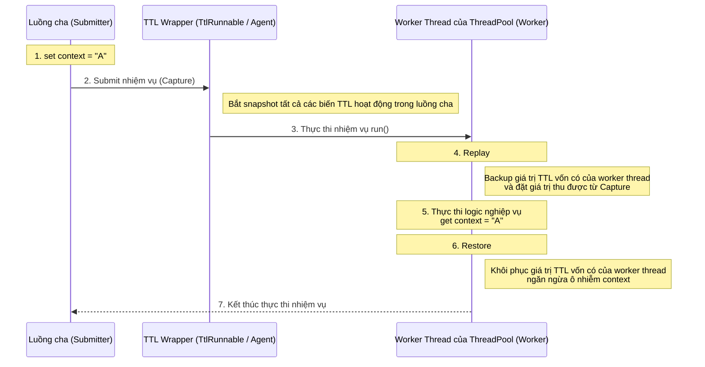

<!-- @include: @article-header.snippet.md -->

## ThreadLocal

### ThreadLocal có tác dụng gì?

Bình thường, các biến chúng ta tạo ra có thể được truy cập và sửa đổi bởi bất kỳ luồng nào. Điều này trong môi trường đa luồng có thể dẫn đến tranh chấp dữ liệu và các vấn đề an toàn luồng. Vậy **nếu muốn mỗi luồng đều có biến cục bộ độc quyền của riêng mình, thì nên thực hiện như thế nào?**

Lớp `ThreadLocal` được cung cấp trong JDK chính là để giải quyết vấn đề này. **Lớp `ThreadLocal` cho phép mỗi luồng ràng buộc giá trị của riêng mình**, có thể ví một cách hình tượng nó như một "chiếc hộp đựng dữ liệu". Mỗi luồng đều có chiếc hộp độc lập của riêng mình dùng để lưu trữ dữ liệu riêng tư, đảm bảo dữ liệu giữa các luồng khác nhau không can thiệp lẫn nhau.

Khi bạn tạo một biến `ThreadLocal`, mỗi luồng truy cập biến đó sẽ sở hữu một bản sao độc lập. Đây cũng là nguồn gốc tên gọi của `ThreadLocal`. Luồng có thể thông qua phương thức `get()` để lấy bản sao cục bộ của luồng mình, hoặc thông qua phương thức `set()` để sửa đổi giá trị của bản sao đó, từ đó tránh được vấn đề an toàn luồng.

Lấy một ví dụ đơn giản: Giả sử có hai người đi vào nhà kho thu thập báu vật. Nếu họ dùng chung một chiếc túi, chắc chắn sẽ xảy ra tranh chấp; nhưng nếu mỗi người có một chiếc túi độc lập, thì sẽ không có vấn đề đó. Nếu ví hai người này là các luồng, thì `ThreadLocal` chính là phương pháp dùng để tránh hai luồng này tranh chấp cùng một tài nguyên.

```java
public class ThreadLocalExample {
    private static ThreadLocal<Integer> threadLocal = ThreadLocal.withInitial(() -> 0);

    public static void main(String[] args) {
        Runnable task = () -> {
            int value = threadLocal.get();
            value += 1;
            threadLocal.set(value);
            System.out.println(Thread.currentThread().getName() + " Value: " + threadLocal.get());
        };

        Thread thread1 = new Thread(task, "Thread-1");
        Thread thread2 = new Thread(task, "Thread-2");

        thread1.start(); // 输出: Thread-1 Value: 1
        thread2.start(); // 输出: Thread-2 Value: 1
    }
}
```

### ⭐️ Bạn có hiểu nguyên lý của ThreadLocal không?

Bắt đầu từ mã nguồn lớp `Thread`.

```java
public class Thread implements Runnable {
    //......
    //Giá trị ThreadLocal liên quan đến luồng này. Do lớp ThreadLocal bảo trì
    ThreadLocal.ThreadLocalMap threadLocals = null;

    //Giá trị InheritableThreadLocal liên quan đến luồng này. Do lớp InheritableThreadLocal bảo trì
    ThreadLocal.ThreadLocalMap inheritableThreadLocals = null;
    //......
}
```

Từ mã nguồn lớp `Thread` ở trên có thể thấy trong lớp `Thread` có một biến `threadLocals` và một biến `inheritableThreadLocals`, chúng đều là các biến kiểu `ThreadLocalMap`. Chúng ta có thể hiểu `ThreadLocalMap` là một `HashMap` tùy chỉnh do lớp `ThreadLocal` triển khai. Mặc định cả hai biến này đều là null, chỉ khi luồng hiện tại gọi phương thức `set` hoặc `get` của lớp `ThreadLocal` thì mới tạo ra chúng. Thực tế khi gọi hai phương thức này, chúng ta gọi phương thức `get()`, `set()` tương ứng của lớp `ThreadLocalMap`.

Phương thức `set()` của lớp `ThreadLocal`:

```java
public void set(T value) {
    //Lấy luồng hiện tại đang yêu cầu
    Thread t = Thread.currentThread();
    //Lấy ra biến threadLocals bên trong lớp Thread (cấu trúc bảng băm)
    ThreadLocalMap map = getMap(t);
    if (map != null)
        // Đặt giá trị cần lưu trữ vào bảng băm này
        map.set(this, value);
    else
        createMap(t, value);
}
ThreadLocalMap getMap(Thread t) {
    return t.threadLocals;
}
```

Thông qua những nội dung trên, chúng ta đủ để rút ra kết luận qua dự đoán: **Biến cuối cùng được đặt trong `ThreadLocalMap` của luồng hiện tại, chứ không tồn tại trên `ThreadLocal`, `ThreadLocal` có thể hiểu chỉ là lớp đóng gói của `ThreadLocalMap`, truyền giá trị biến.** Trong lớp `ThreadLocal`, sau khi lấy được đối tượng luồng hiện tại qua `Thread.currentThread()`, trực tiếp qua `getMap(Thread t)` có thể truy cập đến đối tượng `ThreadLocalMap` của luồng đó.

**Mỗi `Thread` đều sở hữu một `ThreadLocalMap`, và `ThreadLocalMap` có thể lưu trữ các cặp key-value với key là `ThreadLocal` và value là đối tượng Object.**

```java
ThreadLocalMap(ThreadLocal<?> firstKey, Object firstValue) {
    //......
}
```

Ví dụ nếu trong cùng một luồng chúng ta khai báo hai đối tượng `ThreadLocal`, thì bên trong `Thread` đều sử dụng duy nhất một `ThreadLocalMap` đó để lưu trữ dữ liệu, key của `ThreadLocalMap` chính là đối tượng `ThreadLocal`, value chính là giá trị được đặt khi đối tượng `ThreadLocal` gọi phương thức `set`.

Cấu trúc dữ liệu `ThreadLocal` như hình dưới đây:


`ThreadLocalMap` là static inner class của `ThreadLocal`.


### ⭐️ Vấn đề rò rỉ bộ nhớ trong ThreadLocal do đâu mà ra?

Nguyên nhân cốt lõi dẫn đến rò rỉ bộ nhớ (memory leak) của `ThreadLocal` nằm ở cơ chế triển khai bên trong của nó.

Thông qua nội dung trên chúng ta đã biết: Mỗi luồng bảo trì một map tên là `ThreadLocalMap`. Khi bạn dùng `ThreadLocal` để lưu giá trị, thực tế là lưu giá trị trong `ThreadLocalMap` của luồng hiện tại, trong đó bản thân thể hiện `ThreadLocal` đóng vai trò là key, còn giá trị bạn muốn lưu đóng vai trò là value.

Mã nguồn phương thức `set()` của `ThreadLocal` như sau:

```java
public void set(T value) {
    Thread t = Thread.currentThread(); // Lấy luồng hiện tại
    ThreadLocalMap map = getMap(t);   // Lấy ThreadLocalMap của luồng hiện tại
    if (map != null) {
        map.set(this, value);         // Đặt giá trị
    } else {
        createMap(t, value);          // Tạo ThreadLocalMap mới
    }
}
```

Trong phương thức `set()` và `createMap()` của `ThreadLocalMap`, không trực tiếp lưu bản thân đối tượng `ThreadLocal`, mà dùng giá trị băm của `ThreadLocal` để tính chỉ số mảng, cuối cùng lưu trong mảng có kiểu `static class Entry extends WeakReference<ThreadLocal<?>>`.

```java
int i = key.threadLocalHashCode & (len-1);
```

Định nghĩa `Entry` của `ThreadLocalMap` như sau:

```java
static class Entry extends WeakReference<ThreadLocal<?>> {
    Object value;

    Entry(ThreadLocal<?> k, Object v) {
        super(k);
        value = v;
    }
}
```

Cơ chế tham chiếu `key` và `value` của `ThreadLocalMap`:

- **key là tham chiếu yếu (WeakReference)**: Key trong `ThreadLocalMap` là tham chiếu yếu của `ThreadLocal` (`WeakReference<ThreadLocal<?>>`). Điều này có nghĩa là, nếu thể hiện `ThreadLocal` không còn được trỏ tới bởi bất kỳ tham chiếu mạnh (strong reference) nào, Garbage Collector (GC) sẽ thu hồi thể hiện đó trong lần GC tiếp theo, dẫn đến key tương ứng trong `ThreadLocalMap` trở thành `null`.
- **value là tham chiếu mạnh (Strong Reference)**: Dù `key` bị GC thu hồi, `value` vẫn được `ThreadLocalMap.Entry` tham chiếu mạnh tới, không thể bị GC thu hồi.

Khi thể hiện `ThreadLocal` mất đi tham chiếu mạnh, value tương ứng của nó vẫn tồn tại trong `ThreadLocalMap`, vì đối tượng `Entry` tham chiếu mạnh tới nó. Nếu luồng tiếp tục sống (ví dụ luồng trong ThreadPool), `ThreadLocalMap` cũng sẽ luôn tồn tại, dẫn đến entry có key là `null` không thể được thu hồi rác, tức là gây ra rò rỉ bộ nhớ.

Nói cách khác, sự cố rò rỉ bộ nhớ xảy ra cần đồng thời thỏa mãn 2 điều kiện:

1. Thể hiện `ThreadLocal` không còn được tham chiếu mạnh;
2. Luồng tiếp tục sống kéo dài, dẫn đến `ThreadLocalMap` tồn tại lâu dài.

Mặc dù `ThreadLocalMap` khi thực hiện các thao tác `get()`, `set()` và `remove()` sẽ thử dọn dẹp các entry có key là null, nhưng cơ chế dọn dẹp này là bị động, không hoàn toàn tin cậy.

**Làm thế nào để tránh rò rỉ bộ nhớ xảy ra?**

1. Sau khi dùng xong `ThreadLocal`, nhất định phải gọi phương thức `remove()`. Đây là cách làm an toàn nhất và được khuyến nghị nhất. Phương thức `remove()` sẽ xóa một cách rõ ràng entry tương ứng khỏi `ThreadLocalMap`, giải quyết triệt để rủi ro rò rỉ bộ nhớ. Dù khai báo `ThreadLocal` là `static final`, cũng rất khuyến nghị gọi `remove()` sau mỗi lần sử dụng.
2. Trong các kịch bản tái sử dụng luồng như ThreadPool, sử dụng khối `try-finally` có thể đảm bảo dù xảy ra ngoại lệ, phương thức `remove()` vẫn chắc chắn được thực thi.

#### Tại sao Entry key lại được thiết kế là tham chiếu yếu?

Đây là một câu hỏi phỏng vấn đào sâu điển hình. Nhiều bạn biết key của `ThreadLocalMap` là tham chiếu yếu, nhưng không rõ **tại sao lại thiết kế như vậy**, và nếu thay bằng tham chiếu mạnh thì sẽ ra sao.

Chúng ta hãy xem chuỗi tham chiếu hoàn chỉnh trước. Khi một luồng dùng `ThreadLocal`, liên quan đến các mối quan hệ tham chiếu sau:

```
Tham chiếu mạnh (Stack/Biến static) ──→ Thể hiện ThreadLocal
                                            ↑
Thread ──→ ThreadLocalMap ──→ Entry ─── key (WeakReference) ──┘
                              │
                              └─── value (Tham chiếu mạnh) ──→ Đối tượng lưu trữ thực tế
```

Hiểu được chuỗi tham chiếu này, chúng ta hãy so sánh 2 phương án thiết kế:

**Giả sử key dùng tham chiếu mạnh (thực tế không áp dụng):**

Khi tham chiếu `ThreadLocal` trong code nghiệp vụ được gán bằng `null` (ví dụ phương thức thực thi xong, đối tượng bị thu hồi), lúc này mặc dù code nghiệp vụ không còn cần `ThreadLocal` này nữa, nhưng do Entry của `ThreadLocalMap` nắm giữ **tham chiếu mạnh** đối với key, thể hiện `ThreadLocal` vẫn không thể được GC thu hồi. Chỉ cần luồng chưa kết thúc, `ThreadLocal` này và value tương ứng của nó sẽ luôn tồn tại trong bộ nhớ, gây ra rò rỉ bộ nhớ mà cả key và value **đều không thể thu hồi**.

**Key dùng tham chiếu yếu (phương án thực tế áp dụng):**

Khi tham chiếu `ThreadLocal` trong code nghiệp vụ được gán bằng `null`, do key của Entry là tham chiếu yếu, thể hiện `ThreadLocal` sẽ bị thu hồi trong lần GC tiếp theo, key trở thành `null`. Lúc này mặc dù value vẫn tồn tại (tham chiếu mạnh), nhưng `ThreadLocalMap` khi thực thi các thao tác `get()`, `set()`, `remove()` sẽ chủ động thăm dò và dọn dẹp các "stale entry" (mục hết hạn) có key là `null` này, từ đó giải phóng đối tượng value.

Nói cách khác, **thiết kế tham chiếu yếu là một cơ chế phòng thủ "bọc lót"** — cho dù nhà phát triển quên gọi `remove()`, GC của JVM phối hợp với logic tự dọn dẹp của `ThreadLocalMap` vẫn có cơ hội thu hồi dữ liệu bị rò rỉ. Còn nếu dùng tham chiếu mạnh, một khi quên `remove()`, sẽ hoàn toàn không có cơ hội cứu chữa nào.

> Cần lưu ý rằng, cơ chế tự dọn dẹp này được **kích hoạt bị động** (chỉ tiện thể dọn dẹp khi thao tác `get`/`set`/`remove`), không đảm bảo tất cả mục hết hạn đều được dọn dẹp kịp thời. Do đó, **tham chiếu yếu chỉ làm giảm rủi ro rò rỉ bộ nhớ chứ không xóa bỏ hoàn toàn**, việc chủ động gọi `remove()` vẫn là bắt buộc.

#### Rủi ro đặc thù trong kịch bản ThreadPool

Phía trên có đề cập một trong các điều kiện rò rỉ bộ nhớ là "luồng tiếp tục sống lâu dài". Trong kịch bản dùng `new Thread()` tạo luồng, luồng sau khi thực thi xong sẽ bị tiêu hủy, `ThreadLocalMap` mà nó nắm giữ cũng sẽ bị GC thu hồi theo, ảnh hưởng của rò rỉ tương đối hữu hạn.

Tuy nhiên trong kịch bản **ThreadPool**, vấn đề sẽ bị phóng đại nghiêm trọng. Các luồng cốt lõi trong ThreadPool mặc định không bị tiêu hủy, chúng sẽ được tái sử dụng liên tục để thực thi các nhiệm vụ khác nhau. Điều này có nghĩa là:

1. **Rò rỉ bộ nhớ có thể tích lũy**: Nếu nhiệm vụ liên tục tạo `ThreadLocal` tạm thời mới, hoặc dùng nhiều `ThreadLocal` mà không dọn dẹp, sau khi key mất tham chiếu mạnh bị thu hồi, value tương ứng vẫn có thể tồn tại trong `ThreadLocalMap` của luồng được tái sử dụng. Việc gọi `set()` liên tục trên cùng một `ThreadLocal` vẫn còn trỏ tới thường sẽ thay thế value cũ, nhưng value mới nhất vẫn sẽ giữ lại cho đến khi bị ghi đè, xóa bỏ, dọn dẹp hoặc luồng chấm dứt.
2. **Ô nhiễm dữ liệu (dữ liệu rác - dirty data)**: Giá trị `ThreadLocal` do nhiệm vụ trước cài đặt, nếu không được dọn dẹp, nhiệm vụ tiếp theo được phân công cùng luồng đó sẽ đọc được giá trị còn sót lại này. Điều này có thể dẫn đến lỗi logic nghiệp vụ nghiêm trọng, ví dụ yêu cầu của User A lại đọc được thông tin danh tính của User B.

**Sự cố thực tế của đội ngũ kỹ thuật Meituan:**

Đội ngũ kỹ thuật Meituan trong bài viết [《Nguyên lý triển khai ThreadPool trong Java và thực tiễn trong nghiệp vụ Meituan》](https://tech.meituan.com/2020/04/02/java-pooling-pratice-in-meituan.html) đã ghi lại một sự cố online do dùng `ThreadLocal` không đúng cách gây ra: Trong một ứng dụng Web phụ thuộc vào `ThreadLocal` để truyền context người dùng, do dùng ThreadPool xử lý request, và không dọn dẹp `ThreadLocal` sau khi kết thúc request, dẫn đến **các request sau khi tái sử dụng cùng một luồng đã đọc phải thông tin người dùng còn sót lại của request trước**, gây ra sự cố nghiêm trọng về nhầm lẫn dữ liệu người dùng.

#### Quy định bắt buộc trong Cẩm nang phát triển Java của Alibaba

Chính vì sự kết hợp ThreadPool + `ThreadLocal` rất dễ sập bẫy, nên trong chương "Xử lý Concurrency" của 《Cẩm nang phát triển Java Alibaba》 đã đưa ra yêu cầu cấp **BẮT BUỘC**:

> **【Bắt buộc】** Phải thu hồi giá trị luồng hiện tại được ghi lại bởi biến `ThreadLocal` tự định nghĩa, đặc biệt trong kịch bản ThreadPool, luồng thường xuyên được tái sử dụng, nếu không dọn dẹp biến `ThreadLocal` tự định nghĩa, có thể ảnh hưởng đến logic nghiệp vụ sau đó và gây ra rò rỉ bộ nhớ. Cố gắng sử dụng khối `try-finally` trong proxy để thu hồi.

Pattern sử dụng đúng như sau:

```java
// Khai báo là static final, tránh tạo lặp lại thể hiện ThreadLocal
private static final ThreadLocal<UserContext> userContextHolder = new ThreadLocal<>();

public void processRequest(HttpServletRequest request) {
    try {
        // Đặt giá trị trong khối try
        UserContext context = buildUserContext(request);
        userContextHolder.set(context);

        // Thực thi logic nghiệp vụ
        doBusinessLogic();
    } finally {
        // Trong khối finally bắt buộc phải dọn dẹp, đảm bảo dù xảy ra ngoại lệ vẫn được thực thi
        userContextHolder.remove();
    }
}
```

Ở đây có 3 điểm mấu chốt:

1. **`ThreadLocal` khai báo là `static final`**: Đảm bảo thể hiện `ThreadLocal` tương ứng với field này không bị tạo lại mỗi lần gọi, tránh việc thể hiện cũ mất tham chiếu mạnh để lại mục hết hạn; điều này không có nghĩa là toàn bộ ứng dụng chỉ có thể có 1 thể hiện `ThreadLocal`.
2. **`try-finally` đảm bảo `remove()` chắc chắn được thực thi**: Ngay cả khi logic nghiệp vụ ném ra ngoại lệ, khối `finally` vẫn đảm bảo `ThreadLocal` được dọn dẹp.
3. **Dọn dẹp ngay sau khi sử dụng xong, chứ không phụ thuộc vào việc ghi đè lần dùng sau**: Gọi `set()` trên cùng một `ThreadLocal` sẽ thay thế value cũ, nhưng trước khi nhiệm vụ tiếp theo đến, giá trị cũ vẫn bị luồng giữ; nếu code chuyển sang dùng `ThreadLocal` khác, mục hết hạn còn có thể tồn tại lâu dài. Dùng xong gọi `remove()` trong `finally` có thể kịp thời tránh chiếm dụng bộ nhớ và ô nhiễm dữ liệu.

### ⭐️ Làm thế nào để truyền giá trị ThreadLocal xuyên luồng?

**Tại sao ThreadLocal bị mất tác dụng trong kịch bản bất đồng bộ (async)?**

Giá trị của `ThreadLocal` không nằm trong đối tượng `ThreadLocal`, mà được lưu trong `Thread`:

```java
Thread → ThreadLocalMap → Entry(ThreadLocal, value)
```

Cấu trúc dữ liệu `ThreadLocal` như hình dưới đây:


Thực thi bất đồng bộ thường có nghĩa là nhiệm vụ sẽ chuyển từ luồng hiện tại sang một luồng khác (ví dụ worker thread trong ThreadPool) để thực thi. Do các luồng khác nhau tự bảo trì `ThreadLocalMap` độc lập, theo mặc định context của `ThreadLocal` không thể tự động truyền trong thực thi bất đồng bộ.

**Làm thế nào để truyền giá trị của ThreadLocal xuyên luồng?**

Để giải quyết vấn đề này, giới công nghệ có 2 bộ giải pháp chủ đạo, một bộ là nguyên bản của JDK, bộ còn lại do Alibaba mã nguồn mở.

1. `InheritableThreadLocal`: Một lớp do JDK 1.2 cung cấp, kế thừa từ `ThreadLocal`. Khi dùng `InheritableThreadLocal`, lúc tạo luồng con, sẽ làm cho luồng con kế thừa giá trị `ThreadLocal` trong luồng cha, tuy nhiên không hỗ trợ truyền giá trị `ThreadLocal` trong kịch bản ThreadPool.
2. `TransmittableThreadLocal`: `TransmittableThreadLocal` (viết tắt là TTL) là utility class do Alibaba mã nguồn mở, kế thừa và tăng cường lớp `InheritableThreadLocal`, có thể hỗ trợ truyền giá trị `ThreadLocal` trong kịch bản ThreadPool. Địa chỉ project: <https://github.com/alibaba/transmittable-thread-local>.

#### Nguyên lý InheritableThreadLocal

`InheritableThreadLocal` đạt được chức năng kế thừa giá trị `ThreadLocal` của luồng cha khi tạo luồng bất đồng bộ. Lớp này do đội ngũ JDK cung cấp, thông qua việc cải tạo mã nguồn lớp `Thread` trong gói JDK để đạt được việc truyền giá trị `ThreadLocal` khi tạo luồng.

**Giá trị của `InheritableThreadLocal` lưu ở đâu?**

Trong lớp `Thread` đã thêm một `ThreadLocalMap` mới, đặt tên là `inheritableThreadLocals`, biến này dùng để lưu các giá trị `ThreadLocal` cần truyền xuyên luồng. Như sau:

```JAVA
class Thread implements Runnable {
    ThreadLocal.ThreadLocalMap threadLocals = null;
    ThreadLocal.ThreadLocalMap inheritableThreadLocals = null;
}
```

**Hoàn thành việc truyền giá trị `ThreadLocal` như thế nào?**

Thông qua việc cải tạo constructor của lớp `Thread` để triển khai, khi tạo luồng `Thread`, lấy biến `inheritableThreadLocals` của luồng cha gán cho luồng con là được. Code liên quan như sau:

```JAVA
// Constructor của Thread sẽ gọi phương thức init()
private void init(/* ... */) {
	// 1. Lấy luồng cha
    Thread parent = currentThread();
    // 2. Gán inheritableThreadLocals của luồng cha cho luồng con
    if (inheritThreadLocals && parent.inheritableThreadLocals != null)
        this.inheritableThreadLocals =
        	ThreadLocal.createInheritedMap(parent.inheritableThreadLocals);
}
```

**Phương án của `InheritableThreadLocal` có vấn đề gì?**

Nhược điểm của phương án này nằm ở tính **một lần** của nó, tức là nó chỉ xảy ra copy một lần duy nhất khi luồng được tạo. Tuy nhiên, trong phát triển hiện đại, chúng ta sử dụng rất nhiều ThreadPool, mà các luồng trong ThreadPool thì được tái sử dụng.

Hãy tưởng tượng, Nhiệm vụ A thực thi trong Luồng 1, truyền giá trị `ThreadLocal` của nó cho Luồng con 2 trong ThreadPool. Sau khi Nhiệm vụ A kết thúc, Luồng 1 đi nghỉ. Tiếp theo, Nhiệm vụ B đến, thực thi trong Luồng 3, ThreadPool lại tái sử dụng Luồng con 2 vừa rồi để thực thi một phần của Nhiệm vụ B. Lúc này, trong `ThreadLocal` của Luồng con 2 vẫn còn sót lại dữ liệu bẩn do Nhiệm vụ A truyền cho nó, trong khi context của Nhiệm vụ B (ở Luồng 3) lại hoàn toàn không được truyền sang. Điều này dẫn đến ô nhiễm dữ liệu và mất mát context.

#### Nguyên lý TransmittableThreadLocal

JDK mặc định không hỗ trợ chức năng truyền giá trị `ThreadLocal` trong kịch bản ThreadPool, do đó Alibaba đã mã nguồn mở bộ công cụ `TransmittableThreadLocal` để triển khai chức năng đó.

Do Alibaba không thể sửa đổi mã nguồn JDK, TTL đã khéo léo tận dụng **Decorator Pattern (mẫu trang trí)** để tăng cường cho nhiệm vụ (`Runnable`/`Callable`) hoặc ThreadPool (`Executor`), trì hoãn thời điểm truyền context từ "lúc tạo luồng" sang "lúc submit và thực thi nhiệm vụ".

Logic cốt lõi của TTL có thể tóm tắt thành 3 giai đoạn (CRR):

- **Capture (Bắt giữ)**: Ngay tại thời điểm submit nhiệm vụ (như gọi `execute`), `TtlRunnable` sẽ gọi `TransmittableThreadLocal.Transmitter.capture()`. Nó thông qua tập hợp `holder` bảo trì bên trong, bắt lấy snapshot tất cả các biến TTL đang hoạt động trong luồng cha hiện tại.
- **Replay (Phát lại)**: Trước khi worker thread của ThreadPool thực thi phương thức `run()`, gọi `replay()`. Nó sẽ `set` các giá trị trong snapshot vào luồng làm việc hiện tại, và backup lại giá trị cũ vốn có của luồng đó.
- **Restore (Khôi phục)**: Sau khi nhiệm vụ thực thi kết thúc, gọi `restore()`. Nó dựa trên bản backup để khôi phục luồng làm việc về trạng thái trước khi thực thi, tránh ô nhiễm context hoặc rò rỉ bộ nhớ.

Đây là sơ đồ thời gian của toàn bộ quá trình CRR do TTL chính thức cung cấp:


Hơi khó hiểu phải không? Có thể xem sơ đồ thời gian CRR do tôi vẽ dưới đây, rõ ràng và trực quan hơn:



Nói cách khác, bản chất của TTL là Capture context khi submit nhiệm vụ, Replay context trước khi thực thi nhiệm vụ, và Restore trạng thái luồng sau khi kết thúc nhiệm vụ, từ đó hỗ trợ an toàn việc truyền `ThreadLocal` trong ThreadPool.

TTL cung cấp 2 cách tích hợp chính, có thể lựa chọn dựa trên yêu cầu tính xâm nhập và chi phí cải tạo.

**1. Tích hợp thủ công (Explicit Wrapping)**

Sử dụng `TtlRunnable.get(Runnable)` hoặc `TtlCallable.get(Callable)` để bọc nhiệm vụ, sử dụng `TtlExecutors.getTtlExecutor(Executor)`, `getTtlExecutorService(...)` để bọc ThreadPool. Cách tích hợp này rõ ràng, kiểm soát được, nhưng cần code nghiệp vụ phối hợp, có tính xâm nhập nhất định.

Đoạn code dưới đây thể hiện TTL thông qua CRR, hỗ trợ tái sử dụng ThreadPool và chiến lược từ chối, truyền và cách ly context `ThreadLocal` một cách an toàn.

```java
public class TtlContextHolder {
    private static final Logger log = LoggerFactory.getLogger(TtlContextHolder.class);

    // 1. Dùng static final đảm bảo thể hiện TTL không bị tạo lặp lại, tránh rò rỉ bộ nhớ
    // Override phương thức copy (tùy chọn): Nếu là kiểu reference, khuyến nghị triển khai deep copy
    private static final TransmittableThreadLocal<String> CONTEXT = new TransmittableThreadLocal<String>() {
        @Override
        public String copy(String parentValue) {
            // Mặc định là trả về trực tiếp reference, nếu là đối tượng có thể thay đổi (như Map), hãy new đối tượng mới ở đây
            return parentValue;
        }
    };

    // 2. Khởi tạo ThreadPool: Đảm bảo chỉ được bọc bởi TtlExecutors 1 lần
    private static final ExecutorService TTL_EXECUTOR_SERVICE;

    static {
        ExecutorService rawExecutor = new ThreadPoolExecutor(
                2, 4, 60L, TimeUnit.SECONDS,
                new LinkedBlockingQueue<>(1000), (Runnable r) -> new Thread(r, "ttl-worker-" + r.hashCode()),
                new ThreadPoolExecutor.CallerRunsPolicy() // Mấu chốt: TTL hỗ trợ hoàn hảo chiến lược từ chối này
        );
        // Bọc ThreadPool nguyên bản
        TTL_EXECUTOR_SERVICE = TtlExecutors.getTtlExecutorService(rawExecutor);
    }

    public static void main(String[] args) throws Exception {
        try {
            // 3. Đặt context trong luồng cha
            CONTEXT.set("value-set-in-parent");
            log.info("Luồng cha context: {}", CONTEXT.get());

            // 4. Dùng Lambda đơn giản hóa submit nhiệm vụ
            TTL_EXECUTOR_SERVICE.execute(() -> {
                log.info("Nhiệm vụ bất đồng bộ (Runnable) đọc context: {}", CONTEXT.get());
                // Mô phỏng logic nghiệp vụ
                // Lưu ý: Việc luồng con sửa đổi có ảnh hưởng luồng cha hay không phụ thuộc copy() có làm deep copy hay không
                CONTEXT.set("value-modified-in-child");
            });

            Future<String> future = TTL_EXECUTOR_SERVICE.submit(() -> {
                log.info("Nhiệm vụ bất đồng bộ (Callable) đọc context: {}", CONTEXT.get());
                return "Success";
            });

            future.get();

            // 5. Xác minh context luồng cha có bị ô nhiễm hay không
            log.info("Context cuối cùng của luồng cha: {}", CONTEXT.get());

        } finally {
            // 6. Dọn dẹp context của luồng hiện tại (luồng cha), context của luồng con do cơ chế Restore của TTL tự động khôi phục
            CONTEXT.remove();
        }
    }
}
```

Output:

```ba
09:06:31.438 INFO  [main] TtlContextHolder - Luồng cha context: value-set-in-parent
09:06:31.452 INFO  [ttl-worker-1663166483] TtlContextHolder - Nhiệm vụ bất đồng bộ (Runnable) đọc context: value-set-in-parent
09:06:31.453 INFO  [ttl-worker-841283083] TtlContextHolder - Nhiệm vụ bất đồng bộ (Callable) đọc context: value-set-in-parent
09:06:31.453 INFO  [main] TtlContextHolder - Context cuối cùng của luồng cha: value-set-in-parent
```

Nếu bạn muốn test đoạn code này, nhớ thêm Maven dependency của TTL;

```XML
<dependency>
    <groupId>com.alibaba</groupId>
    <artifactId>transmittable-thread-local</artifactId>
    <version>2.14.4</version>
</dependency>
```

**2. Tích hợp không xâm nhập (Java Agent)**

Thông qua Java Agent trong giai đoạn load class tiến hành tăng cường bytecode trên các class liên quan đến ThreadPool, tự động cài cắm logic truyền context của TTL, đạt được việc truyền xuyên suốt context mà code nghiệp vụ không cần sửa đổi gì. Cách này code nghiệp vụ không cần nhận biết sự tồn tại của TTL, nhưng độ phức tạp triển khai tương đối cao.

TTL Agent mặc định tu sửa các component executor JDK sau:

1. **ThreadPool chuẩn**: `java.util.concurrent.ThreadPoolExecutor` và `java.util.concurrent.ScheduledThreadPoolExecutor`.
2. **Hệ thống ForkJoin**: `java.util.concurrent.ForkJoinTask` (từ đó hỗ trợ trong suốt cho `CompletableFuture` và Java 8 Parallel Stream `Stream`).
3. **Component legacy**: `java.util.TimerTask` (từ v2.7.0 hỗ trợ, từ v2.11.2 mặc định bật).

Thêm cấu hình `-javaagent` vào tham số khởi động Java:

```bash
# Cấu hình cơ bản
java -javaagent:path/to/transmittable-thread-local-2.x.y.jar \
     -cp classes \
     com.your.app.Main
```

#### Kịch bản ứng dụng

1. **Đánh dấu traffic test tải (Pressure Test Marker)**: Trong kịch bản test tải, dùng `ThreadLocal` lưu trữ cờ test tải, dùng để phân biệt traffic test tải và traffic thật. Nếu cờ bị mất, có thể dẫn đến traffic test tải bị xử lý nhầm thành traffic ứng dụng thật.
2. **Truyền context**: Trong hệ thống phân tán, truyền thông tin Distributed Tracing (như Trace ID) hoặc context thông tin người dùng.

#### Tóm tắt

Giá trị của `ThreadLocal` mặc định không thể truyền xuyên luồng, vì giá trị của nó được lưu trong `ThreadLocalMap` của **chính từng đối tượng `Thread`**, luồng cha và luồng con là 2 đối tượng khác nhau.

Để giải quyết vấn đề này, chủ yếu có 2 phương án:

1. **InheritableThreadLocal của JDK**: Nó sẽ **copy** một bản sao giá trị của luồng cha sang luồng con khi **tạo luồng con**. Nhưng vấn đề của nó là sẽ bị mất tác dụng trong kịch bản **ThreadPool**. Vì ThreadPool sẽ **tái sử dụng** luồng, điều này dẫn đến luồng lấy được có thể là **dữ liệu bẩn** từ nhiệm vụ trước truyền lại.
2. **TransmittableThreadLocal (TTL) của Alibaba**: Đây là phương án được dùng trong dự án của chúng tôi, nó chuyên giải quyết vấn đề ThreadPool. Nguyên lý của nó là, khi **submit nhiệm vụ** vào ThreadPool, nó sẽ **bắt giữ (capture)** giá trị `ThreadLocal` của luồng cha, và **ràng buộc (bind)** cùng nhiệm vụ. Đợi đến khi một luồng trong ThreadPool chuẩn bị thực thi nhiệm vụ đó, nó lại **set** giá trị đã bắt giữ vào luồng đó, nhiệm vụ thực thi xong lại **dọn dẹp (restore)** đi.

Nói ngắn gọn, **InheritableThreadLocal gắn liền với luồng, chỉ có hiệu lực khi tạo luồng; còn TTL gắn liền với nhiệm vụ, hỗ trợ hoàn hảo cho ThreadPool.**

## ThreadPool (Tập hợp luồng)

### ThreadPool là gì?

Đúng như tên gọi, ThreadPool là một bể tài nguyên bảo trì và quản lý một chuỗi các luồng. Khi có nhiệm vụ cần xử lý, trực tiếp lấy luồng từ ThreadPool để xử lý, sau khi xử lý xong luồng không bị tiêu hủy ngay, mà chờ đợi nhiệm vụ tiếp theo.

### ⭐️ Tại sao nên sử dụng ThreadPool?

Kỹ thuật Pooling (tập hợp tài nguyên) có lẽ mọi người đã không còn xa lạ, ThreadPool, Database Connection Pool, HTTP Connection Pool... đều là ứng dụng của tư tưởng này. Tư tưởng của kỹ thuật Pooling chủ yếu là để giảm bớt việc tiêu tốn tài nguyên mỗi lần xin cấp phát, nâng cao hiệu suất sử dụng tài nguyên.

ThreadPool cung cấp một cách thức hạn chế và quản lý tài nguyên (bao gồm cả việc thực thi một nhiệm vụ). Mỗi ThreadPool còn bảo trì một số thông tin thống kê cơ bản, ví dụ số lượng nhiệm vụ đã hoàn thành. Sử dụng ThreadPool mang lại các lợi ích chính sau:

1. **Giảm tiêu thụ tài nguyên**: Các luồng trong ThreadPool có thể tái sử dụng. Một khi luồng hoàn thành nhiệm vụ nào đó, nó không tiêu hủy ngay mà quay về pool chờ nhiệm vụ tiếp theo. Điều này tránh việc tạo và tiêu hủy luồng liên tục mang lại chi phí lớn.
2. **Tăng tốc độ phản hồi**: Vì trong ThreadPool thường bảo trì một số lượng luồng cốt lõi nhất định (hoặc gọi là "công nhân thường trực"), khi nhiệm vụ đến, có thể giao trực tiếp cho các luồng đã rảnh rỗi tồn tại này thực thi, tiết kiệm thời gian tạo luồng, giúp nhiệm vụ được xử lý nhanh hơn.
3. **Tăng tính quản lý của luồng**: ThreadPool cho phép chúng ta quản lý tập trung các luồng trong pool. Chúng ta có thể cấu hình kích thước ThreadPool (số luồng cốt lõi, số luồng tối đa), loại và kích thước hàng đợi nhiệm vụ, chiến lược từ chối... Từ đó kiểm soát tổng số luồng concurrency, phòng ngừa kiệt quệ tài nguyên, đảm bảo tính ổn định của hệ thống. Đồng thời ThreadPool thường cung cấp các interface giám sát, thuận tiện cho chúng ta nắm được trạng thái vận hành (như có bao nhiêu luồng đang hoạt động, bao nhiêu nhiệm vụ đang xếp hàng...).

### Tạo ThreadPool như thế nào?

Trong Java, tạo ThreadPool chủ yếu có 2 cách:

**Cách 1: Trực tiếp tạo qua constructor ThreadPoolExecutor (Khuyến nghị)**


"Thread factory mặc định" và "Chiến lược từ chối mặc định" trong hình chỉ việc khi constructor hiện tại không truyền vào tham số tương ứng, `ThreadPoolExecutor` sẽ sử dụng cách triển khai mặc định.

Đây là cách được khuyến nghị nhất, vì nó cho phép nhà phát triển chỉ định rõ ràng các tham số cốt lõi của ThreadPool, kiểm soát tinh tế hơn đối với hành vi vận hành của ThreadPool, từ đó tránh rủi ro kiệt quệ tài nguyên.

**Cách 2: Tạo qua utility class Executors (Không khuyến nghị dùng cho sản xuất)**

Các phương thức tạo ThreadPool do utility class `Executors` cung cấp như hình dưới đây:


Có thể thấy, thông qua utility class `Executors` có thể tạo nhiều loại ThreadPool khác nhau, bao gồm:

- `FixedThreadPool`: Trong vận hành bình thường sử dụng tối đa số lượng worker thread cố định. Luồng có thể bị thay thế sau khi chấm dứt do ngoại lệ, khi đóng ThreadPool cũng sẽ thoát, do đó số lượng không phải tuyệt đối không đổi trong suốt lifecycle. Khi có nhiệm vụ mới submit, nếu trong ThreadPool có luồng rảnh rỗi thì thực thi ngay. Nếu không có, nhiệm vụ mới sẽ được lưu tạm vào hàng đợi nhiệm vụ, chờ luồng rảnh rỗi xử lý.
- `SingleThreadExecutor`: ThreadPool chỉ có duy nhất một luồng. Nếu có nhiều hơn một nhiệm vụ submit vào ThreadPool này, các nhiệm vụ sẽ được lưu trong hàng đợi nhiệm vụ, chờ luồng rảnh rỗi thực thi lần lượt theo thứ tự FIFO.
- `CachedThreadPool`: ThreadPool có thể điều chỉnh số luồng theo tình hình thực tế. Số luồng của ThreadPool không cố định, nhưng nếu có luồng rảnh rỗi tái sử dụng được sẽ ưu tiên dùng luồng tái sử dụng. Nếu tất cả luồng đều đang làm việc mà lại có nhiệm vụ mới submit, sẽ tạo luồng mới xử lý nhiệm vụ. Tất cả các luồng sau khi hoàn thành nhiệm vụ hiện tại sẽ quay về ThreadPool để tái sử dụng.
- `ScheduledThreadPool`: ThreadPool chạy nhiệm vụ sau một khoảng delay chỉ định hoặc thực thi định kỳ.

### ⭐️ Tại sao không khuyến nghị sử dụng ThreadPool tích hợp sẵn?

Trong chương "Xử lý Concurrency" của 《Cẩm nang phát triển Java Alibaba》 chỉ ra rõ ràng tài nguyên luồng bắt buộc phải cung cấp qua ThreadPool, không cho phép tự ý tạo luồng thủ công trong ứng dụng.

**Tại sao vậy?**

> Lợi ích của việc dùng ThreadPool là giảm thời gian tiêu tốn và chi phí tài nguyên hệ thống cho việc tạo và tiêu hủy luồng, giải quyết vấn đề thiếu hụt tài nguyên. Nếu không dùng ThreadPool, có thể làm cho hệ thống tạo số lượng lớn luồng cùng loại dẫn đến tiêu thụ hết bộ nhớ hoặc "chuyển đổi ngữ cảnh quá mức".

Ngoài ra, 《Cẩm nang phát triển Java Alibaba》 bắt buộc không cho phép dùng `Executors` để tạo ThreadPool, mà phải thông qua cách constructor `ThreadPoolExecutor`, cách xử lý này giúp người viết hiểu rõ hơn quy tắc vận hành của ThreadPool, tránh rủi ro kiệt quệ tài nguyên.

Nhược điểm của các đối tượng ThreadPool do `Executors` trả về như sau (sau đây sẽ giới thiệu chi tiết):

- `FixedThreadPool` và `SingleThreadExecutor`: Sử dụng hàng đợi chặn `LinkedBlockingQueue`, chiều dài tối đa của hàng đợi nhiệm vụ là `Integer.MAX_VALUE`, có thể coi là vô hạn (unbounded), có thể tích tụ lượng lớn yêu cầu dẫn đến OOM.
- `CachedThreadPool`: Sử dụng hàng đợi đồng bộ `SynchronousQueue`, số lượng luồng tối đa cho phép tạo là `Integer.MAX_VALUE`, nếu số lượng nhiệm vụ quá nhiều mà tốc độ thực thi chậm, có thể tạo số lượng lớn luồng dẫn đến OOM.
- `ScheduledThreadPool` và `SingleThreadScheduledExecutor`: Sử dụng hàng đợi chặn trì hoãn vô hạn `DelayedWorkQueue`, chiều dài tối đa của hàng đợi nhiệm vụ là `Integer.MAX_VALUE`, có thể tích tụ lượng lớn yêu cầu dẫn đến OOM.

```java
public static ExecutorService newFixedThreadPool(int nThreads) {
    // LinkedBlockingQueue chiều dài mặc định là Integer.MAX_VALUE, có thể xem là vô hạn
    return new ThreadPoolExecutor(nThreads, nThreads,0L, TimeUnit.MILLISECONDS,new LinkedBlockingQueue<Runnable>());

}

public static ExecutorService newSingleThreadExecutor() {
    // LinkedBlockingQueue chiều dài mặc định là Integer.MAX_VALUE, có thể xem là vô hạn
    return new FinalizableDelegatedExecutorService (new ThreadPoolExecutor(1, 1,0L, TimeUnit.MILLISECONDS,new LinkedBlockingQueue<Runnable>()));

}

// Hàng đợi đồng bộ SynchronousQueue không có dung lượng, số luồng tối đa là Integer.MAX_VALUE
public static ExecutorService newCachedThreadPool() {

    return new ThreadPoolExecutor(0, Integer.MAX_VALUE,60L, TimeUnit.SECONDS,new SynchronousQueue<Runnable>());

}

// DelayedWorkQueue (hàng đợi chặn trì hoãn)
public static ScheduledExecutorService newScheduledThreadPool(int corePoolSize) {
    return new ScheduledThreadPoolExecutor(corePoolSize);
}
public ScheduledThreadPoolExecutor(int corePoolSize) {
    super(corePoolSize, Integer.MAX_VALUE, 0, NANOSECONDS,
          new DelayedWorkQueue());
}
```

### ⭐️ Các tham số thường gặp của ThreadPool là gì? Giải thích thế nào?

```java
    /**
     * Tạo một ThreadPoolExecutor mới với các tham số khởi tạo đã cho.
     */
    public ThreadPoolExecutor(int corePoolSize,// Số luồng cốt lõi của ThreadPool
                              int maximumPoolSize,// Số luồng tối đa của ThreadPool
                              long keepAliveTime,// Khi số luồng lớn hơn số luồng cốt lõi, thời gian sống tối đa của luồng rảnh rỗi dư thừa
                              TimeUnit unit,// Đơn vị thời gian
                              BlockingQueue<Runnable> workQueue,// Hàng đợi nhiệm vụ, dùng để lưu trữ các nhiệm vụ chờ thực thi
                              ThreadFactory threadFactory,// Factory tạo luồng, dùng để tạo luồng, thường để mặc định
                              RejectedExecutionHandler handler// Chiến lược từ chối, khi nhiệm vụ submit quá nhiều không xử lý kịp, chúng ta có thể tùy chỉnh chiến lược để xử lý
                               ) {
        if (corePoolSize < 0 ||
            maximumPoolSize <= 0 ||
            maximumPoolSize < corePoolSize ||
            keepAliveTime < 0)
            throw new IllegalArgumentException();
        if (workQueue == null || threadFactory == null || handler == null)
            throw new NullPointerException();
        this.corePoolSize = corePoolSize;
        this.maximumPoolSize = maximumPoolSize;
        this.workQueue = workQueue;
        this.keepAliveTime = unit.toNanos(keepAliveTime);
        this.threadFactory = threadFactory;
        this.handler = handler;
    }
```

3 tham số quan trọng nhất của `ThreadPoolExecutor`:

- `corePoolSize`: Mặc định ngay cả khi rảnh rỗi cũng sẽ giữ lại số luồng trong ThreadPool; khi chưa bật timeout luồng cốt lõi và số worker thread ít hơn giá trị này, nhiệm vụ mới sẽ ưu tiên kích hoạt tạo luồng.
- `maximumPoolSize`: Số lượng worker thread tối đa cho phép tồn tại trong ThreadPool.
- `workQueue`: Khi số worker thread đạt `corePoolSize`, nhiệm vụ mới trước tiên sẽ thử đi vào hàng đợi; chỉ khi vào hàng đợi thất bại và số worker thread nhỏ hơn `maximumPoolSize`, ThreadPool mới tiếp tục tạo luồng.

Các tham số thường gặp khác của `ThreadPoolExecutor`:

- `keepAliveTime`: Khi số luồng trong ThreadPool lớn hơn `corePoolSize`, tức là có luồng phi cốt lõi (non-core thread), các luồng phi cốt lõi này sau khi rảnh rỗi sẽ không tiêu hủy ngay, mà chờ đợi cho đến khi thời gian chờ vượt quá `keepAliveTime` mới bị thu hồi tiêu hủy.
- `unit`: Đơn vị thời gian của tham số `keepAliveTime`.
- `threadFactory`: Được dùng khi executor tạo luồng mới.
- `handler`: Chiến lược từ chối (sau đây sẽ giới thiệu chi tiết riêng).

Bức hình dưới đây có thể giúp bạn khắc sâu hiểu biết về mối quan hệ giữa các tham số trong ThreadPool (Nguồn hình: 《Thực chiến tối ưu hiệu năng Java》):


### Luồng cốt lõi trong ThreadPool có bị thu hồi không?

`ThreadPoolExecutor` mặc định không thu hồi luồng cốt lõi, ngay cả khi chúng đã rảnh rỗi. Điều này là để giảm chi phí tạo luồng, vì các luồng cốt lõi thường cần giữ cho hoạt động lâu dài. Tuy nhiên, nếu ThreadPool được dùng cho kịch bản sử dụng định kỳ, và tần suất không cao (giữa các chu kỳ có thời gian rảnh rõ rệt), có thể cân nhắc đặt tham số của phương thức `allowCoreThreadTimeOut(boolean value)` thành `true`, như vậy sẽ thu hồi các luồng cốt lõi rảnh rỗi (khoảng thời gian do `keepAliveTime` chỉ định).

```java
public void allowCoreThreadTimeOut(boolean value) {
    // keepAliveTime của luồng cốt lõi phải lớn hơn 0 mới bật được cơ chế timeout
    if (value && keepAliveTime <= 0) {
        throw new IllegalArgumentException("Core threads must have nonzero keep alive times");
    }
    // Đặt giá trị allowCoreThreadTimeOut
    if (value != allowCoreThreadTimeOut) {
        allowCoreThreadTimeOut = value;
        // Nếu bật cơ chế timeout, dọn dẹp tất cả luồng rảnh rỗi, bao gồm luồng cốt lõi
        if (value) {
            interruptIdleWorkers();
        }
    }
}
```

### Khi luồng cốt lõi rảnh rỗi thì ở trạng thái nào?

Khi luồng cốt lõi rảnh rỗi, trạng thái của nó chia làm 2 trường hợp sau:

- **Có thiết lập thời gian sống cho luồng cốt lõi**: Luồng cốt lõi khi rảnh rỗi sẽ ở trạng thái `WAITING`, chờ lấy nhiệm vụ. Nếu thời gian bị chặn chờ đợi vượt quá thời gian sống của luồng cốt lõi, luồng đó sẽ thoát công việc, xóa luồng đó khỏi tập hợp worker thread của ThreadPool, trạng thái luồng chuyển thành `TERMINATED`.
- **Không thiết lập thời gian sống cho luồng cốt lõi**: Luồng cốt lõi khi rảnh rỗi sẽ luôn ở trạng thái `WAITING`, chờ lấy nhiệm vụ, luồng cốt lõi sẽ luôn tồn tại trong ThreadPool.

Khi trong hàng đợi có nhiệm vụ khả dụng, luồng bị chặn sẽ được đánh thức, trạng thái luồng chuyển từ `WAITING` sang `RUNNABLE`, sau đó đi thực thi nhiệm vụ tương ứng.

Tiếp theo thông qua mã nguồn liên quan, tìm hiểu xem bên trong ThreadPool làm như thế nào.

Luồng bên trong ThreadPool được trừu tượng hóa thành `Worker`, khi `Worker` được start, sẽ liên tục đi lấy nhiệm vụ trong hàng đợi nhiệm vụ.

Khi lấy nhiệm vụ, sẽ dựa vào giá trị `timed` để quyết định hành vi lấy nhiệm vụ từ hàng đợi nhiệm vụ (`BlockingQueue`).

Nếu 「thiết lập thời gian sống cho luồng cốt lõi」 hoặc 「số luồng vượt quá số luồng cốt lõi」, cờ `timed` sẽ được đánh dấu là `true`, thể hiện khi lấy nhiệm vụ cần dùng `poll()` chỉ định thời gian timeout.

- `timed == true`: Sử dụng `poll(timeout, unit)` để lấy nhiệm vụ. Nếu dùng `poll(timeout, unit)` bị hết giờ timeout, luồng hiện tại sẽ thoát thực thi (`TERMINATED`), luồng đó bị xóa khỏi ThreadPool.
- `timed == false`: Sử dụng `take()` để lấy nhiệm vụ. Dùng `take()` lấy nhiệm vụ sẽ làm cho luồng hiện tại bị chặn chờ đợi mãi mãi (`WAITING`).

Mã nguồn như sau:

```JAVA
// ThreadPoolExecutor
private Runnable getTask() {
    boolean timedOut = false;
    for (;;) {
        // ...

        // 1. Nếu 「thiết lập thời gian sống cho luồng cốt lõi」 hoặc 「số luồng vượt quá số luồng cốt lõi」, timed sẽ là true.
        boolean timed = allowCoreThreadTimeOut || wc > corePoolSize;
        // 2. Trừ số lượng luồng.
        // wc > maximumPoolSize: Số luồng trong ThreadPool vượt quá số luồng tối đa. wc là số luồng trong ThreadPool.
        // timed && timedOut: timedOut thể hiện lấy nhiệm vụ bị timeout.
        // Chia làm 2 trường hợp: Luồng cốt lõi thiết lập thời gian sống && lấy nhiệm vụ timeout thì trừ số luồng; Số luồng vượt quá số luồng cốt lõi && lấy nhiệm vụ timeout thì trừ số luồng.
        if ((wc > maximumPoolSize || (timed && timedOut))
            && (wc > 1 || workQueue.isEmpty())) {
            if (compareAndDecrementWorkerCount(c))
                return null;
            continue;
        }
        try {
            // 3. Nếu timed là true thì dùng poll() lấy nhiệm vụ; ngược lại dùng take() lấy nhiệm vụ.
            Runnable r = timed ?
                workQueue.poll(keepAliveTime, TimeUnit.NANOSECONDS) :
                workQueue.take();
            // 4. Lấy được nhiệm vụ xong thì trả về.
            if (r != null)
                return r;
            timedOut = true;
        } catch (InterruptedException retry) {
            timedOut = false;
        }
    }
}
```

### ⭐️ Các chiến lược từ chối của ThreadPool gồm những gì?

Nếu số luồng đang chạy đồng thời đạt số luồng tối đa và hàng đợi cũng đã bị lấp đầy nhiệm vụ, `ThreadPoolExecutor` định nghĩa một số chiến lược:

- `ThreadPoolExecutor.AbortPolicy`: Ném ra `RejectedExecutionException` để từ chối xử lý nhiệm vụ mới.
- `ThreadPoolExecutor.CallerRunsPolicy`: Gọi luồng của chính người thực thi để chạy nhiệm vụ, tức là trực tiếp chạy (`run`) nhiệm vụ bị từ chối trong luồng đã gọi phương thức `execute`, nếu chương trình thực thi đã bị đóng thì sẽ bỏ qua nhiệm vụ đó. Do đó chiến lược này sẽ làm giảm tốc độ submit nhiệm vụ mới, ảnh hưởng đến hiệu năng tổng thể của chương trình. Nếu ứng dụng của bạn chịu được độ trễ này và bạn yêu cầu bất kỳ một yêu cầu nhiệm vụ nào cũng phải được thực thi, bạn có thể chọn chiến lược này.
- `ThreadPoolExecutor.DiscardPolicy`: Không xử lý nhiệm vụ mới, trực tiếp bỏ qua.
- `ThreadPoolExecutor.DiscardOldestPolicy`: Chiến lược này sẽ bỏ qua yêu cầu nhiệm vụ chưa xử lý sớm nhất.

Ví dụ: Spring thông qua `ThreadPoolTaskExecutor` hoặc chúng ta trực tiếp thông qua constructor của `ThreadPoolExecutor` tạo ThreadPool, khi chúng ta không chỉ định `RejectedExecutionHandler` để cấu hình ThreadPool, mặc định sử dụng `AbortPolicy`. Trong chiến lược từ chối này, nếu hàng đợi đầy, `ThreadPoolExecutor` sẽ ném ra ngoại lệ `RejectedExecutionException` để từ chối nhiệm vụ mới đến, điều này đại diện cho việc bạn sẽ mất việc xử lý đối với nhiệm vụ đó. Nếu muốn tránh bỏ rơi nhiệm vụ trực tiếp khi ThreadPool vẫn đang chạy, có thể dùng `CallerRunsPolicy`, đẩy nhiệm vụ về cho luồng gọi `execute()` thực thi; nếu ThreadPool đã đóng, chiến lược này vẫn sẽ bỏ rơi nhiệm vụ.

```java
public static class CallerRunsPolicy implements RejectedExecutionHandler {

        public CallerRunsPolicy() { }

        public void rejectedExecution(Runnable r, ThreadPoolExecutor e) {
            if (!e.isShutdown()) {
                // Trực tiếp luồng chính thực thi, chứ không phải luồng trong ThreadPool thực thi
                r.run();
            }
        }
    }
```

### Nếu muốn khi quá tải cố gắng không bỏ rơi nhiệm vụ, nên chọn chiến lược từ chối nào?

Đối với kịch bản ThreadPool vẫn đang chạy và luồng gọi có thể chấp nhận thực thi nhiệm vụ đồng bộ, có thể cân nhắc `CallerRunsPolicy`. Nó không thể cung cấp đảm bảo "không bỏ rơi nhiệm vụ trong mọi trường hợp": sau khi ThreadPool đóng nhiệm vụ sẽ bị bỏ rơi, tiến trình crash cũng không thể dựa vào chiến lược từ chối trong bộ nhớ để khôi phục nhiệm vụ; khi cần đảm bảo mạnh mẽ nên phối hợp với lưu trữ bền vững (persistence) hoặc Message Queue.

Ở đây chúng ta hãy kết hợp mã nguồn của `CallerRunsPolicy` để xem:

```java
public static class CallerRunsPolicy implements RejectedExecutionHandler {

        public CallerRunsPolicy() { }


        public void rejectedExecution(Runnable r, ThreadPoolExecutor e) {
            // Chỉ cần chương trình hiện tại chưa đóng, thì dùng luồng thực thi phương thức execute để thực thi nhiệm vụ đó
            if (!e.isShutdown()) {

                r.run();
            }
        }
    }
```

Từ mã nguồn có thể thấy, chỉ cần chương trình hiện tại không đóng thì sẽ sử dụng luồng thực thi phương thức `execute` để thực thi nhiệm vụ đó.

### Chiến lược từ chối CallerRunsPolicy có rủi ro gì? Giải quyết thế nào?

Như chúng ta đã đề cập ở trên: Nếu muốn áp dụng backpressure thông qua luồng gọi khi ThreadPool quá tải để cố gắng tránh bỏ rơi nhiệm vụ, `CallerRunsPolicy` là một phương án tùy chọn.

Tuy nhiên, nếu nhiệm vụ đi vào `CallerRunsPolicy` lại là một nhiệm vụ rất tốn thời gian, và luồng xử lý submit nhiệm vụ lại là luồng chính (main thread), có thể dẫn đến luồng chính bị chặn, ảnh hưởng đến việc vận hành bình thường của chương trình.

Dưới đây lấy một ví dụ đơn giản, ThreadPool này giới hạn số luồng tối đa là 2, kích thước hàng đợi chặn là 1 (nghĩa là nhiệm vụ thứ 4 sẽ đi vào chiến lược từ chối), `ThreadUtil` là utility class do Hutool cung cấp:

```java
public class ThreadPoolTest {

    private static final Logger log = LoggerFactory.getLogger(ThreadPoolTest.class);

    public static void main(String[] args) {
        // Tạo một ThreadPool, số luồng cốt lõi là 1, số luồng tối đa là 2
        // Khi số luồng lớn hơn số luồng cốt lõi, thời gian sống tối đa của luồng rảnh rỗi dư thừa là 60 giây,
        // Hàng đợi nhiệm vụ là ArrayBlockingQueue dung lượng 1, chiến lược từ chối là CallerRunsPolicy.
        ThreadPoolExecutor threadPoolExecutor = new ThreadPoolExecutor(1,
                2,
                60,
                TimeUnit.SECONDS,
                new ArrayBlockingQueue<>(1),
                new ThreadPoolExecutor.CallerRunsPolicy());

        // Submit nhiệm vụ thứ 1, do luồng cốt lõi thực thi
        threadPoolExecutor.execute(() -> {
            log.info("Luồng cốt lõi thực thi nhiệm vụ thứ 1");
            ThreadUtil.sleep(1, TimeUnit.MINUTES);
        });

        // Submit nhiệm vụ thứ 2, do luồng cốt lõi bị chiếm, nhiệm vụ sẽ đi vào hàng đợi chờ
        threadPoolExecutor.execute(() -> {
            log.info("Luồng phi cốt lõi xử lý nhiệm vụ thứ 2 đã vào hàng đợi");
            ThreadUtil.sleep(1, TimeUnit.MINUTES);
        });

        // Submit nhiệm vụ thứ 3, do luồng cốt lõi bị chiếm và hàng đợi đã đầy, tạo luồng phi cốt lõi xử lý
        threadPoolExecutor.execute(() -> {
            log.info("Luồng phi cốt lõi xử lý nhiệm vụ thứ 3");
            ThreadUtil.sleep(1, TimeUnit.MINUTES);
        });

        // Submit nhiệm vụ thứ 4, do cả luồng cốt lõi và phi cốt lõi đều bị chiếm, hàng đợi cũng đầy, theo chiến lược CallerRunsPolicy, nhiệm vụ sẽ do luồng submit (tức luồng chính) thực thi
        threadPoolExecutor.execute(() -> {
            log.info("Luồng chính xử lý nhiệm vụ thứ 4");
            ThreadUtil.sleep(2, TimeUnit.MINUTES);
        });

        // Submit nhiệm vụ thứ 5, luồng chính bị kẹt ở nhiệm vụ thứ 4, nhiệm vụ này phải chờ luồng chính thực thi xong mới được submit
        threadPoolExecutor.execute(() -> {
            log.info("Luồng cốt lõi thực thi nhiệm vụ thứ 5");
        });

        // Đóng ThreadPool
        threadPoolExecutor.shutdown();
    }
}

```

Output:

```bash
18:19:48.203 INFO  [pool-1-thread-1] c.j.concurrent.ThreadPoolTest - Luồng cốt lõi thực thi nhiệm vụ thứ 1
18:19:48.203 INFO  [pool-1-thread-2] c.j.concurrent.ThreadPoolTest - Luồng phi cốt lõi xử lý nhiệm vụ thứ 3
18:19:48.203 INFO  [main] c.j.concurrent.ThreadPoolTest - Luồng chính xử lý nhiệm vụ thứ 4
18:20:48.212 INFO  [pool-1-thread-2] c.j.concurrent.ThreadPoolTest - Luồng phi cốt lõi xử lý nhiệm vụ thứ 2 đã vào hàng đợi
18:21:48.219 INFO  [pool-1-thread-2] c.j.concurrent.ThreadPoolTest - Luồng cốt lõi thực thi nhiệm vụ thứ 5
```

Từ kết quả output có thể thấy, vì chiến lược từ chối `CallerRunsPolicy`, dẫn đến nhiệm vụ tốn thời gian đã dùng luồng chính thực thi, khiến ThreadPool bị tắc nghẽn, từ đó làm cho các nhiệm vụ tiếp theo không thể thực thi kịp thời, trong trường hợp nghiêm trọng rất có thể dẫn đến OOM.

Chúng ta bắt đầu từ bản chất vấn đề, caller dùng `CallerRunsPolicy` là hy vọng tất cả các nhiệm vụ đều có thể được thực thi, các nhiệm vụ tạm thời chưa xử lý được lại được lưu trong hàng đợi chặn `BlockingQueue`. Như vậy, trong điều kiện bộ nhớ cho phép, chúng ta có thể tăng kích thước hàng đợi chặn `BlockingQueue` và điều chỉnh heap memory để chứa được nhiều nhiệm vụ hơn, đảm bảo nhiệm vụ có thể được thực thi chính xác.

Để tận dụng tối đa CPU, chúng ta còn có thể điều chỉnh tham số `maximumPoolSize` (số luồng tối đa) của ThreadPool, như vậy có thể nâng cao tốc độ xử lý nhiệm vụ, tránh việc tích tụ quá nhiều nhiệm vụ trong `BlockingQueue` dẫn đến hết bộ nhớ.


Nếu tài nguyên server đã đạt đến giới hạn có thể sử dụng, điều này có nghĩa là chúng ta phải thay đổi việc điều phối ThreadPool ở mặt chiến lược thiết kế. Tất cả chúng ta đều biết, bản chất dẫn đến kẹt luồng chính là vì chúng ta không muốn bất kỳ một nhiệm vụ nào bị bỏ rơi. Đổi hướng suy nghĩ, có cách nào vừa đảm bảo nhiệm vụ không bị bỏ rơi lại vừa kịp thời xử lý khi server có thêm sức lực không?

Ở đây cung cấp một tư tưởng **bền vững hóa nhiệm vụ (task persistence)**, việc bền vững hóa nhiệm vụ ở đây bao gồm nhưng không giới hạn ở:

1. Thiết kế một bảng nhiệm vụ để lưu nhiệm vụ vào database MySQL.
2. Redis cache nhiệm vụ.
3. Submit nhiệm vụ vào Message Queue.

Ở đây lấy phương án 1 làm ví dụ, giới thiệu ngắn gọn logic triển khai:

1. Triển khai interface `RejectedExecutionHandler` để tùy chỉnh chiến lược từ chối, chiến lược từ chối tùy chỉnh chịu trách nhiệm lưu các nhiệm vụ tạm thời chưa xử lý được (lúc này hàng đợi chặn đã đầy) vào database (lưu vào MySQL). Lưu ý: Nhiệm vụ ThreadPool tạm thời không xử lý được sẽ được đặt vào hàng đợi chặn trước, hàng đợi chặn đầy mới kích hoạt chiến lược từ chối.
2. Kế thừa `BlockingQueue` để triển khai một hàng đợi chặn hỗn hợp, hàng đợi đó chứa `ArrayBlockingQueue` đi kèm của JDK. Ngoài ra, hàng đợi chặn hỗn hợp đó cần sửa đổi logic lấy nhiệm vụ xử lý, tức là rewrite phương thức `take()`, khi lấy nhiệm vụ ưu tiên đọc nhiệm vụ sớm nhất từ database, database không có nhiệm vụ mới lấy nhiệm vụ từ `ArrayBlockingQueue`.


Toàn bộ logic triển khai tương đối đơn giản, mấu chốt nằm ở chiến lược từ chối tùy chỉnh và hàng đợi chặn. Nhờ đó, một khi luồng trong ThreadPool của chúng ta đạt mức tải đầy, chúng ta có thể thông qua chiến lược từ chối để lưu các nhiệm vụ mới nhất vào cơ sở dữ liệu MySQL, đợi đến khi ThreadPool có thêm sức lực xử lý tất cả nhiệm vụ, cho nó ưu tiên xử lý các nhiệm vụ trong database để tránh vấn đề "bỏ đói" (starvation).

Tất nhiên, đối với vấn đề này, chúng ta cũng có thể tham khảo cách làm của các framework chủ đạo khác, lấy Netty làm ví dụ, chiến lược từ chối của nó là trực tiếp tạo một luồng ngoài ThreadPool để xử lý các nhiệm vụ này, nhằm đảm bảo xử lý realtime của nhiệm vụ, cách làm này có thể cần thiết bị phần cứng tốt và luồng tạo tạm thời không thể thực hiện giám sát chính xác:

```java
private static final class NewThreadRunsPolicy implements RejectedExecutionHandler {
    NewThreadRunsPolicy() {
        super();
    }
    public void rejectedExecution(Runnable r, ThreadPoolExecutor executor) {
        try {
            //Tạo một luồng tạm thời xử lý nhiệm vụ
            final Thread t = new Thread(r, "Temporary task executor");
            t.start();
        } catch (Throwable e) {
            throw new RejectedExecutionException(
                    "Failed to start a new thread", e);
        }
    }
}
```

ActiveMQ thì cố gắng tranh thủ đưa nhiệm vụ vào hàng đợi trong khoảng thời gian hiệu lực chỉ định, để đảm bảo phân phối tối đa:

```java
new RejectedExecutionHandler() {
                @Override
                public void rejectedExecution(final Runnable r, final ThreadPoolExecutor executor) {
                    try {
                        //Chờ chặn có thời hạn, triển khai cố gắng phân phối
                        executor.getQueue().offer(r, 60, TimeUnit.SECONDS);
                    } catch (InterruptedException e) {
                        throw new RejectedExecutionException("Interrupted waiting for BrokerService.worker");
                    }
                    throw new RejectedExecutionException("Timed Out while attempting to enqueue Task.");
                }
            });
```

### Các hàng đợi chặn thường dùng của ThreadPool là gì?

Khi nhiệm vụ mới đến sẽ kiểm tra xem số luồng đang chạy hiện tại có đạt số luồng cốt lõi không, nếu đạt thì nhiệm vụ mới sẽ được lưu trong hàng đợi.

Các ThreadPool khác nhau sẽ chọn các hàng đợi chặn khác nhau, chúng ta có thể kết hợp với các ThreadPool tích hợp sẵn để phân tích.

- `LinkedBlockingQueue` dung lượng `Integer.MAX_VALUE` (hàng đợi chặn vô hạn): `FixedThreadPool` và `SingleThreadExecutor`. `FixedThreadPool` tối đa chỉ có thể tạo số luồng bằng số luồng cốt lõi (số luồng cốt lõi và số luồng tối đa bằng nhau), `SingleThreadExecutor` chỉ có thể tạo 1 luồng (số luồng cốt lõi và số luồng tối đa đều là 1), hàng đợi nhiệm vụ của cả hai sẽ không bao giờ bị lấp đầy.
- `SynchronousQueue` (hàng đợi đồng bộ): `CachedThreadPool`. `SynchronousQueue` không có dung lượng, không lưu trữ phần tử, mục đích là đảm bảo đối với các nhiệm vụ submit, nếu có luồng rảnh rỗi thì dùng luồng rảnh rỗi xử lý; ngược lại tạo một luồng mới xử lý nhiệm vụ. Nghĩa là số luồng tối đa của `CachedThreadPool` là `Integer.MAX_VALUE`, có thể hiểu số luồng có thể mở rộng vô hạn, có thể tạo lượng lớn luồng dẫn đến OOM.
- `DelayedWorkQueue` (hàng đợi trì hoãn): `ScheduledThreadPool` và `SingleThreadScheduledExecutor`. Các phần tử bên trong `DelayedWorkQueue` không được sắp xếp theo thời gian đưa vào, mà sắp xếp theo độ dài thời gian trì hoãn của nhiệm vụ, bên trong sử dụng cấu trúc dữ liệu "Heap" (đống), có thể đảm bảo mỗi lần lấy ra nhiệm vụ đều là nhiệm vụ có thời gian thực thi sớm nhất trong hàng đợi hiện tại. `DelayedWorkQueue` là một hàng đợi vô hạn. Mặc dù bên dưới là mảng, nhưng khi dung lượng mảng không đủ, nó sẽ tự động mở rộng, do đó hàng đợi không bao giờ bị lấp đầy. Khi nhiệm vụ liên tục được submit, chúng đều sẽ được thêm vào hàng đợi. Điều này có nghĩa là số lượng luồng trong ThreadPool không bao giờ vượt quá số luồng cốt lõi, tham số số luồng tối đa là vô hiệu đối với ThreadPool dùng hàng đợi này.
- `ArrayBlockingQueue` (hàng đợi chặn hữu hạn): Bên dưới triển khai bằng mảng, dung lượng một khi tạo ra thì không thể sửa đổi.

### ⭐️ Bạn có hiểu quy trình xử lý nhiệm vụ của ThreadPool không?


1. Nếu số luồng đang chạy hiện tại nhỏ hơn số luồng cốt lõi, thì sẽ tạo một luồng mới để thực thi nhiệm vụ.
2. Nếu số luồng đang chạy hiện tại bằng hoặc lớn hơn số luồng cốt lõi, nhưng nhỏ hơn số luồng tối đa, thì đưa nhiệm vụ đó vào hàng đợi nhiệm vụ để chờ thực thi.
3. Nếu đưa nhiệm vụ vào hàng đợi nhiệm vụ thất bại (hàng đợi nhiệm vụ đã đầy), nhưng số luồng đang chạy hiện tại nhỏ hơn số luồng tối đa, thì tạo một luồng mới để thực thi nhiệm vụ.
4. Nếu số luồng đang chạy hiện tại đã bằng số luồng tối đa, việc tạo luồng mới sẽ làm cho số luồng đang chạy vượt quá số luồng tối đa, thì nhiệm vụ hiện tại sẽ bị từ chối, chiến lược từ chối sẽ gọi phương thức `RejectedExecutionHandler.rejectedExecution()`.

Lại nêu thêm một câu hỏi nhỏ thú vị: **Trước khi submit nhiệm vụ, ThreadPool có thể tạo trước luồng không?**

Câu trả lời là có thể! `ThreadPoolExecutor` cung cấp 2 phương thức giúp chúng ta hoàn thành việc tạo luồng cốt lõi trước khi submit nhiệm vụ, từ đó đạt hiệu quả warmup (làm nóng) ThreadPool:

- `prestartCoreThread()`: Khởi động 1 luồng, chờ nhiệm vụ, nếu đã đạt số luồng cốt lõi, phương thức này trả về false, ngược lại trả về true;
- `prestartAllCoreThreads()`: Khởi động tất cả các luồng cốt lõi, và trả về số luồng cốt lõi khởi động thành công.

### ⭐️ Khi luồng trong ThreadPool bị ngoại lệ, sẽ bị hủy hay được tái sử dụng?

Nói trực tiếp kết luận, cần chia làm 2 trường hợp:

- **Sử dụng `execute()` submit nhiệm vụ**: Khi nhiệm vụ submit qua `execute()` vào ThreadPool và trong quá trình thực thi ném ra ngoại lệ, nếu ngoại lệ này không được bắt bên trong nhiệm vụ, thì ngoại lệ đó sẽ làm cho luồng hiện tại bị chấm dứt, và ngoại lệ sẽ được in ra console hoặc log file. ThreadPool sẽ phát hiện sự chấm dứt luồng này, và tạo một luồng mới để thay thế, từ đó giữ nguyên số luồng đã cấu hình.
- **Sử dụng `submit()` submit nhiệm vụ**: Đối với nhiệm vụ submit qua `submit()`, nếu xảy ra ngoại lệ trong khi thực thi nhiệm vụ, ngoại lệ này sẽ không được in trực tiếp ra. Thay vào đó, ngoại lệ được đóng gói trong đối tượng `Future` do `submit()` trả về. Khi gọi phương thức `Future.get()`, có thể bắt được một `ExecutionException`. Trong trường hợp này, luồng sẽ không bị chấm dứt vì ngoại lệ, nó tiếp tục tồn tại trong ThreadPool, chuẩn bị thực thi các nhiệm vụ tiếp theo.

Nói ngắn gọn: Khi dùng `execute()`, ngoại lệ không bắt làm luồng chấm dứt, ThreadPool tạo luồng mới thay thế; khi dùng `submit()`, ngoại lệ được đóng gói trong `Future`, luồng tiếp tục được tái sử dụng.

Thiết kế này cho phép `submit()` cung cấp cơ chế xử lý lỗi linh hoạt hơn, vì nó cho phép caller quyết định xử lý ngoại lệ như thế nào, còn `execute()` áp dụng cho các kịch bản không cần quan tâm kết quả thực thi.

Phân tích mã nguồn cụ thể có thể tham khảo bài viết này: [Khi luồng trong ThreadPool bị ngoại lệ: Tiêu hủy hay tái sử dụng? - 京东技术](https://mp.weixin.qq.com/s/9ODjdUU-EwQFF5PrnzOGfw).

### ⭐️ Đặt tên cho ThreadPool như thế nào?

Khi khởi tạo ThreadPool cần hiển thị đặt tên (thiết lập prefix tên ThreadPool), có lợi cho việc định vị vấn đề.

Mặc định tên luồng được tạo ra tương tự `pool-1-thread-n`, không có ý nghĩa nghiệp vụ, không lợi cho chúng ta định vị vấn đề.

Đặt tên cho các luồng trong ThreadPool thường có 2 cách sau:

**1. Tận dụng `ThreadFactoryBuilder` của guava**

```java
ThreadFactory threadFactory = new ThreadFactoryBuilder()
                        .setNameFormat(threadNamePrefix + "-%d")
                        .setDaemon(true).build();
ExecutorService threadPool = new ThreadPoolExecutor(corePoolSize, maximumPoolSize, keepAliveTime, TimeUnit.MINUTES, workQueue, threadFactory);
```

**2. Tự triển khai `ThreadFactory`.**

```java
import java.util.concurrent.ThreadFactory;
import java.util.concurrent.atomic.AtomicInteger;

/**
 * ThreadFactory thiết lập tên luồng, giúp chúng ta định vị vấn đề.
 */
public final class NamingThreadFactory implements ThreadFactory {

    private final AtomicInteger threadNum = new AtomicInteger();
    private final String name;

    /**
     * Tạo một factory sản xuất luồng có tên
     */
    public NamingThreadFactory(String name) {
        this.name = name;
    }

    @Override
    public Thread newThread(Runnable r) {
        Thread t = new Thread(r);
        t.setName(name + " [#" + threadNum.incrementAndGet() + "]");
        return t;
    }
}
```

### Thiết lập kích thước ThreadPool như thế nào?

Nhiều người thậm chí có thể thấy cấu hình ThreadPool to một chút sẽ tốt hơn! Tôi nghĩ điều này rõ ràng có vấn đề. Lấy một ví dụ rất phổ biến trong cuộc sống: **Không phải đông người là làm tốt công việc, tăng chi phí giao tiếp trao đổi. Bạn vốn dĩ một công việc chỉ cần 3 người làm, bạn cố kéo đến 6 người, có tăng hiệu suất làm việc không? Tôi nghĩ là không.** Ảnh hưởng của việc số lượng luồng quá nhiều cũng giống như việc chúng ta phân bổ bao nhiêu người làm việc, đối với kịch bản đa luồng này chủ yếu là làm tăng chi phí **chuyển đổi ngữ cảnh (context switch)**. Nếu chưa rõ chuyển đổi ngữ cảnh là gì, có thể xem phần giới thiệu dưới đây của tôi.

> Chuyển đổi ngữ cảnh:
>
> Trong lập trình đa luồng, số lượng luồng thường lớn hơn số nhân CPU, mà một nhân CPU tại bất kỳ thời điểm nào chỉ có thể được một luồng sử dụng. Để tất cả các luồng này đều được thực thi hiệu quả, chiến lược CPU áp dụng là phân bổ time slice (lát cắt thời gian) cho mỗi luồng và luân chuyển. Khi time slice của một luồng dùng hết, nó sẽ quay lại trạng thái ready nhường cho luồng khác sử dụng, quá trình này thuộc về một lần chuyển đổi ngữ cảnh. Tóm tắt lại là: Nhiệm vụ hiện tại trước khi thực thi xong time slice của CPU chuyển sang nhiệm vụ khác sẽ lưu lại trạng thái của chính mình trước, để lần sau chuyển lại nhiệm vụ này có thể tải lại trạng thái của nhiệm vụ đó. **Quá trình nhiệm vụ từ lưu trữ đến tải lại chính là một lần chuyển đổi ngữ cảnh**.
>
> Chuyển đổi ngữ cảnh thường là loại tính toán dội (CPU-intensive). Nghĩa là nó cần thời gian xử lý đáng kể, trong hàng chục hàng trăm lần chuyển đổi mỗi giây, mỗi lần chuyển đổi đều cần thời gian ở mức nanosecond. Do đó, chuyển đổi ngữ cảnh đối với hệ thống có nghĩa là tiêu tốn lượng lớn thời gian CPU, thực tế có thể là thao tác tốn thời gian nhất trong hệ điều hành.
>
> Linux so với các hệ điều hành khác (bao gồm các hệ điều hành kiểu Unix khác) có nhiều ưu điểm, trong đó có một điểm là thời gian tiêu tốn cho chuyển đổi ngữ cảnh và mode switch của nó rất ít.

Ví dụ thực tế con người hợp tác làm một việc gì đó, chúng ta có thể khẳng định một điều là kích thước ThreadPool thiết lập quá lớn hay quá nhỏ đều có vấn đề, phù hợp mới là tốt nhất.

- Nếu chúng ta thiết lập số lượng ThreadPool quá nhỏ, nếu cùng một lúc có lượng lớn nhiệm vụ/yêu cầu cần xử lý, có thể dẫn đến lượng lớn yêu cầu/nhiệm vụ phải xếp hàng chờ đợi trong hàng đợi nhiệm vụ, thậm chí xuất hiện tình trạng hàng đợi đầy nên yêu cầu/nhiệm vụ không thể xử lý, hoặc lượng lớn nhiệm vụ tích tụ trong hàng đợi dẫn đến OOM. Như vậy rõ ràng là có vấn đề, CPU hoàn toàn không được tận dụng đầy đủ.
- Nếu chúng ta thiết lập số lượng luồng quá lớn, lượng lớn luồng có thể đồng thời tranh giành tài nguyên CPU, như vậy sẽ dẫn đến lượng lớn chuyển đổi ngữ cảnh, từ đó làm tăng thời gian thực thi của luồng, ảnh hưởng đến hiệu suất thực thi tổng thể.

Có một công thức đơn giản và phạm vi áp dụng tương đối rộng:

- **Nhiệm vụ CPU-intensive (N+1):** Loại nhiệm vụ này tiêu thụ chủ yếu là tài nguyên CPU, có thể đặt số luồng là N (số nhân CPU) + 1. Số luồng dư ra 1 so với số nhân CPU là để phòng ngừa việc luồng thỉnh thoảng bị ngắt trang (page fault), hoặc tạm dừng nhiệm vụ do nguyên nhân khác mang lại ảnh hưởng. Một khi nhiệm vụ tạm dừng, CPU sẽ ở trạng thái rảnh rỗi, mà trong trường hợp này luồng dư ra 1 có thể tận dụng đầy đủ thời gian rảnh rỗi của CPU.
- **Nhiệm vụ I/O-intensive (2N):** Loại nhiệm vụ này khi ứng dụng, hệ thống sẽ dùng phần lớn thời gian để xử lý tương tác I/O, mà luồng trong khoảng thời gian xử lý I/O sẽ không chiếm dụng CPU để tính toán, lúc này có thể nhường CPU cho các luồng khác sử dụng. Do đó trong ứng dụng nhiệm vụ I/O-intensive, chúng ta có thể cấu hình nhiều luồng hơn, phương pháp tính cụ thể là 2N.

**Làm thế nào để phán đoán là nhiệm vụ CPU-intensive hay IO-intensive?**

CPU-intensive có thể hiểu đơn giản là nhiệm vụ tận dụng năng lực tính toán của CPU như bạn tiến hành sắp xếp dữ liệu lớn trong bộ nhớ. Còn tất cả những gì liên quan đến đọc mạng, đọc file đều thuộc loại IO-intensive, đặc điểm của loại nhiệm vụ này là thời gian CPU tính toán tiêu tốn so với thời gian chờ thao tác IO hoàn thành là rất ít, phần lớn thời gian đều dùng vào việc chờ thao tác IO hoàn thành.

> 🌈 Mở rộng một chút (Tham khảo: [issue#1737](https://github.com/Snailclimb/JavaGuide/issues/1737)):
>
> Phương pháp tính số luồng nghiêm ngặt hơn phải là: `Số luồng tối ưu = N (Số nhân CPU) * (1 + WT (Thời gian chờ của luồng) / ST (Thời gian tính toán của luồng))`, trong đó `WT (Thời gian chờ của luồng) = Tổng thời gian chạy luồng - ST (Thời gian tính toán của luồng)`.
>
> Tỷ lệ thời gian chờ của luồng chiếm càng cao, càng cần nhiều luồng. Tỷ lệ thời gian tính toán của luồng chiếm càng cao, càng cần ít luồng.
>
> Chúng ta có thể thông qua công cụ VisualVM đi kèm JDK để xem tỷ lệ `WT/ST`.
>
> Nhiệm vụ CPU-intensive có `WT/ST` tiến gần hoặc bằng 0, do đó số luồng có thể đặt là N (Số nhân CPU) * (1 + 0) = N, gần giống với N (Số nhân CPU) + 1 mà chúng ta nói ở trên.
>
> Trong nhiệm vụ IO-intensive, hầu như toàn bộ là thời gian chờ của luồng, về mặt lý thuyết bạn có thể đặt số luồng là 2N (theo lý mà nói kết quả WT/ST tương đối lớn, ở đây chọn 2N có lẽ là để tránh tạo quá nhiều luồng).

Công thức cũng chỉ mang tính tham khảo, cụ thể vẫn phải dựa vào tình hình chạy online thực tế của dự án để điều chỉnh động. Phương án cấu hình động tham số ThreadPool của Meituan mà tôi giới thiệu ở sau rất tuyệt vời, vô cùng thực tế!

### ⭐️ Làm thế nào để điều chỉnh động các tham số của ThreadPool?

Đội ngũ kỹ thuật Meituan trong bài viết [《Nguyên lý triển khai ThreadPool trong Java và thực tiễn trong nghiệp vụ Meituan》](https://tech.meituan.com/2020/04/02/java-pooling-pratice-in-meituan.html) đã giới thiệu tư tưởng và phương pháp triển khai cấu hình tùy chỉnh tham số ThreadPool.

Tư tưởng của đội ngũ kỹ thuật Meituan chủ yếu là triển khai cấu hình tùy chỉnh đối với các tham số cốt lõi của ThreadPool. 3 tham số cốt lõi này là:

- **`corePoolSize`:** Mặc định ngay cả khi rảnh rỗi cũng sẽ giữ lại số luồng trong ThreadPool; khi worker thread ít hơn giá trị này, nhiệm vụ mới sẽ ưu tiên kích hoạt tạo luồng.
- **`maximumPoolSize`:** Số lượng worker thread tối đa cho phép tồn tại trong ThreadPool.
- **`workQueue`:** Khi số worker thread đạt `corePoolSize`, nhiệm vụ mới trước tiên sẽ thử đi vào hàng đợi; khi vào hàng đợi thất bại mới tiếp tục tạo luồng trong điều kiện không vượt quá `maximumPoolSize`.

**Tại sao lại là 3 tham số này?**

Tôi trong bài viết [Giải thích chi tiết ThreadPool Java](https://javaguide.cn/java/concurrent/java-thread-pool-summary.html) đã từng nói 3 tham số này là các tham số quan trọng nhất của `ThreadPoolExecutor`, chúng quyết định cơ bản chiến lược xử lý nhiệm vụ của ThreadPool.

**Hỗ trợ cấu hình động tham số như thế nào?** Hãy xem các phương thức do `ThreadPoolExecutor` cung cấp dưới đây.


Đặc biệt cần lưu ý là `corePoolSize`. Trong thời gian chạy nếu điều chỉnh nhỏ tham số này, các luồng hiện có vượt quá số luồng cốt lõi mới sẽ chấm dứt ở lần rảnh rỗi tiếp theo; khi điều chỉnh lớn, nếu trong hàng đợi đã có nhiệm vụ, ThreadPool sẽ khởi động luồng mới theo nhu cầu để xử lý.

Ngoài ra, bạn cũng thấy ở trên không có phương thức chỉ định động chiều dài hàng đợi, cách của Meituan là tự định nghĩa một hàng đợi gọi là `ResizableCapacityLinkedBlockIngQueue` (chủ yếu là bỏ từ khóa `final` tu sửa field capacity của `LinkedBlockingQueue`, làm cho nó trở thành biến đổi được).

Hiệu quả cuối cùng đạt được việc điều chỉnh động tham số ThreadPool như hình dưới đây. 👏👏👏


Chưa xem đủ? Tôi trong [《Câu hỏi phỏng vấn backend tần suất cao về System Design & Kịch bản》](https://javaguide.cn/zhuanlan/back-end-interview-high-frequency-system-design-and-scenario-questions.html) đã giới thiệu chi tiết cách thiết kế một Dynamic ThreadPool, đây cũng là một câu hỏi System Design thường gặp trong phỏng vấn.


Nếu dự án của chúng ta cũng muốn đạt hiệu quả này, có thể mượn các project mã nguồn mở có sẵn:

- **[Hippo4j](https://github.com/opengoofy/hippo4j)**: Framework ThreadPool bất đồng bộ, hỗ trợ thay đổi động ThreadPool & giám sát & cảnh báo, dễ dàng đưa vào mà không cần sửa code. Hỗ trợ nhiều mode sử dụng, dốc sức nâng cao năng lực đảm bảo hệ thống vận hành.
- **[Dynamic TP](https://github.com/dromara/dynamic-tp)**: Dynamic ThreadPool dạng nhẹ, tích hợp sẵn tính năng giám sát cảnh báo, tích hợp quản lý ThreadPool middleware bên thứ ba, dựa trên các config center chủ đạo (đã hỗ trợ Nacos, Apollo, Zookeeper, Consul, Etcd, có thể tự định nghĩa qua SPI).

### ⭐️ Làm thế nào để thiết kế một ThreadPool có thể thực thi nhiệm vụ theo độ ưu tiên?

Đây là một câu hỏi phỏng vấn thường gặp, bản chất thực ra vẫn là khảo sát người xin việc về mức độ nắm vững ThreadPool cũng như BlockingQueue.

Phía trên chúng ta cũng đã đề cập, các ThreadPool khác nhau sẽ chọn các hàng đợi chặn khác nhau làm hàng đợi nhiệm vụ. `FixedThreadPool` sử dụng `LinkedBlockingQueue` dung lượng mặc định là `Integer.MAX_VALUE`, thường coi nó là hàng đợi vô hạn; thực tế ứng dụng hầu như không thể nạp đầy, do đó `FixedThreadPool` thường chỉ tạo `corePoolSize` worker thread.

Nếu chúng ta cần triển khai một ThreadPool nhiệm vụ có độ ưu tiên, thì có thể cân nhắc sử dụng `PriorityBlockingQueue` (hàng đợi chặn ưu tiên) làm hàng đợi nhiệm vụ (constructor của `ThreadPoolExecutor` có một tham số `workQueue` có thể truyền hàng đợi nhiệm vụ).


`PriorityBlockingQueue` là một hàng đợi chặn vô hạn hỗ trợ độ ưu tiên, có thể xem như phiên bản an toàn luồng của `PriorityQueue`, cả hai bên dưới đều sử dụng nhị phân đống (binary heap) dạng min-heap, tức là phần tử có giá trị nhỏ nhất sẽ ưu tiên ra khỏi hàng đợi. Tuy nhiên, `PriorityQueue` không hỗ trợ thao tác chặn.

Muốn cho `PriorityBlockingQueue` triển khai việc sắp xếp nhiệm vụ, nhiệm vụ truyền vào trong đó bắt buộc phải sở hữu năng lực sắp xếp, có 2 cách:

1. Nhiệm vụ submit vào ThreadPool triển khai interface `Comparable`, và rewrite phương thức `compareTo` để chỉ định quy tắc so sánh độ ưu tiên giữa các nhiệm vụ.
2. Khi tạo `PriorityBlockingQueue` truyền vào một đối tượng `Comparator` để chỉ định quy tắc sắp xếp giữa các nhiệm vụ (Khuyến nghị).

Tuy nhiên, điều này tồn tại một số rủi ro và vấn đề, ví dụ:

- `PriorityBlockingQueue` là vô hạn, có thể tích tụ lượng lớn yêu cầu dẫn đến OOM.
- Có thể dẫn đến vấn đề bỏ đói (starvation), tức là nhiệm vụ có độ ưu tiên thấp thời gian dài không được thực thi.
- Do cần tiến hành thao tác sắp xếp các phần tử trong hàng đợi cũng như đảm bảo an toàn luồng (kiểm soát concurrency dùng `ReentrantLock`), do đó sẽ làm giảm hiệu năng.

Đối với vấn đề OOM giải quyết tương đối đơn giản thô bạo, đó là kế thừa `PriorityBlockingQueue` và rewrite logic phương thức `offer` (vào hàng đợi), khi số phần tử chèn vào vượt quá giá trị chỉ định thì trả về false.

Vấn đề bỏ đói có thể giải quyết qua tối ưu thiết kế (tương đối phức tạp), ví dụ nhiệm vụ chờ đợi quá lâu sẽ được xóa ra và thêm lại vào hàng đợi, nhưng độ ưu tiên sẽ được nâng lên.

Đối với ảnh hưởng mặt hiệu năng thì không có cách nào tránh được, dù sao cũng cần thao tác sắp xếp nhiệm vụ. Hơn nữa, đối với hầu hết kịch bản nghiệp vụ, ảnh hưởng hiệu năng chút này là có thể chấp nhận được.

## Future

Trọng tâm là phải nắm vững cách sử dụng `CompletableFuture` và các câu hỏi phỏng vấn thường gặp.

Ngoài các câu hỏi phỏng vấn dưới đây, còn khuyến nghị bạn xem bài viết này tôi viết: [Giải thích chi tiết CompletableFuture](https://javaguide.cn/java/concurrent/completablefuture-intro.html).

### Interface Future có tác dụng gì?

Interface `Future` là ứng dụng điển hình của tư tưởng bất đồng bộ (async), chủ yếu dùng trong một số kịch bản cần thực thi nhiệm vụ tốn thời gian, tránh cho chương trình đứng yên chờ đợi nhiệm vụ tốn thời gian thực thi xong, làm hiệu suất thực thi quá thấp. Cụ thể là: Khi chúng ta thực thi một nhiệm vụ tốn thời gian nào đó, có thể giao nhiệm vụ tốn thời gian này cho một luồng con đi thực thi bất đồng bộ, đồng thời chúng ta có thể làm việc khác, không cần ngây ngốc chờ nhiệm vụ tốn thời gian thực thi xong. Sau khi việc của chúng ta làm xong, chúng ta lại thông qua `Future` để lấy kết quả thực thi của nhiệm vụ tốn thời gian. Như vậy, hiệu suất thực thi của chương trình được nâng cao rõ rệt.

Đây thực ra chính là **Future pattern** kinh điển trong đa luồng, bạn có thể coi nó là một design pattern, tư tưởng cốt lõi là gọi bất đồng bộ, chủ yếu dùng trong lĩnh vực đa luồng, chứ không phải riêng ngôn ngữ Java.

Trong Java, `Future` là một interface generic, nằm trong gói `java.util.concurrent`. Nó có 5 phương thức trừu tượng kinh điển, chủ yếu bao gồm 4 loại chức năng dưới đây; Từ JDK 19 trở đi lại bổ sung thêm 3 phương thức truy vấn mặc định `resultNow()`, `exceptionNow()` và `state()`.

- Hủy nhiệm vụ;
- Phán đoán nhiệm vụ có bị hủy không;
- Phán đoán nhiệm vụ đã thực thi xong chưa;
- Lấy kết quả thực thi nhiệm vụ.

```java
// V đại diện cho kiểu giá trị trả về của nhiệm vụ do Future thực thi
public interface Future<V> {
    // Hủy thực thi nhiệm vụ
    // Hủy thành công trả về true, ngược lại trả về false
    boolean cancel(boolean mayInterruptIfRunning);
    // Phán đoán nhiệm vụ có bị hủy không
    boolean isCancelled();
    // Phán đoán nhiệm vụ đã thực thi xong chưa
    boolean isDone();
    // Lấy kết quả thực thi nhiệm vụ
    V get() throws InterruptedException, ExecutionException;
    // Trong thời gian chỉ định nếu không trả về kết quả tính toán sẽ ném ra ngoại lệ TimeOutException
    V get(long timeout, TimeUnit unit)

        throws InterruptedException, ExecutionException, TimeoutExceptio

}
```

Hiểu đơn giản chính là: Tôi có một nhiệm vụ, submit cho `Future` xử lý. Trong thời gian nhiệm vụ thực thi, bản thân tôi có thể đi làm bất kỳ việc gì mình muốn. Hơn nữa, trong thời gian này tôi còn có thể hủy nhiệm vụ cũng như lấy trạng thái thực thi của nhiệm vụ. Sau một khoảng thời gian, tôi có thể trực tiếp lấy ra kết quả thực thi nhiệm vụ từ `Future`.

### Callable và Future có mối quan hệ gì?

Chúng ta có thể thông qua `FutureTask` để hiểu mối quan hệ giữa `Callable` và `Future`.

`FutureTask` cung cấp cách triển khai cơ bản cho interface `Future`, thường dùng để bọc `Callable` và `Runnable`, sở hữu các phương thức hủy nhiệm vụ, xem nhiệm vụ đã thực thi xong chưa cũng như lấy kết quả thực thi nhiệm vụ. Phương thức `ExecutorService.submit()` trả về thực chất chính là lớp triển khai `FutureTask` của `Future`.

```java
<T> Future<T> submit(Callable<T> task);
Future<?> submit(Runnable task);
```

`FutureTask` không chỉ triển khai interface `Future`, mà còn triển khai interface `Runnable`, do đó có thể đóng vai trò như một nhiệm vụ được luồng thực thi trực tiếp.


`FutureTask` có 2 constructor, có thể truyền vào đối tượng `Callable` hoặc `Runnable`. Thực tế, truyền vào đối tượng `Runnable` cũng sẽ được chuyển đổi thành đối tượng `Callable` bên trong phương thức.

```java
public FutureTask(Callable<V> callable) {
    if (callable == null)
        throw new NullPointerException();
    this.callable = callable;
    this.state = NEW;
}
public FutureTask(Runnable runnable, V result) {
    // Thông qua adapter RunnableAdapter để chuyển đối tượng Runnable runnable thành đối tượng Callable
    this.callable = Executors.callable(runnable, result);
    this.state = NEW;
}
```

`FutureTask` tương đương với việc đóng gói `Callable`, quản lý tình hình thực thi nhiệm vụ, lưu trữ kết quả thực thi nhiệm vụ của phương thức `call` thuộc `Callable`.

Về các chi tiết mã nguồn khác của `Future`, bạn có thể xem bài phân tích vạn chữ này, viết rất rõ ràng: [Java triển khai Future Pattern như thế nào? Giải thích chi tiết vạn chữ!](https://juejin.cn/post/6844904199625375757).

### Lớp CompletableFuture có tác dụng gì?

`Future` trong quá trình sử dụng thực tế tồn tại một số hạn chế, ví dụ không hỗ trợ phối hợp kết hợp các nhiệm vụ bất đồng bộ, phương thức `get()` lấy kết quả tính toán là lời gọi bị chặn.

Java 8 mới đưa vào lớp `CompletableFuture` có thể giải quyết các khuyết điểm này của `Future`. `CompletableFuture` ngoài việc cung cấp các tính năng `Future` dễ dùng và mạnh mẽ hơn, còn cung cấp các năng lực như lập trình hàm (functional programming), phối hợp tổ hợp nhiệm vụ bất đồng bộ (có thể chuỗi nhiều nhiệm vụ bất đồng bộ lại với nhau, tạo thành một chuỗi lời gọi hoàn chỉnh).

Dưới đây chúng ta hãy xem đơn giản định nghĩa lớp `CompletableFuture`.

```java
public class CompletableFuture<T> implements Future<T>, CompletionStage<T> {
}
```

Có thể thấy, `CompletableFuture` đồng thời triển khai interface `Future` và `CompletionStage`.


Interface `CompletionStage` mô tả một giai đoạn của tính toán bất đồng bộ. Nhiều tính toán có thể chia thành nhiều giai đoạn hoặc bước, lúc này có thể thông qua nó để kết hợp tất cả các bước lại, hình thành quy trình tính toán bất đồng bộ.

Các phương thức trong interface `CompletionStage` tương đối nhiều, năng lực hàm của `CompletableFuture` chính là do interface này ban cho. Từ các tham số phương thức của interface này bạn có thể phát hiện nó sử dụng lượng lớn lập trình hàm được đưa vào từ Java 8.


### ⭐️ Một nhiệm vụ cần phụ thuộc vào hai nhiệm vụ khác thực thi xong mới chạy, thiết kế như thế nào?

Kịch bản sắp xếp phối hợp nhiệm vụ này rất phù hợp triển khai thông qua `CompletableFuture`. Ở đây giả sử cần triển khai T3 thực thi sau khi T2 và T1 thực thi xong.

Code như sau (ở đây để đơn giản hóa code, có dùng utility class về luồng `ThreadUtil` và ngày tháng `DateUtil` của Hutool):

```java
// T1
CompletableFuture<Void> futureT1 = CompletableFuture.runAsync(() -> {
    System.out.println("T1 is executing. Current time：" + DateUtil.now());
    // Mô phỏng thao tác tốn thời gian
    ThreadUtil.sleep(1000);
});
// T2
CompletableFuture<Void> futureT2 = CompletableFuture.runAsync(() -> {
    System.out.println("T2 is executing. Current time：" + DateUtil.now());
    ThreadUtil.sleep(1000);
});

// Sử dụng phương thức allOf() gộp CompletableFuture của T1 và T2, chờ chúng đều hoàn thành
CompletableFuture<Void> bothCompleted = CompletableFuture.allOf(futureT1, futureT2);
// Khi T1 và T2 đều hoàn thành, thực thi T3
bothCompleted.thenRunAsync(() -> System.out.println("T3 is executing after T1 and T2 have completed.Current time：" + DateUtil.now()));
// Chờ tất cả nhiệm vụ hoàn thành, xác minh hiệu quả
ThreadUtil.sleep(3000);
```

`T1` và `T2` ở phía trước đã được khởi chạy qua `runAsync()`, `allOf()` chỉ kết hợp trạng thái hoàn thành của chúng: Khi cả hai đều hoàn thành, mới thực thi T3. Việc có song song hay không phụ thuộc vào cách tạo nhiệm vụ và executor, chứ không phải bản thân `allOf()`.

### ⭐️ Khi sử dụng CompletableFuture, nếu một nhiệm vụ thất bại thì xử lý ngoại lệ như thế nào?

Khi sử dụng `CompletableFuture` nhất định phải dùng cách đúng đắn để xử lý ngoại lệ, tránh việc mất ngoại lệ hoặc xuất hiện vấn đề không thể kiểm soát.

Dưới đây là một số gợi ý:

- `whenComplete` sẽ thực thi callback khi giai đoạn hoàn thành bình thường hoặc bất thường, phù hợp để quan sát kết quả và ghi log ngoại lệ; nó mặc định giữ nguyên kết quả hoặc ngoại lệ của giai đoạn gốc.
- `exceptionally` chỉ thực thi khi giai đoạn hoàn thành bất thường, và dùng giá trị trả về của callback để khôi phục về kết quả bình thường; nếu cần tiếp tục lan truyền ngoại lệ, có thể ném ra ngoại lệ một cách hiển thị trong callback.
- `handle` bất kể giai đoạn hoàn thành bình thường hay bất thường đều sẽ thực thi, và dựa trên kết quả cùng ngoại lệ để sinh ra một kết quả mới.
- `CompletableFuture.allOf` có thể chờ nhiều giai đoạn hoàn thành toàn bộ; chỉ cần một trong số các giai đoạn hoàn thành bất thường, `CompletableFuture` trả về cũng sẽ hoàn thành bất thường, nhưng vẫn cần kiểm tra riêng từng giai đoạn mới lấy được kết quả hoặc ngoại lệ của từng nhiệm vụ.
- ……

### ⭐️ Tại sao khi sử dụng CompletableFuture lại nên tùy chỉnh ThreadPool?

Trong triển khai mặc định của `CompletableFuture`, các phương thức bất đồng bộ không truyền hiển thị `Executor` thường sử dụng `ForkJoinPool.commonPool()` dùng chung toàn cục; lớp con có thể override `defaultExecutor()` để thay đổi executor mặc định của các phương thức bất đồng bộ non-static. Điều này có nghĩa là ứng dụng và thư viện sử dụng triển khai mặc định thường sẽ dùng chung một ThreadPool.

Mặc dù `ForkJoinPool` hiệu suất rất cao, nhưng khi đồng thời submit lượng lớn nhiệm vụ, có thể dẫn đến tranh chấp tài nguyên và bỏ đói luồng (thread starvation), từ đó ảnh hưởng đến hiệu năng hệ thống.

Để tránh các vấn đề này, khuyến nghị cung cấp ThreadPool tùy chỉnh cho `CompletableFuture`, mang lại các ưu thế sau:

- Tính cách ly: Phân bổ ThreadPool độc lập cho các nhiệm vụ khác nhau, tránh tranh giành tài nguyên ThreadPool toàn cục.
- Kiểm soát tài nguyên: Điều chỉnh kích thước ThreadPool và loại hàng đợi dựa trên đặc tính nhiệm vụ, tối ưu hóa biểu hiện hiệu năng.
- Xử lý ngoại lệ: Thông qua `ThreadFactory` tùy chỉnh để xử lý tốt hơn các trường hợp ngoại lệ trong luồng.

```java
private ThreadPoolExecutor executor = new ThreadPoolExecutor(10, 10,
        0L, TimeUnit.MILLISECONDS,
        new LinkedBlockingQueue<Runnable>());

CompletableFuture.runAsync(() -> {
     //...
}, executor);
```

## AQS

Về phần phân tích chi tiết mã nguồn AQS, bạn có thể xem bài viết này: [Giải thích chi tiết AQS](https://javaguide.cn/java/concurrent/aqs.html).

### AQS là gì?

AQS (`AbstractQueuedSynchronizer`, Bộ đồng bộ hóa hàng đợi trừu tượng) là component cốt lõi trong Java Concurrency được cung cấp từ JDK 1.5.

AQS giải quyết độ phức tạp của nhà phát triển khi triển khai bộ đồng bộ hóa. Nó cung cấp một framework chung, dùng để triển khai các loại bộ đồng bộ hóa khác nhau, ví dụ **Khóa có thể reentrant** (`ReentrantLock`), **Tín hiệu lượng** (`Semaphore`) và **Bộ đếm lùi** (`CountDownLatch`). Thông qua việc đóng gói cơ chế đồng bộ luồng bên dưới, AQS che giấu logic quản lý luồng phức tạp, làm cho nhà phát triển chỉ cần tập trung vào logic đồng bộ cụ thể.

Nói đơn giản, AQS là một lớp trừu tượng, cung cấp **framework thực thi** chung cho bộ đồng bộ hóa. Nó định nghĩa **quy trình chung về lấy và giải phóng tài nguyên**, còn logic lấy tài nguyên cụ thể thì do bộ đồng bộ hóa cụ thể triển khai bằng cách rewrite các phương thức template. Do đó, có thể xem AQS như **"đế" nền tảng** của bộ đồng bộ hóa, còn bộ đồng bộ hóa là **"ứng dụng" cụ thể** được triển khai dựa trên AQS.

### ⭐️ Nguyên lý của AQS là gì?

> Lưu ý: Cấu trúc bên trong và đoạn mã nguồn như `waitStatus`, `Unsafe.compareAndSwapInt()` thể hiện dưới đây dựa trên JDK 8. Cách triển khai bên trong AQS sau đó tiếp tục tiến hóa: Trong JDK 11 vẫn giữ lại các cấu trúc chính liên quan trong bài, field node cũng như cách triển khai vào hàng đợi, chờ đợi trong JDK 17 và phiên bản hiện tại đã có thay đổi tương đối lớn, nhưng các tư tưởng cốt lõi như trạng thái đồng bộ, hàng đợi chờ và phương thức template vẫn áp dụng.

Tư tưởng cốt lõi của AQS là, nếu tài nguyên dùng chung được yêu cầu đang rảnh rỗi, thì đặt luồng đang yêu cầu tài nguyên hiện tại thành worker thread có hiệu lực, và đặt tài nguyên dùng chung thành trạng thái khóa. Nếu tài nguyên dùng chung được yêu cầu đang bị chiếm dụng, vậy thì cần một bộ cơ chế luồng bị chặn chờ đợi cũng như phân bổ khóa khi được đánh thức, cơ chế này AQS dựa trên **CLH Lock** (Craig, Landin, and Hagersten locks) để tối ưu hóa triển khai tiếp.

**CLH Lock** đã cải tiến đối với Spin Lock, là Spin Lock dựa trên danh sách liên kết đơn. Trong kịch bản đa luồng, sẽ tổ chức các luồng xin lấy khóa thành một hàng đợi một chiều, mỗi luồng chờ đợi sẽ thông qua tự xoay (spin) để truy cập trạng thái của node luồng phía trước, sau khi node phía trước giải phóng khóa, node hiện tại mới có thể lấy khóa. Cấu trúc hàng đợi của **CLH Lock** như hình dưới đây.


**Hàng đợi chờ** sử dụng trong AQS là một biến thể của hàng đợi CLH Lock (sau đây gọi tắt là hàng đợi biến thể CLH).

Hàng đợi biến thể CLH của AQS là một hàng đợi hai chiều, các luồng tạm thời không lấy được khóa sẽ được thêm vào hàng đợi đó, sự khác biệt giữa hàng đợi biến thể CLH và hàng đợi CLH Lock ban đầu chủ yếu có 2 điểm:

- Từ **Tự xoay** tối ưu thành **Tự xoay + Chặn**: Thao tác tự xoay có hiệu năng rất cao, nhưng lượng lớn thao tác tự xoay tương đối chiếm dụng tài nguyên CPU, do đó trong hàng đợi biến thể CLH trước tiên sẽ thông qua tự xoay để thử lấy khóa, nếu thất bại mới tiến hành chặn chờ đợi.
- Từ **Hàng đợi một chiều** tối ưu thành **Hàng đợi hai chiều**: Trong hàng đợi biến thể CLH, sẽ tiến hành thao tác chặn đối với luồng chờ đợi, khi luồng phía trước hàng đợi giải phóng khóa, cần tiến hành đánh thức luồng phía sau, do đó bổ sung thêm con trỏ `next`, trở thành hàng đợi hai chiều.

AQS đóng gói mỗi luồng yêu cầu tài nguyên dùng chung thành một node (Node) của hàng đợi biến thể CLH để triển khai việc phân bổ khóa. Trong hàng đợi biến thể CLH, một node thể hiện một luồng, nó lưu trữ tham chiếu luồng (thread), trạng thái của node hiện tại trong hàng đợi (waitStatus), node tiền nhiệm (prev), node kế nhiệm (next).

Cấu trúc hàng đợi biến thể CLH trong AQS như hình dưới đây:


Sơ đồ nguyên lý cốt lõi của AQS (`AbstractQueuedSynchronizer`):


AQS sử dụng **biến thành viên int `state` biểu thị trạng thái đồng bộ**, thông qua **hàng đợi chờ luồng** tích hợp sẵn để hoàn thành công việc xếp hàng của các luồng lấy tài nguyên.

Biến `state` được tu sửa bởi `volatile`, dùng để thể hiện tình hình lấy khóa của tài nguyên tới hạn hiện tại.

```java
// Biến dùng chung, dùng volatile tu sửa đảm bảo tính nhìn thấy của luồng
private volatile int state;
```

Ngoài ra, thông tin trạng thái `state` có thể thông qua `getState()`, `setState()` và `compareAndSetState()` kiểu `protected` để thao tác. Hơn nữa, vài phương thức này đều được tu sửa bởi `final`, không thể bị rewrite trong lớp con.

```java
// Trả về giá trị hiện tại của trạng thái đồng bộ
protected final int getState() {
     return state;
}
 // Đặt giá trị cho trạng thái đồng bộ
protected final void setState(int newState) {
     state = newState;
}
// Nguyên tử (thao tác CAS) đặt giá trị trạng thái đồng bộ thành giá trị update đã cho nếu giá trị trạng thái đồng bộ hiện tại bằng expect (giá trị kỳ vọng)
protected final boolean compareAndSetState(int expect, int update) {
      return unsafe.compareAndSwapInt(this, stateOffset, expect, update);
}
```

Lấy `ReentrantLock` làm ví dụ, giá trị ban đầu của `state` là 0, biểu thị trạng thái chưa khóa. Khi luồng A `lock()`, sẽ gọi `tryAcquire()` độc chiếm khóa đó và đặt `state+1`. Từ đó về sau, các luồng khác khi `tryAcquire()` sẽ thất bại, cho đến khi luồng A `unlock()` về `state=0` (tức giải phóng khóa), các luồng khác mới có cơ hội lấy khóa đó. Tất nhiên, trước khi giải phóng khóa, bản thân luồng A có thể lặp lại việc lấy khóa này (`state` sẽ cộng dồn), đây chính là khái niệm reentrant. Nhưng cần lưu ý, lấy bao nhiêu lần thì phải giải phóng bấy nhiêu lần, như vậy mới đảm bảo state có thể quay về trạng thái 0.

Lấy `CountDownLatch` làm ví dụ khác, `state` khởi tạo là N, biểu thị cần chờ N lần gọi `countDown()`. N biểu thị số sự kiện hoặc số lần đếm, không bắt buộc phải khớp với số luồng; cùng một luồng có thể gọi nhiều lần, cũng có thể do nhiều luồng lần lượt gọi. Khi `state` trở thành 0, các luồng bị chặn trong hàng đợi chờ do gọi `await()` sẽ được đánh thức và tiếp tục thực thi.

### Semaphore có tác dụng gì?

`synchronized` và `ReentrantLock` đều là chỉ cho phép một luồng truy cập tài nguyên nào đó tại một thời điểm, còn `Semaphore` (Tín hiệu lượng) có thể dùng để kiểm soát số lượng luồng đồng thời truy cập tài nguyên đặc định.

Cách dùng Semaphore rất đơn giản, ở đây chúng ta giả sử có N (N>5) luồng đến lấy tài nguyên dùng chung trong `Semaphore`, đoạn code dưới đây thể hiện tại cùng một thời điểm trong N luồng chỉ có 5 luồng có thể lấy được tài nguyên dùng chung, các luồng khác đều bị chặn, chỉ có luồng lấy được tài nguyên dùng chung mới được thực thi. Đợi đến khi có luồng giải phóng tài nguyên dùng chung, các luồng bị chặn khác mới có thể lấy được.

```java
// Số lượng tài nguyên dùng chung ban đầu
final Semaphore semaphore = new Semaphore(5);
// Lấy 1 permit
semaphore.acquire();
// Giải phóng 1 permit
semaphore.release();
```

Khi số lượng permit là 1, `Semaphore` có thể giới hạn số lượng truy cập concurrency thành 1, nhưng nó khác với khóa tương hỗ (mutex lock): Tín hiệu lượng không có ràng buộc về quyền sở hữu, luồng lấy permit và luồng giải phóng permit có thể không phải cùng một luồng.

`Semaphore` có 2 mode:

- **Mode công bằng:** Khi tồn tại tranh chấp, phương thức `acquire` dạng chặn sẽ xếp hàng theo FIFO nội bộ để chọn luồng; `tryAcquire()` không tham số không tuân theo thiết lập công bằng, vẫn có thể chen ngang thành công;
- **Mode không công bằng:** Dạng cướp giật (preemptive).

Hai constructor tương ứng của `Semaphore` như sau:

```java
public Semaphore(int permits) {
    sync = new NonfairSync(permits);
}

public Semaphore(int permits, boolean fair) {
    sync = fair ? new FairSync(permits) : new NonfairSync(permits);
}
```

**Hai constructor này đều bắt buộc phải cung cấp số lượng permit, constructor thứ hai có thể chỉ định là mode công bằng hay không công bằng, mặc định là mode không công bằng.**

`Semaphore` thường dùng cho các kịch bản tài nguyên có giới hạn rõ ràng về số lượng truy cập như Rate Limiting (chỉ giới hạn trong mode đơn máy, trong dự án thực tế khuyến nghị dùng Redis + Lua để làm Rate Limiting).

### Nguyên lý của Semaphore là gì?

`Semaphore` là một cách triển khai của khóa dùng chung, nó mặc định dựng giá trị `state` của AQS thành `permits`, bạn có thể hiểu giá trị của `permits` là số lượng permit (giấy phép), chỉ có luồng lấy được permit mới được thực thi.

Gọi `semaphore.acquire()`, luồng thử lấy permit, nếu `state >= 0` thì thể hiện có thể lấy thành công. Nếu lấy thành công, dùng thao tác CAS để sửa giá trị của `state` thành `state=state-1`. Nếu `state<0` thì thể hiện số lượng permit không đủ. Lúc này sẽ tạo một Node node thêm vào hàng đợi chặn, treo luồng hiện tại.

```java
/**
 * Lấy 1 permit
 */
public void acquire() throws InterruptedException {
    sync.acquireSharedInterruptibly(1);
}
/**
 * Trong mode dùng chung lấy permit, lấy thành công thì trả về, thất bại thì thêm vào hàng đợi chặn, treo luồng
 */
public final void acquireSharedInterruptibly(int arg)
    throws InterruptedException {
    if (Thread.interrupted())
      throw new InterruptedException();
        // Thử lấy permit, arg là số permit lấy, khi kết quả số permit khả dụng trừ số permit lấy hiện tại nhỏ hơn 0, tạo một node thêm vào hàng đợi chặn, treo luồng hiện tại.
    if (tryAcquireShared(arg) < 0)
      doAcquireSharedInterruptibly(arg);
}
```

Gọi `semaphore.release();`, luồng thử giải phóng permit, và dùng thao tác CAS để sửa giá trị của `state` thành `state=state+1`. Sau khi giải phóng permit thành công, đồng thời sẽ đánh thức một luồng trong hàng đợi đồng bộ. Luồng được đánh thức sẽ thử lại lần nữa để sửa giá trị của `state` thành `state=state-1`, nếu `state>=0` thì lấy token thành công, ngược lại vào lại hàng đợi chặn, treo luồng.

```java
// Giải phóng một permit
public void release() {
    sync.releaseShared(1);
}

// Giải phóng khóa dùng chung, đồng thời đánh thức một luồng trong hàng đợi đồng bộ.
public final boolean releaseShared(int arg) {
    // Giải phóng khóa dùng chung
    if (tryReleaseShared(arg)) {
      // Đánh thức một luồng trong hàng đợi đồng bộ
      doReleaseShared();
      return true;
    }
    return false;
}
```

### CountDownLatch có tác dụng gì?

`CountDownLatch` cho phép số lượng luồng tùy ý chờ tại `await()`, cho đến khi xảy ra `count` lần gọi `countDown()`. Số đếm này thể hiện số lần sự kiện hoặc thao tác, không nhất thiết tương ứng với `count` luồng khác nhau.

`CountDownLatch` mang tính một lần, giá trị của bộ đếm chỉ có thể khởi tạo một lần trong constructor, sau đó không có bất kỳ cơ chế nào để đặt lại giá trị cho nó nữa, khi `CountDownLatch` dùng xong, nó không thể được sử dụng lại nữa.

### Nguyên lý của CountDownLatch là gì?

`CountDownLatch` là một cách triển khai bộ đồng bộ hóa mode dùng chung, nó khi khởi tạo sẽ đặt `state` của AQS thành `count`. Mỗi lần gọi `countDown()` đều sẽ thông qua `tryReleaseShared` làm cho `state` giảm 1, cho đến khi bằng 0. Khi gọi `await()`, nếu `state` không phải 0, luồng hiện tại sẽ chờ đợi: khi đếm về 0, `await()` không tham số trả về bình thường, phiên bản có timeout trả về `true`; trong lúc chờ đợi nếu bị ngắt sẽ ném ra `InterruptedException`; phiên bản có timeout khi hết giờ trả về `false`. Số lần gọi `countDown()` không có mối quan hệ tất yếu với số lượng luồng.

### Đã từng dùng CountDownLatch chưa? Dùng trong kịch bản nào?

Tác dụng của `CountDownLatch` là cho phép số lượng luồng tùy ý chờ tại một nơi, cho đến khi xảy ra `count` lần gọi `countDown()`. Trước đây trong dự án, có một kịch bản sử dụng đa luồng đọc nhiều file để xử lý, tôi đã dùng đến `CountDownLatch`. Kịch bản cụ thể như dưới đây:

Chúng ta cần đọc xử lý 6 file, 6 nhiệm vụ này đều là các nhiệm vụ không có phụ thuộc về thứ tự thực thi, nhưng khi trả về cho user chúng ta cần thống kê tổng hợp kết quả xử lý của các file này lại.

Vì vậy chúng ta đã định nghĩa một ThreadPool và một đối tượng `CountDownLatch` có count là 6. Sử dụng ThreadPool xử lý nhiệm vụ đọc, mỗi một luồng sau khi xử lý xong sẽ làm cho count-1, gọi phương thức `countDown()` của đối tượng `CountDownLatch`, cho đến khi tất cả file đọc xong hết, mới tiếp tục thực thi logic phía sau.

Pseudo-code như dưới đây:

```java
public class CountDownLatchExample1 {
    // Số lượng file xử lý
    private static final int threadCount = 6;

    public static void main(String[] args) throws InterruptedException {
        // Tạo đối tượng ThreadPool có số luồng cố định (Khuyến nghị dùng constructor tạo)
        ExecutorService threadPool = Executors.newFixedThreadPool(10);
        final CountDownLatch countDownLatch = new CountDownLatch(threadCount);
        for (int i = 0; i < threadCount; i++) {
            final int threadnum = i;
            threadPool.execute(() -> {
                try {
                    // Thao tác nghiệp vụ xử lý file
                    //......
                } catch (InterruptedException e) {
                    e.printStackTrace();
                } finally {
                    // Thể hiện một file đã được hoàn thành
                    countDownLatch.countDown();
                }

            });
        }
        countDownLatch.await();
        threadPool.shutdown();
        System.out.println("finish");
    }
}
```

**Có chỗ nào có thể cải tiến không?**

Có thể sử dụng lớp `CompletableFuture` để cải tiến! `CompletableFuture` của Java8 cung cấp rất nhiều phương thức thân thiện với đa luồng, sử dụng nó có thể rất thuận tiện lập trình đa luồng cho chúng ta, bất đồng bộ, nối tiếp, song song hay chờ tất cả luồng thực thi xong nhiệm vụ đều vô cùng thuận tiện.

```java
CompletableFuture<Void> task1 =
    CompletableFuture.supplyAsync(()->{
        // Thao tác nghiệp vụ tự định nghĩa
    });
......
CompletableFuture<Void> task6 =
    CompletableFuture.supplyAsync(()->{
    // Thao tác nghiệp vụ tự định nghĩa
    });
......
CompletableFuture<Void> headerFuture=CompletableFuture.allOf(task1,.....,task6);

try {
    headerFuture.join();
} catch (Exception ex) {
    //......
}
System.out.println("all done. ");
```

Đoạn code trên còn có thể tiếp tục tối ưu, khi nhiệm vụ quá nhiều, liệt kê từng task ra không thực tế lắm, có thể cân nhắc thông qua vòng lặp để thêm nhiệm vụ.

```java
// Vị trí thư mục
List<String> filePaths = Arrays.asList(...)
// Xử lý bất đồng bộ tất cả file
List<CompletableFuture<String>> fileFutures = filePaths.stream()
    .map(filePath -> doSomeThing(filePath))
    .collect(Collectors.toList());
// Gộp chúng lại với nhau
CompletableFuture<Void> allFutures = CompletableFuture.allOf(
    fileFutures.toArray(new CompletableFuture[fileFutures.size()])
);
```

### CyclicBarrier có tác dụng gì?

`CyclicBarrier` và `CountDownLatch` rất tương đồng nhau, nó cũng có thể triển khai việc chờ đợi đếm số giữa các luồng, nhưng tính năng của nó phức tạp và mạnh mẽ hơn `CountDownLatch`. Kịch bản ứng dụng chủ yếu tương tự `CountDownLatch`.

> Việc triển khai `CountDownLatch` là dựa trên AQS, còn `CyclicBarrier` là dựa trên `ReentrantLock` (`ReentrantLock` cũng thuộc bộ đồng bộ hóa AQS) và `Condition`.

Nghĩa đen của `CyclicBarrier` là rào cản (Barrier) có thể tái sử dụng tuần hoàn (Cyclic). Việc nó cần làm là: Cho một nhóm luồng khi đến một rào cản (cũng có thể gọi là điểm đồng bộ) thì bị chặn lại, cho đến khi luồng cuối cùng đến rào cản, rào cản mới mở cửa, tất cả các luồng bị rào cản chặn lại mới tiếp tục làm việc.

### Nguyên lý của CyclicBarrier là gì?

Bên trong `CyclicBarrier` thông qua một biến `count` làm bộ đếm, giá trị ban đầu của `count` là giá trị khởi tạo của thuộc tính `parties`, mỗi khi có một luồng đến chỗ rào cản, thì làm cho bộ đếm trừ 1. Nếu giá trị count bằng 0, thể hiện đây là luồng cuối cùng của thế hệ này đến rào cản, liền thử thực thi nhiệm vụ mà chúng ta truyền vào trong constructor.

```java
// Số luồng chặn mỗi lần
private final int parties;
// Bộ đếm
private int count;
```

Dưới đây chúng ta hãy xem đơn giản kết hợp với mã nguồn.

1. Constructor mặc định của `CyclicBarrier` là `CyclicBarrier(int parties)`, tham số của nó thể hiện số lượng luồng bị rào cản chặn, mỗi luồng gọi phương thức `await()` nói cho `CyclicBarrier` tôi đã đến rào cản rồi, sau đó luồng hiện tại bị chặn.

```java
public CyclicBarrier(int parties) {
    this(parties, null);
}

public CyclicBarrier(int parties, Runnable barrierAction) {
    if (parties <= 0) throw new IllegalArgumentException();
    this.parties = parties;
    this.count = parties;
    this.barrierCommand = barrierAction;
}
```

Trong đó, `parties` đại diện cho số lượng luồng chặn, khi số luồng bị chặn đạt đến giá trị này thì mở rào cản, cho tất cả luồng đi qua.

2. Khi đối tượng `CyclicBarrier` gọi phương thức `await()`, thực tế là gọi phương thức `dowait(false, 0L)`. Phương thức `await()` giống như hành vi dựng lên một rào cản, chặn luồng lại, khi số luồng bị chặn đạt giá trị `parties`, rào cản mới mở ra, luồng mới được đi qua thực thi.

```java
public int await() throws InterruptedException, BrokenBarrierException {
  try {
      return dowait(false, 0L);
  } catch (TimeoutException toe) {
      throw new Error(toe); // cannot happen
  }
}
```

Phân tích mã nguồn phương thức `dowait(false, 0L)` như sau:

```java
    // Khi số luồng hoặc số yêu cầu đạt count thì phương thức sau await mới được thực thi. Trong ví dụ trên giá trị count là 5.
    private int count;
    /**
     * Main barrier code, covering the various policies.
     */
    private int dowait(boolean timed, long nanos)
        throws InterruptedException, BrokenBarrierException,
               TimeoutException {
        final ReentrantLock lock = this.lock;
        // Cài khóa
        lock.lock();
        try {
            final Generation g = generation;

            if (g.broken)
                throw new BrokenBarrierException();

            // Nếu luồng bị ngắt, ném ngoại lệ
            if (Thread.interrupted()) {
                breakBarrier();
                throw new InterruptedException();
            }
            // count trừ 1
            int index = --count;
            // Khi số lượng count giảm về 0 thể hiện luồng cuối cùng đã đến rào cản, tức là đạt điều kiện có thể thực thi các phương thức sau await
            if (index == 0) {  // tripped
                boolean ranAction = false;
                try {
                    final Runnable command = barrierCommand;
                    if (command != null)
                        command.run();
                    ranAction = true;
                    // Đặt lại count thành giá trị khởi tạo của thuộc tính parties
                    // Đánh thức các luồng đã chờ trước đó
                    // Đợt thực thi tiếp theo bắt đầu
                    nextGeneration();
                    return 0;
                } finally {
                    if (!ranAction)
                        breakBarrier();
                }
            }

            // loop until tripped, broken, interrupted, or timed out
            for (;;) {
                try {
                    if (!timed)
                        trip.await();
                    else if (nanos > 0L)
                        nanos = trip.awaitNanos(nanos);
                } catch (InterruptedException ie) {
                    if (g == generation && ! g.broken) {
                        breakBarrier();
                        throw ie;
                    } else {
                        // We're about to finish waiting even if we had not
                        // been interrupted, so this interrupt is deemed to
                        // "belong" to subsequent execution.
                        Thread.currentThread().interrupt();
                    }
                }

                if (g.broken)
                    throw new BrokenBarrierException();

                if (g != generation)
                    return index;

                if (timed && nanos <= 0L) {
                    breakBarrier();
                    throw new TimeoutException();
                }
            }
        } finally {
            lock.unlock();
        }
    }
```

## Virtual Thread (Luồng ảo)

Virtual Thread (Luồng ảo) được phát hành chính thức trong Java 21, đây là một nâng cấp nặng ký. Mặc dù hiện tại phỏng vấn hỏi chưa nhiều, nhưng vẫn khuyến nghị mọi người nên tìm hiểu đơn giản. Tôi đã viết một bài viết tổng kết các câu hỏi thường gặp về Virtual Thread: [Tổng kết câu hỏi thường gặp về Virtual Thread](https://javaguide.cn/java/concurrent/virtual-thread.html), bao gồm những câu hỏi dưới đây:

1. Virtual Thread là gì?
2. Mối quan hệ giữa Virtual Thread và Platform Thread là gì?
3. Virtual Thread có những ưu nhược điểm gì?
4. Tạo Virtual Thread như thế nào?
5. Nguyên lý bên dưới của Virtual Thread là gì?

## Tham khảo

- 《Sâu sắc về Java Virtual Machine》
- 《Lập trình Java Concurrency thực chiến》
- Nguyên lý triển khai ThreadPool Java và thực tiễn tốt nhất trong nghiệp vụ: Alibaba Cloud Developer: <https://mp.weixin.qq.com/s/icrrxEsbABBvEU0Gym7D5Q>
- Đưa bạn tìm hiểu về SynchronousQueue (Chuyên đề hàng đợi Concurrency): <https://juejin.cn/post/7031196740128768037>
- Hàng đợi chặn — Phân tích mã nguồn DelayedWorkQueue: <https://zhuanlan.zhihu.com/p/310621485>
- Đa luồng Java (Ba) — FutureTask/CompletableFuture: <https://www.cnblogs.com/iwehdio/p/14285282.html>
- Giải thích chi tiết Java Concurrency - AQS: <https://www.cnblogs.com/waterystone/p/4920797.html>
- Nền tảng Java Concurrency - Giải thích chi tiết AQS: <https://www.cnblogs.com/chengxiao/archive/2017/07/24/7141160.html>

<!-- @include: @article-footer.snippet.md -->
