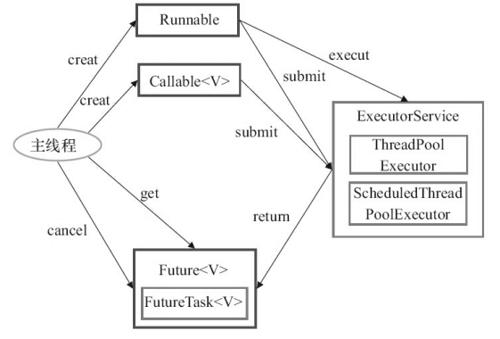
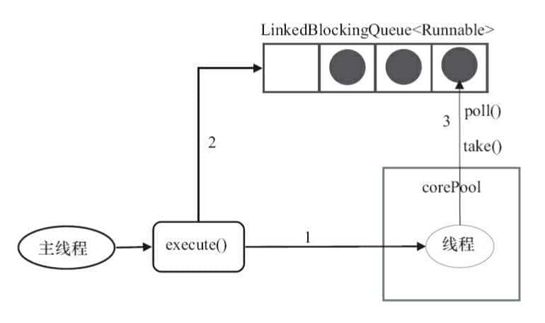

<!-- markdownlint-disable MD024 -->

Kỹ thuật Pooling (tập hợp tài nguyên) chắc hẳn mọi người đã không còn xa lạ, ThreadPool, Database Connection Pool, HTTP Connection Pool... đều là ứng dụng của tư tưởng này. Tư tưởng của kỹ thuật Pooling chủ yếu là để giảm bớt việc tiêu tốn tài nguyên mỗi lần lấy tài nguyên, nâng cao hiệu suất sử dụng tài nguyên.

Bài viết này tôi sẽ giới thiệu chi tiết khái niệm cơ bản cũng như nguyên lý cốt lõi của ThreadPool.

## Giới thiệu ThreadPool

Kỹ thuật Pooling chắc hẳn mọi người đã không còn xa lạ, ThreadPool, Database Connection Pool, HTTP Connection Pool... đều là ứng dụng của tư tưởng này. Tư tưởng của kỹ thuật Pooling chủ yếu là để giảm bớt việc tiêu tốn tài nguyên mỗi lần lấy tài nguyên, nâng cao hiệu suất sử dụng tài nguyên.

ThreadPool cung cấp một cách thức hạn chế và quản lý tài nguyên (bao gồm cả việc thực thi một nhiệm vụ). Mỗi ThreadPool còn bảo trì một số thông tin thống kê cơ bản, ví dụ số lượng nhiệm vụ đã hoàn thành. Sử dụng ThreadPool mang lại các lợi ích chính sau:

1. **Giảm tiêu thụ tài nguyên**: Các luồng trong ThreadPool có thể tái sử dụng. Một khi luồng hoàn thành nhiệm vụ nào đó, nó không tiêu hủy ngay mà quay về pool chờ nhiệm vụ tiếp theo. Điều này tránh việc tạo và tiêu hủy luồng liên tục mang lại chi phí lớn.
2. **Tăng tốc độ phản hồi**: Vì trong ThreadPool thường bảo trì một số lượng luồng cốt lõi nhất định (hoặc gọi là "công nhân thường trực"), khi nhiệm vụ đến, có thể giao trực tiếp cho các luồng đã rảnh rỗi tồn tại này thực thi, tiết kiệm thời gian tạo luồng, giúp nhiệm vụ được xử lý nhanh hơn.
3. **Tăng tính quản lý của luồng**: ThreadPool cho phép chúng ta quản lý tập trung các luồng trong pool. Chúng ta có thể cấu hình kích thước ThreadPool (số luồng cốt lõi, số luồng tối đa), loại và kích thước hàng đợi nhiệm vụ, chiến lược từ chối... Từ đó kiểm soát tổng số luồng concurrency, phòng ngừa kiệt quệ tài nguyên, đảm bảo tính ổn định của hệ thống. Đồng thời ThreadPool thường cung cấp các interface giám sát, thuận tiện cho chúng ta nắm được trạng thái vận hành (như có bao nhiêu luồng đang hoạt động, bao nhiêu nhiệm vụ đang xếp hàng...), thuận tiện cho việc tuning (điều chỉnh).

## Giới thiệu Framework Executor

Framework `Executor` được đưa vào từ Java 5, sau Java 5, việc khởi động luồng qua `Executor` tốt hơn dùng phương thức `start` của `Thread`, ngoài việc dễ quản lý hơn, hiệu suất tốt hơn (dùng ThreadPool triển khai, tiết kiệm chi phí), còn có một điểm mấu chốt: Giúp tránh được vấn đề "this escape" (rò rỉ this).

> "this escape" chỉ việc trước khi constructor trả về, các luồng khác đã nắm giữ tham chiếu đối tượng đó, việc gọi phương thức của đối tượng chưa khởi tạo hoàn chỉnh có thể gây ra các lỗi khó hiểu.

Framework `Executor` không chỉ bao gồm việc quản lý ThreadPool, mà còn cung cấp ThreadFactory, hàng đợi cũng như chiến lược từ chối..., Framework `Executor` giúp cho lập trình concurrency trở nên đơn giản hơn.

Cấu trúc Framework `Executor` chủ yếu do 3 thành phần lớn cấu thành:

**1. Nhiệm vụ (`Runnable` / `Callable`)**

Thực thi nhiệm vụ cần triển khai **interface `Runnable`** hoặc **interface `Callable`**. Các lớp triển khai **interface `Runnable`** hoặc **interface `Callable`** đều có thể được thực thi bởi **`ThreadPoolExecutor`** hoặc **`ScheduledThreadPoolExecutor`**.

**2. Thực thi nhiệm vụ (`Executor`)**

Như hình dưới đây, bao gồm interface cốt lõi của cơ chế thực thi nhiệm vụ **`Executor`**, cũng như **interface `ExecutorService`** kế thừa từ interface `Executor`. Hai lớp then chốt **`ThreadPoolExecutor`** và **`ScheduledThreadPoolExecutor`** đã triển khai **interface `ExecutorService`**.


Ở đây đã nêu ra rất nhiều mối quan hệ lớp bên dưới, nhưng thực tế chúng ta cần chú ý nhiều hơn đến lớp `ThreadPoolExecutor`, lớp này trong quá trình sử dụng thực tế ThreadPool có tần suất dùng rất cao.

**Lưu ý:** Thông qua việc xem mã nguồn `ScheduledThreadPoolExecutor` chúng ta phát hiện `ScheduledThreadPoolExecutor` thực chất kế thừa `ThreadPoolExecutor` và triển khai `ScheduledExecutorService`, mà `ScheduledExecutorService` lại triển khai `ExecutorService`, đúng như sơ đồ mối quan hệ lớp ở trên thể hiện.

Mô tả lớp `ThreadPoolExecutor`:

```java
//AbstractExecutorService triển khai interface ExecutorService
public class ThreadPoolExecutor extends AbstractExecutorService
```

Mô tả lớp `ScheduledThreadPoolExecutor`:

```java
//ScheduledExecutorService kế thừa interface ExecutorService
public class ScheduledThreadPoolExecutor
        extends ThreadPoolExecutor
        implements ScheduledExecutorService
```

**3. Kết quả tính toán bất đồng bộ (`Future`)**

Interface **`Future`** cũng như lớp triển khai **`FutureTask`** của interface `Future` đều có thể đại diện cho kết quả tính toán bất đồng bộ.

Khi chúng ta submit các lớp triển khai **interface `Runnable`** hoặc **interface `Callable`** cho **`ThreadPoolExecutor`** hoặc **`ScheduledThreadPoolExecutor`** thực thi, việc gọi `submit()` sẽ trả về một đối tượng triển khai interface `Future`. Triển khai cụ thể không nhất thiết là `FutureTask`, ví dụ Scheduled ThreadPool sẽ trả về triển khai `RunnableScheduledFuture` tương ứng.

**Sơ đồ minh họa cách sử dụng Framework `Executor`**:



1. Luồng chính trước tiên tạo đối tượng nhiệm vụ triển khai interface `Runnable` hoặc `Callable`.
2. Trực tiếp giao đối tượng triển khai `Runnable`/`Callable` đã tạo cho `ExecutorService` thực thi: `ExecutorService.execute(Runnable command)` hoặc cũng có thể submit đối tượng `Runnable` hoặc `Callable` cho `ExecutorService` thực thi (`ExecutorService.submit(Runnable task)` hoặc `ExecutorService.submit(Callable <T> task)`).
3. Nếu thực thi `ExecutorService.submit(...)`, `ExecutorService` sẽ trả về đối tượng triển khai interface `Future`. Do `FutureTask` đồng thời triển khai `Runnable` và `Future`, chúng ta cũng có thể tự tạo `FutureTask`, rồi trực tiếp giao cho `ExecutorService` thực thi.
4. Cuối cùng, luồng chính có thể thực thi phương thức `Future.get()` để chờ nhiệm vụ thực thi hoàn thành, cũng có thể thực thi `Future.cancel(boolean mayInterruptIfRunning)` để thử hủy nhiệm vụ.

## Giới thiệu lớp ThreadPoolExecutor (Quan trọng)

Lớp triển khai ThreadPool `ThreadPoolExecutor` là lớp cốt lõi nhất trong Framework `Executor`.

### Phân tích tham số ThreadPool

Bốn constructor được cung cấp trong lớp `ThreadPoolExecutor`. Chúng ta hãy xem cái dài nhất, ba cái còn lại đều được tạo ra dựa trên constructor này (nói trắng ra các constructor khác đều là các constructor cho trước một số tham số mặc định ví dụ mặc định quy định chiến lược từ chối là gì).

```java
    /**
     * Tạo một ThreadPoolExecutor mới với các tham số khởi tạo đã cho.
     */
    public ThreadPoolExecutor(int corePoolSize,// Số luồng cốt lõi của ThreadPool
                              int maximumPoolSize,// Số luồng tối đa của ThreadPool
                              long keepAliveTime,// Khi số luồng lớn hơn số luồng cốt lõi, thời gian sống tối đa của luồng rảnh rỗi dư thừa
                              TimeUnit unit,// Đơn vị thời gian
                              BlockingQueue<Runnable> workQueue,// Hàng đợi nhiệm vụ, dùng để lưu trữ các nhiệm vụ chờ thực thi
                              ThreadFactory threadFactory,// Factory tạo luồng, dùng để tạo luồng, thường để mặc định
                              RejectedExecutionHandler handler// Chiến lược từ chối, khi nhiệm vụ submit quá nhiều không xử lý kịp, chúng ta có thể tùy chỉnh chiến lược để xử lý
                               ) {
        if (corePoolSize < 0 ||
            maximumPoolSize <= 0 ||
            maximumPoolSize < corePoolSize ||
            keepAliveTime < 0)
            throw new IllegalArgumentException();
        if (workQueue == null || threadFactory == null || handler == null)
            throw new NullPointerException();
        this.corePoolSize = corePoolSize;
        this.maximumPoolSize = maximumPoolSize;
        this.workQueue = workQueue;
        this.keepAliveTime = unit.toNanos(keepAliveTime);
        this.threadFactory = threadFactory;
        this.handler = handler;
    }
```

Các tham số dưới đây vô cùng quan trọng, chắc chắn bạn sẽ dùng tới trong quá trình sử dụng ThreadPool về sau! Vì vậy, nhất định phải nhớ kỹ.

3 tham số quan trọng nhất của `ThreadPoolExecutor`:

- `corePoolSize`: Số lượng worker thread mà ThreadPool ưu tiên duy trì. Mặc định các luồng tạo theo nhu cầu; khi số worker thread đạt giá trị này, nhiệm vụ mới thường sẽ đi vào hàng đợi trước.
- `maximumPoolSize`: Khi các nhiệm vụ lưu trong hàng đợi đạt dung lượng hàng đợi, số luồng có thể đồng thời chạy hiện tại sẽ chuyển thành số luồng tối đa.
- `workQueue`: Khi nhiệm vụ mới đến sẽ kiểm tra xem số luồng đang chạy hiện tại có đạt số luồng cốt lõi không, nếu đạt thì nhiệm vụ mới sẽ được lưu trong hàng đợi.

Các tham số thường gặp khác của `ThreadPoolExecutor`:

- `keepAliveTime`: Khi số lượng luồng trong ThreadPool lớn hơn `corePoolSize`, nếu lúc này không có nhiệm vụ mới submit, các luồng ngoài luồng cốt lõi sẽ không bị thu hồi ngay, mà sẽ chờ đợi, cho đến khi thời gian chờ vượt quá `keepAliveTime` mới bị thu hồi tiêu hủy.
- `unit`: Đơn vị thời gian của tham số `keepAliveTime`.
- `threadFactory`: Đã dùng khi executor tạo luồng mới.
- `handler`: Chiến lược từ chối (sau đây sẽ giới thiệu chi tiết riêng).

Bức hình dưới đây có thể giúp bạn khắc sâu hiểu biết về mối quan hệ giữa các tham số trong ThreadPool (Nguồn hình: 《Thực chiến tối ưu hiệu năng Java》):


### Trạng thái lifecycle của ThreadPool

`ThreadPoolExecutor` sử dụng biến `ctl` (kiểu `AtomicInteger`) để đồng thời quản lý trạng thái chạy của ThreadPool và số lượng worker thread. ThreadPool có tổng cộng 5 trạng thái:

- **Đang chạy (`RUNNING`)**: Chấp nhận nhiệm vụ mới, và xử lý các nhiệm vụ trong hàng đợi. Trạng thái ban đầu sau khi tạo ThreadPool.
- **Đóng (`SHUTDOWN`)**: Không chấp nhận nhiệm vụ mới nữa, nhưng tiếp tục xử lý các nhiệm vụ đã có trong hàng đợi. Vào trạng thái này sau khi gọi `shutdown()`.
- **Dừng (`STOP`)**: Không chấp nhận nhiệm vụ mới, không xử lý nhiệm vụ trong hàng đợi, và thử ngắt các nhiệm vụ đang thực thi. Vào trạng thái này sau khi gọi `shutdownNow()`.
- **Thu dọn (`TIDYING`)**: Tất cả nhiệm vụ đã chấm dứt, số worker thread bằng 0, sắp sửa thực thi hook method `terminated()`.
- **Đã chấm dứt (`TERMINATED`)**: Phương thức `terminated()` thực thi xong, ThreadPool kết thúc hoàn toàn.

Trạng thái chỉ có thể luân chuyển một chiều: Đang chạy (`RUNNING`) → Đóng (`SHUTDOWN`) → Thu dọn (`TIDYING`) → Đã chấm dứt (`TERMINATED`), hoặc Đang chạy (`RUNNING`) → Dừng (`STOP`) → Thu dọn (`TIDYING`) → Đã chấm dứt (`TERMINATED`). Trong trạng thái Đóng (`SHUTDOWN`) nếu gọi lại `shutdownNow()` cũng sẽ chuyển thành Dừng (`STOP`).

`shutdown()` là "đóng êm" — ngắt các luồng rảnh rỗi, nhưng các nhiệm vụ trong hàng đợi vẫn sẽ thực thi xong. `shutdownNow()` là "đóng cưỡng chế" — thử ngắt tất cả các luồng đang chạy, và trả về danh sách các nhiệm vụ chưa thực thi trong hàng đợi dưới dạng `List<Runnable>`. `terminated()` là một hook method rỗng, có thể kế thừa `ThreadPoolExecutor` để rewrite nó, dùng cho việc dọn dẹp sau khi ThreadPool chấm dứt.

### Cơ chế Worker thread

`ThreadPoolExecutor` đóng gói mỗi luồng làm việc thành một inner class `Worker`. `Worker` kế thừa AQS và triển khai interface `Runnable`.

**Tại sao `Worker` phải kế thừa AQS?** `Worker` triển khai một **khóa độc chiếm không thể reentrant**, dùng để phối hợp với `shutdown()` phân biệt xem luồng đang rảnh rỗi hay đang làm việc — Worker đang thực thi nhiệm vụ sẽ giữ khóa, `shutdown()` thử `tryLock()` đối với mỗi Worker, thất bại chứng tỏ luồng đó đang làm việc, sẽ không bị ngắt.

**Lifecycle của Worker:**

1. **Tạo**: `execute()` phán đoán cần tạo luồng mới sẽ gọi `addWorker()` tạo thể hiện `Worker`, bên trong tạo luồng qua `ThreadFactory`.
2. **Chạy**: Sau khi luồng khởi động sẽ đi vào vòng lặp `while` của `runWorker()`, thông qua `getTask()` liên tục lấy nhiệm vụ từ hàng đợi để thực thi. Worker không bị đánh dấu vĩnh viễn là "cốt lõi" hay "phi cốt lõi"; khi cho phép luồng cốt lõi timeout, hoặc số worker thread hiện tại lớn hơn `corePoolSize`, `getTask()` mới dùng `workQueue.poll(keepAliveTime, unit)` có timeout, ngược lại dùng `workQueue.take()` chặn chờ đợi.
3. **Thoát**: Khi `getTask()` trả về `null`, Worker thoát khỏi vòng lặp và dọn dẹp. Các trường hợp trả về `null` bao gồm: ThreadPool ở trạng thái Dừng (`STOP`), ThreadPool ở trạng thái Đóng (`SHUTDOWN`) và hàng đợi rỗng, luồng phi cốt lõi chờ timeout, hoặc thu nhỏ `maximumPoolSize` lúc runtime. Nếu sau khi thoát số worker thread thấp hơn số cốt lõi, sẽ tự động bổ sung một luồng mới.

**Định nghĩa chiến lược từ chối của `ThreadPoolExecutor`:**

Khi ThreadPool đã đóng, hoặc số worker thread hiện tại đạt giới hạn tối đa và hàng đợi cũng không thể tiếp nhận nhiệm vụ mới, `ThreadPoolExecutor` sẽ gọi chiến lược từ chối:

- `ThreadPoolExecutor.AbortPolicy`: Ném ra `RejectedExecutionException` để từ chối xử lý nhiệm vụ mới.
- `ThreadPoolExecutor.CallerRunsPolicy`: Gọi luồng của chính người thực thi để chạy nhiệm vụ, tức là trực tiếp chạy (`run`) nhiệm vụ bị từ chối trong luồng đã gọi phương thức `execute`, nếu chương trình thực thi đã bị đóng thì sẽ bỏ qua nhiệm vụ đó. Do đó chiến lược này sẽ làm giảm tốc độ submit nhiệm vụ mới, ảnh hưởng đến hiệu năng tổng thể của chương trình. Nếu ứng dụng của bạn chịu được độ trễ này và bạn yêu cầu bất kỳ một yêu cầu nhiệm vụ nào cũng phải được thực thi, bạn có thể chọn chiến lược này.
- `ThreadPoolExecutor.DiscardPolicy`: Không xử lý nhiệm vụ mới, trực tiếp bỏ qua.
- `ThreadPoolExecutor.DiscardOldestPolicy`: Chiến lược này sẽ bỏ qua yêu cầu nhiệm vụ chưa xử lý sớm nhất.

Ví dụ:

Lấy một ví dụ: Spring thông qua `ThreadPoolTaskExecutor` hoặc chúng ta trực tiếp thông qua constructor của `ThreadPoolExecutor` tạo ThreadPool, khi chúng ta không chỉ định `RejectedExecutionHandler` để cấu hình ThreadPool, mặc định sử dụng `AbortPolicy`. Trong chiến lược từ chối này, nếu hàng đợi đầy, `ThreadPoolExecutor` sẽ ném ra ngoại lệ `RejectedExecutionException` để từ chối nhiệm vụ mới đến, điều này đại diện cho việc bạn sẽ mất việc xử lý đối với nhiệm vụ đó. Khi ThreadPool vẫn ở trạng thái running, `CallerRunsPolicy` sẽ giao nhiệm vụ bị từ chối cho luồng caller thực thi; khi ThreadPool đã đóng, chiến lược này sẽ trực tiếp bỏ rơi nhiệm vụ.

```java
public static class CallerRunsPolicy implements RejectedExecutionHandler {

        public CallerRunsPolicy() { }

        public void rejectedExecution(Runnable r, ThreadPoolExecutor e) {
            if (!e.isShutdown()) {
                // Trực tiếp luồng chính thực thi, chứ không phải luồng trong ThreadPool thực thi
                r.run();
            }
        }
    }
```

### Kịch bản ứng dụng thực tế của 4 chiến lược từ chối

Phía trên đã giới thiệu hành vi cơ bản của 4 chiến lược từ chối tích hợp sẵn, dưới đây kết hợp với kinh nghiệm sản xuất thực tế, giải thích chúng phù hợp với kịch bản nào:

**`AbortPolicy`**: Phù hợp với các nghiệp vụ cốt lõi không chấp nhận mất mát nhiệm vụ (như thanh toán, chuyển khoản). Khi nhiệm vụ bị từ chối, phía gọi sẽ nhận được `RejectedExecutionException`, bắt buộc phải bắt trong code nghiệp vụ và làm bù (như thử lại hoặc lưu bền vững vào database rồi bù đắp thực thi sau). 《Cẩm nang phát triển Java Alibaba》 chỉ ra rằng nếu không làm bất kỳ cấu hình nào, hàng đợi đầy sẽ trực tiếp ném ngoại lệ, nhà phát triển bắt buộc phải xử lý hiển thị.

**`CallerRunsPolicy`**: Phù hợp với kịch bản không cho phép bỏ rơi nhiệm vụ, và cho phép giảm tốc độ submit. Do nhiệm vụ thực thi trong luồng của caller, caller trong thời gian này không thể submit nhiệm vụ mới, tạo thành một cơ chế **ngược áp (back-pressure)** tự nhiên. Đội ngũ kỹ thuật Meituan trong bài viết 《Nguyên lý triển khai ThreadPool trong Java và thực tiễn trong nghiệp vụ Meituan》 có đề cập, đây là chiến lược từ chối họ thường dùng trong các nghiệp vụ online. Nhưng cần lưu ý: Nếu luồng submit nhiệm vụ là luồng xử lý request của Web container (như Worker thread của Tomcat), sẽ làm cho response time của request đó tăng lên rõ rệt, trong kịch bản nhạy cảm với độ trễ cần hết sức cẩn trọng.

**`DiscardPolicy`**: Phù hợp với các luồng không quan trọng cho phép mất nhiệm vụ, như ghi log bất đồng bộ, báo cáo chỉ số giám sát. Chiến lược này hoàn toàn im lặng (triển khai rỗng), nhiệm vụ bị từ chối sẽ không để lại bất kỳ dấu vết nào, khi troubleshoot có thể khó phát hiện ra việc mất nhiệm vụ.

**`DiscardOldestPolicy`**: Phù hợp với kịch bản chỉ quan tâm đến dữ liệu mới nhất, nhiệm vụ cũ có thể bị ghi đè, như push giá thị trường realtime, thu thập dữ liệu cảm biến. Cần lưu ý: Nếu sử dụng `PriorityBlockingQueue`, `poll()` bật ra lại là nhiệm vụ có độ ưu tiên cao nhất chứ không phải nhiệm vụ cũ nhất, có thể dẫn đến nhiệm vụ quan trọng bị bỏ rơi nhầm.

**Cách làm phổ biến trong môi trường sản xuất**: 4 chiến lược tích hợp sẵn ở trên thường không thể đáp ứng hoàn toàn nhu cầu. Framework Dubbo đã tùy chỉnh chiến lược `AbortPolicyWithReport`, ngoài việc ném ngoại lệ còn dump thông tin nhiệm vụ bị từ chối ra file local, thuận tiện cho việc troubleshooting sau đó. Đội ngũ kỹ thuật Meituan khuyến nghị tiến hành giám sát và cảnh báo số lần từ chối của ThreadPool. Các hướng tư tưởng chiến lược tùy chỉnh phổ biến bao gồm: Ghi nhiệm vụ bị từ chối vào database hoặc Message Queue để tiêu thụ bù đắp sau, tăng đếm chỉ số giám sát báo cáo Prometheus, hoặc gọi `workQueue.put(r)` chặn chờ hàng đợi có chỗ trống (trong Netty có triển khai tương tự).

### Hai cách tạo ThreadPool

Trong Java, tạo ThreadPool chủ yếu có 2 cách:

**Cách 1: Trực tiếp tạo qua constructor ThreadPoolExecutor (Khuyến nghị)**


"Thread factory mặc định" và "Chiến lược từ chối mặc định" trong hình chỉ việc khi constructor hiện tại không truyền vào tham số tương ứng, `ThreadPoolExecutor` sẽ sử dụng cách triển khai mặc định.

Đây là cách được khuyến nghị nhất, vì nó cho phép nhà phát triển chỉ định rõ ràng các tham số cốt lõi của ThreadPool, kiểm soát tinh tế hơn đối với hành vi vận hành của ThreadPool, từ đó tránh rủi ro kiệt quệ tài nguyên.

**Cách 2: Tạo qua utility class Executors (Không khuyến nghị dùng cho sản xuất)**

Các phương thức tạo ThreadPool do utility class `Executors` cung cấp như hình dưới đây:


Có thể thấy, thông qua utility class `Executors` có thể tạo nhiều loại ThreadPool khác nhau, bao gồm:

- `FixedThreadPool`: Trong vận hành bình thường sử dụng tối đa số lượng worker thread cố định. Luồng có thể bị thay thế sau khi chấm dứt do ngoại lệ, khi đóng ThreadPool cũng sẽ thoát, do đó số lượng không phải tuyệt đối không đổi trong suốt lifecycle. Khi có nhiệm vụ mới submit, nếu trong ThreadPool có luồng rảnh rỗi thì thực thi ngay. Nếu không có, nhiệm vụ mới sẽ được lưu tạm vào hàng đợi nhiệm vụ, chờ luồng rảnh rỗi xử lý.
- `SingleThreadExecutor`: ThreadPool chỉ có duy nhất một luồng. Nếu có nhiều hơn một nhiệm vụ submit vào ThreadPool này, các nhiệm vụ sẽ được lưu trong hàng đợi nhiệm vụ, chờ luồng rảnh rỗi thực thi lần lượt theo thứ tự FIFO.
- `CachedThreadPool`: ThreadPool có thể điều chỉnh số luồng theo tình hình thực tế. Số luồng của ThreadPool không cố định, nhưng nếu có luồng rảnh rỗi tái sử dụng được sẽ ưu tiên dùng luồng tái sử dụng. Nếu tất cả luồng đều đang làm việc mà lại có nhiệm vụ mới submit, sẽ tạo luồng mới xử lý nhiệm vụ. Tất cả các luồng sau khi hoàn thành nhiệm vụ hiện tại sẽ quay về ThreadPool để tái sử dụng.
- `ScheduledThreadPool`: ThreadPool chạy nhiệm vụ sau một khoảng delay chỉ định hoặc thực thi định kỳ.

《Cẩm nang phát triển Java Alibaba》 bắt buộc ThreadPool không cho phép dùng `Executors` để tạo, mà phải thông qua cách constructor `ThreadPoolExecutor`, cách xử lý này giúp người viết hiểu rõ hơn quy tắc vận hành của ThreadPool, tránh rủi ro kiệt quệ tài nguyên.

Nhược điểm của các đối tượng ThreadPool do `Executors` trả về như sau (sau đây sẽ giới thiệu chi tiết):

- `FixedThreadPool` và `SingleThreadExecutor`: Sử dụng hàng đợi chặn `LinkedBlockingQueue`, chiều dài tối đa của hàng đợi nhiệm vụ là `Integer.MAX_VALUE`, có thể coi là vô hạn, có thể tích tụ lượng lớn yêu cầu dẫn đến OOM.
- `CachedThreadPool`: Sử dụng hàng đợi đồng bộ `SynchronousQueue`, số lượng luồng tối đa cho phép tạo là `Integer.MAX_VALUE`, nếu số lượng nhiệm vụ quá nhiều mà tốc độ thực thi chậm, có thể tạo số lượng lớn luồng dẫn đến OOM.
- `ScheduledThreadPool` và `SingleThreadScheduledExecutor`: Sử dụng hàng đợi chặn trì hoãn vô hạn `DelayedWorkQueue`, chiều dài tối đa của hàng đợi nhiệm vụ là `Integer.MAX_VALUE`, có thể tích tụ lượng lớn yêu cầu dẫn đến OOM.

```java
public static ExecutorService newFixedThreadPool(int nThreads) {
    // LinkedBlockingQueue chiều dài mặc định là Integer.MAX_VALUE, có thể xem là vô hạn
    return new ThreadPoolExecutor(nThreads, nThreads,0L, TimeUnit.MILLISECONDS,new LinkedBlockingQueue<Runnable>());

}

public static ExecutorService newSingleThreadExecutor() {
    // LinkedBlockingQueue chiều dài mặc định là Integer.MAX_VALUE, có thể xem là vô hạn
    return new FinalizableDelegatedExecutorService (new ThreadPoolExecutor(1, 1,0L, TimeUnit.MILLISECONDS,new LinkedBlockingQueue<Runnable>()));

}

// Hàng đợi đồng bộ SynchronousQueue không có dung lượng, số luồng tối đa là Integer.MAX_VALUE
public static ExecutorService newCachedThreadPool() {

    return new ThreadPoolExecutor(0, Integer.MAX_VALUE,60L, TimeUnit.SECONDS,new SynchronousQueue<Runnable>());

}

// DelayedWorkQueue (hàng đợi chặn trì hoãn)
public static ScheduledExecutorService newScheduledThreadPool(int corePoolSize) {
    return new ScheduledThreadPoolExecutor(corePoolSize);
}
public ScheduledThreadPoolExecutor(int corePoolSize) {
    super(corePoolSize, Integer.MAX_VALUE, 0, NANOSECONDS,
          new DelayedWorkQueue());
}
```

### Tóm tắt các hàng đợi chặn thường dùng của ThreadPool

Khi nhiệm vụ mới đến sẽ kiểm tra xem số luồng đang chạy hiện tại có đạt số luồng cốt lõi không, nếu đạt thì nhiệm vụ mới sẽ được lưu trong hàng đợi.

Các ThreadPool khác nhau sẽ chọn các hàng đợi chặn khác nhau, chúng ta có thể kết hợp với các ThreadPool tích hợp sẵn để phân tích.

- `LinkedBlockingQueue` dung lượng `Integer.MAX_VALUE` (hàng đợi vô hạn): `FixedThreadPool` và `SingleThreadExecutor`. `FixedThreadPool` tối đa chỉ có thể tạo số luồng bằng số luồng cốt lõi (số luồng cốt lõi và số luồng tối đa bằng nhau), `SingleThreadExecutor` chỉ có thể tạo 1 luồng (số luồng cốt lõi và số luồng tối đa đều là 1), hàng đợi nhiệm vụ của cả hai trong sử dụng thực tế hầu như không bị lấp đầy.
- `SynchronousQueue` (hàng đợi đồng bộ): `CachedThreadPool`. `SynchronousQueue` không có dung lượng, không lưu trữ phần tử, mục đích là đảm bảo đối với các nhiệm vụ submit, nếu có luồng rảnh rỗi thì dùng luồng rảnh rỗi xử lý; ngược lại tạo một luồng mới xử lý nhiệm vụ. Nghĩa là số luồng tối đa của `CachedThreadPool` là `Integer.MAX_VALUE`, có thể hiểu số luồng có thể mở rộng vô hạn, có thể tạo lượng lớn luồng dẫn đến OOM.
- `DelayedWorkQueue` (hàng đợi chặn trì hoãn): `ScheduledThreadPool` và `SingleThreadScheduledExecutor`. Các phần tử bên trong `DelayedWorkQueue` không được sắp xếp theo thời gian đưa vào, mà sắp xếp theo độ dài thời gian trì hoãn của nhiệm vụ, bên trong sử dụng cấu trúc dữ liệu "Heap" (đống), có thể đảm bảo mỗi lần lấy ra nhiệm vụ đều là nhiệm vụ có thời gian thực thi sớm nhất trong hàng đợi hiện tại. `DelayedWorkQueue` sau khi thêm phần tử bị đầy sẽ tự động mở rộng thêm 1/2 dung lượng cũ, tức là không bao giờ bị chặn, mở rộng tối đa lên tới `Integer.MAX_VALUE`, nên tối đa chỉ tạo số luồng bằng số luồng cốt lõi.

## Phân tích nguyên lý ThreadPool (Quan trọng)

Chúng ta ở trên đã giải thích về Framework `Executor` cũng như lớp `ThreadPoolExecutor`, dưới đây hãy thực chiến một chút, thông qua viết một Demo nhỏ của `ThreadPoolExecutor` để điểm lại nội dung trên.

### Code ví dụ ThreadPool

Trước tiên tạo một lớp triển khai interface `Runnable` (tất nhiên cũng có thể là interface `Callable`, chúng ta sẽ giới thiệu điểm khác nhau của cả hai ở phần sau.)

`MyRunnable.java`

```java
import java.util.Date;

/**
 * Đây là một lớp Runnable đơn giản, cần khoảng 5 giây để thực thi nhiệm vụ.
 * @author shuang.kou
 */
public class MyRunnable implements Runnable {

    private String command;

    public MyRunnable(String s) {
        this.command = s;
    }

    @Override
    public void run() {
        System.out.println(Thread.currentThread().getName() + " Start. Time = " + new Date());
        processCommand();
        System.out.println(Thread.currentThread().getName() + " End. Time = " + new Date());
    }

    private void processCommand() {
        try {
            Thread.sleep(5000);
        } catch (InterruptedException e) {
            e.printStackTrace();
        }
    }

    @Override
    public String toString() {
        return this.command;
    }
}
```

Viết chương trình test, ở đây chúng ta lấy cách tạo ThreadPool tùy chỉnh tham số qua constructor `ThreadPoolExecutor` mà Alibaba khuyến nghị.

`ThreadPoolExecutorDemo.java`

```java
import java.util.concurrent.ArrayBlockingQueue;
import java.util.concurrent.ThreadPoolExecutor;
import java.util.concurrent.TimeUnit;

public class ThreadPoolExecutorDemo {

    private static final int CORE_POOL_SIZE = 5;
    private static final int MAX_POOL_SIZE = 10;
    private static final int QUEUE_CAPACITY = 100;
    private static final Long KEEP_ALIVE_TIME = 1L;
    public static void main(String[] args) {

        // Dùng cách tạo ThreadPool được Alibaba khuyến nghị
        // Tạo tùy chỉnh tham số qua constructor ThreadPoolExecutor
        ThreadPoolExecutor executor = new ThreadPoolExecutor(
                CORE_POOL_SIZE,
                MAX_POOL_SIZE,
                KEEP_ALIVE_TIME,
                TimeUnit.SECONDS,
                new ArrayBlockingQueue<>(QUEUE_CAPACITY),
                new ThreadPoolExecutor.CallerRunsPolicy());

        for (int i = 0; i < 10; i++) {
            // Tạo đối tượng WorkerThread (Lớp WorkerThread triển khai interface Runnable)
            Runnable worker = new MyRunnable("" + i);
            // Thực thi Runnable
            executor.execute(worker);
        }
        // Chấm dứt ThreadPool
        executor.shutdown();
        while (!executor.isTerminated()) {
        }
        System.out.println("Finished all threads");
    }
}
```

Có thể thấy mã nguồn trên của chúng ta đã chỉ định:

- `corePoolSize`: Số luồng cốt lõi là 5.
- `maximumPoolSize`: Số luồng tối đa là 10
- `keepAliveTime`: Thời gian chờ là 1L.
- `unit`: Đơn vị thời gian chờ là TimeUnit.SECONDS.
- `workQueue`: Hàng đợi nhiệm vụ là `ArrayBlockingQueue`, và dung lượng là 100;
- `handler`: Chiến lược từ chối là `CallerRunsPolicy`.

**Kết quả output**:

```plain
pool-1-thread-3 Start. Time = Sun Apr 12 11:14:37 CST 2020
pool-1-thread-5 Start. Time = Sun Apr 12 11:14:37 CST 2020
pool-1-thread-2 Start. Time = Sun Apr 12 11:14:37 CST 2020
pool-1-thread-1 Start. Time = Sun Apr 12 11:14:37 CST 2020
pool-1-thread-4 Start. Time = Sun Apr 12 11:14:37 CST 2020
pool-1-thread-3 End. Time = Sun Apr 12 11:14:42 CST 2020
pool-1-thread-4 End. Time = Sun Apr 12 11:14:42 CST 2020
pool-1-thread-1 End. Time = Sun Apr 12 11:14:42 CST 2020
pool-1-thread-5 End. Time = Sun Apr 12 11:14:42 CST 2020
pool-1-thread-1 Start. Time = Sun Apr 12 11:14:42 CST 2020
pool-1-thread-2 End. Time = Sun Apr 12 11:14:42 CST 2020
pool-1-thread-5 Start. Time = Sun Apr 12 11:14:42 CST 2020
pool-1-thread-4 Start. Time = Sun Apr 12 11:14:42 CST 2020
pool-1-thread-3 Start. Time = Sun Apr 12 11:14:42 CST 2020
pool-1-thread-2 Start. Time = Sun Apr 12 11:14:42 CST 2020
pool-1-thread-1 End. Time = Sun Apr 12 11:14:47 CST 2020
pool-1-thread-4 End. Time = Sun Apr 12 11:14:47 CST 2020
pool-1-thread-5 End. Time = Sun Apr 12 11:14:47 CST 2020
pool-1-thread-3 End. Time = Sun Apr 12 11:14:47 CST 2020
pool-1-thread-2 End. Time = Sun Apr 12 11:14:47 CST 2020
Finished all threads  // Nhiệm vụ chạy xong hết mới nhảy ra, vì executor.isTerminated() đánh giá là true mới nhảy khỏi vòng lặp while, khi và chỉ khi gọi phương thức shutdown() và tất cả nhiệm vụ đã submit hoàn thành mới trả về true
```

### Phân tích nguyên lý ThreadPool

Chúng ta thông qua kết quả output code phía trước có thể thấy: **ThreadPool trước tiên sẽ thực thi 5 nhiệm vụ, sau đó nếu các nhiệm vụ này có nhiệm vụ thực thi xong thì sẽ đi lấy nhiệm vụ mới để thực thi.** Mọi người có thể thông qua nội dung đã giải thích ở trên, phân tích xem rốt cuộc là thế nào? (Tự độc lập suy nghĩ một chút)

Bây giờ, chúng ta phân tích nội dung output ở trên để phân tích đơn giản về nguyên lý ThreadPool.

Để hiểu nguyên lý ThreadPool, trước tiên chúng ta cần phân tích phương thức `execute`. Trong code ví dụ, chúng ta dùng `executor.execute(worker)` để submit một nhiệm vụ vào ThreadPool.

Phương thức này rất quan trọng, dưới đây chúng ta hãy xem mã nguồn của nó:

```java
   // Lưu trữ trạng thái chạy của ThreadPool (runState) và số luồng có hiệu lực trong ThreadPool (workerCount)
   private final AtomicInteger ctl = new AtomicInteger(ctlOf(RUNNING, 0));

    private static int workerCountOf(int c) {
        return c & CAPACITY;
    }
    // Hàng đợi nhiệm vụ
    private final BlockingQueue<Runnable> workQueue;

    public void execute(Runnable command) {
        // Nếu nhiệm vụ là null, ném ra ngoại lệ.
        if (command == null)
            throw new NullPointerException();
        // ctl lưu trữ một số thông tin trạng thái hiện tại của ThreadPool
        int c = ctl.get();

        // Dưới đây liên quan đến 3 bước thao tác
        // 1. Trước tiên phán đoán tổng số worker thread trong ThreadPool hiện tại có nhỏ hơn corePoolSize không
        // Nếu nhỏ hơn, thông qua addWorker(command, true) tạo một luồng mới, và thêm nhiệm vụ (command) vào luồng đó; sau đó khởi động luồng đó để thực thi nhiệm vụ.
        if (workerCountOf(c) < corePoolSize) {
            if (addWorker(command, true))
                return;
            c = ctl.get();
        }
        // 2. Nếu tổng số worker thread hiện tại lớn hơn hoặc bằng corePoolSize thì sẽ đi tới đây, thể hiện không đi theo nhánh tạo luồng cốt lõi.
        // Thông qua phương thức isRunning phán đoán trạng thái ThreadPool, ThreadPool ở trạng thái RUNNING và hàng đợi có thể thêm nhiệm vụ, thì nhiệm vụ mới được thêm vào
        if (isRunning(c) && workQueue.offer(command)) {
            int recheck = ctl.get();
            // Lấy lại trạng thái ThreadPool, nếu trạng thái ThreadPool không phải RUNNING thì cần xóa nhiệm vụ khỏi hàng đợi nhiệm vụ, và thử phán đoán các luồng đã thực thi xong chưa. Đồng thời thực thi chiến lược từ chối.
            if (!isRunning(recheck) && remove(command))
                reject(command);
                // Nếu số worker thread hiện tại là 0, tạo mới một luồng và thực thi.
            else if (workerCountOf(recheck) == 0)
                addWorker(null, false);
        }
        //3. Thông qua addWorker(command, false) tạo mới một luồng, và thêm nhiệm vụ (command) vào luồng đó; sau đó, khởi động luồng đó để thực thi nhiệm vụ.
        // Truyền vào false đại diện cho việc khi thêm luồng phán đoán số luồng hiện tại có ít hơn maxPoolSize không
        // Nếu addWorker(command, false) thực thi thất bại, thì thông qua reject() thực thi nội dung chiến lược từ chối tương ứng.
        else if (!addWorker(command, false))
            reject(command);
    }
```

Ở đây phân tích đơn giản toàn bộ quy trình (đã đơn giản hóa toàn bộ logic để dễ hiểu):

1. Nếu tổng số worker thread hiện tại nhỏ hơn số luồng cốt lõi, thì sẽ tạo một luồng mới để thực thi nhiệm vụ.
2. Nếu tổng số worker thread hiện tại đã đạt số luồng cốt lõi, trước tiên thử đặt nhiệm vụ vào hàng đợi nhiệm vụ để chờ thực thi.
3. Nếu đưa nhiệm vụ vào hàng đợi nhiệm vụ thất bại (hàng đợi nhiệm vụ đã đầy), và tổng số worker thread hiện tại nhỏ hơn số luồng tối đa, thì tạo một luồng phi cốt lõi mới để thực thi nhiệm vụ.
4. Nếu tổng số worker thread hiện tại đã bằng số luồng tối đa, hàng đợi nhiệm vụ cũng không thể tiếp tục nhận nhiệm vụ, thì nhiệm vụ hiện tại sẽ bị từ chối, chiến lược từ chối sẽ gọi phương thức `RejectedExecutionHandler.rejectedExecution()`.

> **Bổ sung giải thích**: Nhiều người nhầm tưởng rằng luồng phi cốt lõi chỉ được tạo khi hàng đợi nhiệm vụ bị đầy, sau đó thì "rảnh rỗi" chờ tiêu hủy. Thực ra, luồng phi cốt lõi sau khi thực thi xong nhiệm vụ ban đầu, không bị tiêu hủy ngay, mà sẽ **chủ động kéo nhiệm vụ từ hàng đợi nhiệm vụ về thực thi** (thông qua phương thức `getTask()`). Cụ thể, luồng cốt lõi dùng `workQueue.take()` chặn chờ nhiệm vụ, còn luồng phi cốt lõi dùng `workQueue.poll(keepAliveTime, unit)` —— nếu trong thời gian sống lấy được nhiệm vụ từ hàng đợi thì tiếp tục thực thi; chỉ khi timeout không lấy được nhiệm vụ, luồng phi cốt lõi mới bị thu hồi. Điều này có nghĩa là, ngay cả khi nhiệm vụ mới được đưa vào hàng đợi, các luồng phi cốt lõi rảnh rỗi cũng sẽ tranh trước lấy nhiệm vụ từ hàng đợi về thực thi, chứ không phải chờ hàng đợi đầy mới phản ứng bị động.


Trong phương thức `execute`, gọi nhiều lần phương thức `addWorker`. Phương thức `addWorker` này chủ yếu dùng để tạo các worker thread mới, nếu trả về true chứng tỏ tạo và khởi động worker thread thành công, ngược lại trả về false.

```java
    // Khóa toàn cục, thao tác concurrency cần có
    private final ReentrantLock mainLock = new ReentrantLock();
    // Theo dõi dung lượng tối đa của ThreadPool, chỉ khi nắm giữ khóa toàn cục mainLock mới truy cập được tập hợp này
    private int largestPoolSize;
    // Tập hợp worker thread, lưu trữ tất cả các worker thread (hoạt động) trong ThreadPool, chỉ khi nắm giữ khóa toàn cục mainLock mới truy cập được tập hợp này
    private final HashSet<Worker> workers = new HashSet<>();
    // Lấy trạng thái ThreadPool
    private static int runStateOf(int c)     { return c & ~CAPACITY; }
    // Phán đoán trạng thái ThreadPool có phải Running không
    private static boolean isRunning(int c) {
        return c < SHUTDOWN;
    }


    /**
     * Thêm worker thread mới vào ThreadPool
     * @param firstTask Nhiệm vụ thực thi
     * @param core Tham số là true đại diện dùng dung lượng cơ bản của ThreadPool, false dùng dung lượng tối đa của ThreadPool
     * @return Thêm thành công trả về true ngược lại trả về false
     */
   private boolean addWorker(Runnable firstTask, boolean core) {
        retry:
        for (;;) {
            // Hai câu này dùng để lấy trạng thái của ThreadPool
            int c = ctl.get();
            int rs = runStateOf(c);

            // Check if queue empty only if necessary.
            if (rs >= SHUTDOWN &&
                ! (rs == SHUTDOWN &&
                   firstTask == null &&
                   ! workQueue.isEmpty()))
                return false;

            for (;;) {
               // Lấy số lượng luồng đang làm việc trong ThreadPool
                int wc = workerCountOf(c);
                // Tham số core là false thể hiện hàng đợi cũng đã đầy, kích thước ThreadPool chuyển thành maximumPoolSize
                if (wc >= CAPACITY ||
                    wc >= (core ? corePoolSize : maximumPoolSize))
                    return false;
               // Thao tác nguyên tử tăng số lượng workcount lên 1
                if (compareAndIncrementWorkerCount(c))
                    break retry;
                // Nếu trạng thái luồng thay đổi thì thực thi lại các thao tác trên
                c = ctl.get();
                if (runStateOf(c) != rs)
                    continue retry;
                // else CAS failed due to workerCount change; retry inner loop
            }
        }
        // Đánh dấu worker thread khởi động thành công không
        boolean workerStarted = false;
        // Đánh dấu worker thread tạo thành công không
        boolean workerAdded = false;
        Worker w = null;
        try {

            w = new Worker(firstTask);
            final Thread t = w.thread;
            if (t != null) {
              // Cài khóa
                final ReentrantLock mainLock = this.mainLock;
                mainLock.lock();
                try {
                   // Lấy trạng thái ThreadPool
                    int rs = runStateOf(ctl.get());
                   // rs < SHUTDOWN nếu trạng thái ThreadPool vẫn là RUNNING, và trạng thái luồng là còn sống, thì thêm worker thread vào tập hợp worker thread
                  // (rs=SHUTDOWN && firstTask == null) nếu trạng thái ThreadPool nhỏ hơn STOP, tức là trạng thái RUNNING hoặc SHUTDOWN, đồng thời thể hiện nhiệm vụ truyền vào firstTask là null, thì cần thêm vào tập hợp worker thread và khởi động Worker mới
                   // firstTask == null chứng tỏ chỉ tạo mới luồng chứ không thực thi nhiệm vụ
                    if (rs < SHUTDOWN ||
                        (rs == SHUTDOWN && firstTask == null)) {
                        if (t.isAlive()) // precheck that t is startable
                            throw new IllegalThreadStateException();
                        workers.add(w);
                       // Cập nhật dung lượng tối đa của worker thread hiện tại
                        int s = workers.size();
                        if (s > largestPoolSize)
                            largestPoolSize = s;
                      // Worker thread khởi động thành công chưa
                        workerAdded = true;
                    }
                } finally {
                    // Giải phóng khóa
                    mainLock.unlock();
                }
                //// Nếu thêm worker thread thành công, gọi phương thức Thread#start() của thể hiện luồng t bên trong Worker để khởi động thể hiện luồng thực sự
                if (workerAdded) {
                    t.start();
                  /// Đánh dấu luồng khởi động thành công
                    workerStarted = true;
                }
            }
        } finally {
           // Luồng khởi động thất bại, cần xóa Worker tương ứng khỏi worker thread
            if (! workerStarted)
                addWorkerFailed(w);
        }
        return workerStarted;
    }
```

Xem thêm về nội dung phân tích mã nguồn ThreadPool khuyến nghị bài viết này: Hàng khô cứng cáp: [4 vạn chữ từ mã nguồn phân tích nguyên lý triển khai JUC ThreadPool ThreadPoolExecutor](https://www.cnblogs.com/throwable/p/13574306.html).

Bây giờ, chúng ta quay lại code ví dụ, bây giờ có phải rất dễ dàng có thể hiểu được nguyên lý của nó rồi phải không?

Nếu chưa hiểu cũng không sao, có thể xem phân tích của tôi:

> Chúng ta trong code mô phỏng 10 nhiệm vụ, số luồng cốt lõi chúng ta cấu hình là 5, dung lượng hàng đợi chờ là 100, do đó mỗi lần chỉ có thể tồn tại 5 nhiệm vụ đồng thời thực thi, 5 nhiệm vụ còn lại sẽ được đặt vào hàng đợi chờ. Trong 5 nhiệm vụ hiện tại nếu có nhiệm vụ thực thi xong, ThreadPool sẽ đi lấy nhiệm vụ mới để thực thi.

### Một số so sánh thường gặp

#### `Runnable` vs `Callable`

`Runnable` đã tồn tại từ Java 1.0, nhưng `Callable` mới được đưa vào từ Java 1.5, mục đích chính là để xử lý các kịch bản sử dụng mà `Runnable` không hỗ trợ. Interface `Runnable` không trả về kết quả hoặc ném ra checked exception, nhưng interface `Callable` thì có thể. Vì vậy, nếu nhiệm vụ không cần trả về kết quả hoặc ném ra exception thì khuyến nghị dùng interface `Runnable`, như vậy code nhìn sẽ gọn gàng hơn.

Utility class `Executors` có thể triển khai việc chuyển đối tượng `Runnable` thành đối tượng `Callable`. (`Executors.callable(Runnable task)` hoặc `Executors.callable(Runnable task, Object result)`).

`Runnable.java`

```java
@FunctionalInterface
public interface Runnable {
   /**
    * Được luồng thực thi, không có giá trị trả về cũng không thể ném ngoại lệ
    */
    public abstract void run();
}
```

`Callable.java`

```java
@FunctionalInterface
public interface Callable<V> {
    /**
     * Tính toán kết quả, hoặc ném ngoại lệ khi không thể làm như vậy.
     * @return Kết quả tính toán được
     * @throws Nếu không thể tính toán kết quả thì ném ngoại lệ
     */
    V call() throws Exception;
}
```

#### `execute()` vs `submit()`

`execute()` và `submit()` là hai phương thức submit nhiệm vụ vào ThreadPool, có một số điểm khác biệt:

- **Giá trị trả về**: Phương thức `execute()` dùng để submit nhiệm vụ `Runnable` không cần giá trị trả về. `submit()` có thể submit nhiệm vụ `Runnable` hoặc `Callable`, và trả về một đối tượng `Future`. `Future.isDone()` chỉ có thể thể hiện nhiệm vụ đã kết thúc ở một trong các trạng thái hoàn thành bình thường, ngoại lệ hoặc hủy; gọi `get()` mới lấy được kết quả, hoặc biết được ngoại lệ do nhiệm vụ ném ra (`get(long timeout, TimeUnit unit)` khi chưa hoàn thành trước timeout sẽ ném ra `TimeoutException`).
- **Xử lý ngoại lệ**: Khi sử dụng phương thức `submit()`, có thể thông qua đối tượng `Future` để xử lý ngoại lệ ném ra trong quá trình thực thi nhiệm vụ; còn khi sử dụng phương thức `execute()`, xử lý ngoại lệ cần thông qua `ThreadFactory` tùy chỉnh (khi factory tạo luồng thiết lập đối tượng `UncaughtExceptionHandler` để xử lý ngoại lệ) hoặc phương thức `afterExecute()` của `ThreadPoolExecutor` để xử lý.

Ví dụ 1: Sử dụng phương thức `get()` để lấy giá trị trả về.

```java
// Ở đây chỉ để demo sử dụng, khuyến nghị dùng phương thức constructor `ThreadPoolExecutor` để tạo ThreadPool.
ExecutorService executorService = Executors.newFixedThreadPool(3);

Future<String> submit = executorService.submit(() -> {
    try {
        Thread.sleep(5000L);
    } catch (InterruptedException e) {
        e.printStackTrace();
    }
    return "abc";
});

String s = submit.get();
System.out.println(s);
executorService.shutdown();
```

Output:

```plain
abc
```

Ví dụ 2: Sử dụng phương thức `get(long timeout, TimeUnit unit)` để lấy giá trị trả về.

```java
ExecutorService executorService = Executors.newFixedThreadPool(3);

Future<String> submit = executorService.submit(() -> {
    try {
        Thread.sleep(5000L);
    } catch (InterruptedException e) {
        e.printStackTrace();
    }
    return "abc";
});

String s = submit.get(3, TimeUnit.SECONDS);
System.out.println(s);
executorService.shutdown();
```

Output:

```plain
Exception in thread "main" java.util.concurrent.TimeoutException
  at java.util.concurrent.FutureTask.get(FutureTask.java:205)
```

#### `shutdown()` VS `shutdownNow()`

- **`shutdown()`**: Đóng ThreadPool, trạng thái ThreadPool chuyển thành `SHUTDOWN`. ThreadPool không nhận nhiệm vụ mới nữa, nhưng các nhiệm vụ trong hàng đợi phải thực thi xong.
- **`shutdownNow()`**: Đóng ThreadPool, trạng thái ThreadPool chuyển thành `STOP`. ThreadPool sẽ thử ngắt các nhiệm vụ đang thực thi, dừng xử lý các nhiệm vụ xếp hàng và trả về danh sách các nhiệm vụ chưa bắt đầu thực thi; khi nhiệm vụ không phản hồi ngắt, không thể đảm bảo chấm dứt ngay lập tức.

#### `isTerminated()` VS `isShutdown()`

- **`isShutDown`**: Trả về true sau khi gọi phương thức `shutdown()`.
- **`isTerminated`**: Trả về true sau khi gọi phương thức `shutdown()`, và tất cả nhiệm vụ đã submit hoàn thành xong.

## Một số ThreadPool tích hợp sẵn thường gặp

### FixedThreadPool

#### Giới thiệu

`FixedThreadPool` được gọi là ThreadPool có số luồng cố định tái sử dụng được. Xem cách triển khai liên quan qua mã nguồn liên quan trong lớp `Executors`:

```java
   /**
     * Tạo một ThreadPool có số luồng cố định tái sử dụng được
     */
    public static ExecutorService newFixedThreadPool(int nThreads, ThreadFactory threadFactory) {
        return new ThreadPoolExecutor(nThreads, nThreads,
                                      0L, TimeUnit.MILLISECONDS,
                                      new LinkedBlockingQueue<Runnable>(),
                                      threadFactory);
    }
```

Ngoài ra còn có một phương thức triển khai của `FixedThreadPool`, tương tự như trên nên ở đây không giải thích thêm:

```java
    public static ExecutorService newFixedThreadPool(int nThreads) {
        return new ThreadPoolExecutor(nThreads, nThreads,
                                      0L, TimeUnit.MILLISECONDS,
                                      new LinkedBlockingQueue<Runnable>());
    }
```

Từ mã nguồn trên có thể thấy `corePoolSize` và `maximumPoolSize` của `FixedThreadPool` mới tạo đều được đặt thành `nThreads`, tham số `nThreads` này do chúng ta tự truyền vào khi sử dụng.

Cho dù giá trị của `maximumPoolSize` có lớn hơn `corePoolSize`, cũng chỉ tạo tối đa `corePoolSize` luồng. Điều này là do `FixedThreadPool` sử dụng `LinkedBlockingQueue` (hàng đợi vô hạn) dung lượng `Integer.MAX_VALUE`, hàng đợi không bao giờ bị lấp đầy.

#### Giới thiệu quy trình thực thi nhiệm vụ

Sơ đồ chạy phương thức `execute()` của `FixedThreadPool` (Nguồn hình: 《Nghệ thuật lập trình Java Concurrency》):


**Giải thích hình trên:**

1. Nếu tổng số worker thread hiện tại nhỏ hơn `corePoolSize`, nếu có nhiệm vụ mới đến, sẽ tạo luồng mới để thực thi nhiệm vụ;
2. Sau khi tổng số worker thread hiện tại đạt `corePoolSize`, nếu có nhiệm vụ mới đến, sẽ thêm nhiệm vụ vào `LinkedBlockingQueue`;
3. Các luồng trong ThreadPool sau khi thực thi xong nhiệm vụ trong tay, sẽ lặp đi lặp lại lấy nhiệm vụ từ `LinkedBlockingQueue` để thực thi;

#### Tại sao không khuyến nghị sử dụng `FixedThreadPool`?

`FixedThreadPool` sử dụng hàng đợi vô hạn `LinkedBlockingQueue` (dung lượng hàng đợi là Integer.MAX_VALUE) làm hàng đợi công việc của ThreadPool sẽ mang lại các ảnh hưởng sau cho ThreadPool:

1. Khi số luồng trong ThreadPool đạt `corePoolSize`, nhiệm vụ mới sẽ chờ trong hàng đợi vô hạn, do đó số luồng trong ThreadPool sẽ không vượt quá `corePoolSize`;
2. Do sử dụng hàng đợi vô hạn nên `maximumPoolSize` sẽ là một tham số vô hiệu, vì không thể tồn tại trường hợp hàng đợi nhiệm vụ đầy. Do đó, qua mã nguồn tạo `FixedThreadPool` có thể thấy `corePoolSize` và `maximumPoolSize` của `FixedThreadPool` được đặt thành cùng một giá trị.
3. Do điểm 1 và 2, khi dùng hàng đợi vô hạn `keepAliveTime` sẽ là một tham số vô hiệu;
4. `FixedThreadPool` đang chạy (chưa thực thi `shutdown()` hay `shutdownNow()`) sẽ không từ chối nhiệm vụ, khi nhiệm vụ tương đối nhiều sẽ dẫn đến OOM (tràn bộ nhớ).

### SingleThreadExecutor

#### Giới thiệu

`SingleThreadExecutor` là ThreadPool chỉ có một luồng. Dưới đây hãy xem **triển khai của SingleThreadExecutor:**

```java
   /**
     * Trả về ThreadPool chỉ có một luồng
     */
    public static ExecutorService newSingleThreadExecutor(ThreadFactory threadFactory) {
        return new FinalizableDelegatedExecutorService
            (new ThreadPoolExecutor(1, 1,
                                    0L, TimeUnit.MILLISECONDS,
                                    new LinkedBlockingQueue<Runnable>(),
                                    threadFactory));
    }
```

```java
   public static ExecutorService newSingleThreadExecutor() {
        return new FinalizableDelegatedExecutorService
            (new ThreadPoolExecutor(1, 1,
                                    0L, TimeUnit.MILLISECONDS,
                                    new LinkedBlockingQueue<Runnable>()));
    }
```

Từ mã nguồn trên có thể thấy `corePoolSize` và `maximumPoolSize` của `SingleThreadExecutor` mới tạo đều được đặt thành 1, các tham số khác giống với `FixedThreadPool`.

#### Giới thiệu quy trình thực thi nhiệm vụ

Sơ đồ vận hành của `SingleThreadExecutor` (Nguồn hình: 《Nghệ thuật lập trình Java Concurrency》):



**Giải thích hình trên**:

1. Nếu số luồng đang chạy hiện tại ít hơn `corePoolSize`, tạo một luồng mới thực thi nhiệm vụ;
2. Sau khi trong ThreadPool hiện tại có một luồng đang chạy, thêm nhiệm vụ vào `LinkedBlockingQueue`
3. Luồng sau khi thực thi xong nhiệm vụ hiện tại, sẽ lặp đi lặp lại lấy nhiệm vụ từ `LinkedBlockingQueue` để thực thi;

#### Tại sao không khuyến nghị sử dụng `SingleThreadExecutor`?

`SingleThreadExecutor` và `FixedThreadPool` giống nhau, đều sử dụng `LinkedBlockingQueue` (hàng đợi vô hạn) dung lượng `Integer.MAX_VALUE`. Việc `SingleThreadExecutor` sử dụng hàng đợi vô hạn làm hàng đợi công việc của ThreadPool mang lại ảnh hưởng giống với `FixedThreadPool`. Nói đơn giản là có thể dẫn đến OOM.

### CachedThreadPool

#### Giới thiệu

`CachedThreadPool` là một ThreadPool sẽ tạo luồng mới theo nhu cầu. Dưới đây thông qua mã nguồn hãy xem triển khai của `CachedThreadPool`:

```java
    /**
     * Tạo một ThreadPool, tạo luồng mới theo nhu cầu, nhưng sẽ tái sử dụng nó khi luồng đã dựng trước đó khả dụng.
     */
    public static ExecutorService newCachedThreadPool(ThreadFactory threadFactory) {
        return new ThreadPoolExecutor(0, Integer.MAX_VALUE,
                                      60L, TimeUnit.SECONDS,
                                      new SynchronousQueue<Runnable>(),
                                      threadFactory);
    }
```

```java
    public static ExecutorService newCachedThreadPool() {
        return new ThreadPoolExecutor(0, Integer.MAX_VALUE,
                                      60L, TimeUnit.SECONDS,
                                      new SynchronousQueue<Runnable>());
    }
```

`corePoolSize` của `CachedThreadPool` được đặt thành rỗng (0), `maximumPoolSize` được đặt thành `Integer.MAX_VALUE`, tức là nó không giới hạn (unbounded), điều này cũng có nghĩa là nếu tốc độ luồng chính submit nhiệm vụ cao hơn tốc độ các luồng trong `maximumPool` xử lý nhiệm vụ, `CachedThreadPool` sẽ liên tục tạo các luồng mới. Trong trường hợp cực đoan, điều này sẽ làm kiệt quệ tài nguyên CPU và bộ nhớ.

#### Giới thiệu quy trình thực thi nhiệm vụ

Sơ đồ thực thi phương thức `execute()` của `CachedThreadPool` (Nguồn hình: 《Nghệ thuật lập trình Java Concurrency》):


**Giải thích hình trên:**

1. Trước tiên thực thi `SynchronousQueue.offer(Runnable task)` submit nhiệm vụ vào hàng đợi nhiệm vụ. Nếu trong `maximumPool` hiện tại có luồng rảnh rỗi đang thực thi `SynchronousQueue.poll(keepAliveTime,TimeUnit.NANOSECONDS)`, thì thao tác offer luồng chính thực thi ghép cặp thành công với thao tác `poll` luồng rảnh rỗi thực thi, luồng chính giao nhiệm vụ cho luồng rảnh rỗi thực thi, phương thức `execute()` thực thi hoàn thành, ngược lại thực thi bước 2 dưới đây;
2. Khi `maximumPool` ban đầu rỗng, hoặc trong `maximumPool` không có luồng rảnh rỗi, sẽ không có luồng nào thực thi `SynchronousQueue.poll(keepAliveTime,TimeUnit.NANOSECONDS)`. Trong trường hợp này, bước 1 sẽ thất bại, lúc này `CachedThreadPool` sẽ tạo luồng mới thực thi nhiệm vụ, phương thức execute thực thi hoàn thành;

#### Tại sao không khuyến nghị sử dụng `CachedThreadPool`?

`CachedThreadPool` sử dụng hàng đợi đồng bộ `SynchronousQueue`, số lượng luồng cho phép tạo là `Integer.MAX_VALUE`, có thể tạo lượng lớn luồng, từ đó dẫn đến OOM.

### ScheduledThreadPool

#### Giới thiệu

`ScheduledThreadPool` dùng để chạy nhiệm vụ sau một khoảng delay chỉ định hoặc thực thi nhiệm vụ định kỳ. Cái này trong dự án thực tế về cơ bản không được dùng đến, cũng không khuyến nghị dùng, mọi người chỉ cần tìm hiểu đơn giản là được.

```java
public static ScheduledExecutorService newScheduledThreadPool(int corePoolSize) {
    return new ScheduledThreadPoolExecutor(corePoolSize);
}
public ScheduledThreadPoolExecutor(int corePoolSize) {
    super(corePoolSize, Integer.MAX_VALUE, 0, NANOSECONDS,
          new DelayedWorkQueue());
}
```

`ScheduledThreadPool` được tạo thông qua `ScheduledThreadPoolExecutor`, sử dụng `DelayedWorkQueue` (hàng đợi chặn trì hoãn) làm hàng đợi nhiệm vụ của ThreadPool.

Các phần tử bên trong `DelayedWorkQueue` không được sắp xếp theo thời gian đưa vào, mà sắp xếp theo độ dài thời gian trì hoãn của nhiệm vụ, bên trong sử dụng cấu trúc dữ liệu "Heap" (đống), có thể đảm bảo mỗi lần lấy ra nhiệm vụ đều là nhiệm vụ có thời gian thực thi sớm nhất trong hàng đợi hiện tại. `DelayedWorkQueue` sau khi thêm phần tử bị đầy sẽ tự động mở rộng thêm 1/2 dung lượng cũ, tức là không bao giờ bị chặn, mở rộng tối đa lên tới `Integer.MAX_VALUE`, nên tối đa chỉ tạo số luồng bằng số luồng cốt lõi.

`ScheduledThreadPoolExecutor` kế thừa `ThreadPoolExecutor`, do đó bản chất việc tạo `ScheduledThreadExecutor` cũng là tạo một ThreadPool `ThreadPoolExecutor`, chỉ là các tham số truyền vào không giống nhau.

```java
public class ScheduledThreadPoolExecutor
        extends ThreadPoolExecutor
        implements ScheduledExecutorService
```

#### So sánh ScheduledThreadPoolExecutor và Timer

- `Timer` nhạy cảm với sự thay đổi đồng hồ hệ thống, `ScheduledThreadPoolExecutor` thì không;
- `Timer` chỉ có duy nhất một luồng thực thi, do đó các nhiệm vụ chạy lâu có thể làm trì hoãn các nhiệm vụ khác. `ScheduledThreadPoolExecutor` có thể cấu hình số luồng tùy ý. Ngoài ra, nếu bạn muốn (bằng cách cung cấp `ThreadFactory`), bạn hoàn toàn có thể kiểm soát các luồng được tạo;
- Trong `TimerTask` ném ra ngoại lệ runtime sẽ làm chấm dứt luồng duy nhất của `Timer`, các nhiệm vụ lên lịch sau đó cũng không thể tiếp tục chạy. Trong `ScheduledThreadPoolExecutor` một nhiệm vụ nào đó ném ra ngoại lệ sẽ không làm chấm dứt các nhiệm vụ khác; nhiệm vụ chu kỳ sau khi ném ra ngoại lệ, các lần thực thi sau đó sẽ bị ngưng trệ. Các nhiệm vụ submit qua `submit()` hoặc phương thức điều phối định kỳ thường sẽ lưu ngoại lệ trong `Future`, phía gọi có thể lấy qua `Future.get()`; nếu kiểm tra thống nhất trong `afterExecute()`, cũng cần đọc ngoại lệ từ `Future` truyền vào.

Về bài giới thiệu chi tiết định thời nhiệm vụ, có thể xem bài viết này: [Giải thích chi tiết Định thời nhiệm vụ Java](https://javaguide.cn/system-design/schedule-task.html).

## Thực tiễn tốt nhất cho ThreadPool

Bài viết [Thực tiễn tốt nhất cho ThreadPool Java](https://javaguide.cn/java/concurrent/java-thread-pool-best-practices.html) đã tổng kết một số điều cần lưu ý khi sử dụng ThreadPool, trước khi sử dụng ThreadPool trong dự án thực tế có thể xem qua.

## Tham khảo

- 《Nghệ thuật lập trình Java Concurrency》
- [Java Scheduler ScheduledExecutorService ScheduledThreadPoolExecutor Example](https://www.journaldev.com/2340/java-scheduler-scheduledexecutorservice-scheduledthreadpoolexecutor-example "Java Scheduler ScheduledExecutorService ScheduledThreadPoolExecutor Example")
- [java.util.concurrent.ScheduledThreadPoolExecutor Example](https://examples.javacodegeeks.com/core-java/util/concurrent/scheduledthreadpoolexecutor/java-util-concurrent-scheduledthreadpoolexecutor-example/ "java.util.concurrent.ScheduledThreadPoolExecutor Example")
- [ThreadPoolExecutor – Java Thread Pool Example](https://www.journaldev.com/1069/threadpoolexecutor-java-thread-pool-example-executorservice "ThreadPoolExecutor – Java Thread Pool Example")

<!-- @include: @article-footer.snippet.md -->
