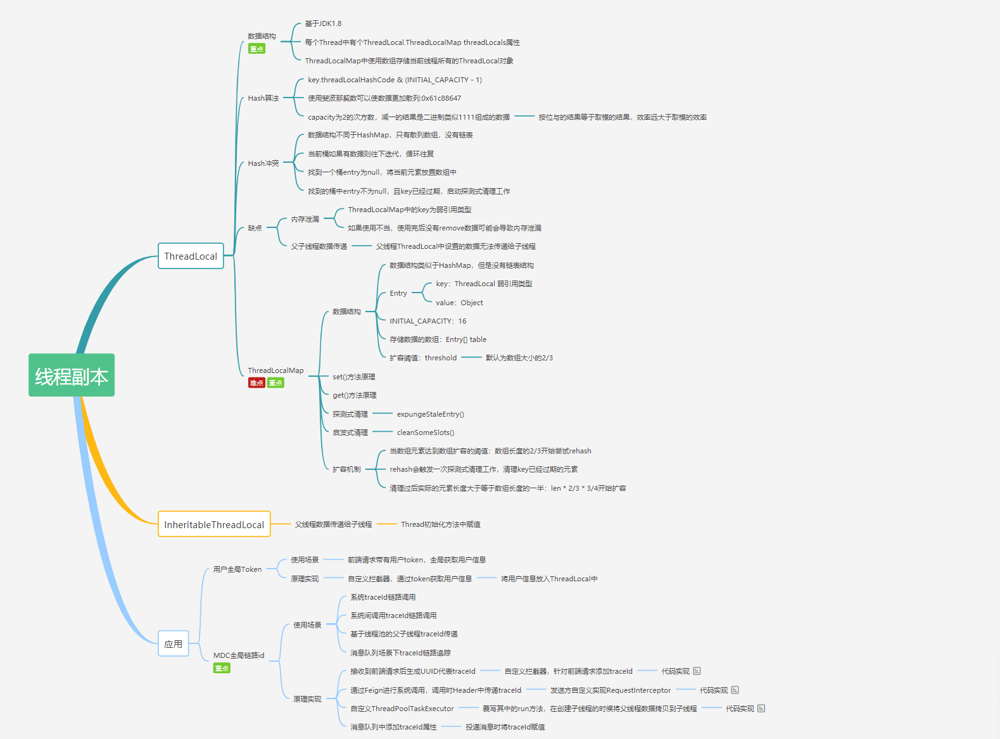
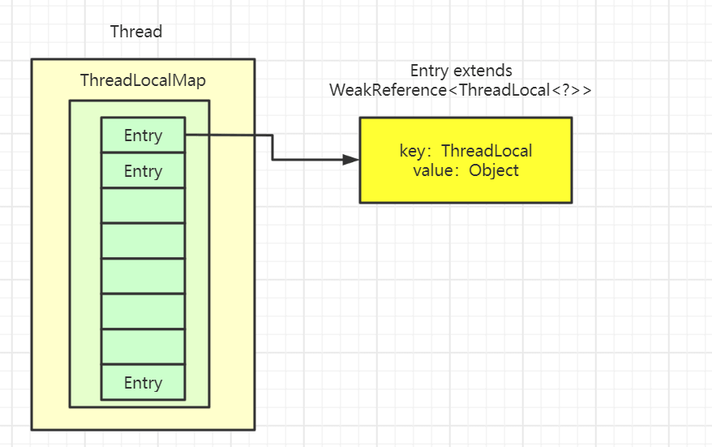
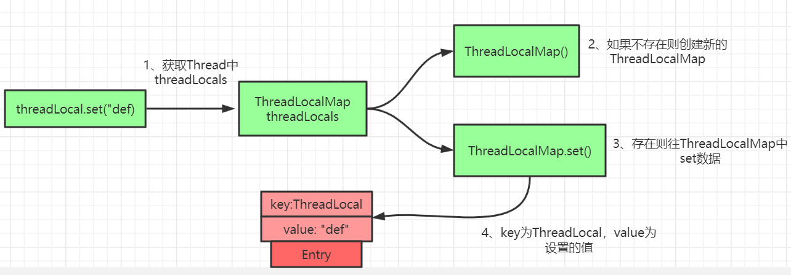
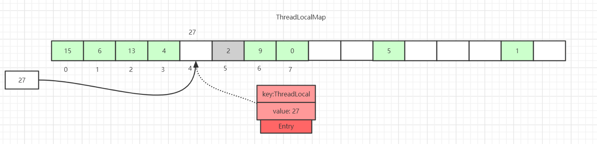
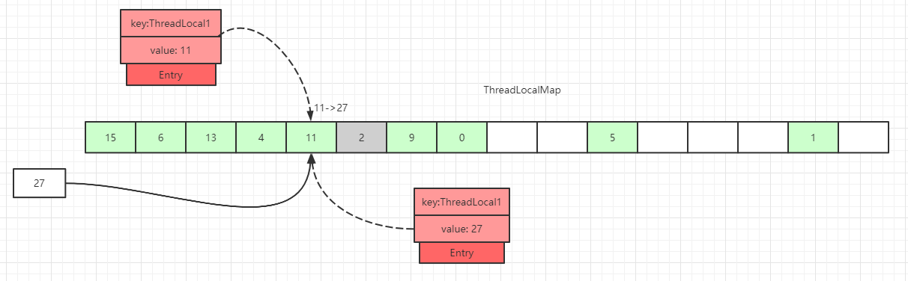
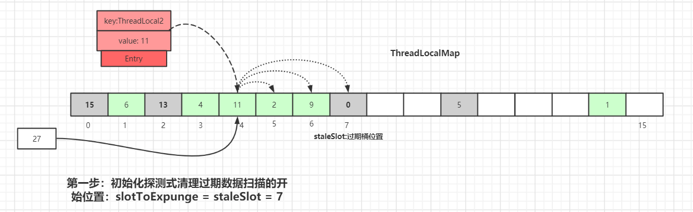
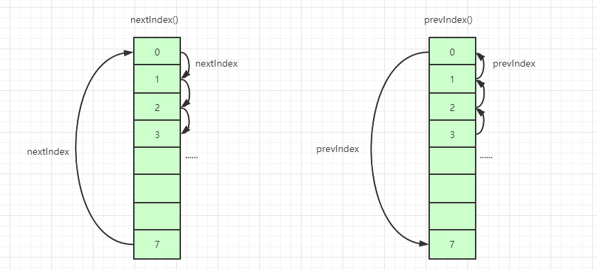
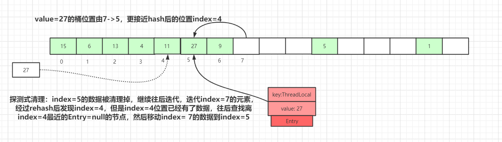
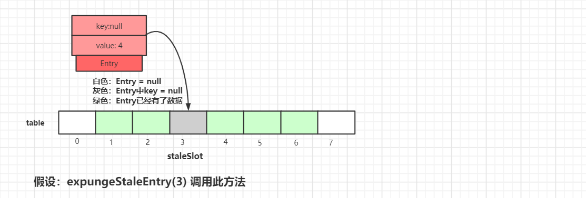
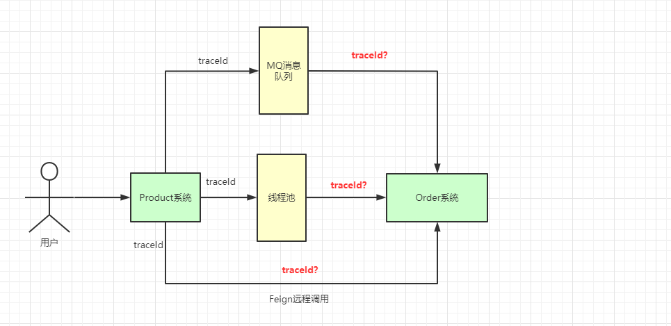

> Bài viết này do 一枝花算不算浪漫 đóng góp, địa chỉ bài gốc: [https://juejin.cn/post/6844904151567040519](https://juejin.cn/post/6844904151567040519).

### Lời nói đầu



**Toàn văn gồm 10000+ chữ, 31 bức hình, bài viết này cũng tiêu tốn không ít thời gian và công sức mới hoàn thành được, sáng tác không dễ dàng, xin mọi người nhấn follow +like, xin cảm ơn.**

Đối với `ThreadLocal`, phản ứng đầu tiên của mọi người có lẽ là rất đơn giản thôi, bản sao biến của luồng, mỗi luồng được cách ly. Vậy ở đây có một vài câu hỏi mọi người có thể suy nghĩ một chút:

- Key của `ThreadLocal` là **tham chiếu yếu (weak reference)**, vậy trong lúc `ThreadLocal.get()`, sau khi xảy ra **GC**, key có bằng **null** không?
- **Cấu trúc dữ liệu** của `ThreadLocalMap` trong `ThreadLocal`?
- **Thuật toán Hash** của `ThreadLocalMap`?
- **Xung đột Hash** trong `ThreadLocalMap` giải quyết như thế nào?
- **Cơ chế mở rộng (resize)** của `ThreadLocalMap`?
- **Cơ chế dọn dẹp key hết hạn** trong `ThreadLocalMap`? Quy trình **dọn dẹp dò tìm (探测式清理)** và **dọn dẹp gợi mở (启发式清理)**?
- Nguyên lý triển khai phương thức `ThreadLocalMap.set()`?
- Nguyên lý triển khai phương thức `ThreadLocalMap.get()`?
- Tình hình sử dụng `ThreadLocal` trong dự án? Các cạm bẫy từng gặp?
- ……

Các câu hỏi trên liệu bạn đã nắm vững rất rõ ràng chưa? Bài viết này sẽ xoay quanh các câu hỏi này sử dụng phương thức hình ảnh và văn bản để bóc tách **từng chút một** về `ThreadLocal`.

### Mục lục

**Ghi chú:** Mã nguồn bài viết này dựa trên `JDK 1.8`

### Minh họa code `ThreadLocal`

Trước tiên chúng ta xem ví dụ sử dụng `ThreadLocal`:

```java
public class ThreadLocalTest {
    private List<String> messages = Lists.newArrayList();

    public static final ThreadLocal<ThreadLocalTest> holder = ThreadLocal.withInitial(ThreadLocalTest::new);

    public static void add(String message) {
        holder.get().messages.add(message);
    }

    public static List<String> clear() {
        List<String> messages = holder.get().messages;
        holder.remove();

        System.out.println("size: " + holder.get().messages.size());
        return messages;
    }

    public static void main(String[] args) {
        ThreadLocalTest.add("一枝花算不算浪漫");
        System.out.println(holder.get().messages);
        ThreadLocalTest.clear();
    }
}
```

In kết quả:

```java
[一枝花算不算浪漫]
size: 0
```

Đối tượng `ThreadLocal` có thể cung cấp biến cục bộ của luồng, mỗi luồng `Thread` sở hữu một **bản sao biến** của riêng mình, nhiều luồng không can thiệp lẫn nhau.

### Cấu trúc dữ liệu của `ThreadLocal`



Lớp `Thread` có một biến thể hiện `threadLocals` kiểu `ThreadLocal.ThreadLocalMap`, nghĩa là mỗi luồng có một `ThreadLocalMap` của riêng mình.

`ThreadLocalMap` có triển khai độc lập của riêng mình, có thể xem `key` của nó đơn giản là `ThreadLocal`, `value` là giá trị đưa vào trong code (thực tế `key` không phải là bản thân `ThreadLocal`, mà là một **tham chiếu yếu** của nó).

Mỗi luồng khi đưa giá trị vào `ThreadLocal`, đều sẽ lưu vào `ThreadLocalMap` của chính mình, khi đọc cũng lấy `ThreadLocal` làm tham chiếu, tìm `key` tương ứng trong `map` của chính mình, từ đó đạt được **cách ly luồng (thread isolation)**.

`ThreadLocalMap` có cấu trúc hơi giống `HashMap`, chỉ là `HashMap` được triển khai bởi **mảng + danh sách liên kết**, còn trong `ThreadLocalMap` không hề có cấu trúc **danh sách liên kết**.

Chúng ta còn cần chú ý `Entry`, `key` của nó là `ThreadLocal<?> k`, kế thừa từ `WeakReference`, tức là kiểu tham chiếu yếu mà chúng ta thường nói.

### Sau GC key có bằng null không?

Trả lời câu hỏi ở đầu bài, `key` của `ThreadLocal` là tham chiếu yếu, vậy khi `ThreadLocal.get()`, sau khi xảy ra `GC`, `key` có phải là `null` không?

Để hiểu rõ vấnled này, chúng ta cần hiểu rõ **bốn loại tham chiếu** của `Java`:

- **Tham chiếu mạnh (Strong Reference)**: Đối tượng chúng ta thường new ra là kiểu tham chiếu mạnh, chỉ cần tham chiếu mạnh còn tồn tại, Garbage Collector sẽ không bao giờ thu hồi đối tượng được tham chiếu, ngay cả khi không đủ bộ nhớ.
- **Tham chiếu mềm (Soft Reference)**: Đối tượng tu sửa bằng `SoftReference` được gọi là tham chiếu mềm, đối tượng mà tham chiếu mềm trỏ tới sẽ bị thu hồi khi bộ nhớ sắp tràn.
- **Tham chiếu yếu (Weak Reference)**: Đối tượng sử dụng `WeakReference` tham chiếu nếu không còn tồn tại tham chiếu mạnh hay tham chiếu mềm, sẽ thuộc về đối tượng đến được yếu (weakly reachable); khi Garbage Collector quyết định xử lý loại đối tượng này, sẽ xóa tham chiếu yếu tương ứng. Một lần thu hồi rác cụ thể không đảm bảo lập tức xử lý tất cả đối tượng ứng viên.
- **Tham chiếu ảo (Phantom Reference)**: Tham chiếu ảo là tham chiếu yếu nhất, định nghĩa bằng `PhantomReference` trong Java. Tác dụng duy nhất trong tham chiếu ảo là dùng hàng đợi nhận thông báo đối tượng sắp tử vong.

Tiếp tục xem lại code, chúng ta sử dụng phương pháp reflection để xem tình hình dữ liệu trong `ThreadLocal` sau `GC`: (Mã nguồn dưới đây đến từ: <https://blog.csdn.net/thewindkee/article/details/103726942> chạy local minh họa kịch bản GC thu hồi)

> `System.gc()` chỉ là đưa ra gợi ý thực thi thu hồi rác cho JVM, kết quả dưới đây thích hợp dùng để giải thích nguyên lý, nhưng không thể làm hành vi chắc chắn xuất hiện mỗi lần chạy.

```java
public class ThreadLocalDemo {

    public static void main(String[] args) throws NoSuchFieldException, IllegalAccessException, InterruptedException {
        Thread t = new Thread(()->test("abc",false));
        t.start();
        t.join();
        System.out.println("--Sau GC--");
        Thread t2 = new Thread(() -> test("def", true));
        t2.start();
        t2.join();
    }

    private static void test(String s,boolean isGC)  {
        try {
            new ThreadLocal<>().set(s);
            if (isGC) {
                System.gc();
            }
            Thread t = Thread.currentThread();
            Class<? extends Thread> clz = t.getClass();
            Field field = clz.getDeclaredField("threadLocals");
            field.setAccessible(true);
            Object ThreadLocalMap = field.get(t);
            Class<?> tlmClass = ThreadLocalMap.getClass();
            Field tableField = tlmClass.getDeclaredField("table");
            tableField.setAccessible(true);
            Object[] arr = (Object[]) tableField.get(ThreadLocalMap);
            for (Object o : arr) {
                if (o != null) {
                    Class<?> entryClass = o.getClass();
                    Field valueField = entryClass.getDeclaredField("value");
                    Field referenceField = entryClass.getSuperclass().getSuperclass().getDeclaredField("referent");
                    valueField.setAccessible(true);
                    referenceField.setAccessible(true);
                    System.out.println(String.format("Key tham chiếu yếu:%s, Giá trị:%s", referenceField.get(o), valueField.get(o)));
                }
            }
        } catch (Exception e) {
            e.printStackTrace();
        }
    }
}
```

Kết quả như sau:

```java
Key tham chiếu yếu:java.lang.ThreadLocal@433619b6, Giá trị:abc
Key tham chiếu yếu:java.lang.ThreadLocal@418a15e3, Giá trị:java.lang.ref.SoftReference@bf97a12
--Sau GC--
Key tham chiếu yếu:null, Giá trị:def
```


Như hình vẽ, vì `ThreadLocal` được tạo ở đây không trỏ tới bất kỳ giá trị nào, tức là không có bất kỳ tham chiếu nào:

```java
new ThreadLocal<>().set(s);
```

Trong lần chạy ví dụ này, Garbage Collector đã xử lý `ThreadLocal` chỉ còn lại tham chiếu yếu, nên chúng ta thấy `referent=null`. Nhưng điều này phụ thuộc vào việc JVM có thực sự thực thi và hoàn thành việc thu hồi rác tương ứng hay không. Nếu **sửa code một chút:**


Câu hỏi này vừa mới nhìn, nếu không suy nghĩ quá nhiều, **tham chiếu yếu**, lại có **thu hồi rác**, vậy chắc chắn sẽ nghĩ là `null`.

Thực ra là không đúng, vì đề bài nói là đang làm thao tác `ThreadLocal.get()`, chứng tỏ thực ra vẫn có **tham chiếu mạnh** tồn tại, nên `key` không bằng `null`, như hình dưới đây, **tham chiếu mạnh** của `ThreadLocal` vẫn còn tồn tại.


Nếu **tham chiếu mạnh** của chúng ta không tồn tại, Garbage Collector có thể dọn dẹp `key` trong tham chiếu yếu. Lúc này `Entry` vẫn tham chiếu mạnh tới `value`, cho đến khi entry hết hạn đó được thao tác sau đó của `ThreadLocalMap` dọn dẹp, hoặc luồng sở hữu chấm dứt, toàn bộ Map không còn đến được nữa; trong các luồng có lifecycle dài như ThreadPool, khoảng thời gian lưu lại này có thể rất dài, do đó tồn tại rủi ro rò rỉ bộ nhớ (memory leak).

### Giải thích chi tiết mã nguồn phương thức `ThreadLocal.set()`



Nguyên lý của phương thức `set` trong `ThreadLocal` như hình trên, rất đơn giản, chủ yếu là phán đoán `ThreadLocalMap` có tồn tại không, sau đó sử dụng phương thức `set` trong `ThreadLocal` để xử lý dữ liệu.

Code như sau:

```java
public void set(T value) {
    Thread t = Thread.currentThread();
    ThreadLocalMap map = getMap(t);
    if (map != null)
        map.set(this, value);
    else
        createMap(t, value);
}

void createMap(Thread t, T firstValue) {
    t.threadLocals = new ThreadLocalMap(this, firstValue);
}
```

Logic cốt lõi chính vẫn nằm trong `ThreadLocalMap`, từng bước đi xuống dưới, phía sau còn có bóc tách chi tiết hơn.

### Thuật toán Hash của `ThreadLocalMap`

Đã là cấu trúc `Map`, vậy `ThreadLocalMap` đương nhiên cũng phải triển khai thuật toán `hash` của riêng mình để giải quyết vấn đề xung đột mảng bảng băm.

```java
int i = key.threadLocalHashCode & (len-1);
```

Thuật toán `hash` trong `ThreadLocalMap` rất đơn giản, ở đây `i` chính là vị trí chỉ số mảng tương ứng của key hiện tại trong bảng băm.

Ở đây điều mấu chốt nhất chính là việc tính toán giá trị `threadLocalHashCode`, trong `ThreadLocal` có một thuộc tính là `HASH_INCREMENT = 0x61c88647`

```java
public class ThreadLocal<T> {
    private final int threadLocalHashCode = nextHashCode();

    private static AtomicInteger nextHashCode = new AtomicInteger();

    private static final int HASH_INCREMENT = 0x61c88647;

    private static int nextHashCode() {
        return nextHashCode.getAndAdd(HASH_INCREMENT);
    }

    static class ThreadLocalMap {
        ThreadLocalMap(ThreadLocal<?> firstKey, Object firstValue) {
            table = new Entry[INITIAL_CAPACITY];
            int i = firstKey.threadLocalHashCode & (INITIAL_CAPACITY - 1);

            table[i] = new Entry(firstKey, firstValue);
            size = 1;
            setThreshold(INITIAL_CAPACITY);
        }
    }
}
```

Mỗi khi tạo một đối tượng `ThreadLocal`, giá trị `ThreadLocal.nextHashCode` này sẽ tăng thêm `0x61c88647`.

Hằng số này không phải là số Fibonacci, mà là đại lượng tăng băm 32-bit được suy ra từ tỷ lệ vàng (Golden Ratio). Các `ThreadLocal` được tạo liên tiếp sử dụng đại lượng tăng này để sinh ra hashCode, khi lấy các bit thấp đối với mảng có độ dài là lũy thừa của 2, có thể làm cho sự phân bố ô chứa (slot) tương đối đồng đều.

Bản thân chúng ta có thể thử nghiệm một chút:


Có thể thấy hashCode sinh ra phân bố tương đối đồng đều, ai quan tâm có thể tìm hiểu thêm về băm nhân dựa trên tỷ lệ vàng.

### Xung đột Hash trong `ThreadLocalMap`

> **Ghi chú:** Trong tất cả các hình vẽ ví dụ dưới đây, `Entry` **khối màu xanh** đại diện cho **dữ liệu bình thường**, **khối màu xám** đại diện cho giá trị `key` của `Entry` bằng `null`, **đã bị thu hồi rác**. **Khối màu trắng** biểu thị `Entry` bằng `null`.

Mặc dù trong `ThreadLocalMap` có sử dụng **số tỷ lệ vàng** làm hệ số tính toán `hash`, làm giảm đáng kể xác suất xung đột `Hash`, nhưng vẫn sẽ tồn tại xung đột.

Phương pháp giải quyết xung đột trong `HashMap` là dựng một cấu trúc **danh sách liên kết** trên mảng, dữ liệu xung đột treo vào danh sách liên kết, nếu chiều dài danh sách liên kết vượt quá một số lượng nhất định thì chuyển thành **cây đỏ đen**.

Còn trong `ThreadLocalMap` không hề có cấu trúc danh sách liên kết, nên ở đây không thể dùng cách giải quyết xung đột của `HashMap` nữa.


Như hình trên thể hiện, nếu chúng ta chèn một dữ liệu `value=27`, sau khi tính `hash` xong đáng lẽ rơi vào ô `index=4`, mà ô `index=4` đã có dữ liệu `Entry`.

Lúc này sẽ tìm kiếm tuyến tính về phía sau, cho đến khi tìm được ô `Entry` bằng `null` mới dừng tìm kiếm, đặt phần tử hiện tại vào ô này. Đương nhiên trong quá trình lặp còn có các trường hợp khác, ví dụ gặp phải trường hợp `Entry` không bằng `null` và giá trị `key` bằng nhau, còn có trường hợp giá trị `key` trong `Entry` bằng `null` v.v. đều sẽ có xử lý khác nhau, phía sau sẽ giải thích chi tiết từng cái một.

Ở đây còn vẽ một dữ liệu `key` trong `Entry` bằng `null` (**Dữ liệu khối xám Entry=2**), vì giá trị `key` là kiểu **tham chiếu yếu**, nên sẽ có loại dữ liệu này tồn tại. Trong quá trình `set`, nếu gặp phải dữ liệu `Entry` có `key` hết hạn, thực tế sẽ tiến hành một vòng thao tác **dọn dẹp dò tìm (probing clean)**, cách thao tác cụ thể phía sau sẽ giảng tới.

### Giải thích chi tiết `ThreadLocalMap.set()`

#### Sơ đồ nguyên lý `ThreadLocalMap.set()`

Xem xong **thuật toán hash** của `ThreadLocal`, chúng ta xem tiếp `set` được triển khai như thế nào.

Đưa dữ liệu vào `ThreadLocalMap` (**thêm mới** hoặc **cập nhật** dữ liệu) chia làm nhiều trường hợp, đối với các trường hợp khác nhau chúng ta vẽ hình để giải thích.

**Trường hợp 1:** Dữ liệu `Entry` tương ứng với ô tính toán qua `hash` là rỗng:



Ở đây trực tiếp đặt dữ liệu vào ô đó là được.

**Trường hợp 2:** Dữ liệu trong ô không rỗng, giá trị `key` khớp với giá trị `key` của `ThreadLocal` hiện tại tính qua `hash`:



Ở đây trực tiếp cập nhật dữ liệu của ô đó.

**Trường hợp 3:** Dữ liệu trong ô không rỗng, trong quá trình duyệt về sau, trước khi tìm được ô có `Entry` bằng `null`, chưa gặp phải `Entry` có `key` hết hạn:


Duyệt mảng băm, tìm kiếm tuyến tính về sau, nếu tìm được ô có `Entry` bằng `null`, thì đặt dữ liệu vào ô đó, hoặc trong quá trình duyệt về sau, gặp phải dữ liệu có **giá trị key bằng nhau**, trực tiếp cập nhật là được.

**Trường hợp 4:** Dữ liệu trong ô không rỗng, trong quá trình duyệt về sau, trước khi tìm được ô có `Entry` bằng `null`, gặp phải `Entry` có `key` hết hạn, như hình dưới đây, trong quá trình duyệt về sau, gặp phải ô `index=7` có dữ liệu `Entry` với `key=null`:



Dữ liệu `Entry` tương ứng vị trí chỉ số mảng băm bằng 7 có `key` bằng `null`, thể hiện giá trị `key` của dữ liệu này đã bị thu hồi rác rồi, lúc này sẽ thực thi phương thức `replaceStaleEntry()`, ý nghĩa phương thức đó là **logic thay thế dữ liệu hết hạn**, lấy **index=7** làm điểm bắt đầu duyệt về sau, tiến hành công việc dọn dẹp dữ liệu dò tìm.

Khởi tạo vị trí bắt đầu quét dọn dẹp dữ liệu hết hạn dò tìm: `slotToExpunge = staleSlot = 7`

Lấy `staleSlot` hiện tại làm điểm bắt đầu duyệt ngược về trước, tìm dữ liệu hết hạn khác, sau đó cập nhật chỉ số bắt đầu quét dữ liệu hết hạn `slotToExpunge`. Lặp vòng `for`, cho đến khi gặp `Entry` bằng `null` thì kết thúc.

Nếu tìm được dữ liệu hết hạn, tiếp tục lặp ngược về trước, cho đến khi gặp ô `Entry=null` mới dừng lặp, như hình dưới đây, **slotToExpunge được cập nhật thành 0**:


Lấy node hiện tại (`index=7`) lặp ngược về trước, kiểm tra xem có dữ liệu `Entry` hết hạn không, nếu có thì cập nhật giá trị `slotToExpunge`. Gặp `null` thì kết thúc dò tìm. Lấy ví dụ hình trên `slotToExpunge` được cập nhật thành 0.

Thao tác lặp ngược về trước ở trên là để cập nhật giá trị chỉ số bắt đầu dọn dẹp dữ liệu hết hạn dò tìm `slotToExpunge`, giá trị này ở phía sau sẽ giảng tới, nó dùng để phán đoán xem trước ô hết hạn hiện tại `staleSlot` còn có phần tử hết hạn hay không.

Tiếp theo bắt đầu lấy vị trí `staleSlot` (`index=7`) lặp về phía sau, **nếu tìm được dữ liệu Entry có giá trị key giống nhau:**


Từ node hiện tại `staleSlot` tìm về phía sau phần tử `Entry` có giá trị `key` bằng nhau, sau khi tìm thấy cập nhật giá trị của `Entry` và hoán đổi vị trí phần tử `staleSlot` (vị trí `staleSlot` là phần tử hết hạn), cập nhật dữ liệu `Entry`, sau đó bắt đầu tiến hành công việc dọn dẹp `Entry` hết hạn, như hình dưới đây:

 Trong quá trình duyệt về phía sau, nếu không tìm được dữ liệu Entry có giá trị key giống nhau:


Từ node hiện tại `staleSlot` tìm về phía sau phần tử `Entry` có giá trị `key` bằng nhau, cho đến khi `Entry` bằng `null` thì dừng tìm kiếm. Thông qua hình trên có thể thấy, lúc này trong `table` không có `Entry` nào có giá trị `key` giống nhau.

Tạo `Entry` mới, thay thế vị trí `table[stableSlot]`:


Sau khi thay thế hoàn thành cũng là tiến hành công việc dọn dẹp phần tử hết hạn, công việc dọn dẹp chủ yếu có hai phương thức: `expungeStaleEntry()` và `cleanSomeSlots()`, chi tiết cụ thể phía sau sẽ giảng tới, xin tiếp tục xem về sau.

#### Giải thích chi tiết mã nguồn `ThreadLocalMap.set()`

Phía trên đã dùng hình vẽ phân tích nguyên lý triển khai `set()`, thực ra đã rất rõ ràng rồi, chúng ta tiếp tục xem mã nguồn:

`java.lang.ThreadLocal`.`ThreadLocalMap.set()`:

```java
private void set(ThreadLocal<?> key, Object value) {
    Entry[] tab = table;
    int len = tab.length;
    int i = key.threadLocalHashCode & (len-1);

    for (Entry e = tab[i];
         e != null;
         e = tab[i = nextIndex(i, len)]) {
        ThreadLocal<?> k = e.get();

        if (k == key) {
            e.value = value;
            return;
        }

        if (k == null) {
            replaceStaleEntry(key, value, i);
            return;
        }
    }

    tab[i] = new Entry(key, value);
    int sz = ++size;
    if (!cleanSomeSlots(i, sz) && sz >= threshold)
        rehash();
}
```

Ở đây sẽ thông qua `key` để tính toán vị trí tương ứng trong bảng băm, sau đó lấy vị trí bucket tương ứng với `key` hiện tại làm điểm bắt đầu tìm về phía sau, tìm bucket có thể sử dụng.

```java
Entry[] tab = table;
int len = tab.length;
int i = key.threadLocalHashCode & (len-1);
```

Trong trường hợp nào thì bucket mới có thể sử dụng?

1. `k = key` thể hiện là thao tác thay thế, có thể sử dụng
2. Gặp phải một bucket hết hạn, thực thi logic thay thế, chiếm dụng bucket hết hạn
3. Trong quá trình tìm kiếm, gặp phải trường hợp `Entry=null` trong bucket, sử dụng trực tiếp

Tiếp theo chính là thực thi vòng lặp `for` duyệt, tìm kiếm về phía sau, chúng ta xem trước cách triển khai phương thức `nextIndex()`, `prevIndex()`:



```java
private static int nextIndex(int i, int len) {
    return ((i + 1 < len) ? i + 1 : 0);
}

private static int prevIndex(int i, int len) {
    return ((i - 1 >= 0) ? i - 1 : len - 1);
}
```

Tiếp tục xem logic còn lại trong vòng lặp `for`:

1. Duyệt dữ liệu `Entry` trong bucket tương ứng với giá trị `key` hiện tại là rỗng, điều này chứng tỏ mảng băm ở đây không có xung đột dữ liệu, nhảy khỏi vòng lặp `for`, trực tiếp `set` dữ liệu vào bucket tương ứng
2. Nếu dữ liệu `Entry` trong bucket tương ứng với giá trị `key` không rỗng
   2.1 Nếu `k = key`, chứng tỏ thao tác `set` hiện tại là một thao tác thay thế, làm logic thay thế, trả về trực tiếp
   2.2 Nếu `key = null`, chứng tỏ `Entry` tại vị trí bucket hiện tại là dữ liệu hết hạn, thực thi phương thức `replaceStaleEntry()` (phương thức cốt lõi), sau đó trả về
3. Vòng lặp `for` thực thi xong, tiếp tục thực thi xuống dưới chứng tỏ trong quá trình lặp về phía sau gặp phải trường hợp `entry` bằng `null`
   3.1 Trong bucket có `Entry` bằng `null` tạo một đối tượng `Entry` mới
   3.2 Thực thi thao tác `++size`
4. Gọi `cleanSomeSlots()` làm một lần công việc dọn dẹp gợi mở, dọn dẹp các dữ liệu có `key` của `Entry` trong mảng băm đã hết hạn
   4.1 Nếu sau khi công việc dọn dẹp hoàn thành, chưa dọn dẹp được dữ liệu nào, và `size` vượt quá ngưỡng (`len * 2/3`), tiến hành thao tác `rehash()`
   4.2 Trong `rehash()` trước tiên sẽ tiến hành một vòng dọn dẹp dò tìm, dọn dẹp `key` hết hạn, sau khi dọn dẹp hoàn thành nếu **size >= threshold - threshold / 4**, thì sẽ thực thi logic mở rộng dung lượng thực sự (logic mở rộng xem tiếp phía sau)

Tiếp theo tập trung xem phương thức `replaceStaleEntry()`, phương thức `replaceStaleEntry()` cung cấp tính năng thay thế dữ liệu hết hạn, chúng ta có thể đối chiếu lại sơ đồ nguyên lý của **Trường hợp 4** ở trên để điểm lại, code cụ thể như sau:

`java.lang.ThreadLocal.ThreadLocalMap.replaceStaleEntry()`:

```java
private void replaceStaleEntry(ThreadLocal<?> key, Object value,
                                       int staleSlot) {
    Entry[] tab = table;
    int len = tab.length;
    Entry e;

    int slotToExpunge = staleSlot;
    for (int i = prevIndex(staleSlot, len);
         (e = tab[i]) != null;
         i = prevIndex(i, len))

        if (e.get() == null)
            slotToExpunge = i;

    for (int i = nextIndex(staleSlot, len);
         (e = tab[i]) != null;
         i = nextIndex(i, len)) {

        ThreadLocal<?> k = e.get();

        if (k == key) {
            e.value = value;

            tab[i] = tab[staleSlot];
            tab[staleSlot] = e;

            if (slotToExpunge == staleSlot)
                slotToExpunge = i;
            cleanSomeSlots(expungeStaleEntry(slotToExpunge), len);
            return;
        }

        if (k == null && slotToExpunge == staleSlot)
            slotToExpunge = i;
    }

    tab[staleSlot].value = null;
    tab[staleSlot] = new Entry(key, value);

    if (slotToExpunge != staleSlot)
        cleanSomeSlots(expungeStaleEntry(slotToExpunge), len);
}
```

`slotToExpunge` biểu thị chỉ số bắt đầu dọn dẹp dữ liệu hết hạn dò tìm, mặc định bắt đầu từ `staleSlot` hiện tại. Lấy `staleSlot` hiện tại làm điểm bắt đầu, lặp ngược về trước tìm kiếm, tìm dữ liệu chưa hết hạn, vòng lặp `for` liên tục đụng `Entry` bằng `null` mới kết thúc. Nếu tìm được dữ liệu hết hạn ngược về trước, cập nhật chỉ số bắt đầu dọn dẹp dò tìm là i, tức là `slotToExpunge=i`

```java
for (int i = prevIndex(staleSlot, len);
     (e = tab[i]) != null;
     i = prevIndex(i, len)){

    if (e.get() == null){
        slotToExpunge = i;
    }
}
```

Tiếp theo bắt đầu tìm kiếm về phía sau từ `staleSlot`, cũng đụng `Entry` bằng `null` thì kết thúc.
Nếu trong quá trình lặp, **đụng k == key**, điều này chứng tỏ ở đây là logic thay thế, thay thế dữ liệu mới và hoán đổi vị trí `staleSlot` hiện tại. Nếu `slotToExpunge == staleSlot`, điều này chứng tỏ `replaceStaleEntry()` lúc ban đầu khi tìm kiếm ngược về trước không tìm thấy dữ liệu `Entry` hết hạn, tiếp theo trong quá trình tìm kiếm về phía sau cũng không phát hiện dữ liệu hết hạn, sửa đổi chỉ số bắt đầu dọn dẹp dữ liệu hết hạn dò tìm thành index của vòng lặp hiện tại, tức là `slotToExpunge = i`. Cuối cùng gọi `cleanSomeSlots(expungeStaleEntry(slotToExpunge), len);` để tiến hành dọn dẹp dữ liệu hết hạn gợi mở.

```java
if (k == key) {
    e.value = value;

    tab[i] = tab[staleSlot];
    tab[staleSlot] = e;

    if (slotToExpunge == staleSlot)
        slotToExpunge = i;

    cleanSomeSlots(expungeStaleEntry(slotToExpunge), len);
    return;
}
```

`cleanSomeSlots()` và `expungeStaleEntry()` phía sau đều sẽ giải thích chi tiết, hai cái này là phương thức liên quan đến dọn dẹp, một cái là dọn dẹp gợi mở (`Heuristically scan`) các `Entry` liên quan đến `key` hết hạn, cái còn lại là dọn dẹp dò tìm các `Entry` liên quan đến `key` hết hạn.

**Nếu k != key** thì sẽ đi tiếp xuống dưới, `k == null` chứng tỏ `Entry` hiện tại đang duyệt là một dữ liệu hết hạn, `slotToExpunge == staleSlot` chứng tỏ, việc tìm kiếm ngược về trước ban đầu không tìm thấy `Entry` hết hạn. Nếu điều kiện thỏa mãn, thì cập nhật `slotToExpunge` thành vị trí hiện tại, tiền đề này là khi node tiền nhiệm scan chưa phát hiện dữ liệu hết hạn.

```java
if (k == null && slotToExpunge == staleSlot)
    slotToExpunge = i;
```

Trong quá trình lặp về phía sau nếu không tìm thấy dữ liệu `k == key`, và đụng dữ liệu `Entry` bằng `null`, thì kết thúc thao tác lặp hiện tại. Lúc này chứng tỏ ở đây là một logic thêm mới, thêm dữ liệu mới vào `slot` tương ứng với `table[staleSlot]`.

```java
tab[staleSlot].value = null;
tab[staleSlot] = new Entry(key, value);
```

Cuối cùng phán đoán ngoài `staleSlot` ra, còn phát hiện dữ liệu `slot` hết hạn khác, thì phải mở logic dọn dẹp dữ liệu:

```java
if (slotToExpunge != staleSlot)
    cleanSomeSlots(expungeStaleEntry(slotToExpunge), len);
```

### Quy trình dọn dẹp dò tìm key hết hạn của `ThreadLocalMap`

Phía trên chúng ta có đề cập 2 cách dọn dẹp dữ liệu `key` hết hạn của `ThreadLocalMap`: **Dọn dẹp dò tìm** và **Dọn dẹp gợi mở**.

Chúng ta nói trước về dọn dẹp dò tìm, tức là phương thức `expungeStaleEntry`, duyệt mảng băm, từ vị trí bắt đầu dò tìm dọn dẹp dữ liệu hết hạn về phía sau, đặt `Entry` của dữ liệu hết hạn thành `null`, trên đường đi đụng dữ liệu chưa hết hạn thì đưa dữ liệu này `rehash` rồi định vị lại trong mảng `table`, nếu vị trí định vị đã có dữ liệu, thì sẽ đưa dữ liệu chưa hết hạn đặt vào ô `Entry=null` gần với vị trí này nhất, làm cho dữ liệu `Entry` sau khi `rehash` gần với vị trí ô đúng hơn. Logic thao tác như sau:


Như hình trên, `set(27)` sau khi tính hash đáng lẽ rơi vào ô `index=4`, do ô `index=4` đã có dữ liệu, nên lặp về phía sau cuối cùng dữ liệu được đặt vào ô `index=7`, đặt vào được một khoảng thời gian sau `key` của dữ liệu `Entry` trong `index=5` biến thành `null`



Nếu lại có dữ liệu khác `set` vào `map`, sẽ kích hoạt thao tác **dọn dẹp dò tìm**.

Như hình trên, sau khi thực thi **dọn dẹp dò tìm**, dữ liệu `index=5` bị dọn dẹp đi, tiếp tục lặp về phía sau, đến phần tử `index=7`, sau khi `rehash` phát hiện `index=4` đúng của phần tử đó, mà vị trí này đã có dữ liệu, tìm về phía sau node `Entry=null` gần `index=4` nhất (dữ liệu vừa bị dọn dẹp dò tìm đi: `index=5`), sau khi tìm thấy di chuyển dữ liệu `index=7` sang `index=5`, lúc này vị trí ô gần với vị trí đúng `index=4` hơn rồi.

Sau một vòng dọn dẹp dò tìm, dữ liệu hết hạn `key` sẽ bị dọn dẹp đi, dữ liệu chưa hết hạn sau khi `rehash` định vị lại thì vị trí ô đang ở về mặt lý thuyết gần hơn vị trí `i= key.hashCode & (tab.len - 1)`. Loại tối ưu hóa này sẽ nâng cao hiệu năng truy vấn của toàn bộ bảng băm.

Tiếp theo xem quy trình cụ thể của `expungeStaleEntry()`, chúng ta vẫn theo cách sơ đồ nguyên lý trước rồi mã nguồn sau để bóc tách từng bước:



Chúng ta giả sử `expungeStaleEntry(3)` để gọi phương thức này, như hình trên thể hiện, chúng ta có thể thấy tình hình dữ liệu của `table` trong `ThreadLocalMap`, tiếp theo thực thi thao tác dọn dẹp:


Bước đầu tiên là xóa rỗng dữ liệu vị trí `staleSlot` hiện tại, `Entry` vị trí `index=3` biến thành `null`. Sau đó tiếp tục dò tìm về phía sau:


Sau khi thực thi xong bước thứ hai, phần tử index=4 chuyển sang ô index=3.

Tiếp tục lặp về phía sau kiểm tra, đụng dữ liệu bình thường, tính toán xem vị trí dữ liệu đó có bị lệch không, nếu bị lệch, thì tính lại vị trí `slot`, mục đích là làm cho dữ liệu bình thường cố gắng lưu trữ ở vị trí đúng hoặc vị trí gần vị trí đúng hơn


Trong quá trình lặp về phía sau đụng ô rỗng, chấm dứt dò tìm, như vậy một vòng công việc dọn dẹp dò tìm đã hoàn thành, tiếp theo chúng ta tiếp tục xem **mã nguồn triển khai** cụ thể:

```java
private int expungeStaleEntry(int staleSlot) {
    Entry[] tab = table;
    int len = tab.length;

    tab[staleSlot].value = null;
    tab[staleSlot] = null;
    size--;

    Entry e;
    int i;
    for (i = nextIndex(staleSlot, len);
         (e = tab[i]) != null;
         i = nextIndex(i, len)) {
        ThreadLocal<?> k = e.get();
        if (k == null) {
            e.value = null;
            tab[i] = null;
            size--;
        } else {
            int h = k.threadLocalHashCode & (len - 1);
            if (h != i) {
                tab[i] = null;

                while (tab[h] != null)
                    h = nextIndex(h, len);
                tab[h] = e;
            }
        }
    }
    return i;
}
```

Ở đây chúng ta vẫn lấy `staleSlot=3` làm ví dụ giải thích, trước tiên là xóa rỗng dữ liệu ô `tab[staleSlot]`, sau đó đặt `size--`
Tiếp theo lấy vị trí `staleSlot` lặp về phía sau, nếu gặp dữ liệu hết hạn `k==null`, cũng xóa rỗng dữ liệu ô đó, sau đó `size--`

```java
ThreadLocal<?> k = e.get();

if (k == null) {
    e.value = null;
    tab[i] = null;
    size--;
}
```

Nếu `key` chưa hết hạn, tính lại vị trí chỉ số của `key` hiện tại có phải là vị trí chỉ số ô hiện tại không, nếu không phải, vậy chứng tỏ đã phát sinh xung đột `hash`, lúc này lấy vị trí ô đúng vừa tính ra lặp về phía sau, tìm vị trí gần nhất có thể đặt `entry`.

```java
int h = k.threadLocalHashCode & (len - 1);
if (h != i) {
    tab[i] = null;

    while (tab[h] != null)
        h = nextIndex(h, len);

    tab[h] = e;
}
```

Ở đây là xử lý dữ liệu phát sinh xung đột `Hash` bình thường, sau khi lặp, vị trí `Entry` của dữ liệu có xung đột `Hash` sẽ gần vị trí đúng hơn, như vậy, khi truy vấn hiệu suất mới cao hơn.

### Cơ chế mở rộng dung lượng của `ThreadLocalMap`

Ở phần cuối của phương thức `ThreadLocalMap.set()`, nếu sau khi thực thi xong công việc dọn dẹp gợi mở, chưa dọn dẹp được dữ liệu nào, và số lượng `Entry` trong mảng băm hiện tại đã đạt ngưỡng mở rộng dung lượng của danh sách `(len*2/3)`, thì bắt đầu thực thi logic `rehash()`:

```java
if (!cleanSomeSlots(i, sz) && sz >= threshold)
    rehash();
```

Tiếp tục xem triển khai cụ thể của `rehash()`:

```java
private void rehash() {
    expungeStaleEntries();

    if (size >= threshold - threshold / 4)
        resize();
}

private void expungeStaleEntries() {
    Entry[] tab = table;
    int len = tab.length;
    for (int j = 0; j < len; j++) {
        Entry e = tab[j];
        if (e != null && e.get() == null)
            expungeStaleEntry(j);
    }
}
```

Ở đây trước tiên sẽ tiến hành công việc dọn dẹp dò tìm, dọn dẹp từ vị trí bắt đầu của `table` về phía sau, phía trên có phân tích quy trình chi tiết của việc dọn dẹp. Sau khi dọn dẹp hoàn thành, trong `table` có thể có một số dữ liệu `Entry` có `key` bằng `null` bị dọn dẹp đi, nên lúc này thông qua phán đoán `size >= threshold - threshold / 4` tức là `size >= threshold * 3/4` để quyết định xem có mở rộng dung lượng không.

Chúng ta còn nhớ ngưỡng tiến hành `rehash()` ở trên là `size >= threshold`, nên khi người phỏng vấn hỏi gài bẫy chúng ta về cơ chế mở rộng của `ThreadLocalMap` thì chúng ta nhất định phải nói rõ hai bước này:


Tiếp tục xem phương thức `resize()` cụ thể, để tiện minh họa, chúng ta lấy `oldTab.len=8` làm ví dụ:


Kích thước của `tab` sau khi mở rộng dung lượng là `oldLen * 2`, sau đó duyệt mảng băm cũ, tính lại vị trí `hash`, rồi đặt vào mảng `tab` mới, nếu xuất hiện xung đột `hash` thì tìm ô có `entry` bằng `null` gần nhất về phía sau, sau khi duyệt hoàn thành, tất cả dữ liệu `entry` trong `oldTab` đều đã được đưa vào `tab` mới rồi. Tính lại **ngưỡng** mở rộng dung lượng lần sau của `tab`, code cụ thể như sau:

```java
private void resize() {
    Entry[] oldTab = table;
    int oldLen = oldTab.length;
    int newLen = oldLen * 2;
    Entry[] newTab = new Entry[newLen];
    int count = 0;

    for (int j = 0; j < oldLen; ++j) {
        Entry e = oldTab[j];
        if (e != null) {
            ThreadLocal<?> k = e.get();
            if (k == null) {
                e.value = null;
            } else {
                int h = k.threadLocalHashCode & (newLen - 1);
                while (newTab[h] != null)
                    h = nextIndex(h, newLen);
                newTab[h] = e;
                count++;
            }
        }
    }

    setThreshold(newLen);
    size = count;
    table = newTab;
}
```

### Giải thích chi tiết `ThreadLocalMap.get()`

Phía trên đã xem xong mã nguồn của phương thức `set()`, trong đó bao gồm các thao tác `set` dữ liệu, dọn dẹp dữ liệu, tối ưu vị trí bucket dữ liệu v.v., tiếp theo xem nguyên lý thao tác `get()`.

#### Minh họa hình ảnh `ThreadLocalMap.get()`

**Trường hợp 1:** Thông qua tìm kiếm giá trị `key` tính ra vị trí `slot` trong bảng băm, sau đó `Entry.key` trong vị trí `slot` đó khớp với `key` tìm kiếm, thì trả về trực tiếp:


**Trường hợp 2:** `Entry.key` trong vị trí `slot` không khớp với `key` muốn tìm:


Chúng ta lấy `get(ThreadLocal1)` làm ví dụ, thông qua tính `hash`, vị trí `slot` đúng đáng lẽ là 4, mà ô `index=4` đã có dữ liệu, và giá trị `key` không bằng `ThreadLocal1`, nên cần tiếp tục lặp về phía sau để tìm.

Lặp đến dữ liệu `index=5`, lúc này `Entry.key=null`, kích hoạt một thao tác thu hồi dữ liệu dò tìm, thực thi phương thức `expungeStaleEntry()`, sau khi thực thi xong, dữ liệu `index 5,8` đều sẽ bị thu hồi, còn dữ liệu `index 6,7` đều sẽ dịch lên trước. Sau khi `index 6,7` dịch lên trước, tiếp tục lặp về phía sau từ `index=5`, thế là tìm thấy dữ liệu `Entry` có giá trị `key` bằng nhau tại `index=6`, như hình dưới đây:


#### Giải thích chi tiết mã nguồn `ThreadLocalMap.get()`

`java.lang.ThreadLocal.ThreadLocalMap.getEntry()`:

```java
private Entry getEntry(ThreadLocal<?> key) {
    int i = key.threadLocalHashCode & (table.length - 1);
    Entry e = table[i];
    if (e != null && e.get() == key)
        return e;
    else
        return getEntryAfterMiss(key, i, e);
}

private Entry getEntryAfterMiss(ThreadLocal<?> key, int i, Entry e) {
    Entry[] tab = table;
    int len = tab.length;

    while (e != null) {
        ThreadLocal<?> k = e.get();
        if (k == key)
            return e;
        if (k == null)
            expungeStaleEntry(i);
        else
            i = nextIndex(i, len);
        e = tab[i];
    }
    return null;
}
```

### Quy trình dọn dẹp gợi mở key hết hạn của `ThreadLocalMap`

Phía trên nhiều lần đề cập đến 2 cách dọn dẹp key hết hạn của `ThreadLocalMap`: **Dọn dẹp dò tìm (expungeStaleEntry())**, **Dọn dẹp gợi mở (cleanSomeSlots())**

Dọn dẹp dò tìm lấy `Entry` hiện tại dọn dẹp về phía sau, đụng giá trị bằng `null` thì kết thúc dọn dẹp, thuộc về **dọn dẹp dò tìm tuyến tính**.

Còn dọn dẹp gợi mở được tác giả định nghĩa là: **Heuristically scan some cells looking for stale entries**.


Code cụ thể như sau:

```java
private boolean cleanSomeSlots(int i, int n) {
    boolean removed = false;
    Entry[] tab = table;
    int len = tab.length;
    do {
        i = nextIndex(i, len);
        Entry e = tab[i];
        if (e != null && e.get() == null) {
            n = len;
            removed = true;
            i = expungeStaleEntry(i);
        }
    } while ( (n >>>= 1) != 0);
    return removed;
}
```

### `InheritableThreadLocal`

Khi chúng ta sử dụng `ThreadLocal`, trong kịch bản bất đồng bộ thì không cách nào chia sẻ dữ liệu bản sao luồng tạo trong luồng cha cho luồng con.

Để giải quyết vấn đề này, trong JDK còn có một lớp `InheritableThreadLocal`, chúng ta xem một ví dụ:

```java
public class InheritableThreadLocalDemo {
    public static void main(String[] args) {
        ThreadLocal<String> ThreadLocal = new ThreadLocal<>();
        ThreadLocal<String> inheritableThreadLocal = new InheritableThreadLocal<>();
        ThreadLocal.set("Dữ liệu lớp cha:threadLocal");
        inheritableThreadLocal.set("Dữ liệu lớp cha:inheritableThreadLocal");

        new Thread(new Runnable() {
            @Override
            public void run() {
                System.out.println("Luồng con lấy dữ liệu ThreadLocal lớp cha：" + ThreadLocal.get());
                System.out.println("Luồng con lấy dữ liệu inheritableThreadLocal lớp cha：" + inheritableThreadLocal.get());
            }
        }).start();
    }
}
```

In kết quả:

```java
Luồng con lấy dữ liệu ThreadLocal lớp cha：null
Luồng con lấy dữ liệu inheritableThreadLocal lớp cha：Dữ liệu lớp cha:inheritableThreadLocal
```

Nguyên lý triển khai là luồng con thông qua việc gọi phương thức `new Thread()` trong luồng cha để tạo luồng con, phương thức `Thread#init` được gọi trong constructor của `Thread`. Trong phương thức `init` copy dữ liệu luồng cha sang luồng con:

```java
private void init(ThreadGroup g, Runnable target, String name,
                      long stackSize, AccessControlContext acc,
                      boolean inheritThreadLocals) {
    if (name == null) {
        throw new NullPointerException("name cannot be null");
    }

    if (inheritThreadLocals && parent.inheritableThreadLocals != null)
        this.inheritableThreadLocals =
            ThreadLocal.createInheritedMap(parent.inheritableThreadLocals);
    this.stackSize = stackSize;
    tid = nextThreadID();
}
```

Nhưng `InheritableThreadLocal` vẫn có khuyết điểm, thông thường khi chúng ta làm xử lý async đều sử dụng ThreadPool, mà `InheritableThreadLocal` lại gán giá trị trong phương thức `init()` của `new Thread`, còn ThreadPool lại là logic tái sử dụng luồng, nên ở đây sẽ tồn tại vấn đề.

Đương nhiên, có vấn đề xuất hiện thì sẽ có phương án giải quyết vấn đề, Alibaba mã nguồn mở một component `TransmittableThreadLocal` có thể giải quyết vấn đề này, ở đây không mở rộng thêm nữa, ai quan tâm có thể tự tra cứu tài liệu.

### Thực chiến sử dụng `ThreadLocal` trong dự án

#### Kịch bản sử dụng `ThreadLocal`

Trong dự án hiện tại của chúng tôi việc ghi log dùng `ELK+Logstash`, cuối cùng hiển thị và truy vấn trong `Kibana`.

Hiện tại đều là hệ thống phân tán thống nhất cung cấp service ra ngoài, mối quan hệ gọi nhau giữa các project có thể thông qua `traceId` để liên kết, nhưng giữa các project khác nhau truyền `traceId` như thế nào?

Ở đây chúng ta sử dụng `org.slf4j.MDC` để triển khai tính năng này, bên trong chính là thông qua `ThreadLocal` để triển khai, triển khai cụ thể như sau:

Khi frontend gửi request đến **Service A**, **Service A** sẽ sinh ra một chuỗi `traceId` tương tự `UUID`, đưa chuỗi này vào `ThreadLocal` của luồng hiện tại, khi gọi **Service B**, ghi `traceId` vào `Header` của request, **Service B** khi nhận request trước tiên sẽ phán đoán trong `Header` của request có `traceId` không, nếu tồn tại thì ghi vào `ThreadLocal` của luồng mình.


`requestId` trong hình chính là `traceId` liên kết chuỗi liên kết các hệ thống của chúng ta, các hệ thống gọi lẫn nhau, thông qua `requestId` này là có thể tìm thấy chuỗi liên kết tương ứng, ở đây còn có một số kịch bản khác:



Nhắm vào các kịch bản này, chúng ta đều có thể có phương án giải quyết tương ứng, như dưới đây:

#### Phương án giải quyết Feign remote call

**Service gửi request:**

```java
@Component
@Slf4j
public class FeignInvokeInterceptor implements RequestInterceptor {

    @Override
    public void apply(RequestTemplate template) {
        String requestId = MDC.get("requestId");
        if (StringUtils.isNotBlank(requestId)) {
            template.header("requestId", requestId);
        }
    }
}
```

**Service nhận request:**

```java
@Slf4j
@Component
public class LogInterceptor extends HandlerInterceptorAdapter {

    @Override
    public void afterCompletion(HttpServletRequest arg0, HttpServletResponse arg1, Object arg2, Exception arg3) {
        MDC.remove("requestId");
    }

    @Override
    public void postHandle(HttpServletRequest arg0, HttpServletResponse arg1, Object arg2, ModelAndView arg3) {
    }

    @Override
    public boolean preHandle(HttpServletRequest request, HttpServletResponse response, Object handler) throws Exception {

        String requestId = request.getHeader(BaseConstant.REQUEST_ID_KEY);
        if (StringUtils.isBlank(requestId)) {
            requestId = UUID.randomUUID().toString().replace("-", "");
        }
        MDC.put("requestId", requestId);
        return true;
    }
}
```

#### Gọi bất đồng bộ ThreadPool, truyền requestId

Vì `MDC` là dựa trên `ThreadLocal` để triển khai, trong quá trình async, luồng con không có cách nào lấy được dữ liệu lưu trong `ThreadLocal` của luồng cha, nên ở đây có thể tùy chỉnh ThreadPoolTaskExecutor, sửa đổi phương thức `run()` trong đó:

```java
public class MyThreadPoolTaskExecutor extends ThreadPoolTaskExecutor {

    @Override
    public void execute(Runnable runnable) {
        Map<String, String> context = MDC.getCopyOfContextMap();
        super.execute(() -> run(runnable, context));
    }

    @Override
    private void run(Runnable runnable, Map<String, String> context) {
        if (context != null) {
            MDC.setContextMap(context);
        }
        try {
            runnable.run();
        } finally {
            MDC.remove();
        }
    }
}
```

#### Sử dụng MQ gửi message cho hệ thống bên thứ ba

Trong message body mà MQ gửi tùy chỉnh thuộc tính `requestId`, phía nhận sau khi tiêu thụ message, tự parse `requestId` để sử dụng là được.

<!-- @include: @article-footer.snippet.md -->
