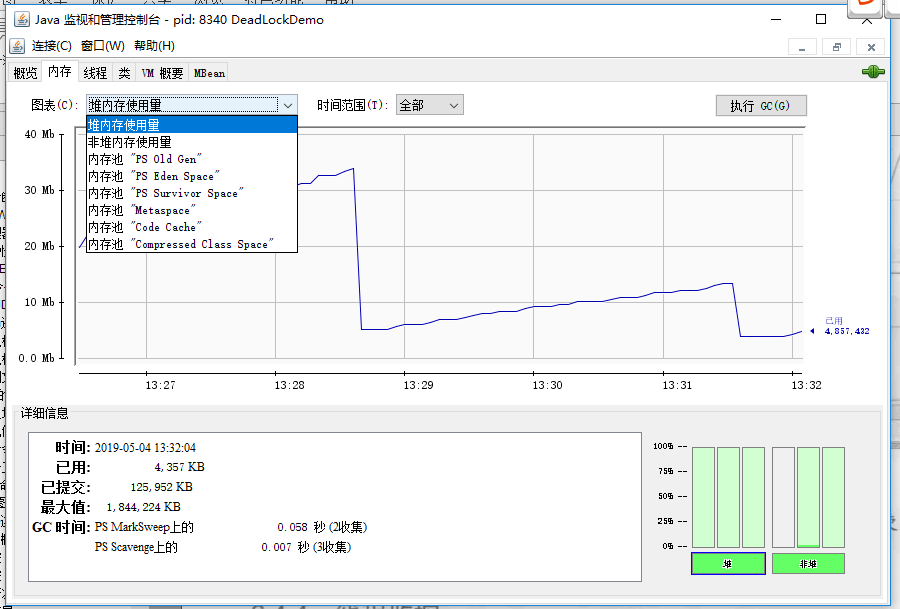
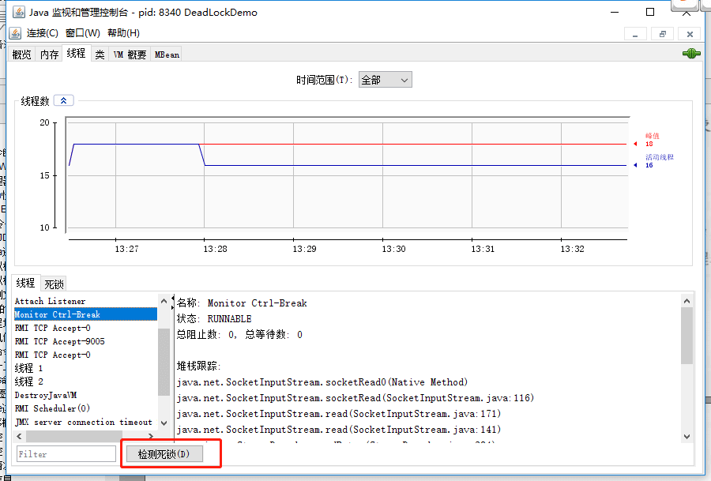

## Các công cụ dòng lệnh (Command-line) của JDK

Các lệnh này nằm trong thư mục `bin` của thư mục cài đặt JDK:

- **`jps`** (JVM Process Status): Tương tự lệnh `ps` trong UNIX. Dùng để xem main class khởi động, tham số truyền vào và các tham số JVM của tất cả các Java process;
- **`jstat`** (JVM Statistics Monitoring Tool): Dùng để thu thập các dữ liệu vận hành về nhiều mặt của HotSpot Virtual Machine;
- **`jinfo`** (Configuration Info for Java): Hiển thị thông tin cấu hình của Virtual Machine;
- **`jmap`** (Memory Map for Java): Tạo snapshot Heap dump;
- **`jhat`** (JVM Heap Dump Browser): Dùng để phân tích file heapdump, nó sẽ tạo một HTTP/HTML server để người dùng có thể xem kết quả phân tích trên trình duyệt. JDK 9 đã loại bỏ jhat;
- **`jstack`** (Stack Trace for Java): Tạo snapshot thread tại thời điểm hiện tại của Virtual Machine, snapshot thread chính là tập hợp stack phương thức mà mỗi thread bên trong Virtual Machine hiện tại đang thực thi.

### `jps`: Xem tất cả các Java Process

Lệnh `jps` (JVM Process Status) tương tự lệnh `ps` của UNIX, dùng để liệt kê các JVM process mà user hiện tại có quyền truy cập và công cụ này có thể phát hiện được, không đảm bảo liệt kê tất cả các Java process trong hệ thống.

`jps`: Hiển thị tên main class thực thi của Virtual Machine cũng như ID duy nhất của Virtual Machine bản địa của các process này (Local Virtual Machine Identifier, LVMID). `jps -q`: Chỉ xuất ra LVMID của process.

```powershell
C:\Users\SnailClimb>jps
7360 NettyClient2
17396
7972 Launcher
16504 Jps
17340 NettyServer
```

`jps -l`: Xuất tên FQCN của main class, nếu process thực thi file Jar thì xuất đường dẫn Jar.

```powershell
C:\Users\SnailClimb>jps -l
7360 firstNettyDemo.NettyClient2
17396
7972 org.jetbrains.jps.cmdline.Launcher
16492 sun.tools.jps.Jps
17340 firstNettyDemo.NettyServer
```

`jps -v`: Xuất ra các tham số JVM khi khởi động process Virtual Machine.

`jps -m`: Xuất các tham số truyền vào hàm `main()` của Java process.

### `jstat`: Giám sát các thông tin trạng thái vận hành của Virtual Machine

`jstat` (JVM Statistics Monitoring Tool) là công cụ dòng lệnh dùng để giám sát các thông tin trạng thái vận hành đa dạng của Virtual Machine. Nó có thể hiển thị dữ liệu vận hành về class, bộ nhớ, Garbage Collection, JIT compile v.v. trong các process Virtual Machine bản địa hoặc từ xa (cần host từ xa hỗ trợ RMI). Ở môi trường server không có GUI, chỉ cung cấp console văn bản thuần túy, nó sẽ là công cụ lựa chọn hàng đầu để định vị sự cố hiệu năng Virtual Machine trong thời gian chạy.

**Định dạng sử dụng lệnh `jstat`:**

```powershell
jstat -<option> [-t] [-h<lines>] <vmid> [<interval> [<count>]]
```

Ví dụ `jstat -gc -h3 31736 1000 10` biểu thị phân tích tình hình GC của process id 31736, cứ mỗi 1000ms in ra một bản ghi, in 10 lần thì dừng, cứ sau 3 dòng thì in tiêu đề chỉ số.

**Các option thường gặp như sau:**

- `jstat -class vmid`: Hiển thị thông tin liên quan ClassLoader;
- `jstat -compiler vmid`: Hiển thị thông tin liên quan JIT compile;
- `jstat -gc vmid`: Hiển thị thông tin Heap liên quan đến GC;
- `jstat -gccapacity vmid`: Hiển thị dung lượng và tình hình sử dụng của từng thế;
- `jstat -gcnew vmid`: Hiển thị thông tin Young Generation;
- `jstat -gcnewcapacity vmid`: Hiển thị kích thước và tình hình sử dụng của Young Generation;
- `jstat -gcold vmid`: Hiển thị thống kê hành vi của Old Generation; trong JDK hiện đại, đầu ra còn chứa thông tin thống kê Metaspace và Compressed Class Space;
- `jstat -gcoldcapacity vmid`: Hiển thị kích thước của Old Generation;
- `jstat -gcpermcapacity vmid`: Hiển thị kích thước Permanent Generation, từ JDK 8 trở đi option này không còn tồn tại nữa; JDK hiện đại có thể dùng `-gcmetacapacity` để xem thống kê dung lượng Metaspace;
- `jstat -gcutil vmid`: Hiển thị thông tin Garbage Collection;

Ngoài ra, thêm tham số `-t` có thể thêm một cột Timestamp trên thông tin đầu ra, hiển thị thời gian chạy của chương trình.

### `jinfo`: Xem và điều chỉnh thời gian thực các tham số Virtual Machine

`jinfo vmid`: Xuất tất cả các tham số và thuộc tính hệ thống của JVM process hiện tại (Phần đầu là thuộc tính hệ thống, phần hai là tham số JVM).

`jinfo -flag name vmid`: Xuất giá trị cụ thể của tham số tương ứng với tên. Ví dụ xuất `MaxHeapSize`. Ví dụ xem và điều chỉnh động `PrintGC` dưới đây nhắm tới JDK 8; GC log từ JDK 9 trở đi nên sử dụng tham số log thống nhất `-Xlog`, và có thể điều chỉnh lúc runtime qua `jcmd VM.log`.

```powershell
C:\Users\SnailClimb>jinfo  -flag MaxHeapSize 17340
-XX:MaxHeapSize=2124414976
C:\Users\SnailClimb>jinfo  -flag PrintGC 17340
-XX:-PrintGC
```

`jinfo` có thể sửa đổi động một số tham số JVM được đánh dấu có thể quản lý mà không cần restart Virtual Machine, không phải tất cả các tham số đều hỗ trợ sửa đổi lúc runtime. Hãy xem ví dụ JDK 8 dưới đây:

`jinfo -flag [+|-]name vmid` Bật hoặc tắt tham số tương ứng với tên.

```powershell
C:\Users\SnailClimb>jinfo  -flag  PrintGC 17340
-XX:-PrintGC

C:\Users\SnailClimb>jinfo  -flag  +PrintGC 17340

C:\Users\SnailClimb>jinfo  -flag  PrintGC 17340
-XX:+PrintGC
```

### `jmap`: Tạo snapshot Heap dump

Lệnh `jmap` (Memory Map for Java) dùng để tạo snapshot Heap dump. Nếu không dùng lệnh `jmap`, muốn lấy Java Heap dump, có thể sử dụng tham số `-XX:+HeapDumpOnOutOfMemoryError`, để Virtual Machine sau khi xuất hiện exception OOM tự động tạo file dump. Lệnh `kill -3 <pid>` trên Linux/macOS gửi tín hiệu `SIGQUIT`, HotSpot sẽ in Java Thread Stack ra luồng stderr, thu được là Thread dump chứ không phải Heap dump.

Tác dụng của `jmap` không chỉ dừng lại ở việc lấy file dump, nó còn có thể truy vấn hàng chờ Finalizer, Java Heap và ClassLoader v.v., lệnh con cụ thể biến đổi theo phiên bản JDK. Permanent Generation chỉ tồn tại trên HotSpot bản cũ, đầu ra liên quan của JDK hiện đại là Metaspace hoặc thống kê ClassLoader. Tương tự như `jinfo`, một số chức năng của `jmap` còn chịu sự giới hạn của hệ điều hành và quyền hạn bổ sung của process mục tiêu.

Ví dụ: Xuất snapshot Heap của ứng dụng chỉ định ra Desktop. Về sau, có thể thông qua các công cụ như jhat, VisualVM để phân tích file Heap này.

```powershell
C:\Users\SnailClimb>jmap -dump:format=b,file=C:\Users\SnailClimb\Desktop\heap.hprof 17340
Dumping heap to C:\Users\SnailClimb\Desktop\heap.hprof ...
Heap dump file created
```

### `jhat`: Phân tích file heapdump

**`jhat`** dùng để phân tích file heapdump, nó sẽ tạo một HTTP/HTML server để người dùng có thể xem kết quả phân tích trên trình duyệt.

```powershell
C:\Users\SnailClimb>jhat C:\Users\SnailClimb\Desktop\heap.hprof
Reading from C:\Users\SnailClimb\Desktop\heap.hprof...
Dump file created Sat May 04 12:30:31 CST 2019
Snapshot read, resolving...
Resolving 131419 objects...
Chasing references, expect 26 dots..........................
Eliminating duplicate references..........................
Snapshot resolved.
Started HTTP server on port 7000
Server is ready.
```

Truy cập <http://localhost:7000/>

Lưu ý ⚠️: JDK 9 đã loại bỏ jhat ([JEP 241: Remove the jhat Tool](https://openjdk.org/jeps/241)), bạn có thể sử dụng các công cụ thay thế như Eclipse Memory Analyzer Tool (MAT) và VisualVM, đây cũng là khuyến nghị từ chính thức.

### `jstack`: Tạo snapshot Thread tại thời điểm hiện tại của Virtual Machine

Lệnh `jstack` (Stack Trace for Java) dùng để tạo snapshot Thread tại thời điểm hiện tại của Virtual Machine. Snapshot Thread chính là tập hợp stack phương thức mà mỗi thread bên trong Virtual Machine hiện tại đang thực thi.

Mục đích tạo snapshot Thread chủ yếu là định vị nguyên nhân thread xuất hiện tạm dừng thời gian dài, như deadlock giữa các thread, vòng lặp vô tận, chờ đợi lâu do yêu cầu tài nguyên bên ngoài v.v. đều là nguyên nhân dẫn đến thread tạm dừng thời gian dài. Khi thread xuất hiện tạm dừng, thông qua `jstack` để xem call stack của từng thread, là có thể biết thread không phản hồi rốt cuộc đang làm gì ở phía sau, hoặc đang chờ đợi tài nguyên gì.

**Code dưới đây thông qua sleep tăng xác suất 2 thread nắm giữ lock của nhau, dùng để minh họa cách kiểm tra deadlock thông qua `jstack`. Điều phối thread không có tính xác định, do đó nó không thể đảm bảo nghiêm ngặt mỗi lần chạy đều tái hiện deadlock.**

```java
public class DeadLockDemo {
    private static Object resource1 = new Object(); // Tài nguyên 1
    private static Object resource2 = new Object(); // Tài nguyên 2

    public static void main(String[] args) {
        new Thread(() -> {
            synchronized (resource1) {
                System.out.println(Thread.currentThread() + "get resource1");
                try {
                    Thread.sleep(1000);
                } catch (InterruptedException e) {
                    e.printStackTrace();
                }
                System.out.println(Thread.currentThread() + "waiting get resource2");
                synchronized (resource2) {
                    System.out.println(Thread.currentThread() + "get resource2");
                }
            }
        }, "Thread 1").start();

        new Thread(() -> {
            synchronized (resource2) {
                System.out.println(Thread.currentThread() + "get resource2");
                try {
                    Thread.sleep(1000);
                } catch (InterruptedException e) {
                    e.printStackTrace();
                }
                System.out.println(Thread.currentThread() + "waiting get resource1");
                synchronized (resource1) {
                    System.out.println(Thread.currentThread() + "get resource1");
                }
            }
        }, "Thread 2").start();
    }
}
```

Output

```plain
Thread[Thread 1,5,main]get resource1
Thread[Thread 2,5,main]get resource2
Thread[Thread 1,5,main]waiting get resource2
Thread[Thread 2,5,main]waiting get resource1
```

Thread A thông qua synchronized (resource1) có được monitor lock của resource1, sau đó thông qua `Thread.sleep(1000);` cho Thread A ngủ 1s là để cho Thread B được thực thi rồi lấy được monitor lock của resource2. Thread A và Thread B ngủ xong đều bắt đầu mưu cầu lấy tài nguyên của đối phương, sau đó hai thread này sẽ rơi vào trạng thái chờ đợi lẫn nhau, việc này tạo ra deadlock.

**Phân tích thông qua lệnh `jstack`:**

```powershell
C:\Users\SnailClimb>jps
13792 KotlinCompileDaemon
7360 NettyClient2
17396
7972 Launcher
8932 Launcher
9256 DeadLockDemo
10764 Jps
17340 NettyServer

C:\Users\SnailClimb>jstack 9256
```

Nội dung xuất ra như sau:

```powershell
Found one Java-level deadlock:
=============================
"Thread 2":
  waiting to lock monitor 0x000000000333e668 (object 0x00000000d5efe1c0, a java.lang.Object),
  which is held by "Thread 1"
"Thread 1":
  waiting to lock monitor 0x000000000333be88 (object 0x00000000d5efe1d0, a java.lang.Object),
  which is held by "Thread 2"

Java stack information for the threads listed above:
===================================================
"Thread 2":
        at DeadLockDemo.lambda$main$1(DeadLockDemo.java:31)
        - waiting to lock <0x00000000d5efe1c0> (a java.lang.Object)
        - locked <0x00000000d5efe1d0> (a java.lang.Object)
        at DeadLockDemo$$Lambda$2/1078694789.run(Unknown Source)
        at java.lang.Thread.run(Thread.java:748)
"Thread 1":
        at DeadLockDemo.lambda$main$0(DeadLockDemo.java:16)
        - waiting to lock <0x00000000d5efe1d0> (a java.lang.Object)
        - locked <0x00000000d5efe1c0> (a java.lang.Object)
        at DeadLockDemo$$Lambda$1/1324119927.run(Unknown Source)
        at java.lang.Thread.run(Thread.java:748)

Found 1 deadlock.
```

Có thể thấy lệnh `jstack` đã giúp chúng ta tìm thấy thông tin chi tiết của thread xảy ra deadlock.

## Các công cụ phân tích trực quan của JDK

### JConsole: Console giám sát và quản lý Java

JConsole là công cụ giám sát, quản lý trực quan dựa trên JMX. Có thể rất thuận tiện giám sát tình hình sử dụng bộ nhớ của Java process bản địa và server từ xa. Bạn có thể nhập lệnh `jconsole` trong console để khởi động hoặc tìm `jconsole.exe` trong thư mục bin dưới thư mục JDK rồi double click khởi động.

#### Kết nối JConsole


Nếu cần sử dụng JConsole kết nối process từ xa, có thể thêm những tham số dưới đây khi khởi động chương trình Java từ xa:

```properties
-Djava.rmi.server.hostname=Địa_chỉ_IP_truy_cập_mạng_ngoài
-Dcom.sun.management.jmxremote.port=60001   // Số cổng giám sát
-Dcom.sun.management.jmxremote.authenticate=false   // Tắt xác thực
-Dcom.sun.management.jmxremote.ssl=false
```

Bộ ví dụ này đồng thời tắt cả xác thực và SSL, chỉ phù hợp với môi trường phát triển bản địa hoặc môi trường test cách ly có thể kiểm soát. Oracle khuyến nghị rõ ràng rằng, cấu hình này cho phép người dùng từ xa có thể truy cập cổng giám sát và kiểm soát ứng dụng, môi trường production nên bật xác thực và truyền tải an toàn, đồng thời hạn chế phạm vi bộc lộ thông qua kiểm soát truy cập mạng.

Khi sử dụng JConsole kết nối, địa chỉ process từ xa như sau:

```plain
Địa_chỉ_IP_truy_cập_mạng_ngoài:60001
```

#### Xem tổng quan chương trình Java


#### Giám sát bộ nhớ

JConsole có thể hiển thị thông tin chi tiết về bộ nhớ hiện tại. Không chỉ bao gồm thông tin tổng thể của Heap / Non-Heap, mà còn có thể chi tiết tới tình hình sử dụng của eden, survivor v.v., như hình dưới.

Click vào nút "Thực thi GC (G)" bên phải sẽ thông qua interface quản lý phát ra yêu cầu Garbage Collection hiển thị, ngữ nghĩa tương tự gọi `System.gc()`; JVM không đảm bảo nhất định thực thi thu hồi, cũng không đảm bảo nhất định thực thi dưới một hình thức Full GC nào đó.

> - **Minor GC (GC Young Gen)**: Chỉ hành vi Garbage Collection xảy ra ở Young Generation, Minor GC rất thường xuyên, tốc độ thu hồi thông thường cũng khá nhanh.
> - **Major GC / Old GC (GC Old Gen)**: Chỉ nhắm tới việc thu hồi Old Generation. Các tài liệu khác nhau sử dụng Major GC không hoàn toàn nhất quán, đôi khi cũng dùng nó để chỉ thu hồi toàn bộ Heap, do đó khi đọc log nên kết hợp collector cụ thể và event log để phán đoán.
> - **Full GC (Thu hồi toàn bộ Heap)**: Tiến hành thu hồi đối với toàn bộ Java Heap, thông thường mang lại thời gian tạm dừng khá dài; thời gian tiêu tốn liên quan đến kích thước Heap, đối tượng sống, collector v.v., không thể dùng bội số cố định để so sánh với Minor GC.



#### Giám sát Thread

Tương tự lệnh `jstack` chúng ta nói ở phần trước, tuy nhiên cái này là trực quan hóa.

Dưới cùng có một nút "Phát hiện deadlock (D)", click nút này có thể tự động tìm thấy các thread xảy ra deadlock cho bạn cũng như thông tin chi tiết của chúng.



### VisualVM: Công cụ xử lý sự cố tất-cả-trong-một (All-in-One)

VisualVM cung cấp thông tin chi tiết về ứng dụng Java chạy trên Java Virtual Machine (JVM). Trong giao diện người dùng đồ họa của VisualVM, bạn có thể xem thông tin liên quan của nhiều ứng dụng Java một cách thuận tiện và nhanh chóng. Trang chủ VisualVM: <https://visualvm.github.io/>. Tài liệu tiếng Trung VisualVM: <https://visualvm.github.io/documentation.html>.

Đoạn văn dưới đây trích từ 《Sâu sắc hiểu về Java Virtual Machine》.

> VisualVM (All-in-One Java Troubleshooting Tool) cung cấp các chức năng giám sát vận hành, xử lý sự cố và phân tích hiệu năng (Profiling) v.v. Java VisualVM từng phát hành đi kèm Oracle JDK 6 ~ 8, từ Oracle JDK 9 trở đi không còn đi kèm theo JDK nữa; ngày nay thông thường cần tải về cài đặt riêng VisualVM. Việc có trực tiếp bật phân tích hiệu năng trong môi trường production hay không nên đánh giá thận trọng dựa trên chế độ sampling hay instrumentation và chi phí thực tế.

VisualVM phát triển dựa trên nền tảng NetBeans, do đó ngay từ đầu nó đã sở hữu đặc tính tính năng mở rộng bằng plugin, thông qua hỗ trợ mở rộng plugin, VisualVM có thể làm được:

- Hiển thị process Virtual Machine cũng như thông tin cấu hình, môi trường của process (jps, jinfo).
- Giám sát thông tin CPU, GC, Heap, Method Area cũng như Thread của ứng dụng (jstat, jstack).
- Dump cũng như phân tích snapshot Heap dump (jmap, jhat).
- Phân tích hiệu năng vận hành chương trình ở cấp độ phương thức, tìm ra phương thức được gọi nhiều nhất, thời gian chạy lâu nhất.
- Snapshot chương trình offline: Thu thập cấu hình runtime, Thread dump, Memory dump v.v. của chương trình để tạo một snapshot, có thể gửi snapshot tới nhà phát triển để phản hồi Bug.
- Khả năng vô hạn của các plugins khác……

Ở đây không giới thiệu cụ thể cách sử dụng VisualVM, nếu muốn tìm hiểu có thể xem:

- <https://visualvm.github.io/documentation.html>
- <https://www.ibm.com/developerworks/cn/java/j-lo-visualvm/index.html>

### MAT: Công cụ Memory Analyzer

MAT (Memory Analyzer Tool) là một công cụ phân tích offline bộ nhớ JVM Heap nhanh chóng, thuận tiện và có chức năng mạnh mẽ phong phú. Nó thông qua việc hiển thị trạng thái snapshot Heap dump thời gian chạy ghi lại khi JVM gặp bất thường (khi chạy bình thường cũng có thể làm phân tích Heap dump), giúp định vị vấn đề rò rỉ bộ nhớ hoặc tối ưu hóa logic tiêu tốn bộ nhớ lớn.

Khi gặp vấn đề OOM và GC, mình thường ưu tiên sử dụng MAT phân tích file dump, đây cũng là kịch bản ứng dụng nhiều nhất của công cụ này.

Về phần giới thiệu chi tiết MAT khuyến nghị hai bài viết dưới đây, viết rất hay:

- [Giải thích sâu sắc và thực tiễn công cụ phân tích bộ nhớ JVM MAT — Bài nhập môn](https://juejin.cn/post/6908665391136899079)
- [Giải thích sâu sắc và thực tiễn công cụ phân tích bộ nhớ JVM MAT — Bài nâng cao](https://juejin.cn/post/6911624328472133646)

<!-- @include: @article-footer.snippet.md -->
