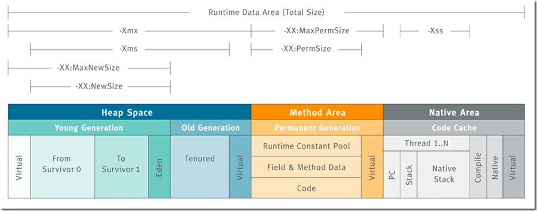

> Bài viết này do JavaGuide dịch từ [https://www.baeldung.com/jvm-parameters](https://www.baeldung.com/jvm-parameters), đồng thời tiến hành bổ sung hoàn thiện rất nhiều nội dung cho bài viết.
> Tài liệu tham số [https://docs.oracle.com/javase/8/docs/technotes/tools/unix/java.html](https://docs.oracle.com/javase/8/docs/technotes/tools/unix/java.html)
>
> Phiên bản JDK: Lấy 1.8 làm chủ đạo, cũng bổ sung các tham số thường dùng của các phiên bản mới

Trong bài viết này, chúng ta sẽ cùng nắm vững một số cấu hình tham số thường dùng nhất trong Java Virtual Machine (JVM), giúp bạn thấu hiểu và tối ưu hóa tốt hơn môi trường chạy ứng dụng Java.

## Liên quan đến bộ nhớ Heap

> Java Heap là vùng lớn nhất trong bộ nhớ do JVM quản lý, **dùng chung cho tất cả các thread**, được tạo khi Virtual Machine khởi động. **Mục đích duy nhất của vùng bộ nhớ này là lưu trữ các instance đối tượng, hầu như tất cả các instance đối tượng cũng như mảng đều phải cấp phát bộ nhớ trên Heap.**



### Thiết lập kích thước bộ nhớ Heap (-Xms và -Xmx)

Dựa trên nhu cầu thực tế của ứng dụng để thiết lập kích thước bộ nhớ Heap ban đầu và tối đa là một trong những thực tiễn phổ biến nhất trong tối ưu hiệu năng. **Khuyến nghị thiết lập hiển thị hai tham số này, và thông thường khuyến nghị thiết lập chúng thành cùng một giá trị**, để tránh chi phí hiệu năng do việc tự điều chỉnh động bộ nhớ Heap lúc runtime mang lại.

Sử dụng các tham số sau để thiết lập:

```bash
-Xms<heap size>[unit]  # Thiết lập kích thước Heap ban đầu của JVM
-Xmx<heap size>[unit]  # Thiết lập kích thước Heap tối đa của JVM
```

- `<heap size>`: Chỉ định giá trị cụ thể của bộ nhớ.
- `[unit]`: Chỉ định đơn vị bộ nhớ, như g (GB), m (MB), k (KB).

**Ví dụ:** Thiết lập Heap ban đầu và Heap tối đa của JVM đều thành 4GB:

```bash
-Xms4G -Xmx4G
```

### Thiết lập kích thước bộ nhớ Young Generation

Theo [tài liệu chính thức Oracle](https://docs.oracle.com/javase/8/docs/technotes/guides/vm/gctuning/sizing.html), sau khi cấu hình tổng bộ nhớ Heap khả dụng hoàn tất, yếu tố ảnh hưởng lớn thứ hai là tỷ lệ `Young Generation` chiếm trong bộ nhớ Heap. Kích thước mặc định của Young Generation chịu ảnh hưởng bởi triển khai JVM, nền tảng, Garbage Collector, kích thước Heap và chiến lược tự điều chỉnh, không tồn tại mức cố định "tối thiểu 1310 MB" áp dụng cho mọi môi trường; `NewSize` và `MaxNewSize` lần lượt dùng để ràng buộc giới hạn dưới và giới hạn trên kích thước Young Generation.

Đối với các collector phân thế hỗ trợ tham số kích thước Young Generation cố định, có thể thiết lập kích thước bộ nhớ Young Generation thông qua 2 cách dưới đây:

**1. Thông qua `-XX:NewSize` và `-XX:MaxNewSize` chỉ định**

```bash
-XX:NewSize=<young size>[unit]    # Thiết lập kích thước ban đầu của Young Generation
-XX:MaxNewSize=<young size>[unit] # Thiết lập kích thước tối đa của Young Generation
```

**Ví dụ:** Thiết lập Young Generation tối thiểu 512MB, tối đa 1024MB:

```bash
-XX:NewSize=512m -XX:MaxNewSize=1024m
```

**2. Thông qua `-Xmn<young size>[unit]` chỉ định**

**Ví dụ:** Cố định kích thước Young Generation thành 512MB:

```bash
-Xmn512m
```

Bật hiển thị kích thước Young Generation sẽ hạn chế khả năng tự điều chỉnh của Garbage Collector. [Tài liệu chính thức Oracle](https://docs.oracle.com/en/java/javase/25/docs/specs/man/java.html#extra-options-for-java) khuyến nghị rõ ràng không nên thiết lập `-Xmn` cho G1; việc có cần điều chỉnh hay không và điều chỉnh như thế nào nên đánh giá kết hợp collector cụ thể và GC log.

Một bài học kinh nghiệm rất quan trọng trong chiến lược GC tuning phát biểu thế này:

> Hãy cố gắng để các đối tượng mới tạo được cấp phát bộ nhớ và thu hồi tại Young Generation, vì chi phí Minor GC thông thường thấp hơn nhiều so với Full GC. Thông qua phân tích GC log, phán đoán việc cấp phát không gian Young Generation có hợp lý không. Nếu lượng lớn đối tượng mới đi vào Old Generation quá sớm (Promotion), có thể điều chỉnh thích hợp kích thước Young Generation qua `-Xmn` hoặc `-XX:NewSize/-XX:MaxNewSize`, mục tiêu là giảm thiểu tối đa trường hợp đối tượng đi trực tiếp vào Old Generation.

Ngoài ra, bạn còn có thể thông qua tham số **`-XX:NewRatio=<int>`** để thiết lập **tỷ lệ kích thước bộ nhớ giữa Old Generation và toàn bộ Young Generation (bao gồm Eden và 2 vùng Survivor)**.

Ví dụ, `-XX:NewRatio=2` biểu thị Old Generation : Young Generation = 2 : 1, tức Young Generation chiếm 1/3 toàn bộ kích thước Heap. Giá trị mặc định chịu ảnh hưởng bởi JVM, collector và nền tảng.

```bash
-XX:NewRatio=2
```

### Thiết lập kích thước Permanent Generation / Metaspace

**Từ Java 8 trở đi, metadata của Class chuyển sang dùng bộ nhớ bản địa (Native Memory). Nếu không thiết lập giới hạn trên qua `-XX:MaxMetaspaceSize`, metadata của Class tăng trưởng liên tục có thể tiêu tốn lượng lớn bộ nhớ bản địa; còn Permanent Generation thì chịu sự ràng buộc giới hạn trên bởi `-XX:MaxPermSize`.**

Trước JDK 1.8 khi Permanent Generation chưa bị loại bỏ hoàn toàn, người ta thường điều chỉnh kích thước Method Area qua các tham số dưới đây:

```bash
-XX:PermSize=N # Kích thước ban đầu của Method Area (Permanent Generation)
-XX:MaxPermSize=N # Kích thước tối đa của Method Area (Permanent Generation), vượt quá giá trị này sẽ ném ra OutOfMemoryError: java.lang.OutOfMemoryError: PermGen
```

Tương đối mà nói, hành vi Garbage Collection khá ít khi xuất hiện ở vùng này, nhưng không phải dữ liệu đi vào Method Area rồi thì sẽ "tồn tại vĩnh viễn".

**Thời JDK 1.8, Method Area (Permanent Generation của HotSpot) đã bị xóa bỏ hoàn toàn (từ JDK 1.7 đã bắt đầu), thay thế bằng Metaspace, Metaspace sử dụng bộ nhớ bản địa.**

Dưới đây là một số tham số thường dùng:

```bash
-XX:MetaspaceSize=N # Thiết lập kích thước ban đầu của Metaspace (là một hiểu lầm thường gặp, phần sau sẽ giải thích)
-XX:MaxMetaspaceSize=N # Thiết lập kích thước tối đa của Metaspace
```

**🐛 Sửa lỗi (Xem thêm: [issue#1947](https://github.com/Snailclimb/JavaGuide/issues/1947))**:

**1. `-XX:MetaspaceSize` không phải dung lượng ban đầu:** Dung lượng ban đầu của Metaspace không phải do `-XX:MetaspaceSize` thiết lập, bất kể cấu hình giá trị gì cho `-XX:MetaspaceSize`, đối với 64-bit JVM, dung lượng ban đầu của Metaspace thường là một giá trị nhỏ cố định (Tài liệu Oracle đề cập khoảng 12MB đến 20MB, thực tế quan sát khoảng 20.8MB).

Có thể tham khảo tài liệu chính thức Oracle [Other Considerations](https://docs.oracle.com/javase/8/docs/technotes/guides/vm/gctuning/considerations.html) có đề cập:

> Specify a higher value for the option MetaspaceSize to avoid early garbage collections induced for class metadata. The amount of class metadata allocated for an application is application-dependent and general guidelines do not exist for the selection of MetaspaceSize. The default size of MetaspaceSize is platform-dependent and ranges from 12 MB to about 20 MB.
>
> Kích thước mặc định của MetaspaceSize phụ thuộc nền tảng, phạm vi từ 12 MB đến khoảng 20 MB.

Ngoài ra, còn có thể xem thử thử nghiệm này: [Hiểu nhầm về tham số JVM MetaspaceSize](https://mp.weixin.qq.com/s/jqfppqqd98DfAJHZhFbmxA).

**2. Mở rộng dung lượng và Metaspace GC:** Khi không gian committed của Metaspace đạt tới ngưỡng high-watermark tương ứng với `-XX:MetaspaceSize`, JVM sẽ kích hoạt một lần Garbage Collection để thử unload class, giải phóng metadata của class. Sau đó, JVM dựa vào hiệu quả giải phóng để tự điều chỉnh tăng hoặc giảm ngưỡng kích hoạt GC lần tiếp theo; cụ thể áp dụng chu kỳ thu gom nào phụ thuộc Garbage Collector và phiên bản JDK, không thể khái quát gọi chung là Full GC. Garbage Collector bên trong dựa trên biến `_capacity_until_GC` để phán đoán xem vùng Metaspace đã đạt ngưỡng chưa, code khởi tạo như sau:

```c
void MetaspaceGC::initialize() {
  // Set the high-water mark to MaxMetapaceSize during VM initialization since
  // we can't do a GC during initialization.
  _capacity_until_GC = MaxMetaspaceSize;
}
```

**3. Tác dụng của `-XX:MaxMetaspaceSize`:** Nếu không thiết lập hiển thị `-XX:MaxMetaspaceSize`, Metaspace mặc định không có giới hạn trên cố định, metadata của Class tăng trưởng liên tục có thể tiêu tốn lượng lớn bộ nhớ bản địa. Việc có thiết lập tham số này hay không và thiết lập bao nhiêu nên quyết định kết hợp tình hình sử dụng metadata của Class và ngân sách bộ nhớ bản địa của process. Giới hạn quá nhỏ sẽ làm tăng tần suất GC metadata, cũng có thể kích hoạt sớm `OutOfMemoryError: Metaspace`, do đó không tồn tại giá trị khuyến nghị áp dụng cho mọi ứng dụng.

Đọc thêm liên quan: [Sửa lỗi issue: MaxMetaspaceSize nếu không chỉ định kích thước thì không làm kiệt bộ nhớ #1204](https://github.com/Snailclimb/JavaGuide/issues/1204).

## Liên quan đến Garbage Collection

### Lựa chọn Garbage Collector

Lựa chọn Garbage Collector (GC) phù hợp có ý nghĩa sống còn đối với Throughput và độ trễ phản hồi của ứng dụng. Về phần giới thiệu chi tiết thuật toán và các collector, bạn có thể xem bài viết do tác giả viết: [Giải thích chi tiết JVM Garbage Collection (Trọng tâm)](https://javaguide.cn/java/jvm/jvm-garbage-collection.html).

JVM cung cấp nhiều triển khai GC khác nhau, áp dụng cho các kịch bản khác nhau:

- **Serial GC (Garbage Collector đơn luồng):** Đơn luồng thực thi GC, áp dụng cho chế độ Client hoặc môi trường CPU đơn nhân. Tham số: `-XX:+UseSerialGC`.
- **Parallel GC (Garbage Collector song song):** Đa luồng thực thi Garbage Collection ở Young Generation và Old Generation, tập trung vào Throughput, là GC mặc định của JDK 8 Server VM; trong JDK 8 khi bật `-XX:+UseParallelGC` mặc định kết hợp với Parallel Old. Tham số: `-XX:+UseParallelGC`.
- **CMS GC (Concurrent Mark Sweep Collector):** Nhắm tới mục tiêu thời gian tạm dừng thu hồi ngắn nhất, phần lớn các giai đoạn GC có thể thực thi đồng thời với User thread. Áp dụng cho các ứng dụng có yêu cầu cao về thời gian phản hồi. Trong JDK 9 bị đánh dấu deprecated, trong JDK 14 bị gỡ bỏ. Tham số: `-XX:+UseConcMarkSweepGC`.
- **G1 GC (Garbage-First Garbage Collector):** GC mặc định từ JDK 9 trở đi trên máy tính Server-class điển hình của HotSpot; việc lựa chọn mặc định ở môi trường khác có thể khác. Nó chia Heap thành nhiều Region, dung hòa Throughput và thời gian tạm dừng, thử đáp ứng mục tiêu thời gian tạm dừng do người dùng thiết lập. Tham số: `-XX:+UseG1GC`.
- **ZGC:** GC độ trễ cực thấp, cần sự hỗ trợ của các phiên bản JDK mới hơn. Tham số: `-XX:+UseZGC`.
- **Shenandoah GC:** Một collector tạm dừng thấp khác, việc có khả dụng hay không phụ thuộc bản phát hành JDK cụ thể. Tham số: `-XX:+UseShenandoahGC`.

### Ghi GC Log

Trong môi trường production hoặc khi tiến hành rà soát sự cố GC, **nhất thiết phải bật ghi GC Log**. GC Log chi tiết là căn cứ then chốt để phân tích và giải quyết các vấn đề GC.

Dưới đây là một số tham số GC Log của JDK 8:

```bash
# --- Cấu hình cơ bản khuyến nghị ---
# In thông tin GC chi tiết
-XX:+PrintGCDetails
# In timestamp khi GC xảy ra (so với thời điểm khởi động JVM)
# -XX:+PrintGCTimeStamps
# In ngày giờ xảy ra GC (thường dùng hơn)
-XX:+PrintGCDateStamps
# Chỉ định đường dẫn file log GC xuất ra, %t có thể xuất timestamp ngày giờ
-Xloggc:/path/to/gc-%t.log

# --- Cấu hình nâng cao khuyến nghị ---
# In phân bố tuổi đối tượng (giúp phán đoán tình hình thăng tiến lên Old Generation của đối tượng)
-XX:+PrintTenuringDistribution
# In thông tin Heap trước và sau GC
-XX:+PrintHeapAtGC
# In thông tin xử lý các loại reference (Strong/Soft/Weak/Phantom)
-XX:+PrintReferenceGC
# In thời gian tạm dừng ứng dụng (Stop-The-World, STW)
-XX:+PrintGCApplicationStoppedTime

# --- Cấu hình xoay vòng (rotation) file GC Log ---
# Bật xoay vòng file log GC
-XX:+UseGCLogFileRotation
# Thiết lập số lượng file log xoay vòng (ví dụ giữ 14 file gần nhất)
-XX:NumberOfGCLogFiles=14
# Thiết lập dung lượng tối đa của từng file log (ví dụ 50MB)
-XX:GCLogFileSize=50M

# --- Cấu hình chẩn đoán bổ sung tùy chọn ---
# In thông tin thống kê Safepoint (giúp phân tích nguyên nhân STW)
# -XX:+PrintSafepointStatistics
# -XX:PrintSafepointStatisticsCount=1
```

JDK 9 trở đi nên sử dụng JVM Logging Framework thống nhất `-Xlog`. Ví dụ, cấu hình dưới đây ghi lại thông tin GC chi tiết và bật xoay vòng theo dung lượng:

```bash
-Xlog:gc*:file=/path/to/gc-%t.log:time,uptime,level,tags:filecount=14,filesize=50M
```

Các tham số cũ không phải tham số nào cũng tiếp tục dùng được: Một số tham số sẽ bị ánh xạ, deprecated hoặc trực tiếp không còn nhận biết nữa. Ví dụ `PrintGCDetails` tương ứng với `-Xlog:gc*`, `PrintTenuringDistribution` tương ứng với `-Xlog:gc+age*=debug`, `PrintGCApplicationStoppedTime` tương ứng với `-Xlog:safepoint`. Nên lấy tài liệu lệnh `java` của JDK mục tiêu và đầu ra `java -Xlog:help` làm chuẩn.

## Xử lý OOM

Đối với các ứng dụng quy mô lớn, việc đối mặt với lỗi OutOfMemoryError là cực kỳ thường gặp, việc này ngược lại dẫn đến ứng dụng crash. Đây là một kịch bản rất then chốt, rất khó tái hiện để giải quyết vấn đề này.

Đó là lý do JVM cung cấp một số tham số, các tham số này sẽ dump bộ nhớ Heap thành một file vật lý, về sau có thể dùng để tìm kiếm rò rỉ:

```bash
# Tạo file Heap dump khi Java Heap kiệt và ném ra OOME
-XX:+HeapDumpOnOutOfMemoryError

# Chỉ định file hoặc thư mục Heap dump. Nếu chỉ định thư mục, JVM sẽ dùng tên mặc định java_pid<pid>.hprof
-XX:HeapDumpPath=/data/dumps/

# (Tùy chọn) Thực thi lệnh hoặc script chỉ định khi xảy ra OOM
# Ví dụ gửi cảnh báo thông báo hoặc thử restart service (cần thận trọng khi dùng)
# -XX:OnOutOfMemoryError="<command> <args>"
# Ví dụ: -XX:OnOutOfMemoryError="sh /path/to/notify.sh"

# (Tùy chọn) Bật kiểm tra giới hạn chi phí GC
# Nếu thời gian GC chiếm tỷ lệ quá cao trong tổng thời gian (mặc định 98%) và hiệu quả thu hồi cực ít (mặc định nhỏ hơn 2% bộ nhớ Heap),
# sẽ ném OOM sớm, tránh ứng dụng bị đơ thời gian dài trong GC.
-XX:+UseGCOverheadLimit
```

## Các tham số thường dùng khác

- `-server`: Bật rõ ràng HotSpot VM chế độ Server. (Trên 64-bit JVM thông thường là mặc định).
- `-XX:+UseStringDeduplication`: (JDK 8u20+) Thử nhận biết các đối tượng String có nội dung giống nhau và chia sẻ mảng dữ liệu ký tự bên dưới của chúng, để giảm chiếm dụng bộ nhớ. Trong JDK 8 mảng bên dưới là `char[]`, JDK hiện đại bật Compact Strings thông thường là `byte[]`; option này còn yêu cầu sử dụng collector hỗ trợ String Deduplication, như G1.
- `-XX:SurvivorRatio=<ratio>`: Thiết lập tỷ lệ kích thước giữa vùng Eden và vùng Survivor đơn lẻ. Ví dụ `-XX:SurvivorRatio=8` biểu thị Eden:Survivor = 8:1.
- `-XX:MaxTenuringThreshold=<threshold>`: Thiết lập ngưỡng tuổi tối đa để đối tượng từ Young Generation thăng tiến lên Old Generation (đối tượng mỗi khi trải qua 1 lần Minor GC và còn sống, tuổi tăng 1). Giá trị mặc định liên quan đến collector và phiên bản JDK, ví dụ tài liệu JDK 8 giá trị mặc định của Parallel GC là 15, của CMS là 6.
- `-XX:+DisableExplicitGC`: Làm JVM bỏ qua các yêu cầu GC hiển thị như `System.gc()`, nhưng JVM khi cần thiết vẫn sẽ tự thực thi GC. Yêu cầu hiển thị không đảm bảo kích hoạt Full GC; việc có bật tham số này hay không nên đánh giá kết hợp dọn dẹp Direct Memory, hành vi framework và collector được dùng, không thể khái quát chung.
- `-XX:+UseLargePages`: (Cần hệ điều hành hỗ trợ) Thử sử dụng trang bộ nhớ lớn (như 2MB thay vì 4KB), có thể nâng cao hiệu năng của ứng dụng ngốn bộ nhớ, nhưng cần test thận trọng.
- `-XX:MinHeapFreeRatio=<percent>` / `-XX:MaxHeapFreeRatio=<percent>`: Kiểm soát phần trăm rảnh tối thiểu/tối đa giữ lại của bộ nhớ Heap sau GC, dùng để tự điều chỉnh kích thước Heap (nếu `-Xms` và `-Xmx` không bằng nhau). Thông thường khuyến nghị thiết lập `-Xms` và `-Xmx` thống nhất, tránh chi phí điều chỉnh.

**Lưu ý:** Các tham số dưới đây trong các phiên bản JVM hiện đại có thể đã **deprecated, bị loại bỏ hoặc mặc định bật và không cần thiết lập thủ công**:

- `-XX:+UseLWPSynchronization`: Option chiến lược đồng bộ cũ hơn, JVM hiện đại thông thường có triển khai tối ưu hơn.
- `-XX:LargePageSizeInBytes`: Thông thường do `-XX:+UseLargePages` tự động xác định hoặc cấu hình qua OS.
- `-XX:+UseStringCache`: Đã bị loại bỏ.
- `-XX:+UseCompressedStrings`: Option thử nghiệm cũ, đã bị loại bỏ; Compact Strings giới thiệu trong JDK 9 là một bộ triển khai khác.
- `-XX:+OptimizeStringConcat`: Option tối ưu hóa nối chuỗi của HotSpot C2 bản cũ; từ JDK 9 trở đi nối chuỗi chủ yếu triển khai qua `invokedynamic` và `StringConcatFactory`, không thể coi hai thứ là cùng một công tắc.

## Tóm tắt

Bài viết này cung cấp cho các nhà phát triển Java một tài liệu hướng dẫn cấu hình tham số JVM thường dùng thực tế, nhằm giúp người đọc hiểu và tối ưu hóa hiệu năng cũng như tính ổn định của ứng dụng Java. Bài viết nhấn mạnh các khía cạnh sau:

1. **Cấu hình bộ nhớ Heap:** Có thể dựa vào môi trường triển khai để thiết lập hiển thị Heap ban đầu và tối đa (`-Xms`, `-Xmx`, ứng dụng server thông thường thiết lập thống nhất). Kích thước Young Generation có cần thiết lập hiển thị hay không nên đánh giá kết hợp Garbage Collector và GC log; G1 thông thường không khuyến nghị thiết lập `-Xmn`.
2. **Quản lý Metaspace (Java 8+):** `-XX:MetaspaceSize` dùng để thiết lập ngưỡng high-watermark ban đầu kích hoạt GC metadata, chứ không phải dung lượng ban đầu của Metaspace. `-XX:MaxMetaspaceSize` có thể giới hạn bộ nhớ bản địa mà metadata của class sử dụng, nhưng giới hạn trên cụ thể cần xác định theo tình hình thực tế của ứng dụng.
3. **Lựa chọn Garbage Collector và Log:** Giới thiệu kịch bản áp dụng của các thuật toán GC khác nhau, và nhấn mạnh sự cần thiết của việc bật GC Log chi tiết trong môi trường production và test để rà soát sự cố; JDK 8 sử dụng tham số GC Log truyền thống, JDK 9 trở đi sử dụng `-Xlog`.
4. **Rà soát sự cố OOM:** Giải thích cách thức thông qua các tham số như `-XX:+HeapDumpOnOutOfMemoryError` khi xảy ra OOM tự động tạo file Heap dump, để tiến hành phân tích rò rỉ bộ nhớ sau đó.
5. **Các tham số khác:** Giới thiệu ngắn gọn các tham số hữu ích khác như String Deduplication, và chỉ ra hiện trạng của một số tham số cũ.

Đối với các ca rà soát sự cố và tuning cụ thể, có thể tham khảo bài viết do tác giả tổng hợp: [Các ca rà soát sự cố online và tuning hiệu năng JVM](https://javaguide.cn/java/jvm/jvm-in-action.html).

<!-- @include: @article-footer.snippet.md -->
