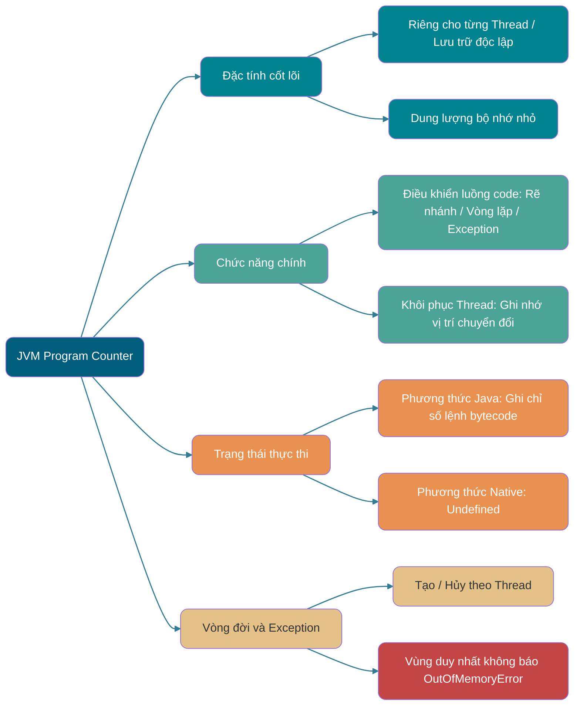
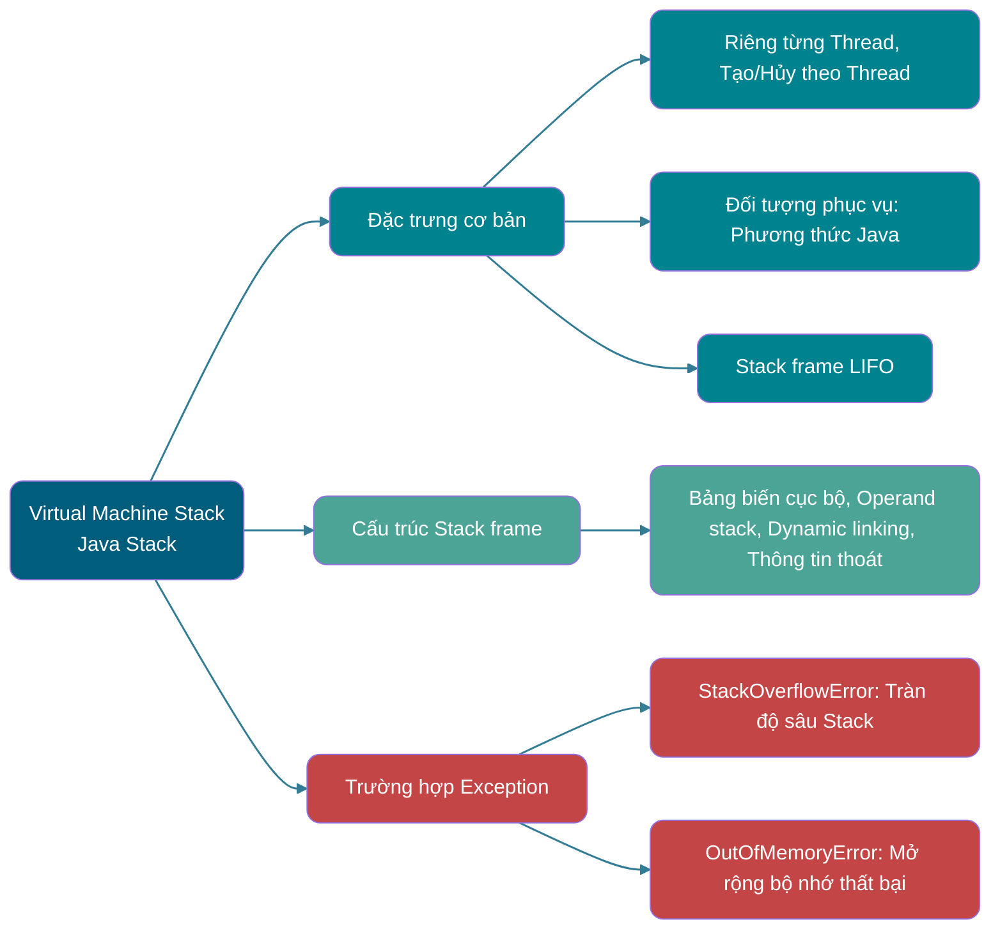
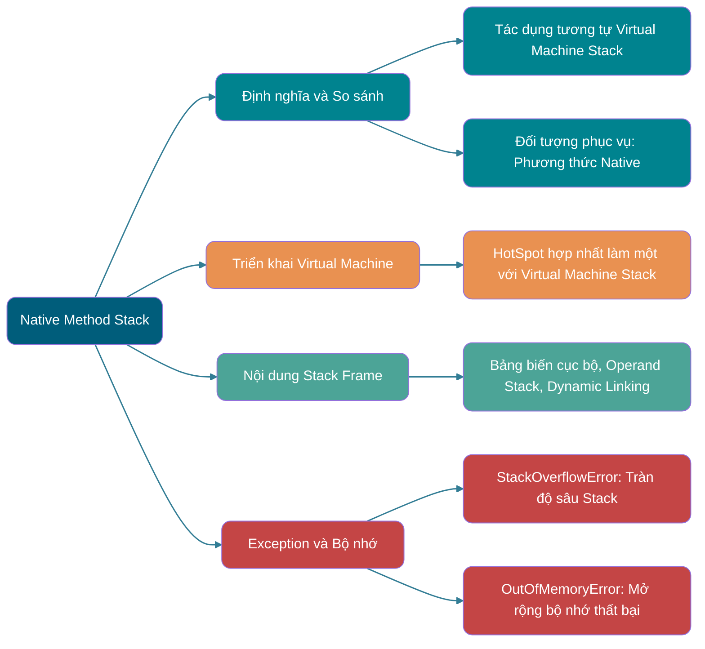
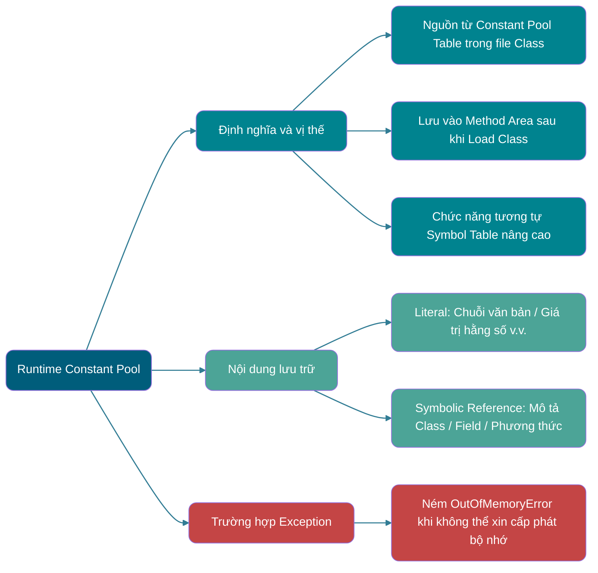
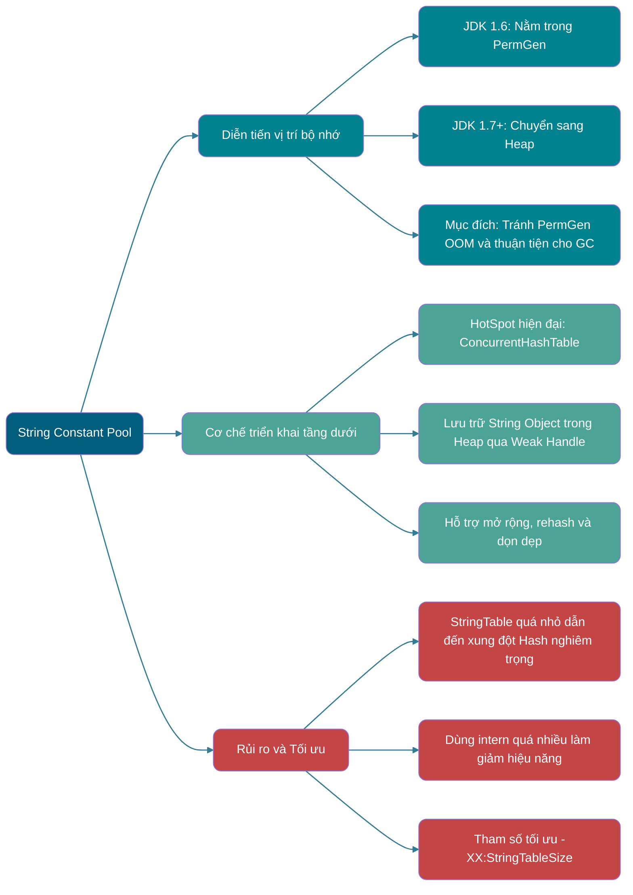
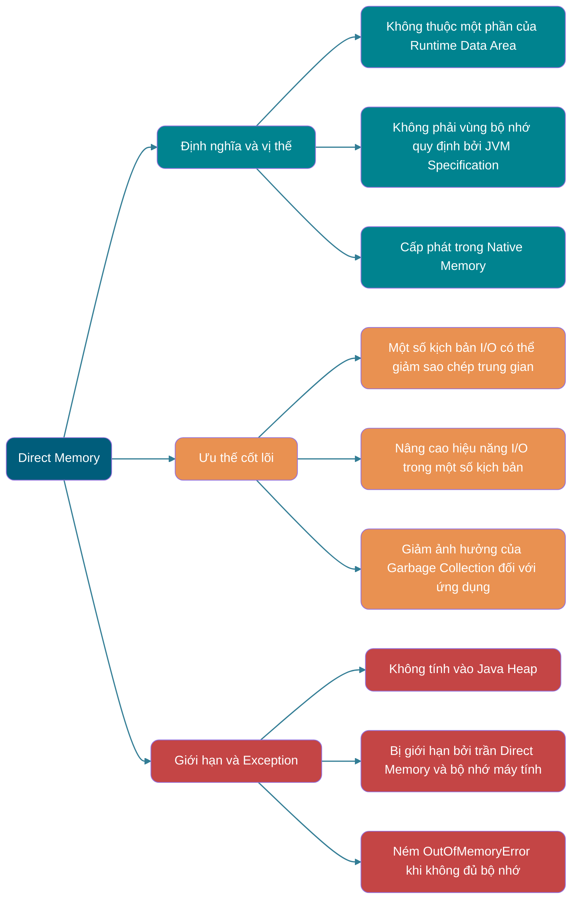

> Nếu không có giải thích đặc biệt, bài viết đều nhắm tới HotSpot Virtual Machine.
>
> Bài viết này được tóm tắt và bổ sung dựa trên cuốn 《Sâu sắc hiểu về Java Virtual Machine: Các tính năng nâng cao của JVM và thực tiễn tốt nhất》.
>
> Các câu hỏi phỏng vấn thường gặp:
>
> - Giới thiệu về vùng bộ nhớ Java (Runtime Data Area)
> - Quá trình tạo Java Object (5 bước, khuyến nghị có thể tự viết ra và biết mỗi bước Virtual Machine làm gì)
> - Hai phương thức định vị truy cập Object (Handle và Direct Pointer)

## Lời nói đầu

Đối với các lập trình viên Java, dưới cơ chế quản lý bộ nhớ tự động của Virtual Machine, không còn cần phải viết các thao tác `delete`/`free` tương ứng cho mỗi thao tác `new` như khi phát triển chương trình C/C++, nên ít gặp phải các vấn đề về memory leak (rò rỉ bộ nhớ) và memory overflow (tràn bộ nhớ). Chính vì lập trình viên Java đã giao quyền kiểm soát bộ nhớ cho Java Virtual Machine, nên một khi xảy ra các vấn đề về memory leak và overflow, nếu không hiểu cách Virtual Machine sử dụng bộ nhớ, việc khắc phục lỗi sẽ là một nhiệm vụ vô cùng gian nan.

## Vùng dữ liệu thời gian chạy (Runtime Data Area)

Java Virtual Machine trong quá trình thực thi chương trình Java sẽ chia bộ nhớ mà nó quản lý thành nhiều vùng dữ liệu khác nhau.

JDK 1.8 hơi khác so với các phiên bản trước đó, ở đây chúng ta lấy hai phiên bản JDK 1.7 và JDK 1.8 làm ví dụ giới thiệu.

**JDK 1.7**:


**JDK 1.8**:


**Thread-private (Riêng của từng thread):**

- Program Counter Register (Bộ đếm chương trình)
- Java Virtual Machine Stack (Stack của JVM)
- Native Method Stack (Stack phương thức Native)

**Thread-shared (Dùng chung giữa các thread):**

- Heap (Bộ nhớ Heap)
- Method Area (Vùng phương thức)

Direct Memory (Bộ nhớ trực tiếp) thường được thảo luận cùng với các vùng này, nhưng nó không phải là Runtime Data Area được định nghĩa trong 《Quy chuẩn Java Virtual Machine》, cũng không nên coi là "Runtime Data Area dùng chung giữa các thread" trong quy chuẩn.

Quy chuẩn Java Virtual Machine đối với các quy định về Runtime Data Area là khá linh hoạt. Lấy Heap làm ví dụ: Heap có thể là không gian liên tục, cũng có thể không liên tục. Kích thước Heap có thể cố định, cũng có thể mở rộng theo nhu cầu lúc runtime. Người triển khai Virtual Machine có thể sử dụng bất kỳ thuật toán Garbage Collection nào để quản lý Heap, thậm chí hoàn toàn không thực hiện Garbage Collection cũng được.

### Program Counter Register (Bộ đếm chương trình)



Program Counter Register là một vùng bộ nhớ nhỏ, có thể coi là con trỏ chỉ số dòng lệnh bytecode mà thread hiện tại đang thực thi. Khi Bytecode Interpreter làm việc, nó thay đổi giá trị của bộ đếm này để chọn lệnh bytecode tiếp theo cần thực thi, các chức năng như rẽ nhánh, vòng lặp, nhảy lệnh, xử lý exception, khôi phục thread v.v. đều cần dựa vào bộ đếm này để hoàn thành.

Ngoài ra, để sau khi chuyển đổi thread có thể khôi phục về đúng vị trí thực thi, mỗi thread đều cần có một Program Counter độc lập, bộ đếm giữa các thread không ảnh hưởng lẫn nhau, lưu trữ độc lập, chúng ta gọi loại vùng bộ nhớ này là bộ nhớ "riêng cho từng thread" (Thread-private).

Từ phần giới thiệu trên, chúng ta biết Program Counter chủ yếu có 2 tác dụng:

- Bytecode Interpreter thông qua việc thay đổi Program Counter để lần lượt đọc các lệnh, từ đó thực hiện điều khiển luồng của code như: thực thi tuần tự, lựa chọn, vòng lặp, xử lý exception.
- Trong trường hợp đa thread, Program Counter được dùng để ghi lại vị trí thực thi của thread hiện tại, nhờ đó khi thread được chuyển đổi quay lại có thể biết được thread này lần trước đã chạy đến đâu.

Vòng đời của Program Counter hoàn toàn đồng bộ với thread:

- **Tạo**: Được tạo cùng với việc tạo thread.
- **Hủy**: Bị hủy cùng với việc kết thúc thread.

Khi thực thi **phương thức Java** (không phải native), Program Counter ghi lại **địa chỉ của lệnh JVM bytecode hiện đang thực thi**. Khi thread thực thi một **phương thức Native** (phương thức bản địa), giá trị của Program Counter là **Undefined (chưa xác định)**, vì lúc này lệnh được thực thi không phải là JVM bytecode.

⚠️ Lưu ý: Program Counter là vùng bộ nhớ duy nhất trong quy chuẩn JVM không quy định bất kỳ trường hợp `OutOfMemoryError` nào. Quy chuẩn chỉ quy định kết luận này chứ không yêu cầu tất cả các triển khai đều phải áp dụng một biểu diễn cụ thể có kích thước cố định nào.

### Java Virtual Machine Stack



Giống như Program Counter Register, Java Virtual Machine Stack (sau đây gọi tắt là Stack) cũng là riêng cho từng thread, vòng đời của nó giống như thread, được tạo cùng với việc tạo thread và chết đi cùng với sự kết thúc của thread.

Stack tuyệt đối có thể xem là một cốt lõi trong Runtime Data Area của JVM, trừ một số lời gọi phương thức Native được thực hiện thông qua Native Method Stack (sẽ đề cập ở sau), tất cả các lời gọi phương thức Java khác đều được thực hiện thông qua Stack (cũng cần phối hợp với các Runtime Data Area khác như Program Counter).

Dữ liệu của lời gọi phương thức cần được truyền qua Stack, mỗi lần gọi phương thức sẽ có một Stack Frame tương ứng được push vào Stack, và sau khi mỗi phương thức kết thúc lời gọi, sẽ có một Stack Frame được pop ra.

Stack được cấu thành từ từng Stack Frame, mà trong mỗi Stack Frame đều sở hữu: Bảng biến cục bộ (Local Variable Table), Operand Stack (Stack toán hạng), Dynamic Linking (Liên kết động), Phương thức trả về địa chỉ. Tương tự như cấu trúc dữ liệu Stack, cả hai đều là cấu trúc dữ liệu LIFO (Last In First Out), chỉ hỗ trợ hai thao tác push và pop.


**Local Variable Table (Bảng biến cục bộ)** chủ yếu lưu trữ các kiểu dữ liệu đã biết tại thời điểm compile (`boolean`, `byte`, `char`, `short`, `int`, `float`, `long`, `double`), Object reference (kiểu `reference`, nó khác với chính Object, có thể là một con trỏ chỉ tới địa chỉ bắt đầu của Object, hoặc là một handle đại diện cho Object hay vị trí khác liên quan đến Object đó).


**Operand Stack (Stack toán hạng)** chủ yếu được dùng làm trạm trung chuyển cho các lời gọi phương thức, dùng để lưu trữ các kết quả tính toán trung gian được tạo ra trong quá trình thực thi phương thức. Ngoài ra, các biến tạm thời tạo ra trong quá trình tính toán cũng sẽ được đặt trong Operand Stack.

**Dynamic Linking (Liên kết động)** là một chức năng của Stack Frame. Mỗi Stack Frame đều giữ một reference chỉ tới Constant Pool runtime của type sở hữu phương thức hiện tại, được dùng để chuyển đổi ký hiệu reference (symbolic reference) của phương thức trong code phương thức thành phương thức reference cụ thể, và chuyển đổi việc truy cập biến thành offset tương ứng trong cấu trúc lưu trữ runtime; việc phân tích các ký hiệu chưa xác định còn có thể kích hoạt class loading. Quá trình cần lựa chọn triển khai phương thức ảo dựa trên kiểu thực tế của receiver thuộc về dispatch động của lệnh gọi phương thức, không thể đánh đồng đơn giản với Dynamic Linking ở đây.


Không gian Stack tuy không phải là vô hạn, nhưng trong các trường hợp gọi bình thường sẽ không xảy ra vấn đề. Tuy nhiên, nếu hàm bị rơi vào đệ quy vô hạn, sẽ dẫn đến việc quá nhiều Stack Frame bị push vào Stack gây chiếm quá nhiều không gian, làm cho độ sâu không gian Stack quá sâu. Như vậy khi độ sâu Stack mà thread yêu cầu vượt quá độ sâu tối đa của Java Virtual Machine Stack hiện tại, nó sẽ ném ra lỗi `StackOverflowError`.

**Phương thức Java có 2 kiểu trả về**:

- **Trả về bình thường**: Thực thi câu lệnh `return`, giá trị trả về được truyền cho phía gọi.
- **Trả về do Exception**: Trong quá trình thực thi phương thức ném ra exception và không được catch.

Dù là kiểu trả về nào thì cũng sẽ dẫn đến việc Stack Frame bị pop ra. Nói cách khác, **Stack Frame được tạo theo lời gọi phương thức, và bị hủy theo sự kết thúc của phương thức. Dù phương thức hoàn thành bình thường hay hoàn thành do exception thì đều được coi là phương thức kết thúc.**

Ngoài lỗi `StackOverflowError`, Stack còn có thể xuất hiện lỗi `OutOfMemoryError`, đó là vì nếu kích thước bộ nhớ của Stack có thể mở rộng động, thì khi Virtual Machine mở rộng Stack động mà không xin cấp phát đủ không gian bộ nhớ, nó sẽ ném ra exception `OutOfMemoryError`.

Tóm tắt ngắn gọn hai loại lỗi có thể xuất hiện ở Stack trong quá trình chương trình chạy:

- **`StackOverflowError`:** Khi không gian Stack mà thread thực thi yêu cầu vượt quá kích thước JVM cho phép, ném ra lỗi `StackOverflowError`.
- **`OutOfMemoryError`:** Nếu kích thước bộ nhớ của Stack có thể mở rộng động, khi Virtual Machine mở rộng Stack động mà không xin được đủ không gian bộ nhớ, sẽ ném ra exception `OutOfMemoryError`.


### Native Method Stack (Stack phương thức Native)



Rất giống với tác dụng của Virtual Machine Stack, điểm khác biệt là: **Virtual Machine Stack phục vụ cho Virtual Machine thực thi các phương thức Java (tức là bytecode), còn Native Method Stack phục vụ cho các phương thức Native mà Virtual Machine sử dụng.** Trong HotSpot Virtual Machine, Native Method Stack và Java Virtual Machine Stack được hợp nhất làm một.

Khi thực thi phương thức Native, triển khai Virtual Machine có thể sử dụng C Stack truyền thống. 《Quy chuẩn Java Virtual Machine》 không quy định Native Method Stack bắt buộc phải áp dụng cùng cấu trúc Local Variable Table, Operand Stack và Dynamic Linking như JVM Stack Frame.

Sau khi phương thức Native thực thi xong, các dữ liệu Stack liên quan tương ứng sẽ được giải phóng. Native Method Stack cũng có thể xuất hiện hai loại lỗi `StackOverflowError` và `OutOfMemoryError`.

### Heap (Bộ nhớ Heap)

```mermaid
graph LR
    %% Định nghĩa màu sắc
    classDef main fill:#005D7B,color:#fff,rx:10,ry:10;
    classDef compare fill:#00838F,color:#fff,rx:10,ry:10;
    classDef structure fill:#4CA497,color:#fff,rx:10,ry:10;
    classDef implement fill:#E99151,color:#fff,rx:10,ry:10;
    classDef error fill:#C44545,color:#fff,rx:10,ry:10;

    %% Node cốt lõi
    Root(Java Heap):::main

    %% Nhánh 1: Định nghĩa và vị thế
    Root --> Def[Định nghĩa và vị thế]:::compare
    Def --> Def1[Vùng bộ nhớ lớn nhất trong JVM]:::compare
    Def --> Def2[Dùng chung cho tất cả các Thread]:::compare
    Def --> Def3[Khởi tạo khi Virtual Machine khởi động, vòng đời dài]:::compare

    %% Nhánh 2: Tác dụng cốt lõi
    Root --> Use[Tác dụng cốt lõi]:::structure
    Use --> Use1[Lưu trữ Object instance (Field phi static)]:::structure
    Use --> Use2[Lưu trữ dữ liệu mảng]:::structure
    Use --> Use3[Quản lý bộ nhớ Object tập trung]:::structure

    %% Nhánh 3: Cấu trúc phân thế (GC Heap)
    Root --> GC[Cấu trúc Generational]:::implement
    GC --> GC1[Young Generation: Vùng Eden + 2 vùng Survivor]:::implement
    GC --> GC2[Old Generation: Old Generation]:::implement
    GC --> GC3[Mục đích: Tối ưu hóa hiệu quả Garbage Collection]:::implement

    %% Kiểu đường nối
    linkStyle default stroke:#005D7B,stroke-width:1.5px,opacity:0.8
```

Là phần bộ nhớ lớn nhất do Java Virtual Machine quản lý, Java Heap là vùng bộ nhớ dùng chung cho tất cả các thread, được tạo khi Virtual Machine khởi động. **Mục đích duy nhất của vùng bộ nhớ này là lưu trữ các instance của Object, hầu như tất cả các Object instance cũng như mảng đều được cấp phát bộ nhớ tại đây.**

Trong thế giới Java, "hầu như" tất cả Object đều được cấp phát trên Heap. Tuy nhiên, JIT compiler có thể dựa trên phân tích thoát (escape analysis) để thay thế scalar (scalar replacement), từ đó loại bỏ việc cấp phát thực tế của một số Object. Loại tối ưu hóa này của HotSpot không thể phát biểu đơn giản là "Object được cấp phát trực tiếp trên Java Virtual Machine Stack".

Java Heap là vùng chủ yếu được quản lý bởi Garbage Collector, do đó còn được gọi là **GC Heap (Garbage Collected Heap)**. Từ góc độ thu gom rác, vì hiện tại các collector về cơ bản đều áp dụng thuật toán phân thế Garbage Collection (Generational Garbage Collection), nên Java Heap còn có thể chia nhỏ thành: Young Generation (Thế hệ trẻ) và Old Generation (Thế hệ già); chi tiết hơn nữa có các không gian: Eden, Survivor, Old v.v. Việc phân chia chi tiết hơn nhằm mục đích thu gom bộ nhớ tốt hơn, hoặc cấp phát bộ nhớ nhanh hơn.

Trong HotSpot JDK 7 và các phiên bản trước đó, GC thường được giới thiệu theo 3 phần dưới đây, trong đó Permanent Generation là triển khai của Method Area, không thuộc về Java Heap:

1. Young Generation (Bộ nhớ thế hệ trẻ)
2. Old Generation (Thế hệ già)
3. Permanent Generation (Thế hệ vĩnh cửu)

Vùng Eden, 2 vùng Survivor S0 và S1 được hiển thị ở hình dưới đều thuộc về Young Generation, tầng giữa thuộc về Old Generation, tầng dưới cùng thuộc về Permanent Generation.


**Từ phiên bản JDK 8 trở đi, PermGen (Permanent Generation) đã được thay thế bởi Metaspace (Vùng nguyên dữ liệu), Metaspace sử dụng bộ nhớ bản địa (Native Memory).** (Mình sẽ giới thiệu chi tiết ở phần nội dung Method Area).

Trong hầu hết các trường hợp, Object đầu tiên sẽ được cấp phát tại vùng Eden, sau một lần Garbage Collection ở Young Generation, nếu Object vẫn còn sống, nó sẽ vào S0 hoặc S1, đồng thời tuổi của Object tăng thêm 1 (sau khi chuyển từ Eden -> Survivor tuổi ban đầu chuyển thành 1). Sau khi Object đạt đến ngưỡng tuổi thăng tiến (tenuring threshold), nó sẽ vào Old Generation. Ngưỡng tuổi này chịu ảnh hưởng chung bởi collector, chiến lược tự điều chỉnh và tham số `-XX:MaxTenuringThreshold`, không phải tất cả các collector mặc định đều là 15. Đối với collector phân thế kinh điển sử dụng field tuổi 4-bit, giới hạn trên của tham số này là 15.

```bash
MaxTenuringThreshold of 20 is invalid; must be between 0 and 15
```

**Tại sao tuổi chỉ có thể là 0-15?**

Bởi vì vùng ghi lại tuổi nằm trong Object Header, kích thước của vùng này thường là 4 bit. Con số nhị phân lớn nhất mà 4 bit này có thể biểu diễn là 1111, tức là số 15 trong hệ thập phân. Do đó, tuổi của Object bị giới hạn từ 0 đến 15.

Ở đây chúng ta kết hợp ngắn gọn với bố cục Object để giới thiệu chi tiết.

Trong HotSpot Virtual Machine, bố cục lưu trữ của Object trong bộ nhớ có thể chia thành 3 vùng: Header (Đầu Object), Instance Data (Dữ liệu instance) và Padding (Đệm căn chỉnh). Trong đó, Header bao gồm 2 phần: Mark Word (Từ đánh dấu) và Klass Word (Từ kiểu). Về giới thiệu chi tiết bố cục bộ nhớ của Object, phần sau bài viết sẽ đề cập tới, ở đây không nhắc lại nữa.

Thông tin tuổi này chính là được lưu trữ trong Mark Word (Mark Word còn lưu trữ các thông tin khác của chính Object như hashCode, thông tin trạng thái khóa v.v.). Dưới đây là cấu trúc Mark Word trong source code HotSpot bản cũ `markOop.hpp`; triển khai tương ứng và bố cục Object Header của JDK hiện đại đã thay đổi:


Có thể thấy kích thước chiếm dụng của tuổi Object đúng là 4 bit.

> **🐛 Sửa lỗi (Xem thêm: [issue552](https://github.com/Snailclimb/JavaGuide/issues/552))**: "Khi Hotspot duyệt qua tất cả các Object, nó sẽ cộng dồn kích thước chiếm dụng theo tuổi từ nhỏ đến lớn, khi cộng dồn tới một tuổi nào đó mà kích thước cộng dồn vượt quá một nửa vùng Survivor, thì sẽ lấy giá trị nhỏ hơn giữa tuổi này và `MaxTenuringThreshold` làm ngưỡng tuổi thăng tiến mới".
>
> **Code tính toán tuổi động như sau**
>
> ```c++
> uint ageTable::compute_tenuring_threshold(size_t survivor_capacity) {
>  //survivor_capacity là kích thước không gian survivor
> size_t desired_survivor_size = (size_t)((((double) survivor_capacity)*TargetSurvivorRatio)/100);//TargetSurvivorRatio là 50
> size_t total = 0;
> uint age = 1;
> while (age < table_size) {
> total += sizes[age];//Mảng sizes là kích thước Object theo từng độ tuổi
> if (total > desired_survivor_size) break;
> age++;
> }
> uint result = age < MaxTenuringThreshold ? age : MaxTenuringThreshold;
>   ...
> }
> ```

Ở Heap dễ xuất hiện nhất là lỗi `OutOfMemoryError`, và biểu hiện sau khi xuất hiện lỗi này cũng có một số dạng, ví dụ:

1. **`java.lang.OutOfMemoryError: GC Overhead Limit Exceeded`**: Xuất hiện khi JVM dành quá nhiều thời gian thực thi Garbage Collection nhưng chỉ thu hồi được rất ít không gian Heap.
2. **`java.lang.OutOfMemoryError: Java heap space`**: Xuất hiện khi tạo Object mới mà không gian bộ nhớ Heap không đủ để chứa Object mới tạo. (Có liên quan đến bộ nhớ Heap tối đa được cấu hình và chịu sự giới hạn của dung lượng bộ nhớ vật lý. Bộ nhớ Heap tối đa có thể cấu hình qua tham số `-Xmx`, nếu không cấu hình đặc biệt sẽ dùng giá trị mặc định, chi tiết xem thêm: [Default Java 8 max heap size](https://stackoverflow.com/questions/28272923/default-xmxsize-in-java-8-max-heap-size))
3. ……

### Method Area (Vùng phương thức)

```mermaid
graph LR
    %% Định nghĩa màu sắc
    classDef main fill:#005D7B,color:#fff,rx:10,ry:10;
    classDef compare fill:#00838F,color:#fff,rx:10,ry:10;
    classDef structure fill:#4CA497,color:#fff,rx:10,ry:10;
    classDef implement fill:#E99151,color:#fff,rx:10,ry:10;
    classDef error fill:#C44545,color:#fff,rx:10,ry:10;

    %% Node cốt lõi
    Root(Method Area):::main

    %% Nhánh 1: Định nghĩa và vị thế
    Root --> Def[Định nghĩa và vị thế]:::compare
    Def --> Def1[Vùng bộ nhớ dùng chung cho các Thread]:::compare
    Def --> Def2[Vùng logic quy định bởi JVM Specification]:::compare
    Def --> Def3[Triển khai cụ thể tùy theo Virtual Machine]:::compare

    %% Nhánh 2: Nội dung lưu trữ cốt lõi
    Root --> Store[Nội dung lưu trữ cốt lõi]:::structure
    Store --> Store1[Metadata của Class: Cấu trúc / Field / Thông tin phương thức]:::structure
    Store --> Store2[Bytecode của phương thức: Chuỗi chỉ số gốc]:::structure
    Store --> Store3[Runtime Constant Pool: Literal và Symbolic Reference]:::structure

    %% Nhánh 3: Diễn tiến vị trí HotSpot (JDK 7+)
    Root --> Change[Diễn tiến vị trí và ngoại lệ]:::implement
    Change --> Change1[Biến static: Chuyển sang Java Heap (JDK 7)]:::implement
    Change --> Change2[String Pool: Chuyển sang Java Heap (JDK 7)]:::implement
    Change --> Change3[JIT Code Cache: Vùng Code Cache độc lập]:::implement

    %% Kiểu đường nối
    linkStyle default stroke:#005D7B,stroke-width:1.5px,opacity:0.8
```

Method Area thuộc về một vùng logic trong Runtime Data Area của JVM, là vùng bộ nhớ dùng chung cho các thread.

《Quy chuẩn Java Virtual Machine》 chỉ quy định có khái niệm Method Area và tác dụng của nó, còn Method Area rốt cuộc triển khai như thế nào là việc mà chính Virtual Machine phải cân nhắc. Nói cách khác, trên các triển khai Virtual Machine khác nhau, cách triển khai Method Area là khác nhau.

Khi Virtual Machine load một Class, nó sẽ parse thông tin tương ứng từ file Class và lưu các **metadata** này vào Method Area. Cụ thể, Method Area chủ yếu lưu trữ các dữ liệu cốt lõi sau:

1. **Metadata của Class**: Bao gồm cấu trúc hoàn chỉnh của Class như tên class, superclass, interface implement, access modifier, cũng như thông tin chi tiết của field và phương thức (tên, kiểu, modifier v.v.).
2. **Bytecode của phương thức**: Chuỗi lệnh nguyên bản của mỗi phương thức.
3. **Runtime Constant Pool**: Mỗi class có một Constant Pool riêng, được chuyển đổi từ Constant Pool trong file Class, dùng để lưu trữ các literal và symbolic reference đối với type, field, phương thức được tạo ra ở thời điểm compile.

Cần đặc biệt lưu ý rằng, một số loại dữ liệu dưới đây mặc dù về mặt logic có liên quan đến Class, nhưng trong HotSpot Virtual Machine, chúng không được lưu trữ trong Method Area:

- **Biến Static (Static Variables)**: Từ JDK 7 trở đi, các biến static của Class cùng với đối tượng `java.lang.Class` tương ứng được lưu trữ trong Java Heap.
- **String Table (String Pool / Constant Pool chuỗi)**: Cũng từ JDK 7 trở đi, String Pool đã được **chuyển sang Java Heap**.
- **JIT Code Cache (Bộ đệm code biên dịch JIT)**: Máy biên dịch JIT biên dịch bytecode của các phương thức hotspot thành machine code bản địa, được lưu trữ trong một **vùng bộ nhớ độc lập tên là "Code Cache"**, chứ không phải bản thân Method Area. Làm như vậy là để đạt được việc thực thi và quản lý bộ nhớ hiệu quả hơn.


**Mối quan hệ giữa Method Area với Permanent Generation và Metaspace là gì?** Mối quan hệ giữa Method Area với Permanent Generation và Metaspace rất giống mối quan hệ giữa interface và class trong Java, class implement interface, class ở đây có thể xem là Permanent Generation và Metaspace, interface có thể xem là Method Area, nói cách khác Permanent Generation và Metaspace là hai cách triển khai của HotSpot Virtual Machine đối với Method Area trong quy chuẩn Virtual Machine. Hơn nữa, Permanent Generation là triển khai Method Area trước JDK 1.8, từ JDK 1.8 trở đi triển khai của Method Area chuyển thành Metaspace.


**Tại sao lại thay thế Permanent Generation (PermGen) bằng Metaspace (MetaSpace)?**

Hình dưới đây trích từ 《Sâu sắc hiểu về Java Virtual Machine》 phiên bản 3 mục 2.2.5


1. Dung lượng của Permanent Generation chịu sự ràng buộc bởi giới hạn trên `-XX:MaxPermSize`, giới hạn trên này có thể cấu hình; Metaspace chuyển sang dùng bộ nhớ bản địa (Native Memory), và có thể hạn chế qua `-XX:MaxMetaspaceSize`. Cả hai đều có thể bị OOM, rủi ro thực tế phụ thuộc vào cấu hình và sự tăng trưởng metadata của Class.

> Khi Metaspace bị tràn sẽ nhận được lỗi như sau: `java.lang.OutOfMemoryError: Metaspace`

Bạn có thể sử dụng `-XX:MaxMetaspaceSize` để thiết lập kích thước tối đa của Metaspace. Nếu không thiết lập, không gian metadata của Class có thể tiếp tục tăng cho đến khi bị giới hạn bởi bộ nhớ bản địa khả dụng của hệ thống. `-XX:MetaspaceSize` không phải là dung lượng ban đầu của Metaspace, mà là ngưỡng high-watermark kích hoạt GC metadata lần đầu, sau đó JVM sẽ tự điều chỉnh động ngưỡng này.

2. Trong Metaspace lưu trữ metadata của Class, như vậy việc load bao nhiêu metadata của Class sẽ không còn bị kiểm soát bởi `MaxPermSize` nữa, mà do không gian thực tế khả dụng của hệ thống kiểm soát, giúp load được nhiều Class hơn.

3. Trong JDK 8, khi hợp nhất code của HotSpot và JRockit, JRockit chưa bao giờ có thứ gọi là Permanent Generation, sau khi hợp nhất không cần thiết phải thiết lập thêm một nơi gọi là Permanent Generation nữa.

4. Permanent Generation mang lại sự phức tạp không cần thiết cho GC, và hiệu quả thu hồi tương đối thấp.

**Các tham số thường dùng của Method Area là gì?**

Trước JDK 1.8 khi Permanent Generation chưa bị loại bỏ hoàn toàn, người ta thường điều chỉnh kích thước Method Area qua các tham số dưới đây.

```java
-XX:PermSize=N //Kích thước ban đầu của Method Area (Permanent Generation)
-XX:MaxPermSize=N //Kích thước tối đa của Method Area (Permanent Generation), vượt quá giá trị này sẽ ném ra OutOfMemoryError: java.lang.OutOfMemoryError: PermGen
```

Tương đối mà nói, hành vi Garbage Collection khá ít khi xuất hiện ở vùng này, nhưng không phải dữ liệu đi vào Method Area rồi thì sẽ "tồn tại vĩnh viễn".

Thời JDK 1.8, Method Area (Permanent Generation của HotSpot) đã bị xóa bỏ hoàn toàn (từ JDK 1.7 đã bắt đầu), thay thế bằng Metaspace, Metaspace sử dụng bộ nhớ bản địa. Dưới đây là một số tham số thường dùng:

```java
-XX:MetaspaceSize=N //Thiết lập ngưỡng high-watermark ban đầu kích hoạt GC metadata
-XX:MaxMetaspaceSize=N //Thiết lập kích thước tối đa của Metaspace
```

Điểm khác biệt lớn so với Permanent Generation là, nếu không chỉ định `MaxMetaspaceSize`, Metaspace không có giới hạn cố định do tham số này thiết lập, sự tăng trưởng liên tục của metadata Class có thể tiêu tốn lượng lớn bộ nhớ bản địa.

### Runtime Constant Pool (Tập hằng số thời gian chạy)



Trong file Class ngoài các thông tin mô tả về phiên bản Class, field, phương thức, interface v.v., còn có **Constant Pool Table (Bảng tập hằng số)** dùng để lưu trữ các Literal và Symbolic Reference được tạo ra ở thời điểm compile.

Literal là biểu diễn giá trị cố định trong source code, tức là thông qua mặt chữ chúng ta có thể biết được ý nghĩa giá trị của nó. Literal bao gồm số nguyên, số thực và string literal. Các symbolic reference thường gặp bao gồm class symbolic reference, field symbolic reference, method symbolic reference, interface method symbol.

Giải thích về symbolic reference và direct reference tại mục 7.34 phiên bản 3 cuốn 《Sâu sắc hiểu về Java Virtual Machine》 như sau:


Constant Pool Table sau khi Class được load sẽ được lưu vào Runtime Constant Pool trong Method Area.

Chức năng của Runtime Constant Pool tương tự như symbol table trong các ngôn ngữ lập trình truyền thống, mặc dù nó chứa dữ liệu rộng hơn so với symbol table điển hình.

Vì Runtime Constant Pool là một phần của Method Area, dĩ nhiên nó bị giới hạn bởi bộ nhớ của Method Area, khi Constant Pool không thể xin thêm bộ nhớ nữa sẽ ném ra lỗi `OutOfMemoryError`.

### String Constant Pool (Tập hằng số chuỗi)



**String Constant Pool** là một vùng bộ nhớ do JVM dành riêng cho String nhằm nâng cao hiệu năng và giảm tiêu tốn bộ nhớ, mục đích chính là để tránh tạo lại các chuỗi trùng lặp.

```java
// 1. Tìm đối tượng String "ab" trong String Constant Pool, nếu chưa có thì tạo "ab" và đưa vào String Constant Pool
// 2. Gán reference của đối tượng String "ab" cho aa
String aa = "ab";
// Trả về trực tiếp reference đối tượng String "ab" trong String Constant Pool, gán cho reference bb
String bb = "ab";
System.out.println(aa==bb); // true
```

Triển khai String Constant Pool trong HotSpot Virtual Machine có thể xem tại `src/hotspot/share/classfile/stringTable.cpp`. `StringTable` bản địa trong HotSpot hiện đại sử dụng ConcurrentHashTable, và lưu trữ các String Object trong Heap thông qua weak handle, hỗ trợ mở rộng, rehash cũng như dọn dẹp các entry vô hiệu; `-XX:StringTableSize` được dùng để thiết lập số lượng bucket ban đầu. Do đó, cách nói "mảng độ dài cố định + danh sách liên kết" chỉ áp dụng cho một số triển khai bản cũ, không thể dùng để khái quát HotSpot hiện tại.

Trước JDK 1.7, String Constant Pool nằm ở Permanent Generation. JDK 1.7 đã chuyển String Constant Pool và các biến static của Class sang Java Heap.


**Tại sao JDK 1.7 lại chuyển String Constant Pool sang Heap?**

Chủ yếu vì hiệu quả thu hồi GC của Permanent Generation (triển khai Method Area) quá thấp, chỉ khi thu gom toàn bộ Heap (Full GC) thì mới thực thi GC. Trong chương trình Java thường có lượng lớn chuỗi được tạo ra chờ thu hồi, việc đặt String Constant Pool vào Heap giúp thu hồi bộ nhớ chuỗi hiệu quả và kịp thời hơn.

Vấn đề liên quan: [Trong JVM Constant Pool lưu trữ Object hay Reference? - RednaxelaFX - Zhihu](https://www.zhihu.com/question/57109429/answer/151717241)

Cuối cùng xin chia sẻ một đoạn phát biểu của thầy Zhou Zhiming trong [issue#112](https://github.com/fenixsoft/jvm_book/issues/112) của repository GitHub [《Sâu sắc hiểu về Java Virtual Machine (Phiên bản 3)》Code mẫu & Sửa lỗi](https://github.com/fenixsoft/jvm_book):

> **Runtime Constant Pool, Method Area, String Constant Pool đều là các khái niệm logic không thay đổi theo triển khai của Virtual Machine, chúng là công khai và trừu tượng; Metaspace, Heap là các khái niệm vật lý liên quan đến một triển khai Virtual Machine cụ thể, chúng là riêng tư và cụ thể.**

### Direct Memory (Bộ nhớ trực tiếp)



Direct Memory là một loại bộ nhớ đệm đặc biệt, không được cấp phát trong Java Heap hay Method Area, mà được cấp phát trong Native Memory. Cơ chế cấp phát cụ thể thuộc về chi tiết triển khai Virtual Machine, không đồng nghĩa với việc bắt buộc phải cấp phát qua JNI.

Direct Memory không phải là một phần của Runtime Data Area trong Virtual Machine, cũng không phải vùng bộ nhớ quy định trong quy chuẩn Virtual Machine, nhưng phần bộ nhớ này cũng được sử dụng rất thường xuyên. Và nó cũng có thể dẫn đến việc xuất hiện lỗi `OutOfMemoryError`.

Trong JDK 1.4 mới bổ sung **NIO (New I/O)**, giới thiệu một phương thức I/O dựa trên **Channel** và **Buffer**. Direct Byte Buffer có thể cấp phát nội dung bên ngoài Java Heap, và thao tác thông qua đối tượng `DirectByteBuffer` trong Java Heap. JVM sẽ cố gắng thực thi I/O bản địa trực tiếp trên loại buffer này, từ đó trong một số kịch bản giảm việc sao chép dữ liệu của buffer trung gian; trong NIO chỉ có SelectableChannel và Selector v.v. cung cấp khả năng I/O non-blocking, không thể mở rộng toàn bộ NIO thành Non-Blocking I/O.

Direct Memory không tính vào Java Heap, nhưng vẫn chịu sự giới hạn của tổng bộ nhớ máy tính, không gian định vị bộ xử lý v.v. Đối với NIO Direct Buffer, còn có thể thông qua [`-XX:MaxDirectMemorySize`](https://docs.oracle.com/en/java/javase/25/docs/specs/man/java.html#extra-options-for-java) để giới hạn tổng lượng cấp phát.

Khái niệm tương tự còn có **Off-Heap Memory (Bộ nhớ ngoài Heap)**. Trong một số bài viết đánh đồng Direct Memory với Off-Heap Memory, cá nhân mình thấy chưa thật sự chính xác.

Off-Heap Memory là tên gọi chung của bộ nhớ được cấp phát bên ngoài Java Heap, bên dưới thường sử dụng bộ nhớ bản địa do hệ điều hành cung cấp. Việc nó có được quản lý bởi JVM hoặc JDK hay không và quản lý như thế nào phụ thuộc vào phương thức cấp phát cụ thể. Ví dụ trong OpenJDK/HotSpot, bộ nhớ bản địa tương ứng với `DirectByteBuffer` sẽ liên kết với đối tượng buffer trong Java Heap, và sau khi đối tượng trở nên không thể truy cập sẽ tham gia dọn dẹp thông qua cơ chế như `Cleaner`. Vì thời điểm dọn dẹp không do ứng dụng trực tiếp kiểm soát, việc sử dụng Off-Heap Memory có thể giảm áp lực lên Java Heap, nhưng vẫn cần chú ý đến rò rỉ bộ nhớ bản địa và `OutOfMemoryError`.

## Khám phá Object trong HotSpot Virtual Machine

Thông qua phần giới thiệu trên chúng ta đã nắm được đại thể tình hình bộ nhớ của Virtual Machine, dưới đây chúng ta sẽ cùng tìm hiểu chi tiết toàn bộ quá trình cấp phát, bố cục và truy cập Object trong Java Heap của HotSpot Virtual Machine.

### Quá trình tạo Object

Quá trình tạo Java Object mình khuyến nghị tốt nhất là bạn nên tự viết ra được, và nắm vững mỗi bước đang làm gì.

```mermaid
graph TD
    %% Định nghĩa màu sắc
    classDef root fill:#004D61,color:#fff,rx:10,ry:10;
    classDef step fill:#005D7B,color:#fff,rx:10,ry:10;
    classDef detail fill:#4CA497,color:#fff,rx:10,ry:10;
    classDef logic fill:#E99151,color:#fff,rx:10,ry:10;

    %% Luồng cốt lõi
    Start(Kích hoạt lệnh new):::root

    Start --> S1[Bước 1: Kiểm tra Class Loading]:::step
    S1 --> S1_1[Kiểm tra Constant Pool xem có symbolic reference của Class không]:::detail
    S1_1 --> S1_2[Kiểm tra Class đã được Load / Parse / Khởi tạo chưa]:::detail

    S1_2 --> S2[Bước 2: Cấp phát bộ nhớ]:::step
    S2 --> S2_Method{Phương thức cấp phát}:::logic
    S2_Method -->|Heap quy chuẩn| S2_A[Pointer Bump (Va chạm con trỏ)]:::logic
    S2_Method -->|Heap đan xen| S2_B[Free List (Danh sách rảnh)]:::logic
    S2_A & S2_B --> S2_Safe[An toàn Concurrency: TLAB hoặc thử lại CAS]:::detail

    S2_Safe --> S3[Bước 3: Khởi tạo giá trị 0]:::step
    S3 --> S3_1[Khởi tạo không gian bộ nhớ đã cấp phát về 0]:::detail
    S3_1 --> S3_2[Đảm bảo instance field không gán giá trị ban đầu vẫn dùng trực tiếp được]:::detail

    S3_2 --> S4[Bước 4: Thiết lập Object Header]:::step
    S4 --> S4_1[Mark Word: HashCode / Tuổi GC / Trạng thái khóa]:::detail
    S4_1 --> S4_2[Klass Pointer: Con trỏ Metadata trỏ tới Class]:::detail

    S4_2 --> S5[Bước 5: Thực thi phương thức init]:::step
    S5 --> S5_1[Khởi tạo theo ý muốn của lập trình viên]:::detail
    S5_1 --> S5_2[Thực thi phương thức constructor]:::detail

    S5_2 --> End((Tạo Object hoàn tất)):::root

    %% Kiểu đường nối
    linkStyle default stroke:#005D7B,stroke-width:1.5px,opacity:0.8
```

#### Bước 1: Kiểm tra Class Loading

Khi Virtual Machine gặp một lệnh `new`, trước tiên nó sẽ kiểm tra xem tham số của lệnh này có thể định vị được symbolic reference của Class này trong Constant Pool hay không, đồng thời kiểm tra Class mà symbolic reference này đại diện đã được load, parse và khởi tạo chưa. Nếu chưa, bắt buộc phải thực hiện quá trình Class Loading tương ứng trước.

#### Bước 2: Cấp phát bộ nhớ

Sau khi **kiểm tra Class Loading** thông qua, tiếp theo Virtual Machine sẽ **cấp phát bộ nhớ** cho Object mới tạo. Kích thước bộ nhớ mà Object cần đã có thể xác định sau khi Class Loading hoàn thành, nhiệm vụ cấp phát không gian cho Object tương đương với việc chia một khối bộ nhớ có kích thước xác định ra từ Java Heap. **Phương thức cấp phát** có hai loại **"Pointer Bump (Va chạm con trỏ)"** và **"Free List (Danh sách rảnh)"**, **việc lựa chọn phương thức cấp phát nào do Java Heap có quy chuẩn hay không quyết định, mà Java Heap có quy chuẩn hay không lại do Garbage Collector được sử dụng có tính năng nén整理 (compact) hay không quyết định**.

**Hai phương thức cấp phát bộ nhớ** (Nội dung bổ sung, cần nắm vững):

- Pointer Bump (Va chạm con trỏ):
  - Trường hợp áp dụng: Khi bộ nhớ Heap quy chuẩn (tức không có mảnh vụn bộ nhớ).
  - Nguyên lý: Bộ nhớ đã dùng gom hết về một bên, bộ nhớ chưa dùng đặt ở bên còn lại, ở giữa có một con trỏ phân giới, chỉ cần di chuyển con trỏ đó về phía bộ nhớ chưa dùng một khoảng bằng kích thước bộ nhớ Object là được.
  - GC collector sử dụng phương thức cấp phát này: Serial, ParNew
- Free List (Danh sách rảnh):
  - Trường hợp áp dụng: Khi bộ nhớ Heap không quy chuẩn.
  - Nguyên lý: Virtual Machine sẽ duy trì một danh sách ghi lại những khối bộ nhớ nào khả dụng, khi cấp phát sẽ tìm một khối bộ nhớ đủ lớn để chia cho Object instance, cuối cùng cập nhật lại danh sách.
  - GC collector sử dụng phương thức cấp phát này: CMS

Lựa chọn phương thức nào trong hai phương thức trên phụ thuộc vào việc bộ nhớ Java Heap có quy chuẩn hay không. Mà bộ nhớ Java Heap có quy chuẩn hay không lại phụ thuộc vào thuật toán của GC collector là "Mark-Sweep" hay "Mark-Compact", đáng chú ý là thuật toán Copy bộ nhớ cũng quy chuẩn.

**Vấn đề concurrency khi cấp phát bộ nhớ (Nội dung bổ sung, cần nắm vững)**

Trong quá trình tạo Object có một vấn đề rất quan trọng là thread safety, vì trong phát triển thực tế, việc tạo Object xảy ra rất thường xuyên, đối với Virtual Machine thì bắt buộc phải đảm bảo thread an toàn, thông thường Virtual Machine áp dụng hai cách để đảm bảo thread safety:

- **CAS + thử lại khi thất bại:** CAS là một cách triển khai của Optimistic Lock. Cái gọi là Optimistic Lock nghĩa là mỗi lần không khóa mà giả định không có xung đột để hoàn thành thao tác nào đó, nếu thất bại do xung đột thì thử lại cho đến khi thành công. **Virtual Machine áp dụng CAS phối hợp thử lại khi thất bại để đảm bảo tính nguyên tử của thao tác cập nhật.**
- **TLAB:** Dự kiến cấp phát một khối bộ nhớ trong vùng Eden cho mỗi thread, khi JVM cấp phát bộ nhớ cho Object trong thread, trước tiên cấp phát tại TLAB, khi Object lớn hơn bộ nhớ còn lại trong TLAB hoặc bộ nhớ TLAB đã dùng hết, mới áp dụng CAS nói trên để cấp phát bộ nhớ.

#### Bước 3: Khởi tạo giá trị 0

Sau khi cấp phát bộ nhớ hoàn tất, Virtual Machine cần khởi tạo không gian bộ nhớ đã cấp phát về giá trị 0 (không bao gồm Object Header), bước thao tác này đảm bảo các instance field của Object trong code Java có thể sử dụng trực tiếp mà không cần gán giá trị ban đầu, chương trình có thể truy cập vào giá trị 0 tương ứng với kiểu dữ liệu của các field này.

#### Bước 4: Thiết lập Object Header

Sau khi khởi tạo giá trị 0 hoàn tất, **Virtual Machine sẽ tiến hành các thiết lập cần thiết cho Object**, ví dụ Object này là instance của Class nào, làm sao tìm thấy thông tin Class metadata, hashCode của Object, tuổi phân thế GC của Object v.v. **Các thông tin này được lưu trữ trong Object Header.** Ngoài ra, bố cục cụ thể của Object Header có liên quan đến phiên bản JDK và cấu hình Virtual Machine; ví dụ Biased Lock từ JDK 15 trở đi mặc định bị vô hiệu hóa, triển khai liên quan sau đó lại bị gỡ bỏ.

#### Bước 5: Thực thi phương thức init

Sau khi các công việc trên hoàn thành, từ góc nhìn của Virtual Machine, một Object mới đã được tạo ra, nhưng từ góc nhìn của chương trình Java, việc tạo Object mới chỉ vừa bắt đầu, phương thức `<init>` vẫn chưa thực thi, tất cả các field vẫn là 0. Do đó thông thường sau khi thực thi lệnh `new` sẽ tiếp tục thực thi phương thức `<init>`, khởi tạo Object theo ý muốn của lập trình viên, như vậy một Object thực sự khả dụng mới算 hoàn toàn được tạo ra.

### Bố cục bộ nhớ của Object

Trong HotSpot Virtual Machine, bố cục của Object trong bộ nhớ có thể chia thành 3 vùng: **Header (Đầu Object)**, **Instance Data (Dữ liệu instance)** và **Padding (Đệm căn chỉnh)**.

Object Header bao gồm hai phần thông tin:

1. Mark Word (Từ đánh dấu): Dùng để lưu trữ dữ liệu runtime của chính Object như HashCode, tuổi phân thế GC, trạng thái khóa v.v.; biased thread ID, biased timestamp chỉ áp dụng cho HotSpot bản cũ còn triển khai và bật Biased Lock.
2. Klass Pointer (Con trỏ kiểu): Con trỏ Object trỏ tới Class metadata của nó, Virtual Machine thông qua con trỏ này để xác định Object này là instance của Class nào.

**Phần Instance Data là thông tin có hiệu lực thực sự lưu trữ trong Object**, cũng là nội dung các field thuộc các kiểu dữ liệu được định nghĩa trong chương trình.

**Phần Padding không nhất thiết phải tồn tại, cũng không có ý nghĩa đặc biệt nào, chỉ đóng vai trò giữ chỗ (placeholder).** HotSpot sẽ cấp phát Object theo ranh giới căn chỉnh Object, căn chỉnh mặc định thường là 8 byte, cũng có thể chịu ảnh hưởng bởi cấu hình như `-XX:ObjectAlignmentInBytes`. Do đó tổng kích thước Object cần làm tròn cho đủ ranh giới căn chỉnh; bản thân Object Header không đảm bảo luôn là bội số nguyên của 8 byte, ví dụ khi bật Compressed Class Pointers, kích thước Object Header thường gặp là 12 byte.

### Định vị truy cập Object

Tạo Object là để sử dụng Object, chương trình Java của chúng ta thông qua dữ liệu `reference` trên Stack để thao tác với Object cụ thể trên Heap. Phương thức truy cập Object do triển khai Virtual Machine quyết định, hiện tại các phương thức truy cập chủ đạo gồm có: **Sử dụng Handle (Tay cầm)**, **Direct Pointer (Con trỏ trực tiếp)**.

#### Handle

Nếu sử dụng Handle, trong Java Heap sẽ chia ra một khối bộ nhớ làm Handle Pool (Bể tay cầm), trong `reference` lưu trữ địa chỉ Handle của Object, mà trong Handle chứa thông tin địa chỉ cụ thể tương ứng của Object Instance Data và Object Type Data.


#### Direct Pointer

Nếu sử dụng Direct Pointer để truy cập, trong `reference` lưu trữ trực tiếp địa chỉ của Object.


Hai phương thức truy cập Object này đều có ưu thế riêng. Ưu điểm lớn nhất của việc sử dụng Handle để truy cập là trong `reference` lưu trữ địa chỉ Handle ổn định, khi Object bị di chuyển chỉ thay đổi con trỏ Instance Data trong Handle, chứ bản thân `reference` không cần sửa đổi. Ưu điểm lớn nhất của việc sử dụng Direct Pointer là tốc độ nhanh, nó tiết kiệm được chi phí thời gian cho một lần định vị con trỏ.

HotSpot Virtual Machine chủ yếu sử dụng phương thức này để tiến hành truy cập Object.

## Tham khảo

- 《Sâu sắc hiểu về Java Virtual Machine: Các tính năng nâng cao của JVM và thực tiễn tốt nhất (Phiên bản 2)》
- 《Tự tay viết Java Virtual Machine》
- Chapter 2. The Structure of the Java Virtual Machine: <https://docs.oracle.com/javase/specs/jvms/se8/html/jvms-2.html>
- Cấu trúc bên trong JVM Stack Frame - Dynamic Linking: <https://chenxitag.com/archives/368>
- Trong Java `new String("literal")` thì "literal" khi nào đi vào String Constant Pool? - Trả lời của Mu Nühai - Zhihu: <https://www.zhihu.com/question/55994121/answer/147296098>
- Trong JVM Constant Pool lưu trữ Object hay Reference? - Trả lời của RednaxelaFX - Zhihu: <https://www.zhihu.com/question/57109429/answer/151717241>
- <http://www.pointsoftware.ch/en/under-the-hood-runtime-data-areas-javas-memory-model/>
- <https://dzone.com/articles/jvm-permgen-%E2%80%93-where-art-thou>
- <https://stackoverflow.com/questions/9095748/method-area-and-permgen>

<!-- @include: @article-footer.snippet.md -->
